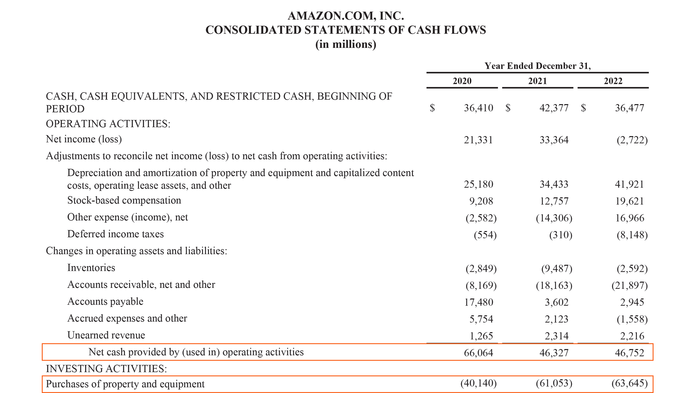

## Table of Contents

## What is a cash flow statement?

A cash flow statement is a financial document that shows how money moves in and out of a business over a specific period, usually a month or a year. It helps business owners and investors understand where the company's money comes from and where it goes. The statement is divided into three main parts: cash from operating activities, cash from investing activities, and cash from financing activities.

The first part, cash from operating activities, shows the money earned from the company's main business activities, like selling products or services. It also includes money spent on things like salaries and rent. The second part, cash from investing activities, shows money spent on or received from investments, like buying or selling equipment or property. The third part, cash from financing activities, shows money coming in from loans or investments, and money going out to pay back loans or dividends to shareholders. Together, these sections give a clear picture of the company's financial health and how well it manages its cash.

## Why is the analysis of operational cash flow important?

Analyzing operational cash flow is important because it shows how much money a business makes from its main activities, like selling products or services. This is different from money coming from loans or investments. By looking at the operational cash flow, you can see if the business is making enough money to keep running and growing. If the operational cash flow is positive, it means the business is earning more than it spends on day-to-day operations, which is a good sign of financial health.

On the other hand, if the operational cash flow is negative, it might mean the business is struggling to make ends meet. This could be a warning sign that the business needs to cut costs or find ways to increase sales. Investors and business owners pay close attention to operational cash flow because it gives them a clear picture of the company's ability to generate money from its core business. This information helps them make better decisions about investing in or managing the business.

## How is operational cash flow different from net income?

Operational cash flow and net income are both important ways to measure how a business is doing, but they show different things. Operational cash flow is the money a business makes from its main activities, like selling products or services. It shows how much cash the business has after paying for things like salaries, rent, and supplies. If the operational cash flow is positive, it means the business is earning more than it spends on its day-to-day operations.

Net income, on the other hand, is the total profit a business makes after all expenses are subtracted from its revenue. This includes not just the costs of running the business, but also things like taxes, interest on loans, and depreciation of equipment. Net income gives a broader picture of the business's overall financial performance, but it doesn't always show how much cash the business actually has on hand. For example, a business might have a high net income but still struggle with cash flow if it has a lot of money tied up in unpaid invoices or inventory.

## What are the main components of operational cash flow?

Operational cash flow is made up of three main parts: cash received from customers, cash paid to suppliers, and cash paid for operating expenses. Cash received from customers is the money that comes in when people buy the company's products or services. This is the most important part because it shows how well the company is doing at selling what it makes or offers. Cash paid to suppliers is the money the company spends to buy the things it needs to make its products or provide its services. This could be raw materials, parts, or anything else that goes into what the company sells.

The third part, cash paid for operating expenses, includes all the other costs of running the business day to day. This can include things like rent for the office or store, salaries for employees, utility bills, and other regular expenses. By looking at these three parts together, you can see if the company is making more money from its sales than it is spending on what it needs to operate. If the operational cash flow is positive, it means the company is doing well at turning its main activities into cash.

## How do you calculate operational cash flow?

To calculate operational cash flow, you start by looking at the money that comes into the business from selling its products or services. This is called cash received from customers. Then, you subtract the money the business spends on things it needs to make those products or provide those services, like raw materials or parts. This is called cash paid to suppliers. After that, you subtract the money spent on other day-to-day costs of running the business, like rent, salaries, and utility bills. These are called operating expenses. The formula is simple: Operational Cash Flow = Cash Received from Customers - Cash Paid to Suppliers - Operating Expenses.

This calculation gives you a clear picture of how much cash the business is making from its main activities. If the number is positive, it means the business is earning more than it spends on its day-to-day operations, which is a good sign. If it's negative, it might mean the business is struggling to make ends meet and needs to find ways to cut costs or increase sales. By understanding operational cash flow, business owners and investors can see if the company is financially healthy and able to keep running and growing.

## What are common methods to improve operational cash flow?

One common way to improve operational cash flow is to speed up how quickly you get paid by customers. This can be done by offering discounts for early payments or by using electronic payment methods that are faster than checks. Another way is to keep a close eye on inventory. If you have too much stuff sitting around that isn't selling, it ties up money that could be used for other things. By selling off slow-moving inventory or ordering less of it in the first place, you can free up cash.

Another method is to cut down on operating expenses. This could mean negotiating better deals with suppliers, finding cheaper ways to do things, or reducing unnecessary costs like travel or office supplies. It's also important to manage your accounts payable well. This means paying your bills on time but not too early, so you can use your cash for as long as possible before it goes out the door. By doing these things, you can make sure more money is coming in than going out, which is the key to a healthy operational cash flow.

## How can operational cash flow be used to assess a company's financial health?

Operational cash flow is a key indicator of a company's financial health because it shows how much money the company makes from its main business activities. If a company has positive operational cash flow, it means it's earning more money from selling its products or services than it's spending on things like salaries, rent, and supplies. This is a good sign that the company is doing well and can keep running and growing without relying too much on loans or investments.

On the other hand, if a company has negative operational cash flow, it might be struggling to make ends meet. This could mean the company needs to find ways to cut costs or increase sales. By looking at operational cash flow over time, investors and business owners can see if the company is getting better or worse at managing its money. This helps them make smart decisions about whether to invest in the company or how to manage it to improve its financial health.

## What are the typical benchmarks for operational cash flow in different industries?

Operational cash flow benchmarks can vary a lot depending on the industry. For example, in the retail industry, a good benchmark might be a positive operational cash flow that covers all operating expenses and leaves some money for growth or dividends. Retail businesses often have to manage a lot of inventory, so a key goal is to turn that inventory into cash quickly. In the tech industry, companies might focus on having enough operational cash flow to fund research and development, which is crucial for staying competitive. A tech company might aim for a higher operational cash flow to support these activities without needing to borrow money.

In manufacturing, operational cash flow benchmarks might focus on the efficiency of production processes. A manufacturing company might aim to have enough operational cash flow to cover the costs of raw materials, labor, and overhead while still making a profit. This can be challenging because manufacturing often involves large upfront costs for equipment and materials. In the service industry, like restaurants or consulting firms, the benchmark might be to have operational cash flow that covers all expenses and provides a cushion for slow periods. Service businesses often have lower overhead costs but need to manage cash flow carefully to handle fluctuations in demand.

## How does seasonality affect operational cash flow and how should it be analyzed?

Seasonality can have a big impact on a company's operational cash flow. This means that during certain times of the year, a business might make more or less money from its main activities. For example, a toy store might see a lot more sales around the holidays, leading to higher operational cash flow in November and December. On the other hand, a beach resort might have a lot more visitors in the summer, but much less in the winter, causing big changes in its cash flow throughout the year. Understanding these patterns is important because it helps the business plan ahead and make sure it has enough money to cover expenses during slower times.

To analyze how seasonality affects operational cash flow, a business should look at its cash flow statements from previous years. By comparing the cash flow month by month or quarter by quarter, the business can see when it usually has more or less money coming in. This can help the business predict when it might need to save more money or take out a loan to get through leaner months. It's also helpful to look at industry trends and talk to other businesses in the same field to see if they experience similar seasonal changes. This way, the business can make better plans and stay financially healthy all year round.

## What advanced metrics can be derived from operational cash flow for deeper analysis?

One advanced metric that can be derived from operational cash flow is the cash conversion cycle (CCC). The CCC measures how long it takes for a company to turn its investments in inventory and other resources into cash from sales. To calculate the CCC, you add the days inventory outstanding (the average number of days it takes to sell inventory) and the days sales outstanding (the average number of days it takes to collect payment after a sale) and then subtract the days payable outstanding (the average number of days it takes to pay suppliers). A shorter CCC means the company is more efficient at turning its operations into cash, which is a good sign for its financial health.

Another useful metric is free cash flow to the firm (FCFF), which shows how much cash a company has left after it has paid for its operating expenses and capital expenditures. FCFF is calculated by taking the operational cash flow and subtracting capital expenditures (the money spent on things like new equipment or buildings). This metric is important because it shows how much money the company has available to pay back loans, pay dividends to shareholders, or reinvest in the business. A positive FCFF means the company is generating enough cash to support these activities, which is a strong indicator of financial stability and growth potential.

## How can operational cash flow analysis be integrated with other financial statements for comprehensive financial analysis?

Operational cash flow analysis is a key part of understanding a company's financial health, but it works best when you look at it together with other financial statements. The income statement shows the company's revenues and expenses, which helps you see if it's making a profit. By comparing the operational cash flow with the net income from the income statement, you can see if the company is good at turning its profits into cash. If the operational cash flow is a lot lower than the net income, it might mean the company is having trouble collecting payments or managing its inventory.

The balance sheet is another important piece of the puzzle. It shows the company's assets, liabilities, and equity at a specific time. By looking at the balance sheet along with the operational cash flow, you can see how the company is using its cash. For example, if the operational cash flow is positive but the company has a lot of debt, it might be using its cash to pay off loans instead of growing the business. This can help you understand the company's financial strategy and whether it's on a solid footing for the future.

By putting these pieces together, you get a full picture of the company's financial situation. Operational cash flow tells you about the day-to-day money coming in and going out, the income statement shows the overall profit or loss, and the balance sheet gives you a snapshot of the company's financial position. Together, they help you see if the company is managing its money well, if it's growing, and if it's likely to be successful in the long run.

## What are the limitations and potential pitfalls of relying solely on operational cash flow for financial decision-making?

Relying only on operational cash flow for making financial decisions can be risky because it doesn't show the whole picture of a company's finances. Operational cash flow tells you about the money coming in and going out from the main business activities, but it doesn't include other important things like money spent on new equipment or paying back loans. If a company is spending a lot on these things, it might look like it's doing well based on its operational cash flow, but it could actually be struggling to keep up with its other financial responsibilities.

Another problem with focusing too much on operational cash flow is that it can be affected by short-term changes that don't reflect the company's long-term health. For example, a company might have a good month because it got paid early for a big order, but that doesn't mean it will keep doing well in the future. By looking at other financial statements like the income statement and balance sheet, you can get a better understanding of the company's overall financial situation and make smarter decisions.

## What is Understanding Operational Cash Flow?

Operational cash flow is a critical indicator of a company's ability to generate sufficient cash from its core business activities, excluding any financing or investment activities. It primarily measures the cash a company produces through its operations, providing insight into operational efficiency and financial health.

### Definition and Distinction from Other Cash Flow Types

Operational cash flow differs from other cash flow types such as investing cash flow and financing cash flow. While operational cash flow focuses on cash generated from typical business activities, investing cash flow relates to cash used for or generated from investments in securities, assets, or financial instruments, and financing cash flow pertains to cash transactions related to funding the business, including receiving or repaying capital.

### Reflection of Financial Health

Operational cash flow serves as a direct reflection of a company’s financial health. It indicates whether the company can maintain and grow its operations without needing outside funding. Positive operational cash flow suggests that a company can cover its debts, reinvest in its business, return capital to shareholders, and buffer against future financial challenges.

### Impact on Investment Decisions

Investors scrutinize operational cash flow to make informed decisions. For instance, a consistent positive operational cash flow indicates that a company not only generates sufficient revenue to cover expenditures but also has leeway for expansion or innovation, making it an attractive investment. In contrast, negative operational cash flow can signal potential [liquidity](/wiki/liquidity-risk-premium) issues, and may deter investment.

### Calculation in Financial Statements

Operational cash flow is calculated using the cash flow statement, starting with net income, followed by adjustments for non-cash expenses, such as depreciation and amortization, changes in working capital, and other operational items. The basic equation for operational cash flow is:

$$
\text{Operational Cash Flow} = \text{Net Income} + \text{Non-cash Expenses} - \text{Changes in Working Capital}
$$

Python code for calculating operational cash flow could look like this:

```python
def calculate_operational_cash_flow(net_income, non_cash_expenses, changes_in_working_capital):
    return net_income + non_cash_expenses - changes_in_working_capital

# Example values
net_income = 100000  # Example net income
non_cash_expenses = 20000  # Example total non-cash expenses such as depreciation
changes_in_working_capital = -5000  # Change in working capital

operational_cash_flow = calculate_operational_cash_flow(net_income, non_cash_expenses, changes_in_working_capital)
print(f'Operational Cash Flow: {operational_cash_flow}')  # Output: 125000
```

### Importance of Tracking Cash Flows

Careful tracking of operational cash flow is crucial for robust financial analysis. It aids not only in assessing current operational efficacy but also in strategic planning. Analysts use this data to predict future cash flow trends, manage liquidity, and identify potential financial bottlenecks. A clear picture of cash flow helps businesses maintain financial stability and align operations with market demands.

## References & Further Reading

[1]: ["Advances in Financial Machine Learning"](https://www.amazon.com/Advances-Financial-Machine-Learning-Marcos/dp/1119482089) by Marcos Lopez de Prado

[2]: ["Evidence-Based Technical Analysis: Applying the Scientific Method and Statistical Inference to Trading Signals"](https://www.amazon.com/Evidence-Based-Technical-Analysis-Scientific-Statistical/dp/0470008741) by David Aronson

[3]: ["Machine Learning for Algorithmic Trading"](https://github.com/stefan-jansen/machine-learning-for-trading) by Stefan Jansen

[4]: ["Quantitative Trading: How to Build Your Own Algorithmic Trading Business"](https://www.amazon.com/Quantitative-Trading-Build-Algorithmic-Business/dp/1119800064) by Ernest P. Chan