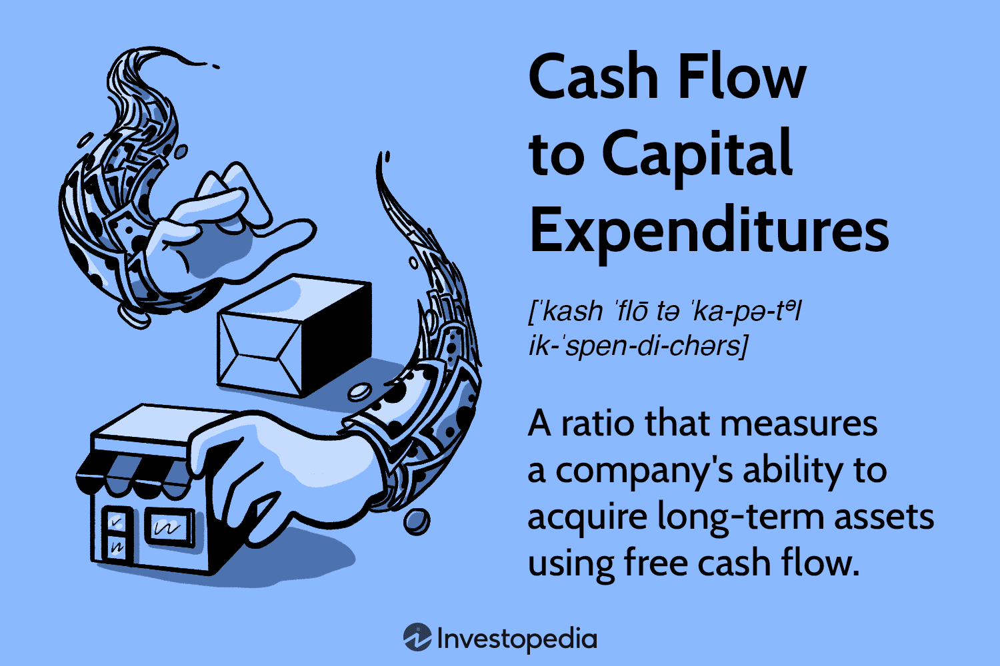

Understanding the significance of capital expenditures (CapEx) and cash flow is crucial in the financial analysis of any company. Capital expenditures represent the funds used by a company to acquire, upgrade, and maintain physical assets such as property, industrial buildings, or equipment. This financial outlay is necessary for a company to maintain its operational capacities and foster growth through new projects and expansions. On the other hand, cash flow measures the net amount of cash being transferred into and out of a business, which impacts its ability to fund operations and investments without relying on external financing.

A more targeted measure that provides vital insights into a company's financial health is Free Cash Flow (FCF). FCF is the cash generated by the company after accounting for capital expenditures. Unlike net income, FCF reflects the actual amount of cash available to fund growth initiatives, return to shareholders, or reduce debt. It is calculated as follows:



$$
\text{FCF} = \text{Operating Cash Flow} - \text{Capital Expenditures}
$$

This metric is particularly valuable for assessing a company's capability to invest in capital projects and expansion opportunities without straining its financial position. A robust FCF indicates strong financial health, enabling companies to pursue strategic initiatives more confidently.

Algorithmic trading has gained prominence in recent years, with investors and fund managers increasingly integrating financial metrics like FCF into their trading strategies. By using computational algorithms to evaluate financial data, traders can identify patterns and make informed investment decisions at speeds unattainable by human analysis alone. The incorporation of FCF into these algorithms enhances the strategies by focusing on the cash-generating abilities of the firms, which can serve as reliable indicators of potential stock performance.

This article examines the intersection of capital expenditures, cash flow analysis, and algorithmic trading. Our objective is to provide a comprehensive overview of these concepts and their relevance in financial analysis and trading. Through an in-depth exploration of these elements, readers will gain a better understanding of how strategic financial management can drive both corporate success and informed trading decisions.

## Table of Contents

## Understanding Capital Expenditures and Cash Flow

Capital Expenditures (CapEx) are investments made by companies to acquire, enhance, or maintain physical assets such as property, industrial buildings, or equipment. These expenditures are crucial for the company’s growth and operational efficiency. They represent a significant outflow of capital, impacting a company’s financial strategy and cash management.

Cash flow is the net amount of cash being transferred into and out of a business. It reflects the company's ability to fund operations, meet its financial obligations, and potentially generate investor returns. Analyzing cash flow involves examining operating activities, including revenues and expenses, as well as investments and financing activities. This analysis is vital for determining the [liquidity](/wiki/liquidity-risk-premium) and financial flexibility of a business.

The ratio of Cash Flow to Capital Expenditures (CF to CapEx) is a key financial metric that indicates a company's capability to acquire long-term assets using its free cash flow. This ratio is expressed as:

$$
\text{CF to CapEx Ratio} = \frac{\text{Free Cash Flow}}{\text{Capital Expenditures}}
$$

A high CF/CapEx ratio suggests that a company is able to finance its investments without relying on external funding sources, which is a sign of financial robustness. This implies that the company can maintain its operations and potentially undertake strategic initiatives even during periods when external financial markets may be less accessible.

Examining cash flow statements provides valuable insights into a company's financial health. Analysts closely review trends in operating cash flow and CapEx to assess a company’s potential for sustainable growth. A company with consistent, positive cash flow is better equipped to manage unexpected expenses and can strategically plan for future investments. By understanding both CapEx and cash flow, stakeholders can make more informed decisions, evaluating how effectively a company is utilizing its financial resources to drive operational success and growth.

## The Role of Free Cash Flow in Financial Analysis

Free Cash Flow (FCF) is a critical metric in financial analysis, offering a transparent view of a company's financial health by representing the cash generated after accounting for capital expenditures (CapEx). Unlike earnings, which can be influenced by accounting conventions and non-cash items, FCF reflects the actual cash available to a company. This direct cash representation is unencumbered by adjustments and provides clearer insights into a company's ability to generate positive cash flow after costs associated with maintaining or expanding its asset base.

Investors often prioritize FCF over earnings to evaluate a company's profitability, sustainability, and potential for enhancing shareholder value. The rationale behind this preference stems from FCF’s ability to signify the cash available for discretionary activities, such as paying dividends, repurchasing shares, reducing debt, or funding new investments and acquisitions. A company demonstrating strong and growing FCF is typically perceived as capable of sustaining its operations and seizing growth opportunities without relying heavily on external financing.

The calculation of FCF is straightforward and involves subtracting capital expenditures from cash flow from operations:

$$
\text{FCF} = \text{Cash Flow from Operations} - \text{Capital Expenditures}
$$

This metric is fundamental for stakeholders, as it aids in making informed decisions regarding investment, financing, and corporate strategies. For instance, a robust FCF allows a company to pursue expansion or diversification and reduces vulnerability to economic downturns due to its ability to self-finance. Moreover, companies with strong FCF are often targets for investment since they hold the promise of growth and consistent return on investment.

FCF's role extends beyond just operational and strategic planning. By understanding and applying FCF insights, investors can gauge whether a company's growth is driven by sustainable cash flows or through debt accumulation. This differentiation is critical for assessing the long-term viability of the business model and provides a comprehensive perspective on financial resilience. In essence, mastering the intricacies of FCF empowers analysts and investors to ensure data-backed decisions that align closely with the financial realities of the company.

## Using Free Cash Flow in Algo Trading

Algorithmic trading, a form of trading utilizing complex algorithms and mathematical models, increasingly incorporates Free Cash Flow (FCF) data to enhance decision-making processes. FCF represents a company's net cash inflow after capital expenditures, making it a crucial indicator of financial health. Its significance lies in offering a clearer, unobstructed view of cash generation, unlike some traditional financial metrics swayed by accounting practices.

FCF data aids in developing predictive models that influence stock price movements based on a company’s financial standing. These models consider FCF as a significant input, recognizing companies with favorable FCF as potentially lucrative investment opportunities. This is largely due to FCF's correlation with a company's ability to invest in growth, sustain operations, or return value to shareholders without needing external financing.

Integrating FCF into trading algorithms enhances strategic analysis by directing focus toward a company’s ability to generate cash. Algorithms designed to evaluate FCF trends can assess whether a company is increasing or maintaining its FCF over time, allowing traders to forecast potential stock behaviors more accurately.

In high-frequency trading ([HFT](/wiki/high-frequency-trading-strategies)) systems, real-time analysis of FCF trends becomes indispensable, especially for short-term trading strategies. By parsing through vast amounts of financial data quickly, algorithms can identify minute market changes and execute trades more efficiently. This reliance on real-time data necessitates a robust infrastructure and optimized code to ensure that trading strategies react promptly to any significant shifts in a company’s FCF.

The application of quantitative models, particularly in [algorithmic trading](/wiki/algorithmic-trading), leverages FCF to refine investment decisions substantially. These models utilize historical and real-time financial data to produce statistical insights that can predict future movements and investment outlooks. For example, a Python implementation might involve using libraries like `pandas` for data manipulation, `numpy` for numerical calculations, and `scikit-learn` for modeling and predicting stock price movements based on FCF metrics.

Here is a basic structure of how one might script a simple analysis of FCF trends using Python:

```python
import pandas as pd
from sklearn.linear_model import LinearRegression

# Load financial data, ideally one with columns like 'FCF' and 'Stock Price'
data = pd.read_csv('financial_data.csv')

# Feature selection for FCF and related financial indicators
X = data[['FCF']].values
y = data['Stock Price'].values

# Create and train the linear regression model
model = LinearRegression()
model.fit(X, y)

# Predict future stock prices based on FCF input
future_FCF = [[1000000]]  # Example future FCF input
predicted_price = model.predict(future_FCF)

print(f"Predicted Stock Price: {predicted_price[0]}")
```

This code outlines a fundamental approach, using a linear regression model to analyze how changes in FCF might influence stock prices. Such models can be expanded by including additional features and employing more sophisticated algorithms to better capture complex market dynamics.

In conclusion, the strategic use of FCF in algorithmic trading not only refines investment strategies but also provides an edge in predicting financial trajectories by highlighting the pivotal role of cash-generating capabilities.

## Strategic Applications of Free Cash Flow

Free Cash Flow (FCF) is a critical metric that enables companies to make informed strategic decisions across various financial dimensions.

Companies that maintain a strong Free Cash Flow position are better equipped to pursue mergers and acquisitions (M&A) without relying heavily on external financing sources. This ability stems from the cash reserves generated through FCF, which can be directly applied to fund acquisitions. As a result, these companies can negotiate more favorable terms, lower their debt levels, and maintain greater financial flexibility in transactions.

FCF plays a pivotal role in guiding capital investment decisions. When companies generate adequate free cash flow, they have the financial leverage to invest in growth opportunities such as new product development, geographic expansion, or upgrading technologies. These investments are crucial for maintaining a competitive edge and fostering long-term innovation and growth.

A consistent or growing Free Cash Flow allows companies to sustain stable dividend policies. Investors often view such stability in dividends as a sign of reliability, spurring investor confidence and potentially leading to a higher stock price. Therefore, companies with predictable FCF can attract and retain investors seeking regular returns on their investments.

Neglecting FCF metrics can result in substantial financial missteps. Without an accurate assessment of FCF, management may make subpar strategic decisions, such as overextending in capital expenditures or underestimating liquidity needs. Therefore, integrating FCF analysis into the strategic planning process is critical for ensuring prudent financial management and avoiding potential liquidity crises.

Finally, analyzing FCF trends can shed light on a company’s growth prospects and financial resilience. An upward trajectory in FCF suggests effective management and robust operational performance, while a declining pattern could indicate potential challenges in sustaining growth. Tracking these trends enables stakeholders to understand better a company's operational efficiency, capacity to generate cash, and overall financial health, ultimately guiding more strategic decision-making.

## Conclusion

Free Cash Flow (FCF) is a crucial metric in assessing a company's financial health and its capabilities in strategic planning and investment. Unlike earnings, which can be subject to accounting adjustments, FCF offers a clearer picture of a company’s ability to generate cash, ensuring that stakeholders get a realistic overview of financial conditions. Understanding and leveraging FCF metrics not only enhance financial analysis but also inform sound investment decisions and optimize algorithmic trading strategies.

The utility of FCF lies in its role as a robust indicator of a company’s ability to generate cash. A positive FCF demonstrates that a company can finance its growth initiatives, such as new product development, market expansion, or capital improvements, without relying excessively on external capital sources, indicating financial resilience and stability. Moreover, it shows a company's potential to return value to shareholders through dividends and share buybacks, solidifying investor confidence.

Integrating FCF evaluation into broader financial assessments is essential for investors and analysts. By doing so, they ensure a comprehensive analysis that not only focuses on profitability metrics like net income but also on cash flow generation, which can often reveal underlying financial strengths or weaknesses not captured in income statements. Mathematical evaluation of FCF can be expressed as:

$$
\text{FCF} = \text{Cash Flow from Operations} - \text{Capital Expenditures}
$$

Mastery of FCF concepts is indispensable for stakeholders looking to make strategic, data-driven decisions. Whether one is involved in corporate strategy, investment analysis, or the development of complex trading algorithms, a clear understanding of FCF metrics is vital. This understanding supports the crafting of strategies that emphasize financial sustainability and long-term shareholder value, proving the critical nature of FCF in today's competitive business landscape.

## References & Further Reading

[1]: ["Financial Statement Analysis and Security Valuation"](https://www.amazon.com/Financial-Statement-Analysis-Security-Valuation/dp/0073379662) by Stephen H. Penman

[2]: ["The Free Cash Flow Method for Valuing Equity Securities"](https://www.investopedia.com/terms/f/freecashflowtoequity.asp) by Andrew C. Wicks and John W. Sherry

[3]: Damodaran, A. (2006). ["Valuation Approaches and Metrics: A Survey of the Theory and Evidence."](https://people.stern.nyu.edu/adamodar/pdfiles/papers/valuesurvey.pdf) NYU Stern School of Business, Working Paper.

[4]: ["Algorithmic Trading and DMA: An Introduction to Direct Access Trading Strategies"](https://www.amazon.com/Algorithmic-Trading-DMA-introduction-strategies/dp/0956399207) by Barry Johnson

[5]: ["Quality of Earnings: The Investor's Guide to How Much Money a Company is Really Making"](https://www.amazon.com/Quality-Earnings-Investors-Company-Really/dp/0029226309) by Thornton L. O'glove