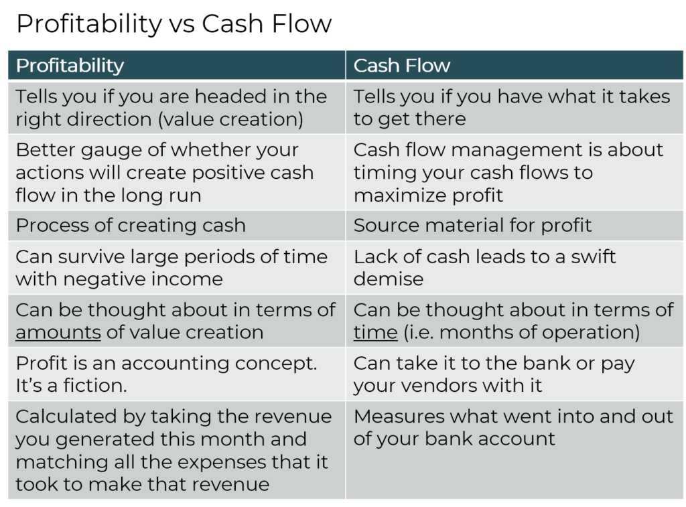

## Table of Contents

## What is cash flow?

Cash flow is the money that comes in and goes out of a business or a person's wallet. It's like keeping track of how much money you have at any time. If more money comes in than goes out, you have a positive cash flow. If more money goes out than comes in, you have a negative cash flow. This is important because it helps you know if you can pay your bills and keep your business running smoothly.

For a business, cash flow can come from selling products or services, getting loans, or investments. Money goes out for things like rent, salaries, and buying supplies. Good cash flow management means making sure there's always enough money to cover these costs. For individuals, cash flow is about managing income from a job or other sources and spending on things like rent, food, and entertainment. Keeping a close eye on cash flow helps avoid running out of money and facing financial problems.

## What is profit?

Profit is the money a business makes after paying for all its costs. It's what's left over when you subtract all the expenses from the money that comes in from selling things or services. If a business sells something for $100 and it cost $80 to make and sell it, the profit is $20. Profit is important because it shows if a business is doing well and can keep going, grow, or pay its owners.

For a business to be successful, it needs to make a profit over time. This profit can be used to reinvest in the business, like buying new equipment or hiring more staff, or it can be given to the owners as a reward for their investment. Sometimes, businesses might have a profit on paper but still struggle with cash flow, meaning they might not have enough money on hand to pay bills right away. So, while profit is crucial, managing cash flow is also very important for the health of a business.

## How is cash flow calculated?

Cash flow is calculated by looking at how much money comes into a business and how much goes out over a certain time, like a month or a year. To figure it out, you start with the money you have at the beginning of the period. Then, you add all the money that comes in from things like sales, loans, or investments. This is called cash inflow.

Next, you subtract all the money that goes out, which is called cash outflow. This includes costs like rent, salaries, buying supplies, and paying bills. The difference between the cash inflow and the cash outflow is your net cash flow. If you have more money coming in than going out, you have a positive cash flow. If you have more money going out than coming in, you have a negative cash flow. Keeping track of this helps you know if you can keep your business running smoothly.

## How is profit calculated?

Profit is what's left after a business pays for everything it needs to run. To find out the profit, you start with all the money the business makes from selling things or services. This is called revenue. Then, you take away all the costs. Costs can be things like the price of making the product, paying workers, rent, and other bills. What's left after you subtract all the costs from the revenue is the profit.

Sometimes, businesses talk about different kinds of profit. Gross profit is what you get when you take away just the cost of making the product from the revenue. Net profit is what's left after you take away all the costs, including things like taxes and interest on loans. Knowing the profit helps a business see if it's doing well and if it can grow or give money back to the owners.

## What are the main differences between cash flow and profit?

Cash flow and profit are both important for a business, but they tell different stories. Cash flow is all about the money moving in and out of a business over time. It's like watching a river flow; you see how much money comes in from sales, loans, or investments and how much goes out to pay for things like rent, salaries, and supplies. If more money comes in than goes out, you have a positive cash flow, which means you can keep the business running smoothly. If more money goes out than comes in, you have a negative cash flow, which can lead to problems paying bills.

Profit, on the other hand, is what's left over after a business pays for everything it needs. It's like looking at the scoreboard at the end of a game to see if you won or lost. You start with the total money made from selling things or services, called revenue, and then subtract all the costs, like making the product, paying workers, and other bills. What's left is the profit. A business can be profitable but still have cash flow problems if it doesn't have enough money on hand to pay its bills right away. So, while profit shows if a business is doing well overall, cash flow is crucial for day-to-day operations.

## Why is cash flow important for a business?

Cash flow is really important for a business because it shows if there's enough money to keep things running smoothly. Imagine you're playing a game where you need money to buy things and pay bills. If more money comes in than goes out, you can keep playing without any problems. But if more money goes out than comes in, you might run out of money and have to stop. That's why businesses need to watch their cash flow closely. It helps them make sure they can pay for things like rent, salaries, and supplies on time.

Even if a business is making a profit, it can still have cash flow problems. Profit is like the score at the end of a game, showing if you won or lost. But cash flow is like the money you have in your pocket while playing. A business might be profitable but still struggle to pay bills because the money isn't coming in fast enough. That's why managing cash flow is so important. It helps a business stay healthy and avoid running out of money, even if it's making a profit on paper.

## Why is profit important for a business?

Profit is important for a business because it shows if the business is doing well. It's like the score at the end of a game. If a business makes more money from selling things than it spends on making them and other costs, it has a profit. This means the business is successful and can keep going. Owners and investors look at profit to see if the business is worth putting money into.

Having profit also helps a business grow. With the extra money, a business can buy new things, like machines or more supplies, or hire more people. Sometimes, the profit can be given back to the owners as a reward for their hard work. Even though profit is important, it's not the only thing that matters. A business also needs to manage its cash flow well to make sure it has enough money to pay bills every day.

## Can a business be profitable but have negative cash flow?

Yes, a business can be profitable but still have negative cash flow. Profit is like the score at the end of a game. It's what's left after you take away all the costs from the money you made from selling things. But cash flow is about the money moving in and out of the business every day. If a business sells a lot of things but doesn't get paid right away, it might not have enough money to pay its bills even if it's making a profit.

For example, imagine a business sells something for $100, but it costs $80 to make it. The profit is $20. But if the customer doesn't pay for 60 days, the business might have to pay for things like rent and salaries before getting that $100. So, even though the business is profitable, it might not have enough cash to keep going until the money comes in. That's why it's important for a business to watch both its profit and its cash flow.

## Can a business have positive cash flow but be unprofitable?

Yes, a business can have positive cash flow but still be unprofitable. Positive cash flow means more money is coming into the business than going out. This can happen if a business gets a big loan or if customers pay quickly. Even if the business is spending a lot of money on things like making products or paying workers, as long as more money is coming in than going out, the cash flow is positive.

But being unprofitable means the business is losing money overall. This can happen if the costs of running the business are more than the money made from selling things. For example, a business might sell a product for $100, but it costs $120 to make and sell it. Even if the business gets the $100 right away, it's still losing $20 on each sale. So, the business can have positive cash flow for a while, but it's not making a profit and might run into problems later if it keeps losing money.

## How do cash flow and profit impact business decisions?

Cash flow and profit are both important for making business decisions. Cash flow tells a business if it has enough money to pay for things like rent, salaries, and supplies every day. If a business sees that it's running low on cash, it might decide to slow down on buying new things or try to get customers to pay faster. This helps the business keep going without running out of money. On the other hand, if the cash flow is good, the business might decide to spend more on growing, like buying new equipment or hiring more people.

Profit, on the other hand, shows if a business is doing well overall. If a business is making a profit, it might decide to invest more money in new projects or give some of the profit back to the owners. But if the business is losing money, it might need to cut costs or find ways to make more money. Sometimes, a business might be profitable but still have cash flow problems, so it's important to look at both when making decisions. For example, a profitable business might need to borrow money to keep the cash flow positive until it gets paid by customers.

## What are some strategies to improve cash flow?

One way to improve cash flow is to speed up how fast you get paid. If you're a business, you can do this by asking customers to pay right away or offering discounts for quick payments. Another way is to be strict about when customers pay. If they're late, remind them or even stop selling to them until they pay what they owe. You can also use technology to make paying easier, like setting up online payments or using apps.

Another strategy is to watch your spending closely. Look at all the money you spend on things like supplies, rent, and salaries, and see if you can spend less. Maybe you can find cheaper suppliers or move to a smaller office. You can also try to buy things when they're on sale or get a better deal by buying in bulk. It's important to keep some money saved up for emergencies, so you don't run out of cash if something unexpected happens.

Lastly, you can improve cash flow by getting more money in from other places. This could mean taking out a loan or finding investors who want to put money into your business. Sometimes, selling things you don't need anymore, like old equipment, can also bring in extra cash. By doing these things, you can make sure you always have enough money to keep your business running smoothly.

## What are some strategies to increase profit?

One way to increase profit is to find ways to make more money from selling things. A business can do this by raising prices if customers are willing to pay more, or by selling more products or services. Another way is to find new customers or sell to different places. Sometimes, businesses can make more money by adding new products or services that people want. It's also important to keep an eye on what competitors are doing and try to do better than them. By focusing on making more sales and finding new ways to bring in money, a business can increase its profit.

Another strategy to increase profit is to cut costs. This means looking at everything the business spends money on and seeing if there are ways to spend less. For example, a business might find cheaper suppliers or move to a smaller office to save on rent. It can also try to use less energy or find ways to make things more efficiently, so it costs less to make each product. Sometimes, businesses can save money by negotiating better deals with suppliers or by buying things in bulk. By spending less on costs, more money is left over as profit.

Lastly, improving the quality of products or services can also help increase profit. If customers are happy with what they buy, they're more likely to come back and buy more. They might also tell their friends, which brings in new customers. Good customer service can make a big difference too. By focusing on making customers happy and keeping them coming back, a business can sell more and increase its profit over time.

## What Makes Cash Flow a Vital Financial Indicator?

Cash flow is a fundamental indicator of a company's financial health, representing the net amount of cash being moved in and out of the organization. It differs from profit, which includes various non-cash elements like depreciation and receivables. Positive cash flow is a sign of a company's ability to cover its obligations, supporting debt repayment, investment opportunities, and resilience against financial challenges.

The cash flow statement, a core component of a company's financial reports, elucidates its liquidity status. It is divided into three sections: operating activities, investing activities, and financing activities.

1. **Operating Activities**: This section reflects the cash generated or consumed in the core business operations. It includes cash receipts from sales and cash payments to suppliers and employees. The formula used to calculate cash flow from operating activities is:
$$
   \text{Cash Flow from Operating Activities} = \text{Net Income} + \text{Non-cash Expenses} + \text{Changes in Working Capital}

$$

   Non-cash expenses typically include depreciation and amortization. Changes in working capital refer to the fluctuations in accounts receivable, inventory, and accounts payable.

2. **Investing Activities**: This outlines cash flows associated with the acquisition and disposal of long-term investments and property, plant, and equipment. Cash spent or received from buying or selling assets is recorded here.

3. **Financing Activities**: This section relates to transactions used to fund the company. It includes cash flows from borrowing or repaying bank loans, issuing or buying back shares, and paying dividends.

Together, these sections provide a comprehensive overview of a company's [liquidity](/wiki/liquidity-risk-premium) by detailing how cash is generated and used across various functions. By evaluating the cash flow statement, stakeholders can gain insights into a company's ability to maintain positive cash flow, indicating robust operational health and a strong position to invest in further growth. Understanding these components highlights the dynamic nature of cash flow management as an essential aspect of strategic financial planning.

## What is Profit Analysis and How Does it Help in Understanding Business Performance?

Profits are a fundamental measure of a company's financial success, representing the monetary surplus remaining after all expenses have been subtracted from total revenues. Calculating and analyzing profits provides insights into how efficiently a business is operating and its potential for growth. 

### Layers of Profit Analysis

Profit analysis is multi-faceted, encompassing various types of profitability metrics that shed light on different operational aspects:

1. **Gross Profit**: This is the revenue minus the cost of goods sold (COGS). It highlights the efficiency of core business operations in producing goods or services before accounting for overhead expenses. The formula for gross profit is:
$$
   \text{Gross Profit} = \text{Revenue} - \text{COGS}

$$

2. **Operating Profit**: Also known as operating income, this metric deducts operating expenses such as wages, rent, and utilities from the gross profit. It provides a clearer picture of the core operational efficiency, independent of interest and tax implications. The calculation is as follows:
$$
   \text{Operating Profit} = \text{Gross Profit} - \text{Operating Expenses}

$$

3. **Net Profit**: Often referred to as the bottom line, net profit is the resultant amount after all expenses, including operating expenses, interest, taxes, and one-time expenses or gains, are deducted. It reflects a company's ultimate profitability and is crucial for financial forecasting and planning. The formula is:
$$
   \text{Net Profit} = \text{Operating Profit} - \text{Interest Expenses} - \text{Taxes}

$$

### Interplay Between Cash Flow and Profit

While profit provides a measure of financial efficiency, it may not represent the actual liquidity available to a business at any given time. Cash flow tracks the inflow and outflow of cash, highlighting the liquidity aspect of a company. 

A business can be profitable yet face liquidity issues if cash flow is inadequate. For instance, a high net profit may coincide with accounts receivable that are not yet collected, rendering the company cash-poor. Conversely, a business might experience a positive cash flow with investments or financing activities despite incurring a period of net losses.

Hence, a comprehensive assessment of financial health must consider both cash flow and profit metrics. Effective management of both elements ensures sustainability and strategic growth potential. 

Incorporating a nuanced understanding of these profit layers and their relation to cash flow is critical. This understanding aids in making informed decisions about cost management, investment opportunities, and general business strategies, ultimately bolstering a firm's financial standing and competitiveness.

## References & Further Reading

[1]: Bergstra, J., Bardenet, R., Bengio, Y., & Kégl, B. (2011). ["Algorithms for Hyper-Parameter Optimization."](https://papers.nips.cc/paper/4443-algorithms-for-hyper-parameter-optimization) Advances in Neural Information Processing Systems 24.

[2]: ["Advances in Financial Machine Learning"](https://www.amazon.com/Advances-Financial-Machine-Learning-Marcos/dp/1119482089) by Marcos Lopez de Prado

[3]: ["Evidence-Based Technical Analysis: Applying the Scientific Method and Statistical Inference to Trading Signals"](https://www.amazon.com/Evidence-Based-Technical-Analysis-Scientific-Statistical/dp/0470008741) by David Aronson

[4]: ["Machine Learning for Algorithmic Trading"](https://github.com/stefan-jansen/machine-learning-for-trading) by Stefan Jansen

[5]: ["Quantitative Trading: How to Build Your Own Algorithmic Trading Business"](https://www.amazon.com/Quantitative-Trading-Build-Algorithmic-Business/dp/1119800064) by Ernest P. Chan