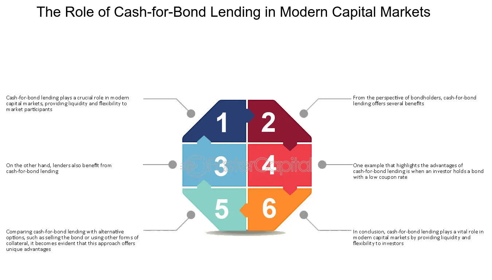

## Table of Contents

## What is cash for bond lending?

Cash for bond lending is a financial arrangement where one party lends cash to another in exchange for bonds as collateral. This process helps the borrower get cash quickly while the lender gets to hold valuable bonds as security. It's like a short-term loan where bonds are used instead of other types of collateral.

This type of lending is common in the financial markets because it helps both parties. The borrower can use the cash for various needs, like funding operations or investing in other opportunities. The lender benefits by earning interest on the cash they lend and having the security of the bonds. It's a way for both sides to manage their money more effectively.

## How does the mechanism of cash for bond lending work?

In cash for bond lending, someone who needs money quickly can borrow cash from another person or a financial institution. To do this, they give their bonds to the lender as a kind of promise. The bonds act like a safety net for the lender. If the borrower can't pay back the cash, the lender can keep the bonds instead. This makes the lender feel more secure about lending the money.

The lender, on the other hand, gets to earn some money from the deal. They charge the borrower interest on the cash they lend. This interest is like a fee for letting the borrower use their money. Plus, while the lender has the bonds, they might be able to use them in other ways, like selling them if the borrower doesn't pay back the cash. It's a way for the lender to make some extra money and for the borrower to get the cash they need.

## What are the primary advantages of cash for bond lending for investors?

For investors who lend cash in a cash for bond lending arrangement, one big advantage is that they can earn interest on the money they lend. This means they get paid for letting someone else use their cash. Also, since they get bonds as collateral, it's safer for them. If the person borrowing the money can't pay it back, the lender can keep the bonds. This makes the deal less risky because the bonds act like a safety net.

For investors who borrow cash by giving their bonds as collateral, the main benefit is that they can get money quickly when they need it. They can use this cash for other investments or to cover expenses. Even though they have to pay interest on the borrowed money, it can be worth it if they can make more money with the cash than what they pay in interest. This way, they keep their bonds but still get to use the cash they need.

## What are the potential disadvantages or risks associated with cash for bond lending?

One risk for the person lending the cash is that the value of the bonds they get as collateral might go down. If this happens and the borrower can't pay back the money, the lender might end up with bonds that are worth less than the cash they lent. Also, if the borrower doesn't pay back the cash, the lender might have to go through a long process to sell the bonds and get their money back. This can be stressful and take a lot of time.

For the person borrowing the cash, the main risk is that they have to pay interest on the money they borrow. If they can't make more money with the cash than what they pay in interest, they might lose money overall. Another risk is that if the value of their bonds goes up while they are being used as collateral, they miss out on that increase in value because they don't have the bonds anymore. They have to wait until they pay back the cash to get their bonds back, which can be a problem if they need the bonds for something else.

## Who are the typical participants in cash for bond lending transactions?

The typical participants in cash for bond lending transactions are often financial institutions like banks and investment firms. These organizations have a lot of cash and bonds, so they can easily lend cash and take bonds as collateral. They do this to earn more money from the interest on the cash they lend and to use the bonds in other ways while they hold them.

Individual investors can also be involved in cash for bond lending, but it's less common. They might lend cash if they have extra money they want to make more from, or they might borrow cash if they need money quickly and have bonds to use as collateral. However, individual investors usually need to go through a financial institution to set up these deals, which can make it more complicated for them.

## How does cash for bond lending impact the bond market?

Cash for bond lending can make the bond market more active. When people use their bonds as collateral to borrow cash, it means there are more bonds moving around in the market. This can help keep the bond market busy and liquid, which is good for everyone who wants to buy or sell bonds. If more people are lending and borrowing, it can also help set bond prices more accurately because there's more trading happening.

However, cash for bond lending can also affect bond prices. If a lot of people are using their bonds to borrow cash, it might mean there are more bonds available in the market. This could push bond prices down a bit because there's a bigger supply. On the other hand, if lenders start selling the bonds they hold as collateral because borrowers can't pay back the cash, it could also change bond prices. This shows how cash for bond lending can have a big impact on the bond market in different ways.

## What are the key considerations for an investor before engaging in cash for bond lending?

Before an investor decides to engage in cash for bond lending, they should think about the risks and benefits carefully. If they are lending cash, they need to check the value of the bonds they will get as collateral. They should make sure the bonds are worth enough to cover the cash they lend, in case the borrower can't pay it back. They also need to consider the interest they will earn on the cash they lend. This interest should be worth the risk they are taking. It's important for them to understand that if the value of the bonds goes down, they might lose money.

If an investor is borrowing cash by using their bonds as collateral, they should look at the interest they will have to pay. They need to make sure they can make more money with the cash they borrow than what they will pay in interest. They should also think about what will happen to their bonds while they are being used as collateral. If the value of the bonds goes up, they won't be able to enjoy that increase until they get the bonds back. They need to be sure they can pay back the cash on time, so they don't lose their bonds.

## How do regulatory requirements affect cash for bond lending practices?

Regulatory requirements can have a big impact on how cash for bond lending works. Governments and financial authorities set rules to make sure that these lending practices are safe and fair for everyone involved. These rules might say how much cash someone can lend, what kind of bonds can be used as collateral, and how much interest can be charged. The goal is to protect both the lender and the borrower, and to keep the financial system stable. If the rules are strict, it might make cash for bond lending more complicated, but it can also help prevent big problems.

For example, regulations might require lenders to check the value of the bonds they get as collateral regularly. This is to make sure the bonds are still worth enough to cover the cash they lent. There might also be rules about how quickly a lender can sell the bonds if the borrower doesn't pay back the cash. These regulations can change depending on where you are and what kind of bonds are involved. So, anyone thinking about doing cash for bond lending needs to know the rules in their area and make sure they follow them.

## Can you explain the role of collateral in cash for bond lending?

In cash for bond lending, collateral is super important. It's like a promise that the person borrowing the cash gives to the lender. The borrower gives their bonds to the lender as collateral. This makes the lender feel safer about lending the money because if the borrower can't pay back the cash, the lender can keep the bonds instead. It's a way to make sure the lender doesn't lose all their money if something goes wrong.

The value of the collateral matters a lot too. The lender needs to check that the bonds are worth enough to cover the cash they are lending. If the value of the bonds goes down while the lender is holding them, it could be a problem. The lender might end up with bonds that are worth less than the cash they lent. That's why lenders often keep an eye on the value of the bonds and might ask for more collateral if the value drops too much. This helps keep the deal fair and safe for everyone involved.

## What are the differences between cash for bond lending and other forms of securities lending?

Cash for bond lending is a specific type of securities lending where someone borrows cash and gives bonds as collateral. In other forms of securities lending, different types of securities, like stocks or other financial instruments, can be used as collateral instead of just bonds. For example, in stock lending, someone might borrow stocks and use other stocks or cash as collateral. The key difference is the type of security used as collateral and what is being borrowed or lent.

Another difference is how these transactions are used. Cash for bond lending is often used by investors who need quick cash but want to keep their bonds. They use the borrowed cash for other investments or to cover expenses, and they get their bonds back when they repay the cash. Other forms of securities lending might be used for different reasons, like short selling, where someone borrows stocks to sell them with the hope of buying them back at a lower price later. The goals and uses of the transactions can be quite different, depending on the type of securities involved.

## How has the practice of cash for bond lending evolved over time?

Cash for bond lending has changed a lot over time. In the past, it was mostly big banks and financial institutions that did this kind of lending. They had a lot of cash and bonds, so it was easy for them to lend and borrow. But as time went on, more and more people started to see the benefits of cash for bond lending. Now, even individual investors can take part, though they usually need to go through a financial institution to set it up. Technology has also made it easier to do these deals quickly and safely.

The rules and regulations around cash for bond lending have also evolved. Governments and financial authorities have put in place more rules to make sure these deals are safe and fair. These rules can say things like how much cash can be lent, what kind of bonds can be used as collateral, and how much interest can be charged. While these rules can make cash for bond lending a bit more complicated, they help prevent big problems and keep the financial system stable. As a result, cash for bond lending has become a common and important part of the financial world.

## What advanced strategies can be employed to optimize returns from cash for bond lending?

To optimize returns from cash for bond lending, investors can use a strategy called active collateral management. This means they keep a close eye on the value of the bonds they get as collateral. If the value of the bonds goes down, they might ask the borrower for more collateral or sell the bonds to get their money back. By doing this, they can make sure they are always protected and can still earn good interest on the cash they lend. Another way to boost returns is to lend cash to many different borrowers at the same time. This spreads out the risk, so if one borrower can't pay back the cash, the lender won't lose all their money. It's like not putting all your eggs in one basket.

Another strategy is to use technology to make the lending process faster and more efficient. With modern tools, lenders can quickly check the value of bonds and make decisions about lending or asking for more collateral. This can help them react faster to changes in the market and get better deals. Also, lenders can work with financial experts who know a lot about cash for bond lending. These experts can help them find the best borrowers and set the right interest rates to make more money. By using these advanced strategies, investors can make the most out of cash for bond lending and get better returns on their money.

## References & Further Reading

[1]: Adrian, Tobias, Burke, Chris, and McAndrews, James. (2009). ["The Federal Reserve's Primary Dealer Credit Facility"](https://papers.ssrn.com/sol3/papers.cfm?abstract_id=1473444). Staff Report, Federal Reserve Bank of New York.

[2]: Garcia, Santiago M., and Tse, Thomas. (2007). ["Bond Markets: Structures and Yield Calculations"](https://api.pageplace.de/preview/DT0400.9781135931421_A40692789/preview-9781135931421_A40692789.pdf). Financial Analysts Journal 63(1): 29-42.

[3]: Lopez de Prado, Marcos. (2018). ["Advances in Financial Machine Learning"](https://www.amazon.com/Advances-Financial-Machine-Learning-Marcos/dp/1119482089). Wiley.

[4]: Jones, Charles M., and Lamont, Owen A. (2002). ["Short-sale constraints and stock returns"](https://www.sciencedirect.com/science/article/pii/S0304405X02002246). Review of Financial Studies 16, no. 2: 487-525.

[5]: Stefan Jansen. (2020). ["Machine Learning for Algorithmic Trading"](https://github.com/stefan-jansen/machine-learning-for-trading). Packt.