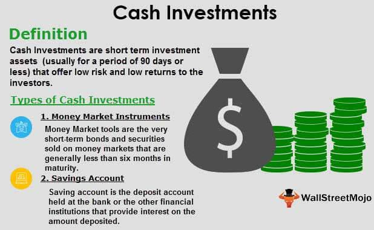

The financial world is vast and often confusing, full of opportunities for growth as well as pitfalls. Investors are faced with a myriad of choices when it comes to allocating their resources, with cash investments and algorithmic trading representing two distinctly different approaches. Each of these investment strategies offers unique benefits and drawbacks, making it imperative for investors to understand these options thoroughly.

Cash investments are typically considered a low-risk approach that provides stability and liquidity. These include savings accounts and certificates of deposit (CDs), which offer secure returns through interest payments. While these investments are generally safe, they often yield lower returns, which can be a drawback for long-term growth, particularly as they may not keep pace with inflation.



On the other end of the spectrum lies algorithmic trading, an advanced method that leverages sophisticated computer algorithms to automate trading decisions. This approach offers speed and efficiency, executing trades based on pre-set criteria and minimizing human error. Algorithmic trading is becoming increasingly prevalent in the financial markets due to its ability to process vast amounts of data and make informed decisions in real-time.

This article aims to explore these two types of investment strategies, examining their benefits and drawbacks through real-world examples that illustrate their impact. Understanding these concepts is crucial for making informed financial decisions and optimizing investment returns. Both cash investments and algorithmic trading have their place in a well-balanced portfolio, offering complementary benefits that can be leveraged for strategic growth and optimal financial health.

## Table of Contents

## Understanding Cash Investments

Cash investments represent a fundamental component of the investment landscape, serving as a low-risk vehicle for preserving capital over short periods. These instruments primarily include savings accounts, money market accounts (MMAs), and certificates of deposit (CDs). Such investments are particularly appealing for their safety and liquidity, offering investors a means to earn interest on their capital with minimal exposure to risk.

The primary characteristic of cash investments is their short duration, generally less than 90 days. This feature offers significant liquidity, allowing investors to access their funds readily when necessary. However, the trade-off for this high degree of liquidity and safety is the relatively low return on investment. Interest rates on cash investments are typically modest, often struggling to keep pace with inflation. Consequently, while they provide a stable environment for parking funds temporarily, they are not suited for long-term growth strategies.

Savings accounts are perhaps the most straightforward form of cash investment. Offered by banks and credit unions, they provide Federal Deposit Insurance Corporation (FDIC) backing, ensuring that deposits are protected up to a certain limit. Though interest rates on savings accounts are generally low, they offer unparalleled security and access to funds.

Money market accounts (MMAs) serve as another popular form of cash investment. These accounts blend features of savings accounts and checking accounts, offering higher interest rates compared to traditional savings accounts. MMAs also provide the flexibility of occasional check-writing and debit card usage, which enhances [liquidity](/wiki/liquidity-risk-premium).

Certificates of deposit (CDs) are time-bound deposits that typically yield higher interest rates than savings accounts and MMAs. In exchange for this higher return, investors must agree to keep their funds locked in for a predetermined period, which can range from a few months to several years. While CDs guarantee a fixed rate of return, they incur penalties for early withdrawals, making them less liquid than savings accounts or MMAs.

Overall, cash investments play a crucial role in financial planning by providing a secure and predictable return. However, due to their inability to significantly outpace inflation, they are best used as a temporary place for funds rather than a long-term investment strategy.

## Types of Cash Investments

Cash investments are short-term financial instruments that provide a safe harbor for funds with the benefit of liquidity and minimal risk. Here, we will outline three prominent types of cash investments: savings accounts, money market accounts, and certificates of deposit (CDs).

**Savings Accounts**: Savings accounts are favored for their convenience and security. They are offered by financial institutions like banks and credit unions and are insured by the Federal Deposit Insurance Corporation (FDIC) up to $250,000 per depositor, providing a safety net for account holders. These accounts are highly liquid, allowing easy access to funds without penalties or restrictions. However, the trade-off for this convenience is a nominal interest rate, which often barely keeps pace with inflation. Consequently, while savings accounts are ideal for immediate financial needs and emergency funds, they may not be suitable for long-term wealth accumulation due to their low return on investment.

**Money Market Accounts (MMAs)**: MMAs offer a hybrid investment opportunity that combines features of savings accounts and checking accounts. They typically provide higher interest rates compared to traditional savings accounts, which makes them attractive for holding larger sums over time. MMAs achieve these higher rates by investing in short-term, high-quality debt instruments like Treasury bills and corporate paper. Despite being less liquid than savings accounts due to limited transactions per month, MMAs maintain a degree of accessibility that appeals to individuals looking for a balance between liquidity and return. Like savings accounts, MMAs are also backed by FDIC insurance, securing depositor funds up to the insured limit.

**Certificates of Deposit (CDs)**: CDs are time-bound deposits where funds are locked in for a specific period, ranging from a few months to several years. They offer higher interest rates because the financial institution can use the funds to lend or invest during the term. The return on a CD is fixed, allowing investors to calculate their earnings precisely using the formula for compound interest: 

$$
A = P \left(1 + \frac{r}{n}\right)^{nt}
$$

Where $A$ represents the amount of money accumulated after n years, including interest, $P$ is the principal amount, $r$ is the annual [interest rate](/wiki/interest-rate-trading-strategies), and $n$ is the number of times that interest is compounded per year. 

While CDs offer substantial returns compared to other cash investments, they require the investor to commit funds for the entire term. Early withdrawal usually incurs penalties, reducing the overall yield. Therefore, CDs are suitable for those who can afford to lock away money without needing immediate access.

In conclusion, cash investments like savings accounts, money market accounts, and CDs serve various financial purposes, each with unique characteristics suited to different financial strategies and goals. Savvy investors often utilize these instruments to meet specific liquidity needs while minimizing risk.

## Investment Examples Impacting Cash Flow

Investment activities greatly influence cash flow dynamics, with each strategic decision impacting the liquidity and growth potential of individuals and corporations alike. When a company opts to acquire assets, such activities can manifest as negative cash flow initially. This is due to the immediate expenditure required for the acquisition, which temporarily reduces available cash reserves. However, asset acquisition is fundamental for long-term growth. Tangible assets, for example, can enhance production capacity or operational efficiency, while intangible ones, such as patents, can bolster a firm's market position and future revenue streams.

To illustrate this with a basic equation, the impact on cash flow ($CF$) from acquiring an asset can be represented as:
$$
CF = \text{Initial Cash} - \text{Asset Cost} + \text{Future Cash Inflows}
$$

Conversely, the sale of investments can provide a critical boost to cash flow, improving liquidity. Selling a portion of an investment portfolio or offloading underperforming assets can convert these holdings into cash. This increases the funds available for more strategic allocations and day-to-day operations, always crucial for maintaining flexibility in financial planning.

Corporations like Apple exemplify efficient cash flow management through strategic asset management. Apple maintains a significant portion of its cash flow within marketable securities. These securities, which include U.S. Treasury and agency securities, commercial paper, and corporate securities, are part of Apple's strategy to manage liquidity while aiming for additional returns. Apple's approach involves balancing immediate access to cash with opportunities for growth, ensuring resources are available for core business expansion, acquisitions, and shareholder returns.

Apple's financial statements indicate active management of operating cash flows and investments in marketable securities. By maintaining an optimal mix of liquidity and investments, Apple can continue innovating and expanding its product line while assuring shareholders of its financial stability. This strategic asset allocation not only ensures adequate cash flow but also prepares the company for future investments and economic fluctuations.

Overall, the strategic handling of investments, whether through acquiring new assets or selling existing ones, plays a pivotal role in cash flow management. This balancing act between asset acquisition and disposal ensures that both individuals and corporations can meet immediate cash needs while supporting sustainable growth trajectories.

## Algorithmic Trading: An Overview

Algorithmic trading employs sophisticated computer algorithms to automate the execution of trading decisions, significantly transforming how financial markets operate. This form of trading leverages technology to reduce human error and emotional biases, thereby enhancing decision-making processes. These algorithms are designed to execute trades based on pre-set criteria, enabling traders to capitalize on opportunities that would be impossible to realize through manual trading due to time constraints and cognitive limitations.

One of the primary advantages of [algorithmic trading](/wiki/algorithmic-trading) is speed. The algorithms can process complex calculations and execute orders within milliseconds, a capability that is vital in today's high-frequency trading environments. This speed allows traders to exploit even the smallest market inefficiencies that may only exist for incredibly brief periods.

Precision is another significant feature of algorithmic trading. Algorithms ensure that large volumes of trades are executed with exactitude, minimizing transaction costs and slippage. This precision in execution is critical in strategies where timing and accuracy are paramount, such as [arbitrage](/wiki/arbitrage) or trend-following strategies.

Automation is intrinsic to algorithmic trading, and it facilitates the continuous operation of trading systems without constant human supervision. Traders can set their algorithms to run 24/7, monitoring market conditions, and executing trades whenever market conditions meet predefined parameters. This capability is particularly useful for global markets that operate across different time zones.

Additionally, algorithmic trading allows for the [backtesting](/wiki/backtesting) of strategies. Traders can simulate how their algorithms would perform under various historical market conditions. This is achieved by leveraging historical data to evaluate the potential profitability and risk associated with a trading strategy, allowing traders to refine their algorithms before deploying them in live markets. Python is often used in this context, as demonstrated by the following simple example of a moving average crossover strategy:

```python
import pandas as pd
import numpy as np

# Load historical data
data = pd.read_csv('historical_prices.csv')
data['10-day MA'] = data['Close'].rolling(window=10).mean()
data['50-day MA'] = data['Close'].rolling(window=50).mean()

# Generate trading signals
data['Signal'] = 0
data['Signal'][10:] = np.where(data['10-day MA'][10:] > data['50-day MA'][10:], 1, 0)

# Backtest strategy
data['Position'] = data['Signal'].shift()
data['Strategy Returns'] = data['Position'] * data['Close'].pct_change()

# Evaluate performance
total_return = data['Strategy Returns'].sum()
print("Total Strategy Return:", total_return)
```

In summary, algorithmic trading is revolutionizing the financial landscape through its ability to automate and enhance trading upon pre-set rules, providing an edge through speed, precision, and robust backtesting capabilities.

## Strategies and Examples of Algorithmic Trading

Algorithmic trading encompasses various strategies that leverage computer algorithms to automate the decision-making and execution of trades. These strategies are designed to optimize performance by taking advantage of speed and precision that human traders cannot achieve. Here are some of the key strategies employed in algorithmic trading:

**Trend-Following**: This strategy seeks to capitalize on market trends by identifying and trading based on observable patterns. One common tool used in trend-following strategies is the moving average, which helps determine the direction of an asset's price trend. Traders use simple moving averages (SMA) or exponential moving averages (EMA) to smooth out price data and generate buy or sell signals. For example, a crossover of a short-term moving average above a long-term moving average may trigger a buy signal, suggesting the start of an upward trend.

Mathematically, a simple moving average for a price series $P$ over $n$ periods is calculated as:

$$
SMA = \frac{1}{n} \sum_{i=0}^{n-1} P_{t-i}
$$

**Arbitrage**: This strategy exploits price discrepancies of the same or similar financial instruments across different markets or forms. Algorithmic trading systems are particularly effective at identifying and executing arbitrage opportunities due to their ability to process information and execute trades at high speeds. A typical scenario might involve purchasing an undervalued asset in one market while simultaneously selling an equivalent asset in an overvalued market, thus locking in a risk-free profit. The efficiency of algorithmic systems allows for arbitrage opportunities that exist only for a brief period to be captured before prices converge.

**Index Fund Rebalancing**: This algorithmic strategy automates the process of adjusting a portfolio to maintain alignment with a specific index. As market prices fluctuate, the weights of the assets in an index can drift, requiring rebalancing to match the target index composition. Algorithmic trading systems can efficiently compute the necessary trade adjustments and execute them with minimal market impact. An index fund rebalancing strategy might involve buying underweight assets and selling overweight ones to maintain the desired portfolio distribution.

Here is a basic Python example illustrating a simple moving average crossover strategy for trend-following:

```python
import pandas as pd

def moving_average_crossover(prices, short_window=40, long_window=100):
    signals = pd.DataFrame(index=prices.index)
    signals['price'] = prices
    signals['short_mavg'] = prices.rolling(window=short_window, min_periods=1, center=False).mean()
    signals['long_mavg'] = prices.rolling(window=long_window, min_periods=1, center=False).mean()

    signals['signal'] = 0.0
    signals['signal'][short_window:] = np.where(signals['short_mavg'][short_window:] > signals['long_mavg'][short_window:], 1.0, 0.0)   
    signals['positions'] = signals['signal'].diff()

    return signals

# Example usage
# prices = pd.Series(...)
# signals = moving_average_crossover(prices)
```

These strategies highlight the diverse applications of algorithmic trading across different market conditions, enabling systematic and often profitable trading operations absent human intervention. They offer precision, speed, and the ability to process vast amounts of data, making them indispensable tools for modern trading.

## Interplay Between Cash Flow and Trading Algorithms

Cash flow analysis serves as a cornerstone in evaluating the effectiveness of investments and optimizing liquidity. It assesses the money that flows in and out of a business, enabling investors and companies to track performance, manage operational costs, and ensure there is enough liquidity for day-to-day operations. Effective cash flow management not only helps in maintaining liquidity but also allows for strategic planning of long-term investments.

Algorithmic trading, with its capacity to dynamically adjust portfolio holdings, plays a significant role in enhancing cash flow management. By using sophisticated algorithms, investors can execute trades based on pre-determined criteria, which allows for more precise control over investment strategies and risk management. These automated systems can quickly respond to market signals, ensuring that portfolios are balanced appropriately according to real-time financial positions and cash flow needs.

Combining cash flow analysis with algorithmic trading strategies results in improved decision-making and efficient resource allocation. Through the integration of data analytics and financial algorithms, investors can simulate various market conditions, assess potential impacts on cash flow, and make informed decisions that align with their financial goals. For example, one might use a Python script to simulate different investment scenarios and analyze their effects on cash flow:

```python
import numpy as np

# Scenario simulation: Cash flow impact model
initial_cash_flow = 100000  # Initial cash flow amount
market_conditions = np.random.normal(loc=0, scale=0.1, size=100)  # Simulating market conditions

# Portfolio adjustment function based on algorithmic analysis
def adjust_portfolio(cash_flow, market_change):
    return cash_flow * (1 + market_change)

adjusted_cash_flows = [adjust_portfolio(initial_cash_flow, change) for change in market_conditions]

# Analyzing impact on cash flow
expected_cash_flow = np.mean(adjusted_cash_flows)
variance = np.var(adjusted_cash_flows)

print(f"Expected Cash Flow: ${expected_cash_flow:.2f}")
print(f"Cash Flow Variance: ${variance:.2f}")
```

This code snippet demonstrates how investors can predict cash flow outcomes under various market conditions and adjust their strategies accordingly. By continuously analyzing and adjusting investment portfolios, algorithmic trading ensures an optimized balance between liquidity and asset growth. This analytics-driven approach results in enhanced resource deployment, allowing for well-rounded decision-making that aligns with overall financial strategies.

In conclusion, the interplay between cash flow analysis and algorithmic trading offers a comprehensive framework for managing financial strategies effectively. Investors who adeptly harness these tools enhance their ability to maintain liquidity while capitalizing on market opportunities, leading to robust financial health and strategic growth.

## Conclusion

Combining cash investments with algorithmic trading provides investors with a comprehensive approach to optimizing risk management and maximizing returns. Each strategy has distinct advantages that complement the other, creating a cohesive framework for effective financial management.

Cash investments are renowned for their stability and liquidity. Instruments like savings accounts, money market accounts, and certificates of deposit offer predictable returns and a high degree of security. This stability is essential for maintaining a base level of financial security and ensuring that funds are readily available for opportunities or emergencies. However, the return on cash investments is often modest, just enough to outpace inflation, emphasizing their role as a safe haven rather than a growth engine.

On the other hand, algorithmic trading offers speed and efficiency, using technology to execute trades based on predefined parameters. This modern approach reduces human error, mitigates emotional biases, and can react to market changes at lightning speed. Algorithms can incorporate complex mathematical formulas and statistical models to identify trading opportunities that might be invisible to the human eye. For instance, Python libraries like NumPy and pandas are frequently used to develop, backtest, and deploy trading algorithms:

```python
import numpy as np
import pandas as pd

# Example of a simple moving average crossover strategy
def moving_average_crossover(df, short_window=40, long_window=100):
    signals = pd.DataFrame(index=df.index)
    signals['price'] = df['Close']
    signals['short_mavg'] = df['Close'].rolling(window=short_window, min_periods=1).mean()
    signals['long_mavg'] = df['Close'].rolling(window=long_window, min_periods=1).mean()
    signals['signal'] = 0.0

    # Generate signals: 1 when the short moving average exceeds the long moving average
    signals['signal'][short_window:] = np.where(signals['short_mavg'][short_window:] > signals['long_mavg'][short_window:], 1.0, 0.0)   

    signals['positions'] = signals['signal'].diff()
    return signals
```

A well-rounded investor strategically combines both cash investments and algorithmic trading. By maintaining a portion of their portfolio in cash investments, investors safeguard against [volatility](/wiki/volatility-trading-strategies) and ensure liquidity. Meanwhile, algorithmic trading can drive growth and capitalize on market inefficiencies, potentially yielding significant returns.

This dual approach empowers investors to achieve a balanced investment strategy, harmonizing the steadiness of cash with the dynamism of algorithmic systems. Ultimately, by understanding and utilizing these financial tools, investors can navigate the complexities of modern markets, positioning themselves for sustainable financial health and growth.

## References & Further Reading

For those interested in deepening their understanding of the intersection between finance, [machine learning](/wiki/machine-learning), and algorithmic trading, the following resources are invaluable. **Advances in Financial Machine Learning by Marcos Lopez de Prado** explores cutting-edge techniques in the application of machine learning to finance. This book emphasizes the practical implementation of robust financial strategies using algorithms, providing insights into model validation, feature selection, and backtesting.

**Machine Learning for Algorithmic Trading by Stefan Jansen** offers a comprehensive guide to using Python to implement data-driven trading strategies. It provides a step-by-step approach to creating complex financial models and executing systematic trading strategies, making it an excellent resource for both beginners and experienced practitioners.

Online resources such as **Investopedia** and **Pocketful** provide accessible and regularly updated information on financial concepts and algorithmic trading techniques. These platforms cover a wide range of topics, from basic financial principles to more advanced trading algorithms, offering user-friendly guides, tutorials, and articles to cater to various levels of expertise.

These resources collectively equip investors and traders with the tools and knowledge required to effectively combine cash investments with sophisticated algorithmic trading strategies, enabling strategic growth and optimal financial decision-making.

