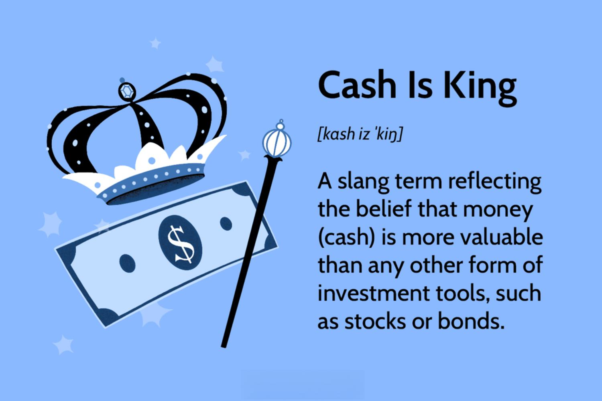

In the financial world, terminology often encapsulates complex concepts with significant implications. One such phrase, "cash is king," emerges as a noteworthy piece of financial slang, deeply rooted in both historical and contemporary financial discourse. This concept signifies the paramount importance of liquidity over other types of assets, particularly during times of economic instability. Historically, the emphasis on cash underlined a fundamental reality of financial markets: having immediate access to liquid assets offers undeniable advantages in navigating unpredictable economic conditions.

Understanding the nuances of "cash is king" enhances financial literacy by clarifying why liquidity remains a cornerstone of prudent financial strategy. It equips both individuals and businesses with the practical knowledge to make informed decisions, particularly in volatile markets where liquidity can determine the difference between seizing opportunities and facing financial setbacks. Cash offers flexibility and immediate purchasing power that other assets, like stocks or real estate, may not provide without conversion delays and potential loss in value.



The exploration of this phrase's implications extends beyond traditional financial settings, reaching into modern financial technology such as algorithmic trading. Here, liquidity takes on new dimensions, with cash reserves playing a crucial role in automated market strategies that capitalize on rapid trading opportunities. In this context, the understanding of "cash is king" is further enriched as it becomes intertwined with cutting-edge financial tools that leverage liquidity for strategic advantage.

This article aims to explore the phrase "cash is king," examining its meaning and relevance across different financial contexts. By looking at its role in both traditional financial management and algorithmic trading, readers can gain a comprehensive view of why liquidity remains a vital element in maintaining robust financial health.

## Table of Contents

## Defining 'Cash is King'

'Cash is king' is a financial aphorism highlighting the importance of having liquid cash over other asset types. It underlines the value of liquidity, especially during economic downturns or periods of financial uncertainty. Liquidity refers to how quickly and easily an asset can be converted into cash without significantly affecting its market value. During times of economic stress, assets like real estate or stocks may experience severe devaluation or may not sell as efficiently as expected, making liquid cash more desirable and potent.

From a business operations perspective, maintaining substantial cash reserves can offer companies a considerable degree of flexibility and resilience. Unlike illiquid assets, cash allows businesses to adapt swiftly to sudden market fluctuations, seize sudden investment opportunities, and avoid unnecessary debt. For example, firms with strong cash positions can invest in distressed assets at reduced prices or fund innovative projects without external financing, ensuring continuity and growth even when the broader economic landscape is uncertain.

Additionally, cash on hand ensures that both individuals and companies can meet their financial obligations promptly. This capability is crucial for avoiding bankruptcies, maintaining credit ratings, and sustaining operations. It also empowers them to take advantage of opportunities that may arise, such as acquiring undervalued assets, providing capital for mergers and acquisitions, or investing in new technology. Companies like Apple and Amazon are renowned for maintaining significant cash reserves, enabling them to navigate adverse market conditions effectively and capitalize on strategic acquisitions when they align with their long-term business objectives.

Thus, whether for businesses or individuals, cash on hand is a strategic asset, offering security, agility, and the ability to thrive amid varying economic environments.

## Use Cases: When is Cash Truly King?

Investment Opportunities: During periods of market [volatility](/wiki/volatility-trading-strategies) or downturns, cash provides a notable advantage by granting investors the ability to seize investment opportunities quickly. When asset prices plummet, those with available cash reserves can purchase undervalued stocks, real estate, or other assets at lower cost. This strategy allows investors to potentially achieve significant returns when the market rebounds. A classic principle of investing is "buy low, sell high," and having cash on hand allows investors to do just that during opportunistic market dips.

Crisis Management: In times of economic recession or financial turmoil, businesses with considerable cash reserves are better equipped to withstand financial strain without resorting to high-interest borrowing. The ability to maintain operations and fulfill financial obligations while avoiding debt is a cornerstone of effective financial management. Companies that maintain strong [liquidity](/wiki/liquidity-risk-premium) can continue paying employees, honor supplier agreements, and invest in core functions even when revenue streams are disrupted. This resilience is critical for sustaining business operations through periods of economic uncertainty.

Negotiating Power: Cash provides a compelling advantage in negotiations. In transactions, whether involving commercial agreements, asset purchases, or mergers and acquisitions, having cash at hand can offer leverage to secure better prices or terms. Sellers often favor cash offers because they are perceived as more reliable and quicker to close than financing-dependent transactions. This immediate availability of funds can incentivize sellers to reduce prices or make concessions, benefiting the buyer and enhancing overall transaction value.

Examples from Businesses: Prominent companies like Apple and Amazon exemplify the strategic advantage of maintaining substantial cash reserves. Apple consistently holds a robust cash position, allowing it to weather economic downturns and fund strategic initiatives, such as research and development or shareholder dividends, without incurring debt. Similarly, Amazon's strong liquidity enables it to invest in infrastructure, acquire strategic businesses, and explore new ventures while maintaining financial flexibility. These companies use their cash reserves as a strategic tool, offering them maneuverability in challenging economic climates while positioning themselves for future growth opportunities.

## Financial Slang and Market Psychology

The phrase "cash is king" is entrenched in market psychology, reflecting the instincts and sentiments of investors during periods of economic uncertainty. This expression underscores the perceived value and security of liquidity when market conditions become unpredictable and volatile. Investors are comforted by the idea that possessing cash can be a buffer against potential financial downturns, allowing them to navigate turbulent times with greater control and fewer constraints.

Similar expressions, such as "bull" and "bear" markets, also encapsulate the emotional and predictive dimensions of market behavior. A "bull market" signifies an environment where prices are rising or are expected to rise, fostering a climate of optimism and aggressive investment strategies. Conversely, a "bear market" denotes declining prices, leading to pessimism and cautious trading practices. Both terms highlight the prevailing mood and psychological undercurrents that drive market activities and investor reactions.

The use of such trading slang can significantly influence the decision-making processes of investors, particularly among retail investors who might be more susceptible to emotional and psychological cues. These informal terms often serve as a shorthand for market trends, simplifying complex market conditions into comprehensible narratives. Consequently, traders might make decisions based on perceived market sentiment rather than objective analysis.

In this context, the behavioral finance theory offers insights into how psychological factors can impact financial decisions. For example, the availability heuristic might lead investors to overestimate the likelihood of events they can easily recall, such as recent market crashes, prompting them to prioritize liquidity over other assets. Additionally, confirmation bias might cause investors to seek out information or interpret data that aligns with the "cash is king" sentiment during uncertain times, reinforcing their predisposed strategies.

While trading slang serves as a useful tool for summarizing market conditions, it can also lead to herd behavior, where investors collectively move in the same direction, driven by shared beliefs and sentiments rather than individual assessments. This dynamic can sometimes result in market inefficiencies or increased volatility, as fear or euphoria spreads through the market, affecting asset prices and trading volumes.

Understanding the psychological underpinnings of such financial slang can aid investors in maintaining a balanced approach to trading and investment strategies. By recognizing the influence of market sentiment, investors can strive for more data-driven and rational decision-making, potentially enhancing their overall financial resilience.

## Algorithmic Trading: The New Frontier

Algorithmic trading represents a significant shift in modern financial practices, leveraging computer algorithms to make rapid trading decisions based on extensive market data. This innovative approach is mainly driven by the capacity to process information at speeds far beyond human capability, allowing traders to exploit market inefficiencies and price discrepancies almost instantaneously.

This trading model inherently values liquidity, aligning with the sentiment of "cash is king" by emphasizing the importance of having readily available cash. Liquidity ensures that traders can quickly adapt to market fluctuations and capitalize on favorable conditions. In an [algorithmic trading](/wiki/algorithmic-trading) environment, liquidity is crucial because it provides the flexibility to execute large volumes of trades without substantially affecting market prices. This adaptability is essential, as it enables traders to navigate volatile markets efficiently.

Algorithmic trading strategies often demand significant cash reserves, as they facilitate the immediate execution of trades when opportunities arise. Maintaining a substantial cash reserve allows traders to manage risks effectively, ensuring that they can meet margin requirements or cover potential losses without having to liquidate existing positions at unfavorable prices. For instance, a common algorithmic trading strategy involves statistical [arbitrage](/wiki/arbitrage), which requires purchasing and selling a basket of securities simultaneously to exploit price differences. This strategy necessitates having enough cash on hand to execute large transactions quickly.

Python, a popular programming language in the field of algorithmic trading, is often used to implement strategies due to its versatility and wide range of libraries. Here's a simple example of a moving average crossover strategy using Python:

```python
import pandas as pd
import numpy as np

# Load historical price data into a DataFrame
data = pd.read_csv('market_data.csv')
data['SMA_50'] = data['Close'].rolling(window=50).mean()
data['SMA_200'] = data['Close'].rolling(window=200).mean()

# Signal generation: Buy when SMA_50 crosses above SMA_200, Sell otherwise
data['Signal'] = np.where(data['SMA_50'] > data['SMA_200'], 1, -1)

# Execute trades based on signals
current_cash = 100000  # Starting cash reserve
for i in range(1, len(data)):
    if data['Signal'][i] == 1 and data['Signal'][i-1] == -1:
        # Buy logic
        # Calculate the number of shares to purchase
        num_shares = current_cash // data['Close'][i]
        current_cash -= num_shares * data['Close'][i]
    elif data['Signal'][i] == -1 and data['Signal'][i-1] == 1:
        # Sell logic
        current_cash += num_shares * data['Close'][i]
        num_shares = 0

print(f"Final cash balance: {current_cash}")
```

In this example, the algorithm relies on two simple moving averages (SMA): a 50-day and a 200-day. When the short-term SMA surpasses the long-term SMA, a buy signal is generated. Conversely, a sell signal is triggered when the short-term SMA dips below the long-term SMA. The cash reserve allows for quick and efficient trade execution, reflecting the liquidity and speed essential in algorithmic trading. Thus, the principle of "cash is king" resonates strongly within this frontier, where rapid response and financial agility are pivotal for success.

## Balancing Cash and Investments

While cash serves as a crucial component for maintaining liquidity, keeping excessive amounts idle can erode its purchasing power, primarily due to inflation. Inflation reduces the value of money over time, meaning each unit of currency buys fewer goods and services. Consequently, balancing cash holdings with other investment vehicles is essential for investors aiming to preserve and grow their wealth.

One effective strategy is diversification—an investment approach that involves spreading assets across various financial instruments. This includes a mix of cash, stocks, bonds, and potentially other assets like real estate or commodities. Diversification is designed to minimize risk and enhance returns by allocating investment dollars into different asset classes, which often perform differently under the same economic conditions.

The principle of diversification can be illustrated through the risk-return spectrum. Stocks, while volatile, generally offer higher potential returns compared to bonds, which are typically more stable but with lower yields. Cash, while offering liquidity, provides minimal returns and fails to outpace inflation. By combining these assets, investors can balance risk and reward, smoothing out the volatility in their portfolios.

A balanced portfolio might be structured with a specific asset allocation, such as the 60/40 rule, which advocates for 60% of the portfolio in stocks and 40% in bonds. This is a traditional allocation model that aims to provide growth through equities while mitigating risk with fixed income. However, an investor's specific allocation should align with their financial goals, risk tolerance, and investment horizon.

Here's a simple example of how diversification might be implemented in Python:

```python
# Define a basic portfolio structure
portfolio = {
    "cash": 0.1,  # 10% cash
    "stocks": 0.6,  # 60% stocks
    "bonds": 0.3   # 30% bonds
}

# Calculate the expected return and volatility
expected_returns = {
    "cash": 0.01,  # 1% for cash
    "stocks": 0.08,  # 8% expected return for stocks
    "bonds": 0.03   # 3% expected return for bonds
}

def calculate_portfolio_return(portfolio, expected_returns):
    return sum(portfolio[asset] * expected_returns[asset] for asset in portfolio)

portfolio_return = calculate_portfolio_return(portfolio, expected_returns)
print(f"Expected portfolio return: {portfolio_return * 100:.2f}%")
```

In this scenario, the portfolio is expected to yield a certain return based on the weighted average of its components. While employing specific diversification strategies, investors can effectively manage volatility and aspire to meet long-term financial objectives. Balancing cash with other assets thus becomes a cornerstone of a robust investment strategy and aids in navigating various economic climates effectively.

## Conclusion

'Cash is king' remains a timeless piece of financial wisdom that underscores the critical importance of liquidity in the financial ecosystem. In both personal finance and corporate strategy, maintaining ample cash reserves is not merely a precaution but a strategic decision. It ensures that individuals and businesses possess the flexibility and readiness needed to navigate economic uncertainties and seize unexpected opportunities.

The evolution of markets and the advent of transformative technologies such as algorithmic trading have only reinforced the importance of cash and liquidity. Algorithmic trading, known for its reliance on speed and precision, often necessitates substantial cash reserves to effectively exploit rapid market movements and manage financial risks. This illustrates how liquidity can facilitate both opportunistic and defensive financial maneuvers.

Nonetheless, it is crucial to balance cash holdings with other investment avenues to prevent erosion of purchasing power due to inflation. This balance is achieved through a diversified investment strategy that includes assets like stocks and bonds, which typically offer higher returns over time. Diversification not only mitigates the risks associated with market volatility but also aids in meeting long-term financial goals.

In conclusion, the principle that 'cash is king' is as relevant today as ever, providing a foundational element for a sound financial strategy. Emphasizing liquidity while judiciously investing in various asset classes ensures resilience and growth across diverse economic conditions.

## References & Further Reading

[1]: Bergstra, J., Bardenet, R., Bengio, Y., & Kégl, B. (2011). ["Algorithms for Hyper-Parameter Optimization."](https://papers.nips.cc/paper/4443-algorithms-for-hyper-parameter-optimization) Advances in Neural Information Processing Systems 24.

[2]: ["Advances in Financial Machine Learning"](https://www.amazon.com/Advances-Financial-Machine-Learning-Marcos/dp/1119482089) by Marcos Lopez de Prado

[3]: ["Evidence-Based Technical Analysis: Applying the Scientific Method and Statistical Inference to Trading Signals"](https://www.amazon.com/Evidence-Based-Technical-Analysis-Scientific-Statistical/dp/0470008741) by David Aronson

[4]: ["Machine Learning for Algorithmic Trading"](https://github.com/stefan-jansen/machine-learning-for-trading) by Stefan Jansen

[5]: ["Quantitative Trading: How to Build Your Own Algorithmic Trading Business"](https://www.amazon.com/Quantitative-Trading-Build-Algorithmic-Business/dp/1119800064) by Ernest P. Chan