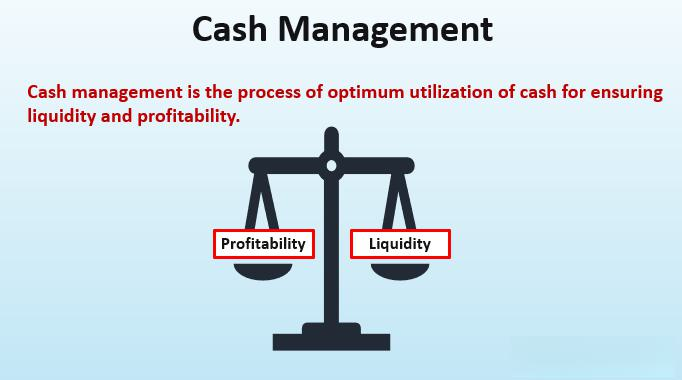

## Table of Contents

## What is a Cash Management Account (CMA)?

A Cash Management Account (CMA) is a type of account offered by financial institutions that combines the features of a checking, savings, and investment account into one. It is designed to help people manage their money more easily by providing a single place to keep their cash and make transactions. With a CMA, you can write checks, use a debit card, and also invest your money in different ways, like in money market funds or other short-term investments.

CMAs are popular among people who want to simplify their finances and get a better return on their money than what traditional checking or savings accounts offer. They often come with benefits like higher interest rates, lower fees, and the ability to easily move money between different types of investments. However, it's important to understand the terms and conditions of a CMA, as they can vary between different financial institutions.

## How does a Cash Management Account differ from a traditional savings account?

A Cash Management Account (CMA) is different from a traditional savings account because it offers more features and flexibility. A CMA combines the benefits of a checking, savings, and investment account into one. This means you can use it to write checks, use a debit card, and also invest your money in things like money market funds. On the other hand, a traditional savings account is mainly for saving money and earning a small amount of interest. You can't use it to write checks or invest directly from the account.

Another key difference is the interest rates and fees. CMAs often offer higher interest rates than traditional savings accounts, which can help your money grow faster. They might also have lower fees, making them a more cost-effective option. However, traditional savings accounts are usually simpler and more straightforward, with fewer fees and less risk. They are good for people who want to keep their money safe and don't need the extra features that a CMA provides.

## What are the benefits of using a Cash Management Account?

Using a Cash Management Account can make managing your money easier. It combines the features of a checking, savings, and investment account all in one place. This means you can use it to write checks, use a debit card, and invest your money without needing separate accounts. It simplifies things by letting you keep all your money in one spot and move it around as you need to.

Another benefit is that CMAs often offer better interest rates than traditional savings accounts. This can help your money grow faster. They also usually have lower fees, which can save you money over time. Plus, CMAs can be a good choice if you want to invest some of your money in things like money market funds, which can give you a better return than just keeping it in a regular savings account.

## Who typically uses Cash Management Accounts?

People who want to keep their money in one place and have easy access to it often use Cash Management Accounts. These accounts are great for folks who want to write checks, use a debit card, and also invest their money without needing different accounts. It's like having a checking, savings, and investment account all rolled into one.

CMAs are popular with people who want to get a better return on their money than what regular savings accounts offer. They are good for people who want to keep their money safe but also want to earn more interest and maybe invest in things like money market funds. People who like to keep their finances simple and want to save on fees also find CMAs helpful.

## How do you open a Cash Management Account?

Opening a Cash Management Account is easy. First, you need to pick a bank or financial institution that offers CMAs. You can do this by looking online or asking friends for suggestions. Once you've chosen a place, you can usually start the process on their website or by going to a branch. You'll need to fill out an application form with your personal details like your name, address, and Social Security number.

After you submit your application, the bank will check your information. This might take a few days. If everything is okay, they will open your CMA. You might need to put some money into the account to start it. Once it's open, you can start using it to write checks, use a debit card, and even invest your money. It's a good idea to ask about any fees or rules so you know what to expect.

## What are the typical fees associated with Cash Management Accounts?

Cash Management Accounts can have different fees, depending on the bank or financial institution. Some common fees are monthly maintenance fees, which you might have to pay every month just to keep the account open. There can also be fees for using an ATM that isn't part of the bank's network, or for writing checks. It's good to check with the bank to see what fees they charge, because they can be different from one place to another.

Some CMAs might not have these fees if you keep a certain amount of money in the account or if you use the account in certain ways. For example, if you keep a minimum balance, you might not have to pay a monthly fee. It's a good idea to read the fine print and ask questions so you know exactly what fees you might have to pay. This way, you can choose a CMA that fits your needs and helps you save money.

## How is the interest calculated in a Cash Management Account?

Interest in a Cash Management Account is calculated based on the money you keep in the account. The bank looks at how much money you have and uses a rate, called the [interest rate](/wiki/interest-rate-trading-strategies), to figure out how much interest you earn. This rate can change, so it's good to check it now and then. The interest is usually added to your account every month, but some banks might do it differently.

The way interest is calculated can be a bit tricky. It's often based on the average daily balance in your account. This means the bank adds up the balance at the end of each day in the month and then divides it by the number of days in that month. The interest you earn is then based on this average. If you keep more money in your account, you can earn more interest. It's a good idea to ask your bank how they calculate interest so you understand it better.

## What are the investment options available within a Cash Management Account?

In a Cash Management Account, you can invest your money in different ways to make it grow. One common option is money market funds. These are like a pool of money from many people that is invested in safe, short-term things like government bonds or high-quality corporate debt. They aim to give you a better return than just keeping your money in a regular savings account, but they are still pretty safe.

Another option might be short-term bond funds. These invest in bonds that will pay back the money in a few years. They can give you a bit more interest than money market funds, but they might be a bit riskier. Some CMAs also let you invest in certificates of deposit (CDs), which are safe and give you a fixed interest rate for a set time. The exact investment options can be different depending on the bank, so it's good to ask them what they offer and how each one works.

## How can a Cash Management Account help with financial planning?

A Cash Management Account can help with financial planning by giving you a simple way to manage your money all in one place. It combines the features of a checking, savings, and investment account, so you can keep track of your money easily. You can use it to pay bills, save for the future, and even invest in things like money market funds. This makes it easier to see where your money is going and plan how to use it best.

Having a CMA can also help you earn more money over time. These accounts often offer better interest rates than regular savings accounts, which means your money can grow faster. Plus, you can move money between different parts of the account, like from savings to investments, without needing to open separate accounts. This flexibility can help you adjust your financial plans as your needs change, making it easier to reach your financial goals.

## What are the risks associated with Cash Management Accounts?

Cash Management Accounts can be a great way to manage your money, but they do come with some risks. One risk is that the interest rates on CMAs can change. If the rates go down, you might earn less money on your savings than you expected. Another risk is that the investments within a CMA, like money market funds, are not completely safe. Even though they are usually pretty secure, there is still a small chance you could lose some of your money if the investments don't do well.

Another thing to think about is the fees. Some CMAs might have fees for things like monthly maintenance, using certain ATMs, or writing checks. These fees can add up and eat into the money you're trying to save or invest. It's important to read the fine print and understand what fees you might have to pay. Also, while CMAs offer a lot of flexibility, they might not be the best choice for everyone. If you prefer simpler accounts with fewer features, a traditional savings account might be a better fit for your needs.

## How do Cash Management Accounts integrate with other financial services?

Cash Management Accounts can work well with other financial services to make managing your money easier. For example, you can link your CMA to your bank's online banking platform. This lets you see all your accounts in one place, move money between them, and pay bills without needing to switch between different websites or apps. Some banks even let you set up automatic transfers from your CMA to other accounts, like your checking account or a retirement account, so you can save or invest money without thinking about it.

CMAs can also connect with investment services. If your bank offers investment options, you can use your CMA to buy and sell investments like stocks or mutual funds. This means you can keep your money in one place but still have the chance to grow it through investing. Plus, if you use other financial tools like budgeting apps or financial advisors, you can often link your CMA to these services too. This helps you keep track of your spending, plan for the future, and get advice on how to use your money best, all while keeping things simple and in one place.

## What advanced features do some Cash Management Accounts offer to expert users?

Some Cash Management Accounts have special features for people who know a lot about money. These features can help them manage their money better. For example, some CMAs let you use something called sweep accounts. This means any extra money in your CMA can automatically move into investments like money market funds at the end of each day. This way, your money can work harder for you without you having to do anything. Another cool feature is the ability to set up different sub-accounts within your CMA. You can use these sub-accounts to keep your money organized for different goals, like saving for a vacation or paying taxes.

Also, some CMAs offer advanced tools for investing. You might be able to trade stocks, bonds, or other investments right from your account. This can be really helpful if you like to invest and want to do it all in one place. Some CMAs even give you access to financial advisors who can help you make smart choices with your money. These advisors can look at your whole financial picture and give you advice on how to reach your goals. So, if you're good with money and want to use all these tools, a CMA with these advanced features might be just what you need.

## What is Financial Management: A Broader Perspective?

Financial management is the strategic process of planning, directing, monitoring, organizing, and controlling an organization's financial resources. This discipline aims to maximize shareholder value and ensure long-term financial stability by efficiently managing the company's finances. It plays a critical role in determining the allocation of financial resources and managing investments to achieve desired business outcomes.

The primary objectives of financial management revolve around ensuring a firm’s profitability, [liquidity](/wiki/liquidity-risk-premium), and solvency. Profitability refers to the ability of a firm to generate earnings over a sustained period, whereas liquidity ensures that a firm can meet its short-term obligations. Solvency, on the other hand, guarantees that the firm can meet its long-term debts and commitments.

One of the fundamental components of financial management is budgeting. This process involves creating a financial plan that outlines expected revenues and expenditures over a specific period. Through effective budgeting, organizations can ensure that financial resources are allocated appropriately to various departments and projects, thereby supporting strategic goals. Financial forecasting complements budgeting by predicting future financial conditions and performance based on historical data and market trends.

Analyzing financial performance against benchmarks is essential in financial management. This analysis helps in assessing how well the organization is performing compared to industry standards or internal targets. Key financial ratios, such as the current ratio, return on equity, and debt-to-equity ratio, are commonly used metrics to evaluate financial health and operational efficiency.

To maximize shareholder value, financial managers must have a comprehensive understanding of market conditions and investment strategies. They need to assess various financial tools and instruments to determine the best mix of debt and equity financing, often referred to as the firm’s capital structure. A well-optimized capital structure minimizes the cost of capital and enhances the firm’s value.

Investment decisions, another vital aspect of financial management, involve selecting projects with the highest potential returns relative to their risk. Techniques such as Net Present Value (NPV), Internal Rate of Return (IRR), and payback period are utilized to evaluate these investment opportunities. For instance, NPV is calculated using the formula:

$$
NPV = \sum_{t=1}^{n} \frac{CF_t}{(1 + r)^t} - C_0
$$

where $CF_t$ represents the cash flow in period $t$, $r$ is the discount rate, and $C_0$ is the initial investment. A positive NPV indicates that the projected earnings, discounted for present value, exceed the initial investment cost, making the project financially viable.

Achieving sound financial management is integral to making informed business decisions and achieving corporate goals. It requires financial managers to be vigilant and adaptable to changes in the economic environment. Staying ahead of regulatory changes, market trends, and technological advancements ensures that organizations maintain their competitive edge and continue to prosper in an ever-evolving financial landscape.

## References & Further Reading

[1]: Bergstra, J., Bardenet, R., Bengio, Y., & Kégl, B. (2011). ["Algorithms for Hyper-Parameter Optimization."](https://papers.nips.cc/paper/4443-algorithms-for-hyper-parameter-optimization) Advances in Neural Information Processing Systems 24.

[2]: ["Advances in Financial Machine Learning"](https://www.amazon.com/Advances-Financial-Machine-Learning-Marcos/dp/1119482089) by Marcos Lopez de Prado

[3]: ["Evidence-Based Technical Analysis: Applying the Scientific Method and Statistical Inference to Trading Signals"](https://www.amazon.com/Evidence-Based-Technical-Analysis-Scientific-Statistical/dp/0470008741) by David Aronson

[4]: ["Machine Learning for Algorithmic Trading"](https://github.com/PacktPublishing/Machine-Learning-for-Algorithmic-Trading-Second-Edition) by Stefan Jansen

[5]: ["Quantitative Trading: How to Build Your Own Algorithmic Trading Business"](https://www.amazon.com/Quantitative-Trading-Build-Algorithmic-Business/dp/1119800064) by Ernest P. Chan