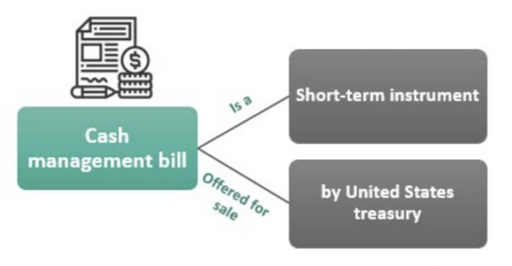

## Table of Contents

## What are Cash Management Bills (CMBs)?

Cash Management Bills (CMBs) are short-term securities issued by the U.S. Treasury to manage its cash flow. They are similar to Treasury bills but are used specifically to help the government meet its short-term cash needs. CMBs have maturities that can range from a few days to a few months, making them very flexible for the Treasury's cash management.

These bills are auctioned off to investors, who can buy them at a discount and then receive the full face value when the bill matures. This difference between the purchase price and the face value is the interest earned by the investor. CMBs are considered very safe investments because they are backed by the full faith and credit of the U.S. government.

## How do Cash Management Bills differ from Treasury Bills?

Cash Management Bills (CMBs) and Treasury Bills (T-Bills) are both short-term securities issued by the U.S. Treasury, but they have different purposes. CMBs are used specifically to help the government manage its cash flow. This means they are issued when the government needs extra money for a short time, usually because of timing differences in its income and expenses. On the other hand, T-Bills are issued as part of the regular borrowing program of the government to finance its operations and pay off debts.

The main difference in how they are used leads to differences in their terms. CMBs can have very short maturities, sometimes just a few days, while T-Bills usually have maturities of 4, 8, 13, 26, or 52 weeks. Because CMBs are more flexible in their timing and duration, they help the Treasury manage its cash more precisely. Both types of bills are sold at a discount and redeemed at face value, but the shorter and more variable nature of CMBs makes them a unique tool in the Treasury's financial toolkit.

## Who issues Cash Management Bills?

Cash Management Bills, or CMBs, are issued by the U.S. Treasury. The Treasury uses these bills to manage its short-term cash needs. This means they help the government when it needs a bit more money for a short time, like when there's a delay between when the government spends money and when it gets money back.

CMBs are different from regular Treasury Bills because they can be issued at any time and have very short maturities. They might last just a few days or a few months. The Treasury decides when to issue them based on how much money it needs and for how long. This makes CMBs a flexible tool for the government to keep its cash flow smooth.

## What is the purpose of Cash Management Bills?

Cash Management Bills, or CMBs, are used by the U.S. Treasury to help manage its money. The main purpose is to make sure the government has enough cash to pay its bills even if there's a delay between when it spends money and when it gets money back. For example, if the government needs to pay for something before it collects taxes, it can use CMBs to get the extra cash it needs for a short time.

CMBs are different from regular Treasury Bills because they can be issued at any time and can last from just a few days to a few months. This flexibility helps the Treasury keep its cash flow smooth. By using CMBs, the government can make sure it always has enough money to cover its short-term needs without having to borrow more than necessary.

## How are Cash Management Bills auctioned?

Cash Management Bills are auctioned by the U.S. Treasury to help manage its money. When the Treasury needs extra cash for a short time, it decides to issue these bills. The auction happens online, and anyone can buy them, like banks or investors. The Treasury announces when the auction will happen and how much money it wants to raise.

At the auction, people bid on how much they are willing to pay for the bills. The Treasury might use a single-price auction, where everyone pays the same price, or a multiple-price auction, where people pay what they bid. After the auction, the winners get the bills and pay for them. When the bills mature, the Treasury pays back the full amount, and the difference between what was paid and what is received is the interest earned by the buyer.

## What are the typical maturities of Cash Management Bills?

Cash Management Bills, or CMBs, have maturities that can be very short. They might last from just a few days up to a few months. The Treasury decides how long each CMB will last based on how much money it needs and for how long.

The short and flexible nature of CMBs helps the Treasury manage its money better. If the government needs extra cash for a short time, like before tax money comes in, it can issue CMBs that last just long enough to cover that gap. This way, the government can keep its cash flow smooth without borrowing more than it needs.

## What are the risks associated with investing in Cash Management Bills?

Investing in Cash Management Bills, or CMBs, is pretty safe because they are backed by the U.S. government. This means the chances of the government not paying you back are very low. But, there are still some risks to think about. One risk is [interest rate](/wiki/interest-rate-trading-strategies) risk. If interest rates go up after you buy a CMB, you might miss out on better deals. You'll still get your money back, but it might not be as good as what you could have earned if you waited.

Another risk is [liquidity](/wiki/liquidity-risk-premium) risk. Sometimes, it can be hard to sell your CMB before it matures. If you need your money back quickly and can't find a buyer, you might be stuck waiting until the bill matures. This isn't a big problem for most people, but it's something to keep in mind if you need your money to be flexible. Overall, CMBs are a safe choice, but understanding these risks can help you make a better decision about whether they're right for you.

## How do Cash Management Bills impact the money market?

Cash Management Bills, or CMBs, can affect the money market by changing how much money is available for banks and investors to use. When the U.S. Treasury issues CMBs, it takes money out of the market because people and banks use their cash to buy these bills. This can make the money market tighter, meaning there's less cash floating around for other investments or loans. On the other hand, when CMBs mature and the Treasury pays back the money, it puts cash back into the market, which can make it easier for banks and investors to lend and borrow.

The impact of CMBs on the money market also depends on how much is issued and for how long. If the Treasury issues a lot of CMBs that last for a short time, it might not have a big effect on the market. But if they issue a lot that last for a longer time, it could have a bigger impact. Investors and banks watch these changes closely because they can affect interest rates and how much they can earn from other investments in the money market.

## What role do Cash Management Bills play in government cash management?

Cash Management Bills, or CMBs, help the U.S. government keep its money in order. The government sometimes needs more cash quickly, like when it has to pay bills before it gets tax money. CMBs let the government borrow this extra money for a short time, just until it gets more cash. This way, the government can make sure it always has enough money to pay for what it needs, without having to borrow more than necessary.

The flexibility of CMBs is really helpful. They can last from just a few days to a few months, so the government can use them to match its short-term cash needs perfectly. By using CMBs, the government can keep its cash flow smooth and avoid any problems that might come from not having enough money at the right time.

## How can investors purchase Cash Management Bills?

Investors can buy Cash Management Bills, or CMBs, through the U.S. Treasury's online auction system. The Treasury announces when the auction will happen and how much money it wants to raise. Anyone can participate in the auction, including banks and individual investors. To buy CMBs, investors need to have an account with the TreasuryDirect website or go through a bank or broker that handles these auctions.

At the auction, investors bid on how much they are willing to pay for the CMBs. The Treasury might use a single-price auction, where everyone pays the same price, or a multiple-price auction, where people pay what they bid. After the auction, the winners get the CMBs and pay for them. When the CMBs mature, the Treasury pays back the full amount, and the difference between what was paid and what is received is the interest earned by the investor.

## What are the tax implications of investing in Cash Management Bills?

When you invest in Cash Management Bills, or CMBs, you need to think about taxes. The interest you earn from CMBs is usually taxed as regular income by the federal government. This means you'll pay taxes on the difference between what you paid for the bill and what you get back when it matures. You'll need to report this interest on your tax return and pay the tax based on your income tax rate.

There's also another thing to keep in mind: state and local taxes. The good news is that the interest from CMBs is usually not taxed by states or local governments. So, you only have to worry about federal taxes on the interest you earn. It's always a good idea to talk to a tax professional to make sure you understand all the tax rules and how they apply to your situation.

## How do Cash Management Bills fit into a diversified investment portfolio?

Cash Management Bills, or CMBs, can be a good choice for a diversified investment portfolio because they are very safe. They are backed by the U.S. government, so the chance of not getting your money back is very low. This makes them a good option if you want to keep some of your money in a secure place. Also, CMBs can be a good way to keep some cash ready for short-term needs or to balance out riskier investments like stocks or real estate.

Adding CMBs to your portfolio can help you manage your money better. Since they have short maturities, you can use them to match your short-term financial goals. For example, if you know you'll need money in a few months, you can buy a CMB that matures around that time. This way, you can keep your money safe and earn a little interest while waiting for the right time to use it. Overall, CMBs can help you keep your investments balanced and ready for whatever comes next.

## References & Further Reading

[1]: ["Cash Management Bills: A Flexible Borrowing Tool for the Treasury"](https://www.treasurydirect.gov/marketable-securities/cash-management-bills/) by the U.S. Department of the Treasury

[2]: ["Understanding Treasury Securities"](https://www.investopedia.com/articles/investing/073113/introduction-treasury-securities.asp) - U.S. Treasury

[3]: Holzmann, R., & Koettl, J. (2014). [“Portability of Pension, Health, and Other Social Benefits: Facts, Concepts, and Issues.”](https://www.researchgate.net/profile/Robert-Holzmann-2/publication/228319920_Portability_of_Pension_Health_and_Other_Social_Benefits_Facts_Concepts_Issues/links/5d27941892851cf4407a75e4/Portability-of-Pension-Health-and-Other-Social-Benefits-Facts-Concepts-Issues.pdf) Social Protection and Labor Discussion Paper.

[4]: ["Algorithmic Trading and DMA: An Introduction to Direct Access Trading Strategies"](https://archive.org/details/algorithmictradi0000john) by Barry Johnson

[5]: ["Inside the U.S. Treasury Market"](https://www.amazon.com/Inside-Treasury-Market-Peter-Wann/dp/0899304923) by Gagnon, J.E. (Brookings Institution)