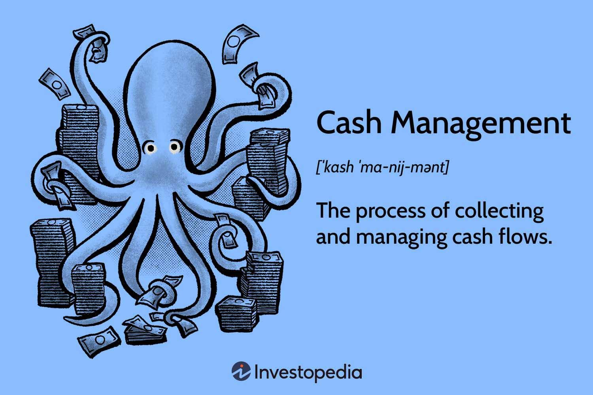

The dynamic field of finance is characterized by constant evolution, driven by advancements in technology, regulatory changes, and market dynamics. Among the core areas of focus are cash management, financial management, liquidity control, and algorithmic trading. These components collectively shape modern trading and financial operations, influencing how businesses and individuals manage their finances. 

Cash management is the art of ensuring that an organization or individual maintains optimal cash flow levels. This involves tracking income and expenditures, managing accounts receivable and payable, and strategically optimizing cash reserves to maintain liquidity. Effective cash management enables entities to meet their operational and investment obligations adeptly.



Financial management is a broader discipline encompassing the planning, organizing, directing, and controlling of financial resources. It involves critical strategies such as investment analysis, risk management, and budgeting, all of which are essential for wealth enhancement and resource efficiency. A solid grasp of financial statements and forecasting is indispensable in this domain.

Liquidity control is vital for ensuring an organization can meet its short-term liabilities as they fall due. It involves balancing current assets against liabilities and using solvency ratios to gauge financial health. Effective liquidity management is critical in steering clear of potential pitfalls associated with cash shortages.

Algorithmic trading represents a technological leap in trading strategies. By employing computer programs and mathematical models, this approach optimizes trade execution, minimizes the influence of human emotions, and enhances speed and accuracy. Algorithmic trading is widely employed by large institutional investors seeking efficiency and competitiveness in the markets.

This article explores how these elements intertwine and impact financial operations, offering insights into leveraging these tools for enhanced stability and optimization. As the financial landscape continues to evolve, understanding these components is crucial for businesses and individuals aspiring to maintain a competitive edge.

## Table of Contents

## Cash Management: Foundation of Financial Stability

Cash management is the structured approach to handling the cash inflows and outflows within an organization or for an individual. It plays a pivotal role in ensuring that there is sufficient [liquidity](/wiki/liquidity-risk-premium) to meet both short-term and long-term financial commitments while optimizing available resources for growth and investment opportunities. Effective cash management involves several key techniques and strategies, each aimed at maintaining or improving financial stability.

One fundamental aspect of cash management is the meticulous monitoring of accounts receivable. This process involves tracking the money owed to a company by its customers for goods or services delivered. By efficiently managing accounts receivable, businesses can ensure timely collection of funds, reducing the days sales outstanding (DSO) and improving cash flow. Employing credit policies, setting payment terms, and conducting regular reviews of outstanding accounts are essential practices in this area.

In addition, managing expenses is another critical component. This involves the strategic planning and controlling of expenditures to ensure a healthy balance between costs and revenues. Budgeting tools and expense tracking systems can help organizations monitor spending patterns, identify cost-saving opportunities, and adjust operations as needed to maintain financial health.

Optimizing cash reserves is also vital to ensure liquidity and leveraging investment opportunities. One approach is to maintain a certain level of cash reserves that can cover unexpected expenses or take advantage of business opportunities without the need for expensive short-term borrowing. Calculating the optimal level of cash reserves involves evaluating the trade-off between holding cash (which may have an opportunity cost) and investing it in ventures with potential returns. The formula for determining the cash conversion cycle (CCC), which measures how long a company takes to convert its investments in inventory and other resources into cash flows from sales, can be used to improve reserve management:
$$
\text{CCC} = \text{Days Inventory Outstanding (DIO)} + \text{Days Sales Outstanding (DSO)} - \text{Days Payable Outstanding (DPO)}
$$
where:
- DIO is the average number of days inventory is held before it is sold.
- DSO is the average number of days needed to collect payment after a sale.
- DPO is the average number of days a company takes to pay its bills.

Advanced tools and automated systems aid in the process of cash flow forecasting, providing real-time data and predictive insights. By utilizing these technologies, entities can make informed decisions that align operational intent with financial objectives, ensuring sufficient liquidity is maintained to support ongoing activities and future expansion plans.

Overall, efficient cash management not only facilitates the meeting of operational obligations but also maximizes potential investment opportunities, contributing to long-term financial prosperity and stability for both corporations and individuals.

## Financial Management: Core Principles and Strategies

Financial management represents a critical facet of organizational success, encompassing several activities aimed at overseeing, directing, and controlling financial resources effectively. This strategic discipline involves the scientific analysis of investments, prudent risk management, and the development of methods to enhance wealth, all while judiciously utilizing resources. 

A fundamental aspect of financial management is investment analysis. This process evaluates potential investments to ensure they align with organizational goals and deliver appropriate returns. Techniques such as Net Present Value (NPV) and Internal Rate of Return (IRR) are commonly employed to assess the profitability and feasibility of projects. For instance, NPV can be calculated using the formula:

$$

\text{NPV} = \sum \left( \frac{R_t}{(1 + i)^t} \right) - C_0 
$$

where $R_t$ is the net cash inflow during the period $t$, $i$ is the discount rate, and $C_0$ is the initial investment cost.

Risk management is another pivotal component, ensuring that organizations can identify, assess, and mitigate financial risks. This involves the use of various tools, such as Value at Risk (VaR) and stress testing, to forecast potential losses and implement safeguards.

Financial management necessitates a deep understanding of financial statements, which are essential for analyzing an organization's financial health. Proficiency in interpreting balance sheets, income statements, and cash flow statements allows managers to make informed decisions and craft effective strategies.

Budgeting and forecasting are also integral to financial management. These processes involve projecting future income, expenses, and profits to guide strategic planning and resource allocation. By employing accurate budgeting techniques, organizations can anticipate future financial needs and adjust operations accordingly.

Overall, effective financial management equips organizations with the necessary tools to optimize performance, increase profitability, and achieve long-term sustainability. Proficiency in these areas ensures that businesses can navigate the complexities of financial operations and adapt to the ever-evolving economic landscape.

## Liquidity Control: Ensuring Smooth Operations

Liquidity control involves managing a company's assets and liabilities to ensure sufficient liquid assets are available to cover short-term obligations. This is essential for maintaining operational continuity and financial stability. Effective liquidity management not only prevents potential cash shortages but also allows businesses to meet their financial commitments in a timely manner.

One fundamental technique in liquidity control is analyzing solvency ratios. These ratios measure a company's ability to meet its long-term obligations and are crucial indicators of financial health. Key solvency ratios include the current ratio and quick ratio. The current ratio is calculated by dividing current assets by current liabilities:

$$
\text{Current Ratio} = \frac{\text{Current Assets}}{\text{Current Liabilities}}
$$

A current ratio of 1 or above suggests that the firm has enough assets to cover its liabilities, indicating sound liquidity management. The quick ratio, also known as the acid-test ratio, provides a more stringent assessment by excluding inventory from current assets:

$$
\text{Quick Ratio} = \frac{\text{Current Assets} - \text{Inventory}}{\text{Current Liabilities}}
$$

Maintaining a balance between current assets and liabilities is critical for liquidity control. Companies often employ cash flow forecasting to anticipate future cash requirements and plan accordingly. This involves estimating incoming and outgoing cash flows over various periods to ensure that sufficient cash reserves are available to manage fluctuations in cash needs.

Efficient liquidity management is vital to avoid the financial pitfalls associated with cash shortages. Companies facing liquidity issues may struggle to pay suppliers, meet payroll, or cover other operational costs, potentially leading to business disruptions or insolvency. Conversely, maintaining excessive liquidity can result in lower investment returns, as surplus cash is not being utilized effectively for growth or profit maximization.

Incorporating technology and advanced financial analysis tools can greatly enhance liquidity control efforts. Such tools provide real-time insights into cash flow positions and enable more accurate forecasting, allowing businesses to optimize liquidity management processes and make informed financial decisions.

In summary, liquidity control is indispensable for ensuring smooth business operations. By analyzing solvency ratios and maintaining an optimal balance between current assets and liabilities, companies can safeguard against financial difficulties and support sustainable growth.

## Algorithmic Trading: Leveraging Technology

Algorithmic trading utilizes advanced computer algorithms to automate the process of executing trades on financial markets. This approach leverages mathematical models and formulas to determine the optimal timing and pricing of trades, significantly reducing the influence of human emotions and biases on trading decisions. By executing trades with precision and speed that surpass human capabilities, [algorithmic trading](/wiki/algorithmic-trading) has become an indispensable tool for large institutional investors and traders.

The primary advantage of algorithmic trading lies in its ability to rapidly analyze vast amounts of market data and identify trading opportunities based on pre-defined criteria. This capability enables traders to take advantage of small price discrepancies and market inefficiencies that may arise over brief periods. The utilization of algorithms for trading can lead to improved execution quality by minimizing market impact and reducing the cost of transactions.

Strategies employed in algorithmic trading are diverse and can be tailored to accommodate various market conditions. Common strategies include:

1. **Trend Following**: This strategy involves identifying and capitalizing on long-term trends in market prices. Trend-following algorithms often use technical indicators such as moving averages to detect and exploit these trends.

2. **Arbitrage**: Arbitrage strategies seek to profit from price discrepancies between related financial instruments in different markets. For instance, when a stock is listed on two different exchanges, an algorithm can facilitate buying on the cheaper exchange and selling on the more expensive one, thus capturing the price difference.

3. **Mean Reversion**: Algorithms based on mean reversion are predicated on the idea that asset prices will eventually revert to their historical averages. These strategies involve buying assets that are undervalued and selling those that are overvalued relative to their mean.

4. **Market Making**: This strategy involves providing liquidity to markets by simultaneously placing buy and sell orders for a particular asset. Algorithms optimize the bid-ask spread to earn a profit while ensuring sufficient liquidity for other traders.

The customization of algorithmic trading strategies allows traders to adapt to different market conditions. For instance, during periods of high [volatility](/wiki/volatility-trading-strategies), an algorithm might prioritize risk management and swift execution of trades to mitigate potential losses. Conversely, in stable market conditions, the focus might shift to capturing small price movements over numerous trades to generate consistent returns.

To illustrate a simple algorithmic trading model, consider the moving average crossover strategy using Python:

```python
import pandas as pd
import numpy as np

# Load historical market data
data = pd.read_csv('market_data.csv')

# Calculate moving averages
short_window = 40
long_window = 100
data['short_mavg'] = data['Close'].rolling(window=short_window, min_periods=1).mean()
data['long_mavg'] = data['Close'].rolling(window=long_window, min_periods=1).mean()

# Generate trading signals
data['signal'] = 0
data['signal'][short_window:] = np.where(data['short_mavg'][short_window:] > data['long_mavg'][short_window:], 1, 0)
data['positions'] = data['signal'].diff()

# Print the trading signals
print(data[['Date', 'Close', 'short_mavg', 'long_mavg', 'signal', 'positions']].tail())
```

This script demonstrates a basic algorithmic trading strategy where buy and sell signals are generated based on the crossover of short-term and long-term moving averages. When the short-term moving average crosses above the long-term average, a buy signal is generated, and when it crosses below, a sell signal is triggered. Such strategies form the foundation of more complex algorithmic trading models used by professionals.

In conclusion, algorithmic trading is a powerful technology-driven approach that enhances trading efficiency and execution quality. It empowers traders with the ability to systematically exploit market opportunities and adapt their strategies to changing market dynamics, thereby optimizing their investment outcomes.

## Integrating Cash and Financial Management with Technology

The integration of technology into cash and financial management enhances both accuracy and efficiency by automating and streamlining numerous processes. Automated solutions enable real-time insights, facilitating faster decision-making and optimizing liquidity alongside operational processes. By utilizing advanced software tools, businesses can effectively align their cash and financial management practices with sophisticated algorithmic trading strategies.

Automated financial systems streamline transactional processes, reduce manual errors, and provide immediate access to financial data. For instance, Enterprise Resource Planning (ERP) systems amalgamate various financial operations, offering a unified platform for managing receivables, payables, and treasury functions. This integration supports real-time cash flow monitoring, allowing businesses to maintain optimal liquidity.

Moreover, cloud-based accounting software offers scalability and accessibility, enabling businesses of all sizes to manage financial transactions comprehensively. Features such as automated reconciliation, budget tracking, and financial reporting are instrumental in maintaining financial accuracy and compliance.

Algorithmic trading systems leverage technology by employing statistical and mathematical models to identify and execute optimal trades. These systems utilize vast datasets, identifying patterns and trends that can inform investment strategies. For example, statistical [arbitrage](/wiki/arbitrage) models assess price deviations of related assets to execute high-frequency trades. Python libraries such as Pandas and NumPy can be employed to analyze time-series data for developing statistical models.

Here is a basic Python code snippet that illustrates how to use Pandas to calculate moving averages, a common strategy in algorithmic trading:

```python
import pandas as pd

# Sample data representing stock prices
data = {'Date': ['2023-01-01', '2023-01-02', '2023-01-03', '2023-01-04'],
        'Price': [100, 102, 101, 103]}
df = pd.DataFrame(data)
df['Date'] = pd.to_datetime(df['Date'])

# Calculate the 2-day moving average
df['2_day_MA'] = df['Price'].rolling(window=2).mean()

print(df)
```

By integrating technological solutions, organizations can automate diverse financial tasks, enabling the redirection of resources towards strategic initiatives. Automation facilitates the synchronizing of cash positions with market conditions, ensuring rapid responses to liquidity demands.

Furthermore, technology-driven forecasting tools employ [artificial intelligence](/wiki/ai-artificial-intelligence) and [machine learning](/wiki/machine-learning) algorithms to predict future market conditions. This predictive capability aids in making informed decisions regarding asset allocation and risk management. Businesses adopting these technologies are better positioned to respond proactively to changing economic landscapes, securing a competitive edge in financial management and trading. 

The convergence of cash and financial management with technology not only elevates operational efficiency but also fortifies financial stability, offering businesses a substantial advantage in the dynamic financial environment.

## The Future of Financial Management and Trading

As financial markets continue to grow and adapt, the roles of cash management, liquidity control, and algorithmic trading are increasingly crucial for maintaining robust and competitive financial operations. Emerging trends indicate a significant shift toward the integration of artificial intelligence (AI) and machine learning (ML) technologies within these domains, promising to redefine the landscape of financial management and trading.

AI and ML offer powerful tools for analyzing vast datasets, identifying patterns, and making predictions with unprecedented accuracy and speed. These capabilities are particularly valuable in financial markets, where vast amounts of data are generated every second. For example, AI algorithms can analyze transaction histories and market movements to optimize cash management strategies, ensuring that liquid assets are strategically allocated to meet immediate demands and maximize investment opportunities.

In terms of liquidity control, AI systems are adept at monitoring real-time changes in market conditions and adjusting asset allocations accordingly. Machine learning models can be employed to predict cash flow patterns and forecast potential liquidity shortages, allowing for proactive measures to enhance financial stability. The ability to accurately predict and respond to these dynamics is especially beneficial in volatile market environments, helping organizations maintain a balance between assets and liabilities.

Algorithmic trading, already heavily reliant on technology, stands to gain further precision and adaptability with the incorporation of AI. Advanced algorithms can be designed to process information faster than human traders, executing trades based on complex strategies that [factor](/wiki/factor-investing) in a multitude of variables. Python, a widely-used programming language in trading, can be employed to develop machine learning models designed for specific trading strategies:

```python
import numpy as np
from sklearn.linear_model import LinearRegression

# Sample data for market trends
X = np.array([[1, 2], [2, 3], [3, 5], [4, 6], [5, 7]])
y = np.array([1, 2, 3, 3.5, 4.5])

# Create and train the model
model = LinearRegression()
model.fit(X, y)

# Predict future market trends
future_trends = np.array([[6, 8]])
predictions = model.predict(future_trends)

print("Predicted market trend:", predictions)
```

Organizations that successfully integrate these advanced strategies and technologies are likely to achieve significant competitive advantages. The operational insights provided by AI and ML can lead to more informed decision-making, reducing risk and enhancing overall financial health. Furthermore, the automation of complex processes enables firms to allocate resources more efficiently, focusing on strategic growth initiatives rather than routine operational tasks.

As AI and machine learning become further entrenched in financial operations, businesses must remain vigilant about technological advancements and emerging best practices. The ability to adapt to new tools and methodologies will be key to thriving in a rapidly changing financial environment. Embracing these technologies not only facilitates improved performance and agility but also positions organizations to capitalize on new opportunities as they arise.

## Conclusion

Concluding the discourse on cash management, financial management, liquidity control, and algorithmic trading, it is evident that proficient use of these strategies is imperative for achieving financial success today. By integrating these disciplines, organizations and individuals can significantly enhance operational efficiency and financial stability. Effective cash management ensures adequate liquidity for meeting immediate obligations, while financial management principles guide the strategic allocation of resources and risk mitigation. 

Liquidity control is essential for maintaining smooth operations by balancing assets to meet short-term liabilities, preventing potential financial constraints. Meanwhile, algorithmic trading represents the pinnacle of modern trading techniques, utilizing technology for swift and precise execution, minimizing the impact of human emotion on financial decisions. 

Incorporating emerging technologies such as artificial intelligence, machine learning, and automated systems further refines these processes. Technological integration not only offers real-time insights and automation but also aligns cash and financial management with advanced trading strategies, providing a substantial competitive edge.

Remaining informed about the latest developments and best practices in these areas enhances the ability to adapt and thrive in today's fast-paced financial environment. This vigilance supports proactive decision-making and positions businesses and individuals to capitalize on new opportunities, securing their financial robustness and competitive advantage.

## References & Further Reading

[1]: Bergstra, J., Bardenet, R., Bengio, Y., & Kégl, B. (2011). ["Algorithms for Hyper-Parameter Optimization."](https://proceedings.neurips.cc/paper/2011/file/86e8f7ab32cfd12577bc2619bc635690-Paper.pdf) Advances in Neural Information Processing Systems 24.

[2]: ["Advances in Financial Machine Learning"](https://www.amazon.com/Advances-Financial-Machine-Learning-Marcos/dp/1119482089) by Marcos Lopez de Prado

[3]: ["Evidence-Based Technical Analysis: Applying the Scientific Method and Statistical Inference to Trading Signals"](https://www.amazon.com/Evidence-Based-Technical-Analysis-Scientific-Statistical/dp/0470008741) by David Aronson

[4]: ["Machine Learning for Algorithmic Trading"](https://github.com/PacktPublishing/Machine-Learning-for-Algorithmic-Trading-Second-Edition) by Stefan Jansen

[5]: ["Quantitative Trading: How to Build Your Own Algorithmic Trading Business"](https://books.google.com/books/about/Quantitative_Trading.html?id=j70yEAAAQBAJ) by Ernest P. Chan