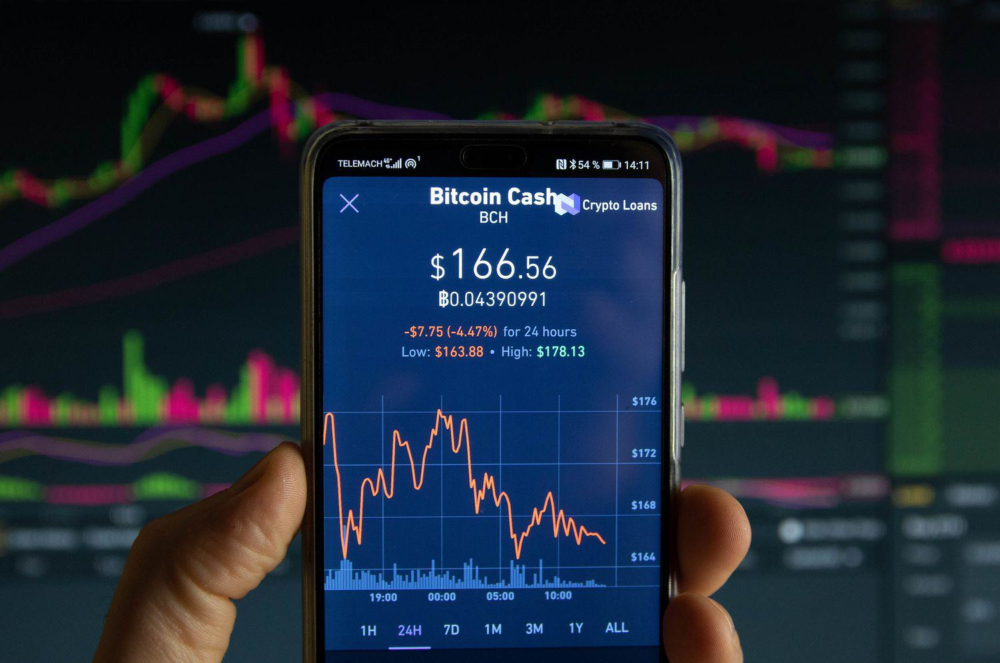

## Table of Contents

## What is a cash market?

A cash market is a place where people buy and sell things right away for cash. It's also called a spot market. In a cash market, when you buy something, you get it immediately, and you pay for it right then too. For example, if you go to a grocery store and buy apples, you take the apples home and pay for them at the checkout. That's a cash market transaction.

Cash markets are different from other markets where you might agree to buy something now but pay for it or get it later. In a cash market, everything happens quickly. This makes it good for people who need things right away or want to sell things they have right now. It's used for many things like food, stocks, and commodities like oil or gold.

## What is a futures market?

A futures market is a place where people agree to buy or sell something at a future date for a price they decide on now. It's different from a cash market because you don't get the thing right away. Instead, you make a deal today, but the actual buying and selling happens later. For example, a farmer might agree to sell their wheat in six months at a price they set today, even though they won't have the wheat ready until then.

Futures markets are useful because they help people plan and manage risk. If you're a farmer, you can use the futures market to lock in a price for your crops, so you know how much money you'll get even if prices change later. If you're a business that needs to buy things in the future, like an airline needing jet fuel, you can use the futures market to know how much you'll have to pay, helping you budget better. This way, both buyers and sellers can feel more secure about the future.

## How do cash markets function?

In a cash market, people buy and sell things right away for cash. It's like going to a store and buying something you need today. You pick out what you want, pay for it at the counter, and take it home with you. This is called a spot transaction because it happens on the spot. Cash markets are used for all sorts of things, like food, stocks, and even gold or oil. When you buy or sell in a cash market, the price is what it is at that moment, and you complete the deal right then.

Cash markets are important because they let people get what they need quickly. If you're hungry, you can go to the grocery store and buy food to eat right away. If you want to sell something you have, like a stock, you can do it in the cash market and get your money right away. This makes cash markets very useful for everyday needs. They help keep the economy moving because people can buy and sell things easily and quickly.

## How do futures markets function?

In a futures market, people make deals to buy or sell things at a future date for a price they agree on now. It's different from a cash market where you get things right away. In a futures market, you might agree to buy wheat in six months, even though you won't get it until then. This is useful for people who need to plan ahead. For example, a farmer can agree to sell their wheat at a set price, so they know how much money they will get, even if wheat prices change later. This helps the farmer feel more secure.

Businesses also use futures markets to manage risk. If an airline needs jet fuel in the future, they can agree to buy it at a set price now. This helps the airline know how much they will have to pay, making it easier to plan their budget. Futures markets are important because they help both buyers and sellers plan for the future. They make it easier for people to manage their money and resources, even when prices might go up or down.

## What are the key differences between cash and futures markets?

The main difference between cash and futures markets is when you get what you buy and when you pay for it. In a cash market, you buy something and get it right away. You also pay for it right then. It's like going to the store and buying food to eat that day. In a futures market, you agree to buy something now, but you don't get it until later. You also don't pay for it until that future date. It's like agreeing to buy wheat in six months, even though you won't have it until then.

Another big difference is how they help people plan. Cash markets are good for things you need right away. If you're hungry, you can go to the store and buy food to eat now. But futures markets are good for planning ahead. A farmer can use a futures market to know how much money they will get for their wheat, even if prices change later. This helps them feel more secure. Businesses can also use futures markets to plan their budgets better, knowing how much they will have to pay for things they need in the future.

## What types of assets are typically traded in cash markets?

In cash markets, you can find all sorts of things being bought and sold right away. Common things include everyday items like food and clothes. If you go to a grocery store or a mall, you're using a cash market. You pick out what you want, pay for it, and take it home with you. It's quick and easy. Besides these, cash markets also trade financial things like stocks and bonds. If you buy a stock, you get it right away and can sell it whenever you want.

Another type of asset you can find in cash markets is commodities. These are things like oil, gold, and agricultural products like wheat or corn. People who need these things right away, like factories or food companies, use cash markets to buy them. The price you pay is what it is at that moment, and you get the commodity right after you pay. This makes cash markets very useful for getting things quickly and easily.

## What types of assets are typically traded in futures markets?

In futures markets, people trade things they will buy or sell later. Common things are commodities like wheat, corn, oil, and gold. Farmers might use futures markets to set a price for their crops before they even grow them. Companies that need these things, like food companies or airlines, can also use futures markets to know how much they will pay for them in the future. This helps everyone plan better and feel more secure about what they will get or pay.

Financial things like stocks and bonds are also traded in futures markets. People can agree to buy or sell stocks at a future date for a price they decide on now. This can help investors manage risk if they think stock prices might change. Besides these, there are futures for currencies too. Businesses that work in different countries can use currency futures to know how much money they will get or pay in the future, even if exchange rates change.

## How does trading in cash markets affect the economy?

Trading in cash markets helps the economy by letting people buy and sell things they need right away. When you go to the store and buy food, you're using a cash market. This helps keep money moving around. If people can buy what they need easily, they feel more secure and are more likely to spend money. This spending helps businesses grow and creates jobs. When businesses do well, they can pay their workers more, and those workers can then spend more money in the cash market. It's like a big circle that keeps the economy going.

Cash markets also help set prices for things. When lots of people want to buy something, the price goes up. If not many people want it, the price goes down. This helps everyone know how much things are worth. For example, if the price of apples goes up, farmers might grow more apples to make more money. This can help make sure there are enough apples for everyone. By setting prices, cash markets help keep the economy balanced and make sure resources are used in the best way.

## How does trading in futures markets affect the economy?

Trading in futures markets helps the economy by letting people plan ahead and manage risk. Farmers can use futures markets to set a price for their crops before they even grow them. This way, they know how much money they will get, even if prices change later. This makes them feel more secure and helps them plan their farming better. Businesses that need things like oil or wheat can also use futures markets to know how much they will have to pay in the future. This helps them budget better and plan their business more carefully.

Futures markets also help keep the economy stable. When people can agree on prices for the future, it makes the economy less risky. If everyone knows what prices will be, they can make better plans and feel more confident about the future. This can help prevent big price swings that can hurt the economy. For example, if oil prices suddenly go up a lot, it can make everything more expensive and slow down the economy. But if businesses use futures markets to lock in prices, they can keep things more stable. This helps the whole economy run smoother and grow in a more predictable way.

## What are the risks associated with trading in cash markets?

Trading in cash markets can be risky because prices can change quickly. If you buy something and the price goes down right after, you might lose money if you need to sell it. For example, if you buy a stock and the price drops, you'll get less money than you paid for it. This can happen with anything you buy in a cash market, like food or gold. You have to be ready for prices to move up or down, and that can be hard to predict.

Another risk is that you might not be able to sell something when you want to. If you need to sell something quickly but no one wants to buy it, you could be stuck with it. This can happen if there are more people trying to sell than buy, which can make prices go down even more. It's important to think about how easy it will be to sell something before you buy it in a cash market.

## What are the risks associated with trading in futures markets?

Trading in futures markets can be risky because prices can change a lot between now and when you get what you bought. If you agree to buy something in the future at a set price, and the price goes down, you might end up paying more than it's worth when you finally get it. This can happen with things like wheat or oil. If prices go up, you might be happy because you locked in a lower price, but if they go down, you could lose money. It's hard to guess what prices will do in the future, and that makes futures markets risky.

Another risk is that you might have to pay a lot of money if things don't go as planned. When you trade in futures markets, you usually have to put down some money as a deposit, called margin. If the price moves against you, you might need to add more money to keep your trade going. This can add up quickly and be a big problem if you don't have enough money. It's important to understand these risks and be ready to handle them when you trade in futures markets.

## How can traders use both cash and futures markets to hedge their investments?

Traders can use both cash and futures markets to protect their investments by balancing the risks they face. In the cash market, they can buy or sell things right away. For example, if a trader owns a stock and is worried that the price might go down, they can sell it in the cash market to avoid losing money. But if they think the price might go up later, they can use the futures market to agree to buy the stock back at a set price in the future. This way, they can still make money if the price goes up, but they don't lose as much if it goes down.

Using both markets together helps traders manage their risks better. If a farmer has wheat to sell, they can sell it right away in the cash market to get money quickly. But if they want to protect against falling prices, they can also use the futures market to agree to sell more wheat at a set price in the future. This way, even if wheat prices drop, the farmer knows they will get a certain amount of money for their future sales. By using both cash and futures markets, traders can feel more secure and plan their investments more carefully.

## How can the integration of cash and futures markets be achieved with algorithmic trading?

Algorithmic trading has profoundly transformed both cash and futures markets by enhancing efficiency and liquidity. By automating processes and utilizing sophisticated algorithms, these markets experience significant improvements in trade execution, risk management, and market accessibility.

In cash markets, algorithmic trading facilitates the seamless execution of large trades while minimizing market impact. This is achieved by disaggregating large orders into smaller transactions, which are executed over a period to avoid significant price fluctuations. Such strategies often employ algorithms like Volume Weighted Average Price (VWAP) and Time Weighted Average Price (TWAP) to ensure optimal trade execution. 

The VWAP algorithm calculates the average price of a security over a specified time frame, weighted by [volume](/wiki/volume-trading-strategy), allowing traders to execute trades close to this benchmark. The formula for VWAP can be expressed as:

$$

\text{VWAP} = \frac{\sum (\text{Price}_t \times \text{Volume}_t)}{\sum \text{Volume}_t} 
$$

where $\text{Price}_t$ and $\text{Volume}_t$ refer to the price and volume at time $t$.

In futures markets, algorithmic trading enables traders to exploit short-term price movements through high-frequency trading (HFT). HFT strategies operate on the millisecond level, allowing traders to capitalize on minute market discrepancies across different exchanges or markets. These strategies can include statistical [arbitrage](/wiki/arbitrage), which relies on statistical models to identify and exploit pricing inefficiencies between correlated securities.

Moreover, the integration of algorithms within futures markets enhances liquidity by generating constant trade activity, providing tighter bid-ask spreads and thus reducing the cost of executing trades. This increased activity ensures that market participants can enter and exit positions with higher precision and lower transaction costs.

While the advantages of algorithmic trading are apparent, it also presents challenges such as increased dependency on technology, susceptibility to algorithmic glitches, and the potential for market manipulation. Despite these concerns, algorithmic trading remains an essential component of modern financial markets, continuously evolving with technological advancements to support the dynamic needs of traders and investors worldwide.

## References & Further Reading

[1]: Bergstra, J., Bardenet, R., Bengio, Y., & Kégl, B. (2011). ["Algorithms for Hyper-Parameter Optimization."](https://papers.nips.cc/paper/4443-algorithms-for-hyper-parameter-optimization) Advances in Neural Information Processing Systems 24.

[2]: ["Advances in Financial Machine Learning"](https://www.amazon.com/Advances-Financial-Machine-Learning-Marcos/dp/1119482089) by Marcos Lopez de Prado

[3]: ["Evidence-Based Technical Analysis: Applying the Scientific Method and Statistical Inference to Trading Signals"](https://books.google.com/books/about/Evidence_Based_Technical_Analysis.html?id=MeoJAQAAMAAJ) by David Aronson

[4]: ["Machine Learning for Algorithmic Trading"](https://github.com/stefan-jansen/machine-learning-for-trading) by Stefan Jansen

[5]: ["Quantitative Trading: How to Build Your Own Algorithmic Trading Business"](https://www.amazon.com/Quantitative-Trading-Build-Algorithmic-Business/dp/1119800064) by Ernest P. Chan