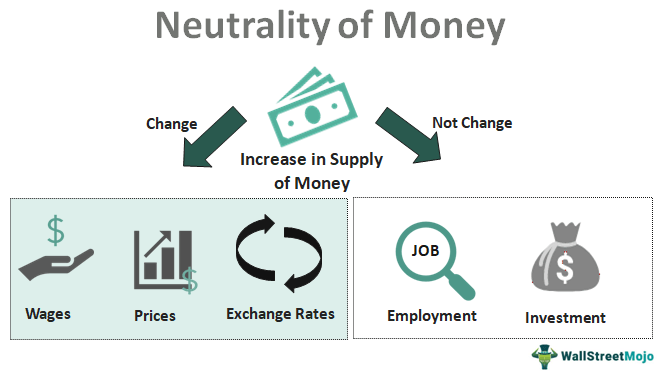

In the current financial landscape, effective cash flow management is indispensable for corporate survival and growth. Companies must strategically navigate their financial inflows and outflows to ensure sufficient liquidity for operational needs, investment opportunities, and unforeseen challenges. Cash neutrality presents a financial strategy that aligns closely with efficient resource allocation. By balancing buy and sell operations to maintain a zero net cash position, companies can fully deploy capital, thus reducing the risk of holding idle cash. This approach positions businesses to be more resilient against market volatility and supports long-term financial health.

In addition to these traditional financial strategies, algo trading, or algorithmic trading, introduces an innovative dimension to financial management. By utilizing computer algorithms to execute trading operations, companies benefit from enhanced precision and speed, allowing them to process complex datasets and respond to market changes more swiftly than human traders can. This not only increases efficiency but also reduces the likelihood of error, providing a competitive edge in the fast-paced financial markets.



This article explores the intersection of cash flow management, cash neutrality, financial strategy, and algo trading. Through a comprehensive understanding of how these components work together, businesses can develop more refined financial strategies. By integrating these elements, companies position themselves to enhance operational efficiency, manage risks proactively, and maintain market competitiveness.

## Table of Contents

## Understanding Cash Flow Management

Cash flow management involves tracking and optimizing the cash that flows into and out of a business, essential for maintaining sufficient liquidity levels. Effective management ensures a business can meet its financial obligations, seize investment opportunities, and bolster growth. With liquidity as a cornerstone, companies are better positioned to handle unexpected costs and strategic investments without financial strain.

A key aspect of cash flow management is forecasting, which involves predicting cash inflows and outflows to anticipate future liquidity positions. Accurate forecasts enable businesses to align their financial strategies with operational needs, minimizing the gap between cash inflows and outflows. Budgeting is another crucial tool, which provides a structured approach to allocating resources according to projected revenues and expenses, thus ensuring capital is available for priority areas.

Scenario analysis further enhances cash flow management by modeling different business situations and their potential impacts on cash flow, ranging from best-case to worst-case scenarios. This predictive approach enables companies to devise contingency plans and adjust their financial tactics according to anticipated economic conditions or market shifts.

By implementing these techniques, businesses can better prepare for both routine and unforeseen financial demands, ensuring they remain agile and competitive in the ever-evolving market landscape.

## The Concept of Cash Neutrality

Cash neutrality represents a financial strategy designed to achieve a zero net cash position by balancing buy and sell operations. This approach is rooted in the philosophy of deploying capital effectively to avoid holding idle cash, which typically yields lower returns. By maintaining a capital usage that is both strategic and efficient, businesses can maximize potential returns while minimizing wasted resources.

The essence of cash neutrality is the full deployment of available capital. Instead of allowing cash reserves to sit idle, which can be detrimental to financial performance, companies actively manage cash to ensure it is consistently contributing to growth or shareholder value. This might involve complex financial maneuvers such as returning excess cash to shareholders through dividends or share repurchase programs, which can enhance shareholder value and optimize the corporate capital structure.

Alternatively, firms may choose to reinvest surplus cash into research and development (R&D) or growth initiatives. This reinvestment is vital for fostering innovation and ensuring long-term growth. By channeling resources into these areas, companies can maintain competitive advantages and adapt to market changes effectively. The underlying principle is that every dollar should work towards generating future income or enhancing shareholder value.

The practice of achieving cash neutrality requires precision in cash flow forecasting and an adept understanding of the organization's [liquidity](/wiki/liquidity-risk-premium) needs. This includes employing detailed scenario analysis to anticipate cash surpluses and deficits. Financial modeling tools can be used to simulate various business conditions and assess the potential impacts on cash flow, providing insights that guide decision-making processes.

In summary, cash neutrality encourages businesses to maintain a dynamic equilibrium of cash flow, ensuring that capital is consistently channeled towards productive ends, thereby driving corporate growth and efficiency. This concept not only optimizes cash utilization but also demonstrates disciplined financial management that can reassure investors and stakeholders of the company's fiscal health and strategic foresight.

## Strategic Financial Planning and Cash Neutral Goals

Strategic financial planning is a critical aspect of effective corporate management, focusing on aligning cash management practices with a company's overarching long-term goals. This approach not only ensures optimal allocation of resources but also plays a vital role in enhancing financial efficiency and stability.

Cash neutrality is one of the strategic goals that some major corporations, such as Apple, pursue to maintain financial efficiency. By achieving cash neutrality, these companies aim to have zero net cash positions, meaning their capital is fully deployed in productive activities rather than left idle. This strategy can involve returning excess cash to shareholders through dividends or share buybacks, or reinvesting in research and development (R&D) and other growth initiatives. The underlying philosophy is to drive shareholder value by ensuring that every dollar is actively working to generate returns, thus avoiding the opportunity cost associated with unutilized capital.

The pursuit of cash neutrality as a corporate goal can significantly enhance investor confidence and improve market valuation. When a company effectively demonstrates its ability to maintain optimal cash positions while simultaneously investing in future growth, it signals financial prudence and a clear long-term vision to the market. This transparency and effective resource management can lead to increased trust among investors, potentially resulting in a more favorable stock valuation. For instance, financial metrics such as Return on Equity (ROE) and Earnings Per Share (EPS) can benefit from well-executed strategies that balance cash management and growth initiatives, making the company more attractive to potential investors.

Additionally, strategic financial planning with a focus on cash neutrality demands rigorous financial discipline, necessitating advanced forecasting and analysis tools. Companies often employ sophisticated financial modeling to predict cash flows, assess investment opportunities, and manage risks. This proactive approach enables firms to anticipate challenges and make informed decisions that align with their long-term strategies.

In summary, strategic financial planning that incorporates aspirations for cash neutrality can serve as a robust framework for achieving corporate financial goals. By ensuring efficient cash deployment and aligning these practices with long-term objectives, companies can bolster investor confidence, enhance their market valuation, and secure sustainable growth trajectories.

## Algorithmic Trading: A Modern Financial Strategy

Algorithmic trading, commonly known as algo trading, utilizes sophisticated computer algorithms to execute trades in financial markets. This strategy has revolutionized trading practices by providing significantly enhanced efficiency and accuracy over traditional methods.

At its core, [algorithmic trading](/wiki/algorithmic-trading) employs predefined rules and mathematical models to determine the timing, price, and quantity of trades. These algorithms process vast amounts of data from diverse sources, such as stock prices, market indices, and economic indicators. The algorithms are designed to identify patterns and trends that may not be immediately apparent to human traders, allowing for a strategic advantage in executing trades.

The efficiency of algorithmic trading largely stems from its capability to process complex datasets at speeds that far exceed human capabilities. By analyzing historical and real-time data, these algorithms can quickly generate insights and make trading decisions in milliseconds. For instance, algorithms might be used to implement strategies such as [trend following](/wiki/trend-following), [arbitrage](/wiki/arbitrage), or [market making](/wiki/market-making). A simple example in Python might involve using the `pandas` library for data analysis and the `numpy` library for executing a mean reversion strategy based on statistical calculations:

```python
import pandas as pd
import numpy as np

# Sample data: historical prices of a stock
data = pd.DataFrame({'price': [100, 101, 102, 104, 103, 100, 98]})

# Calculate the moving average
data['moving_avg'] = data['price'].rolling(window=3).mean()

# Determine trading signals based on moving average
data['signal'] = np.where(data['price'] > data['moving_avg'], 'Buy', 'Sell')

print(data)
```

Algorithmic trading's main advantage lies in its ability to continuously monitor and respond to market changes much faster than human traders. The algorithms execute trades with precision and efficiency, minimizing human error and emotional biases that can adversely affect trading decisions. Furthermore, high-frequency trading, a subset of algorithmic trading, exploits minor price discrepancies across markets, executing a large number of trades within extremely short time frames.

Additionally, algorithmic trading democratizes access to trading strategies, enabling both institutional and individual investors to partake in complex trading strategies that were traditionally reserved for large financial institutions. By utilizing algorithmic models, investors can automate trading processes and optimize their portfolios without requiring constant human oversight.

In conclusion, algorithmic trading represents a modern approach to financial strategy, leveraging computational power to enhance trading accuracy and responsiveness. Its ability to process large datasets and execute trades at lightning speeds affords traders a significant edge in today's rapidly fluctuating markets. As technology continues to advance, it is anticipated that algorithmic trading will increasingly dominate global financial markets, integrating further aspects of [artificial intelligence](/wiki/ai-artificial-intelligence) and [machine learning](/wiki/machine-learning) to refine trading strategies even more.

## Combining Cash Neutrality and Algorithmic Trading

Integrating cash neutrality with algorithmic trading offers a dynamic approach to cash allocation and trading execution, optimizing both financial and operational aspects of an enterprise. This combination capitalizes on the principles of cash neutrality by ensuring that all available capital is actively utilized, minimizing idle cash and enhancing returns through strategic allocations.

Algorithmic trading, characterized by its use of sophisticated algorithms to conduct financial transactions, provides a technological edge that supports the philosophy of cash neutrality. By employing algorithms designed to execute trades based on predefined criteria, firms can effectively balance buy and sell operations to achieve a zero net cash position. This automated approach not only maximizes capital deployment but also mitigates human error and emotional biases often present in manual trading.

The synergy of cash neutrality and algorithmic trading offers an opportunity for enhanced portfolio management. Firms can dynamically adjust their investment strategies in real time, responding to market fluctuations with speed and precision. This agility ensures that capital is consistently invested in high-performing assets, aligning with cash neutrality's goal to avoid underperforming idle cash reserves. Here's a simple example of how algorithmic trading could support cash neutrality in Python:

```python
import numpy as np
import pandas as pd

# Example portfolio allocation strategy
def optimize_allocation(cash_available, assets):
    # Simulating expected returns for available assets
    returns = np.random.rand(len(assets))
    # Allocating cash based on expected returns
    allocation = cash_available * (returns / np.sum(returns))
    return dict(zip(assets, allocation))

# Simulating a list of assets
assets = ['Asset_A', 'Asset_B', 'Asset_C', 'Asset_D']
cash_available = 100000  # Starting cash in USD

# Allocation result
allocation = optimize_allocation(cash_available, assets)
print("Optimized Cash Allocation:", allocation)
```

In this illustrative Python function, cash is optimally allocated across a set of assets. The allocation strategy uses expected returns to proportionately distribute cash, effectively aligning with cash neutrality principles through data-driven decisions while leveraging algorithmic trading's precision.

Implementing this strategy also supports risk management through automated responses. Algorithms can be programmed to trigger predefined actions based on market conditions, such as reallocating investments or executing stop-loss orders, reducing potential losses from market downturns. The automated nature of algorithmic trading ensures that these actions are executed swiftly, preserving the financial agility of the firm.

As businesses continue to explore these combined strategies, they gain a competitive advantage by ensuring efficient cash utilization and adapting quickly to market trends. The interplay between cash neutrality and algorithmic trading stands as a testament to the evolving landscape of financial management, where technology and strategic planning converge to enhance economic resilience.

## Challenges and Future Trends

Implementing strategies such as cash neutrality and algorithmic trading involves addressing several technological and infrastructural challenges. The convergence of these financial strategies requires not only sophisticated technology but also robust infrastructure to support high-frequency data analysis and trading operations. Ensuring the reliability and speed of data transmission is paramount to maintaining the effectiveness of algorithmic trading systems. Furthermore, the integration of real-time data analytics and decision-making processes necessitates scalable computing resources and resilient networks capable of handling large volumes of transactions quickly and efficiently.

Another significant challenge is the regulatory landscape. Financial markets are subject to stringent regulations designed to maintain market integrity and protect investors. Companies must ensure their algorithmic trading strategies comply with these regulations, which may involve continual adjustments to algorithms and trading practices as regulatory environments evolve. This requires ongoing collaboration between legal, compliance, and technical teams within finance organizations.

As we look to the future, a key trend will be the increased integration of artificial intelligence (AI) and machine learning (ML) in both cash flow and trading strategies. AI enables the development of more sophisticated algorithms capable of learning and adapting to market conditions. Machine learning models can be used to predict market trends, optimize trading strategies, and enhance the accuracy of forecasting models for cash flow management. AI and ML can transform not only trading strategies but also overall financial decision-making processes.

The competitive advantage for businesses will lie in their ability to harness these technologies effectively. Firms that successfully integrate AI and machine learning into their cash flow and trading strategies are likely to achieve superior performance by reacting swiftly to market changes, optimizing capital allocations, and minimizing risks. This adaptability will be crucial as financial markets become more complex and dynamic.

In conclusion, while implementing cash neutrality and algorithmic trading strategies presents challenges, the potential benefits are substantial. Companies that overcome technological and regulatory hurdles and embrace AI and machine learning innovations will be better positioned to thrive in an increasingly competitive financial landscape.

## Conclusion

In today's dynamic financial environment, effective management of cash flow, the pursuit of cash neutrality, and the adoption of algorithmic trading have emerged as critical components of an adaptive financial strategy. These elements collectively enhance a company's operational proficiency and solidify its position in highly competitive markets.

Integrating these facets allows businesses to optimize liquidity management and investment strategies. Cash flow management ensures that a company has the liquidity needed to meet immediate and future obligations while capitalizing on growth opportunities. The pursuit of cash neutrality further refines this by ensuring that resources are fully deployed, either reinvested into the business or returned to shareholders, thereby eliminating inefficiencies associated with idle cash reserves.

Algorithmic trading adds a layer of technological advancement by employing sophisticated algorithms to execute trades with unparalleled precision and speed. This not only reduces the likelihood of human error but also allows for real-time adaptation to market fluctuations, providing a competitive edge.

As we look toward the future, the continuous integration of emerging technologies such as artificial intelligence and machine learning into these financial strategies will be crucial. These innovations promise to further enhance decision-making processes, risk management, and resource allocation, enabling businesses to remain agile and resilient amidst changing market dynamics.

To thrive in this evolving landscape, companies must commit to continuous learning and adaptation, embracing new tools and methodologies to maintain an edge over their competitors. By doing so, they can secure a sustainable path to growth and profitability in the ever-evolving financial markets.

## References & Further Reading

[1]: Bergstra, J., Bardenet, R., Bengio, Y., & Kégl, B. (2011). ["Algorithms for Hyper-Parameter Optimization."](https://dl.acm.org/doi/10.5555/2986459.2986743) Advances in Neural Information Processing Systems 24.

[2]: ["Advances in Financial Machine Learning"](https://www.amazon.com/Advances-Financial-Machine-Learning-Marcos/dp/1119482089) by Marcos Lopez de Prado

[3]: ["Evidence-Based Technical Analysis: Applying the Scientific Method and Statistical Inference to Trading Signals"](https://www.amazon.com/Evidence-Based-Technical-Analysis-Scientific-Statistical/dp/0470008741) by David Aronson

[4]: ["Machine Learning for Algorithmic Trading"](https://github.com/stefan-jansen/machine-learning-for-trading) by Stefan Jansen

[5]: ["Quantitative Trading: How to Build Your Own Algorithmic Trading Business"](https://www.amazon.com/Quantitative-Trading-Build-Algorithmic-Business/dp/1119800064) by Ernest P. Chan