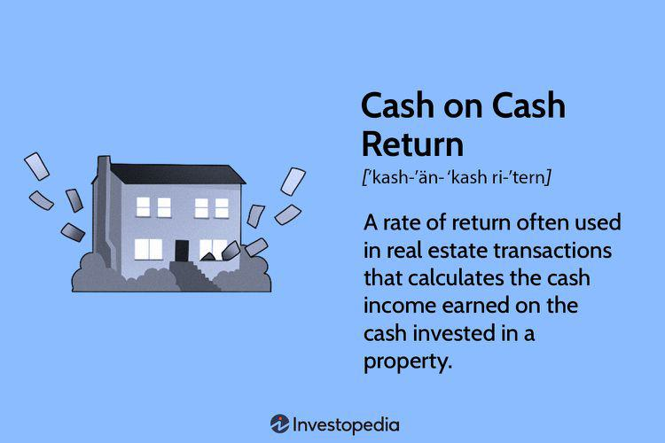

## Table of Contents

## What is Cash-on-Cash Return in real estate?

Cash-on-Cash Return is a simple way to figure out how much money you're making on a real estate investment each year. It's calculated by taking the annual cash flow from the property and dividing it by the total amount of cash you put into the investment. This helps investors see the return on the actual cash they've invested, rather than the whole property value.

For example, if you put $100,000 into a property and it gives you $10,000 in cash flow each year, your Cash-on-Cash Return would be 10%. This percentage is useful because it shows you how quickly you might get your money back and start making a profit. It's a handy tool for comparing different investment opportunities and deciding which one might be the best use of your money.

## How is Cash-on-Cash Return calculated?

Cash-on-Cash Return is calculated by dividing the annual cash flow from a property by the total amount of cash you invested in it. The annual cash flow is the money you get each year after paying all the expenses like mortgage, taxes, insurance, and maintenance. The total cash invested includes your down payment, closing costs, and any other money you spent to get the property ready for renting or selling.

For example, if you invested $50,000 in a property and it gives you $5,000 in cash flow each year, your Cash-on-Cash Return would be 10%. You find this by dividing $5,000 by $50,000 and then multiplying by 100 to get a percentage. This number helps you see how well your investment is doing and how quickly you might get your money back.

## Why is Cash-on-Cash Return important for real estate investors?

Cash-on-Cash Return is important for real estate investors because it shows them how much money they are making on the cash they put into a property each year. This is different from looking at the whole value of the property. It helps investors understand if they are getting a good return on the money they actually spent, like their down payment and any fixes they did. This way, they can see if their investment is doing well or if they should look for something better.

Also, Cash-on-Cash Return is a simple way for investors to compare different real estate deals. If one property gives a higher Cash-on-Cash Return than another, it might be a better investment. This helps investors make smarter choices about where to put their money. By using this number, they can figure out how quickly they might get their money back and start making a profit.

## What is considered a good Cash-on-Cash Return?

A good Cash-on-Cash Return depends on what you want and what the market is like. Usually, a return of 8% to 12% is thought of as good. This means for every dollar you put into a property, you get 8 to 12 cents back each year. But, if you're in a place where property prices are high and rents are low, you might be happy with a lower return, like 6%. On the other hand, in a hot market where prices are going up fast, you might want a higher return, like 15% or more.

It's also important to think about what else you could do with your money. If you can get a better return from something else, like stocks or a different investment, then what's good for real estate might change. So, a good Cash-on-Cash Return is really about what works best for you and fits with your goals.

## How does Cash-on-Cash Return differ from ROI (Return on Investment)?

Cash-on-Cash Return and ROI (Return on Investment) are both ways to measure how well your investment is doing, but they look at different things. Cash-on-Cash Return focuses on the money you actually put into a property, like your down payment and any costs to fix it up. It tells you how much money you're making each year on just that cash. So, if you put $50,000 into a property and it gives you $5,000 a year, your Cash-on-Cash Return is 10%.

ROI, on the other hand, looks at the total value of the property, not just the cash you put in. It includes any increase in the property's value over time, plus the money you make from renting it out. So, if you bought a property for $200,000 and it's now worth $250,000, and you've made $30,000 from rent, your ROI would be based on the whole $230,000 gain, not just the cash you spent. This makes ROI a broader measure of how your investment is doing, while Cash-on-Cash Return is more specific to the money you directly invested.

## Can Cash-on-Cash Return be used to compare different real estate investments?

Yes, Cash-on-Cash Return is a great way to compare different real estate investments. It tells you how much money you're making each year on the cash you put into a property. So, if you're looking at two different properties, you can see which one gives you a better return on your money. This helps you decide which investment might be better for you.

For example, if one property has a Cash-on-Cash Return of 8% and another has a return of 12%, you might choose the one with 12% because it gives you more money back each year. But, you also need to think about other things like how safe the investment is or if the property might go up in value over time. Cash-on-Cash Return is just one tool, but it's really helpful for making quick comparisons between different investments.

## What factors can affect the Cash-on-Cash Return of a property?

Several things can change the Cash-on-Cash Return of a property. One big thing is how much rent you can get. If you can charge more rent, you'll have more money coming in each month, which can make your Cash-on-Cash Return higher. Another thing is the costs you have to pay, like the mortgage, taxes, insurance, and fixing things up. If these costs go up, your Cash-on-Cash Return might go down because you have less money left over.

Also, the price you pay for the property matters a lot. If you buy a property for a lot of money, but the rent doesn't cover your costs well, your Cash-on-Cash Return will be lower. On the other hand, if you get a good deal on a property and the rent is high compared to what you paid, your return can be much better. It's all about balancing how much you spend with how much you earn from the property.

## How can an investor improve the Cash-on-Cash Return on their real estate investment?

An investor can improve their Cash-on-Cash Return by finding ways to increase the income from their property or by reducing the costs. One way to boost income is by raising the rent if the market allows it. You could also add extra services like laundry facilities or parking spaces that tenants might pay more for. Another way is to make the property more attractive to renters, like fixing it up or adding nice features, so you can charge more rent. It's also smart to look for properties in areas where the demand for rentals is high because that can help you get more rent.

On the other hand, cutting costs can also help improve your Cash-on-Cash Return. This means looking at your expenses and seeing where you can save money. For example, you might be able to get a better deal on your insurance or find cheaper ways to do repairs. Sometimes, paying off your mortgage faster can lower your monthly payments, which leaves more money for you each month. Also, being careful about how much you spend to buy and fix up a property in the first place can make a big difference in your return. By balancing these ways to increase income and reduce costs, you can make your investment more profitable.

## What are the limitations of using Cash-on-Cash Return as a sole metric for investment decisions?

Cash-on-Cash Return is a useful way to see how much money you're making each year on the cash you put into a property. But, it's not perfect and has some limits. One big problem is that it only looks at the money you get back each year and doesn't think about how the property's value might go up over time. This means you might miss out on a good investment if it has a low Cash-on-Cash Return but could grow a lot in value.

Another thing to think about is that Cash-on-Cash Return doesn't take into account the risks of your investment. Some properties might have a high return but come with big risks, like being in an area where the economy might not do well. Also, it doesn't show you the full picture of your expenses. For example, if you need to spend a lot on repairs or if taxes go up, your return could be lower than you thought. So, while Cash-on-Cash Return is helpful, it's best to use it with other ways to measure how good an investment might be.

## How does financing impact the Cash-on-Cash Return?

Financing can change the Cash-on-Cash Return a lot because it affects how much money you need to put into a property. When you borrow money to buy a property, you usually only need to pay a down payment, which is less than the full price of the property. This means you can use less of your own money to buy the property, which can make your Cash-on-Cash Return higher. For example, if you buy a property for $100,000 and only need a $20,000 down payment, your return is based on that $20,000 instead of the full $100,000. So, if you get $2,000 a year from the property, your Cash-on-Cash Return is 10%, which is a lot better than if you had to pay the whole $100,000.

But, financing can also make your Cash-on-Cash Return lower if the costs of borrowing are high. When you take out a loan, you have to pay interest on it, and these payments can eat into your cash flow. If the [interest rate](/wiki/interest-rate-trading-strategies) is high, or if you have to pay a lot of other fees, your monthly expenses go up. This means you have less money left over each month from the rent you collect, which can make your Cash-on-Cash Return go down. So, it's important to look at the terms of your loan and see how they will affect your return before you decide to finance your investment.

## What role does property management play in maximizing Cash-on-Cash Return?

Property management is really important for getting the most out of your Cash-on-Cash Return. A good property manager can help you find good tenants who pay rent on time. They can also keep the property in good shape, so you don't have to spend a lot on repairs. This means you can keep your costs down and your income up, which makes your return better. Plus, they can help you set the right rent price, so you're not leaving money on the table.

Also, a property manager can take care of all the little things that come up, like dealing with tenant issues or making sure the bills are paid on time. This saves you time and stress, which is great. But it's also smart because it means you don't have to spend your own time on these tasks, and you can focus on finding more investments. By having a good property manager, you can make sure your property is always making you money and not costing you more than it should.

## How can tax implications influence the Cash-on-Cash Return for real estate investors?

Taxes can have a big impact on your Cash-on-Cash Return. When you own a rental property, you have to pay taxes on the money you make from it. But you can also take some costs off your taxes, like the interest on your mortgage, repairs, and other expenses. This can lower how much tax you have to pay, which means you keep more of the money you make. So, knowing about these tax breaks can help make your Cash-on-Cash Return better because you end up with more cash in your pocket at the end of the year.

But taxes can also make your return go down if you don't plan right. For example, if you're in a high tax area, the taxes you have to pay might eat into your profits a lot. Also, if you sell the property, you might have to pay capital gains tax on any money you make from the sale. This can affect how much money you get back from your investment. So, it's really important to think about taxes when you're figuring out your Cash-on-Cash Return and to talk to a tax expert to make sure you're doing everything you can to keep your taxes low and your return high.

## What is Understanding Cash-on-Cash Return?

Cash-on-cash return is a financial metric extensively utilized within the real estate sector to gauge the cash income generated by a property relative to the cash invested in it. This evaluation is crucial as it directly addresses the liquidity of the investment and its ability to generate cash flow on an annual basis. Unlike comprehensive return on investment (ROI) metrics, which may encompass various forms of financial returns including asset appreciation and taxes, cash-on-cash return strictly focuses on cash inflows and outflows, thus offering a more immediate perspective on an investment's performance.

The formula for calculating cash-on-cash return is:

$$
\text{Cash-on-Cash Return} = \left( \frac{\text{Annual Pre-Tax Cash Flow}}{\text{Total Initial Cash Investment}} \right) \times 100
$$

This percentage highlights the annual return generated purely from the operational cash flow of the property, absent any consideration of gains from sale or refinancing.

The components essential to understanding cash-on-cash return include the annual pre-tax cash flow and the initial cash investment. The annual pre-tax cash flow is derived from subtracting operating expenses and debt service from the property's gross rental income. This calculation requires meticulous attention to the property's income streams and expense liabilities to ensure accurate data.

Cash-on-cash return is particularly informative in assessing an investment's immediate viability. It stands as a clear contrast to more comprehensive metrics such as the internal rate of return (IRR) or net present value (NPV), which involve complex computations and account for future cash inflows, appreciation, and depreciation. While these broader metrics provide a long-term view, cash-on-cash return is indispensable for investors who prioritize understanding the [liquidity](/wiki/liquidity-risk-premium) and immediate cash yield of their properties.

By focusing on cash flow, this metric helps investors recognize the real-time profitability of a real estate asset, facilitating strategic decisions about property investment, management, or divestiture. Thus, cash-on-cash return serves as a practical tool for investors seeking to maintain or enhance their investment portfolios with a clear understanding of cash profitability.

## How do you calculate Cash-on-Cash Return?

Calculating the cash-on-cash return involves understanding certain financial metrics and applying a straightforward formula. The cash-on-cash return is computed by dividing the annual pre-tax cash flow by the total initial cash investment. This computation provides investors with a clear perspective on the annual return they can anticipate from their real estate investment based strictly on cash flow metrics.

### Key Variables in Calculation

1. **Gross Scheduled Rent (GSR)**: This is the total rent income that a property can generate if it is fully leased with no vacancies. It's the starting point for determining cash flow.

2. **Operating Income**: To find the operating income, you must calculate the gross rental income (which may be less than the GSR due to vacancies) and subtract operating expenses. Operating expenses typically include maintenance, property management fees, insurance, and taxes, among other costs.

3. **Expenses**: Operating expenses also play a crucial role in identifying the real cash flow. These must be carefully tracked and include fixed and variable costs associated with maintaining the property.

### Formula

The cash-on-cash return ($COC$) is calculated as follows:

$$
COC = \left( \frac{\text{Annual Pre-Tax Cash Flow}}{\text{Total Initial Cash Investment}} \right) \times 100
$$

Where:
- **Annual Pre-Tax Cash Flow** is the net income from the property after deducting all operating expenses from the gross rental income.
- **Total Initial Cash Investment** includes the down payment, closing costs, and any initial repair costs necessary to make the property operational.

### Detailed Calculation Steps

1. **Calculate Gross Rental Income**: Deduct any anticipated vacancy losses from the Gross Scheduled Rent.

2. **Deduct Operating Expenses**: Subtract all related operating expenses from the Gross Rental Income to find the Net Operating Income (NOI).

3. **Determine Annual Cash Flow**: If the property is financed, subtract the annual debt service (the total mortgage payment) from the Net Operating Income to find the Annual Pre-Tax Cash Flow.

4. **Identify Total Initial Cash Investment**: Sum the initial costs, including down payment, closing costs, and any immediate repair expenses.

5. **Apply the Cash-on-Cash Return Formula**: Use the formula above to find the cash-on-cash return percentage. This figure will help in assessing the investment's cash flow performance.

### Example

Suppose an investor acquires a rental property with the following details:
- **Gross Scheduled Rent**: $120,000 per year
- **Expected Vacancy Loss**: $6,000 per year
- **Operating Expenses**: $30,000 per year
- **Annual Debt Service**: $50,000 
- **Total Initial Investment**: $100,000

**Steps**:
1. **Gross Rental Income**: $120,000 - $6,000 = $114,000
2. **Net Operating Income**: $114,000 - $30,000 = $84,000
3. **Annual Pre-Tax Cash Flow**: $84,000 - $50,000 = $34,000
4. **Cash-on-Cash Return**: $(\frac{34,000}{100,000}) \times 100 = 34\%$

This calculation demonstrates a 34% cash-on-cash return, indicating a robust annual return relative to the cash initially invested. Accurate calculations are pivotal for devising strategies that align with financial objectives. Mastery of cash-on-cash return allows investors like this one to precisely gauge annual investment returns and strategically optimize their real estate portfolios.

## References & Further Reading

[1]: Geltner, D., Miller, N., Clayton, J., & Eichholtz, P. (2013). ["Commercial Real Estate Analysis and Investments."](https://www.researchgate.net/publication/245702364_Commercial_Real_Estate_Analysis_and_Investments) Cengage Learning.

[2]: Brueggeman, W. B., & Fisher, J. D. (2010). ["Real Estate Finance and Investments."](https://archive.org/details/realestatefinanc11edbrue) McGraw-Hill/Irwin.

[3]: Rosen, K. T., & Smith, L. B. (1983). ["The Price-Adjustment Process for Rental Housing and the Natural Vacancy Rate."](https://escholarship.org/uc/item/5284v24v)90060-1) Journal of Urban Economics.

[4]: Fabozzi, F. J. (2007). ["Handbook of Mortgage-Backed Securities."](https://www.amazon.com/Handbook-Mortgage-Backed-Securities-7th/dp/0198785771) McGraw-Hill.

[5]: Damodaran, A. (2012). ["Investment Valuation: Tools and Techniques for Determining the Value of Any Asset."](https://books.google.com/books/about/Investment_Valuation.html?id=5SRHAAAAQBAJ) Wiley Finance. 

[6]: Chan, E. P. (2009). ["Quantitative Trading: How to Build Your Own Algorithmic Trading Business."](https://github.com/ftvision/quant_trading_echan_book) Wiley Trading Series.

[7]: de Prado, M. L. (2018). ["Advances in Financial Machine Learning."](https://www.amazon.com/Advances-Financial-Machine-Learning-Marcos/dp/1119482089) Wiley.