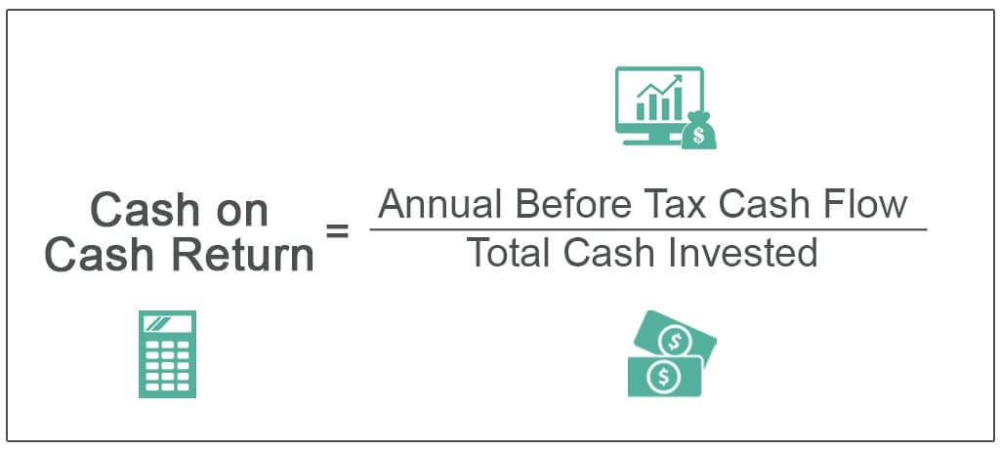

## Table of Contents

## What is Cash-on-Cash Yield?

Cash-on-Cash Yield is a simple way to figure out how much money you're making from an investment compared to how much money you put into it. It's often used in real estate to see how well a rental property is doing. To find the Cash-on-Cash Yield, you take the yearly cash flow from the property and divide it by the total amount of money you spent to buy and fix up the property. The result is shown as a percentage.

This measure is helpful because it gives you a quick idea of your investment's performance without getting into complicated calculations. For example, if you spent $100,000 on a property and it gives you $10,000 a year in cash flow, your Cash-on-Cash Yield would be 10%. This percentage helps you compare different investment opportunities easily, so you can decide where to put your money to get the best return.

## Why is Cash-on-Cash Yield important for real estate investors?

Cash-on-Cash Yield is important for real estate investors because it helps them understand how much money they are making from their investment compared to what they put into it. It's like a quick check to see if the money they are getting back each year from renting out their property is worth the amount they spent to buy and fix it up. This is really helpful when deciding whether to buy a property or not. If the yield is high, it means the property is making good money, which is what investors want.

Also, Cash-on-Cash Yield is easy to figure out and doesn't need a lot of complicated math. This makes it a great tool for investors, especially those who are just starting out. They can compare different properties quickly and see which one gives them the best return on their money. This way, they can make smarter choices about where to invest their money to get the most out of it.

## How do you calculate Cash-on-Cash Yield?

To calculate Cash-on-Cash Yield, you need to know two things: the annual cash flow from the property and the total amount of money you put into it. The annual cash flow is how much money you get from renting out the property each year, after you pay for things like taxes, insurance, and maintenance. The total amount of money you put into it includes the price you paid for the property and any money you spent on fixing it up or making improvements.

To find the Cash-on-Cash Yield, you divide the annual cash flow by the total amount of money you put into the property. Then, you multiply the result by 100 to turn it into a percentage. For example, if you spent $100,000 to buy and fix up a property and it gives you $10,000 a year in cash flow, you would divide $10,000 by $100,000 to get 0.1. Then, you multiply 0.1 by 100 to get a Cash-on-Cash Yield of 10%. This percentage tells you how well your investment is doing each year compared to what you spent on it.

## What are the components needed to calculate Cash-on-Cash Yield?

To calculate Cash-on-Cash Yield, you need to know the annual cash flow from the property and the total amount of money you spent on it. The annual cash flow is the money you get each year from renting out the property, after you've paid for things like taxes, insurance, and any repairs or maintenance. This is the money that's left over and goes into your pocket.

The total amount of money you spent includes the price you paid to buy the property and any money you spent on fixing it up or making improvements. This is the total investment you made in the property. Once you have these two numbers, you can find the Cash-on-Cash Yield by dividing the annual cash flow by the total amount of money you spent, and then multiplying by 100 to get a percentage.

## Can you provide a simple example of calculating Cash-on-Cash Yield?

Let's say you bought a house for $200,000 and spent another $20,000 to fix it up. So, you spent a total of $220,000 on the property. Now, you rent it out and after paying for things like taxes, insurance, and repairs, you get $11,000 a year in cash flow. That's the money you get to keep from renting it out each year.

To find the Cash-on-Cash Yield, you take the annual cash flow, which is $11,000, and divide it by the total amount you spent, which is $220,000. So, $11,000 divided by $220,000 equals 0.05. Then, you multiply 0.05 by 100 to turn it into a percentage. That gives you a Cash-on-Cash Yield of 5%. This means that for every dollar you put into the property, you're getting back 5 cents each year.

## What is considered a good Cash-on-Cash Yield?

A good Cash-on-Cash Yield can vary depending on things like where the property is, how much risk you want to take, and what other investments are out there. But usually, a yield of around 8% to 12% is seen as pretty good for rental properties. This means for every dollar you put into the property, you're getting back 8 to 12 cents each year.

If you're looking at properties in a big city or a place where prices are going up fast, you might be okay with a lower yield, like 4% to 6%, because you think the property's value will go up a lot. But if you want to be safer and get your money back quicker, you might want a higher yield, like 10% or more. It's all about what you're comfortable with and what you're hoping to get out of your investment.

## How does Cash-on-Cash Yield differ from Return on Investment (ROI)?

Cash-on-Cash Yield and Return on Investment (ROI) both help you understand how well your investment is doing, but they look at things a bit differently. Cash-on-Cash Yield focuses on the money you get back each year from your investment compared to the money you put into it. It's like checking how much cash you're making right now from renting out a property. For example, if you spent $100,000 on a property and it gives you $10,000 a year, your Cash-on-Cash Yield would be 10%. This number is really useful for real estate investors because it tells them how their property is doing year by year.

On the other hand, ROI looks at the total profit you make from an investment over time, compared to the total amount you spent. It includes not just the yearly cash flow but also any increase in the property's value when you sell it. So, if you bought a property for $100,000, spent $10,000 on fixes, and then sold it for $150,000 after a few years, your ROI would consider all that money. ROI gives you a bigger picture of your investment's success over its entire life, not just what you're getting each year.

## What are the limitations of using Cash-on-Cash Yield as a metric?

Cash-on-Cash Yield is a handy tool, but it has some limits. One big thing is that it only looks at the cash you get back each year. It doesn't think about how the property's value might go up over time. So, if you're hoping to make money when you sell the property later, Cash-on-Cash Yield won't show you that part. Also, it doesn't take into account things like how easy it is to rent out the property or how much work you might have to do to keep it up. These things can make a big difference in how good of an investment it really is.

Another limit is that Cash-on-Cash Yield can be different depending on how you figure out the cash flow. If you include different costs or don't include some, your yield can look better or worse. This can make it hard to compare different properties fairly. Plus, it doesn't show you any risks, like if the area might become less popular or if there could be big repair costs in the future. So, while Cash-on-Cash Yield is a quick way to check an investment, it's smart to look at other things too to get the full picture.

## How can Cash-on-Cash Yield be improved?

To make your Cash-on-Cash Yield better, you can try to increase the money you get from renting out your property. One way to do this is by raising the rent if the market allows it. You can also look for ways to cut down on the costs of owning the property, like finding cheaper insurance or doing some of the repairs yourself. Another idea is to add value to the property, maybe by fixing it up or adding something new that makes it more attractive to renters, which could let you charge more rent.

Another way to boost your Cash-on-Cash Yield is by lowering the amount of money you put into the property. This could mean getting a better deal when you buy the property or spending less on fixing it up. Sometimes, you can find a property that needs a little work and fix it up yourself for less money. Also, if you can get a loan with a lower interest rate, that can help too because it means less money going out each month. By focusing on both increasing your yearly cash flow and reducing your total investment, you can improve your Cash-on-Cash Yield and make your investment more profitable.

## What are some common mistakes to avoid when calculating Cash-on-Cash Yield?

One common mistake people make when calculating Cash-on-Cash Yield is not including all the costs. They might forget to add in things like property taxes, insurance, and the money spent on repairs and maintenance. These costs can really add up and if you don't include them, your Cash-on-Cash Yield will look better than it really is. Always make sure you're counting all the money that goes out, not just what comes in from rent.

Another mistake is not being clear about what counts as the total investment. Some people only think about the price they paid for the property, but they should also include any money spent on fixing it up or making improvements. If you don't add all these costs together, your Cash-on-Cash Yield will seem higher than it should be. It's important to be honest about everything you've spent so you get a true picture of how your investment is doing.

## How does leverage affect Cash-on-Cash Yield?

Leverage can make your Cash-on-Cash Yield look better. When you use a loan to buy a property, you're not putting all your own money into it. Instead, you're using a mix of your money and borrowed money. This means your total investment is smaller because you're only counting the money you actually spent, not the whole price of the property. So, when you calculate your Cash-on-Cash Yield, the smaller investment number makes the yield higher. For example, if you buy a $100,000 property with $20,000 of your own money and a $80,000 loan, and you get $10,000 a year in cash flow, your Cash-on-Cash Yield would be 50% ($10,000 divided by $20,000).

But, using leverage also means you have to pay back the loan, which includes interest. This can eat into your yearly cash flow. If the interest on your loan is high, it might lower your cash flow enough to make your Cash-on-Cash Yield worse than if you had paid for the whole property yourself. So, while leverage can make your yield look better on paper, you need to think about the real costs of the loan and make sure the cash flow is still good enough to cover everything and give you a solid return.

## Can you discuss a case study where Cash-on-Cash Yield was used to evaluate an investment property?

Let's look at a case where someone named Sarah used Cash-on-Cash Yield to decide if she should buy a rental property. Sarah found a house that cost $150,000. She also had to spend $10,000 to fix it up, so her total investment was $160,000. After she bought the house, she rented it out and after paying for things like taxes, insurance, and repairs, she was getting $16,000 a year in cash flow. To find out her Cash-on-Cash Yield, Sarah divided the $16,000 by her $160,000 investment, which came out to 0.1, or 10% when you multiply by 100. This 10% yield looked pretty good to her, especially since she heard that a good yield is usually between 8% and 12%.

But Sarah didn't stop there. She knew that Cash-on-Cash Yield only shows how much money she's making each year compared to what she put in. She also thought about how the house might be worth more in the future and how easy it would be to keep renting it out. Even though the yield was good, Sarah wanted to make sure she was making a smart choice. So, she looked at other things like how the neighborhood was doing and if there were any big repair costs coming up. In the end, the 10% Cash-on-Cash Yield, along with the other good signs she saw, made her feel confident about buying the property.

## What is Cash-on-Cash Yield?

Cash-on-Cash Yield is a vital financial metric used to estimate the return on an income-generating asset by comparing annual pre-tax cash flow to the total initial cash investment. This metric is widely used in real estate investments, where it serves as a critical tool for assessing how effectively investment capital generates annual returns.

The cash-on-cash yield formula is straightforward, enhancing its utility among investors. It is calculated as follows:

$$
\text{Cash-on-Cash Yield} = \frac{\text{Annual Pre-Tax Cash Flow}}{\text{Total Initial Cash Investment}}
$$

Unlike other yield metrics that might account for potential appreciation or provide a comprehensive return on investment overview, cash-on-cash yield focuses strictly on cash flow. This distinction is crucial, especially in scenarios where the investor is interested in the [liquidity](/wiki/liquidity-risk-premium) and short-term profitability of an investment.

The simplicity of this calculation method makes it accessible to entry-level investors, offering them impactful insights without the complexity of more comprehensive financial metrics. Although it provides a snapshot of an investment's cash flow performance, cash-on-cash yield is particularly valuable in real estate investments. Here, the effects of mortgages and operational costs are significant, directly influencing the real cash flow available to the investor.

In summary, cash-on-cash yield is a practical and straightforward metric that facilitates informed investment decisions, especially in real estate contexts. By concentrating exclusively on cash flow, it offers investors a clear picture of how well their capital is being utilized to generate immediate financial returns.

## How do you calculate cash-on-cash yield?

To calculate cash-on-cash yield, the formula used is:

$$
\text{Cash-on-Cash Yield} = \frac{\text{Annual Net Cash Flow}}{\text{Total Initial Cash Investment}}
$$

This metric provides a percentage indicating the return on cash invested in the property. Consider a property purchased for $200,000 with an annual net cash flow of $12,000. Applying the formula, the yield is calculated as follows:

$$
\text{Cash-on-Cash Yield} = \frac{12,000}{200,000} = 0.06 \text{ or } 6\%
$$

Key elements influencing cash-on-cash yield calculations include rental income, operating expenses, and mortgage payments. Rental income constitutes the primary cash inflow. It is essential to forecast rental income realistically, considering market conditions and property occupancy rates. Operating expenses cover costs necessary for property upkeep, such as maintenance, property management fees, and insurance.

Mortgage payments directly impact annual net cash flow. These payments include both interest and principal components, which should be deducted from total rental income to compute net cash flow accurately. Evaluating these inputs thoroughly is crucial to avoid overestimating or underestimating the potential yield.

While cash-on-cash yield calculation provides a useful snapshot of annual returns, the metric is affected by variables such as vacancy rates and fluctuating expenses. These factors require continuous monitoring and adjustments to the calculations to reflect the current financial realities accurately. It is prudent for investors to update their calculations periodically in response to changes in the property’s financial performance to maintain precise assessments of investment yield.

## What is Cash-on-Cash Yield in Real Estate?

In real estate, cash-on-cash yield is extensively used to evaluate the profitability of investment properties. This metric holds particular appeal for real estate investors due to its emphasis on actual cash inflows, eschewing non-cash impacts such as depreciation. By focusing on the immediate cash return, investors gain a clear, tangible perspective on how well their capital is being utilized annually. 

To calculate cash-on-cash yield, investors compare the annual pre-tax cash flow generated by the property to the total initial cash investment. This is expressed mathematically as:

$$
\text{Cash-on-Cash Yield} = \frac{\text{Annual Pre-Tax Cash Flow}}{\text{Total Initial Cash Investment}}
$$

Such a focus allows investors to measure direct financial outcomes, making cash-on-cash yield especially valuable when comparing multiple properties with different financing arrangements. For instance, two properties might deliver identical rental incomes, but differing mortgage structures could lead to varied cash-on-cash yields, influencing investment choice.

Moreover, cash-on-cash yield serves as an indicator of whether a property might be undervalued or overvalued through straightforward efficiency insights into returns. A higher cash-on-cash yield suggests better immediate returns on the cash invested, whereas lower yields might prompt further inquiry into a property’s potential deficiencies or excess costs.

Nonetheless, challenges exist if the cash-on-cash yield fails to align with broader market appreciation rates. While this metric provides a snapshot of current financial returns, it may not adequately predict long-term success if property value fluctuations aren't considered. As market appreciation often contributes significantly to real estate wealth accumulation over time, reliance solely on cash-on-cash yield might limit investors' understanding of an investment's full potential.

Investors are encouraged to use cash-on-cash yield as a part of a broader investment evaluation toolkit, integrating additional performance indicators to achieve a comprehensive view of potential investment outcomes.

## References & Further Reading

[1]: Fisher, M., & Sirmans, C. (1994). "The Role of Income and Appreciation Returns in the Real Estate Investment Decision." *Journal of Real Estate Research*, 9(2), 153-162.

[2]: Ling, D., & Archer, W. (2012). ["Real Estate Principles: A Value Approach."](https://www.mheducation.com/highered/product/real-estate-principles-value-approach-ling-archer/M9781264500185.html) McGraw-Hill Education.

[3]: Lopez de Prado, M. (2018). ["Advances in Financial Machine Learning."](https://www.amazon.com/Advances-Financial-Machine-Learning-Marcos/dp/1119482089) Wiley.

[4]: Chan, E. (2008). ["Quantitative Trading: How to Build Your Own Algorithmic Trading Business."](https://github.com/ftvision/quant_trading_echan_book) Wiley.

[5]: Fabozzi, F. J. (2005). ["The Handbook of Mortgage-Backed Securities."](https://academic.oup.com/book/7943) McGraw-Hill. 

[6]: Jansen, S. (2020). ["Machine Learning for Algorithmic Trading."](https://github.com/stefan-jansen/machine-learning-for-trading) Packt Publishing.