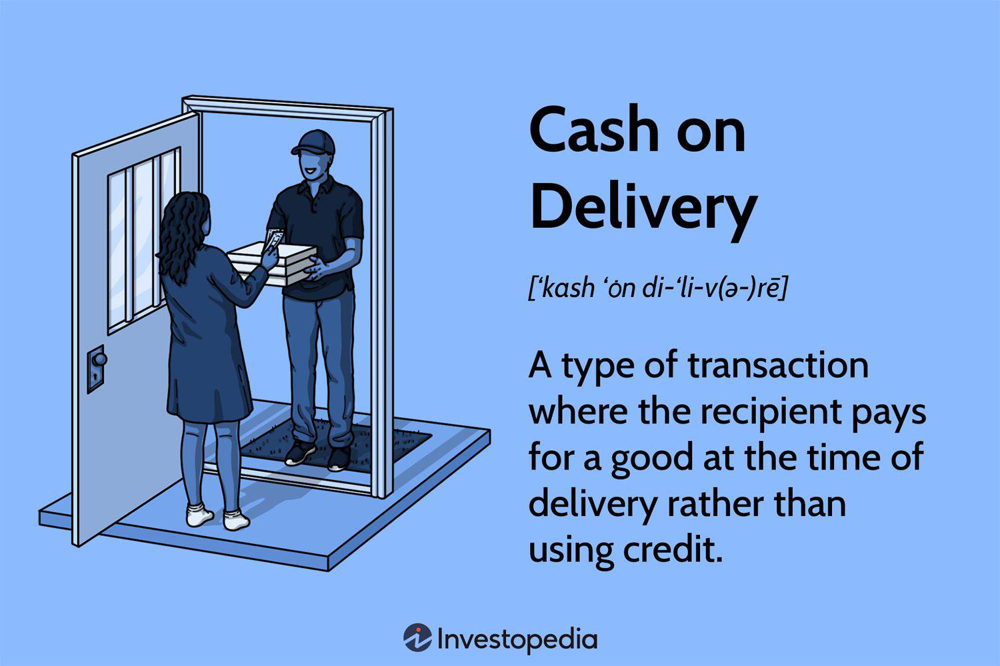

Cash on Delivery (COD) is a traditional payment method wherein payment for goods is made at the time of delivery, rather than in advance. This payment approach bears significant relevance in contemporary transactions, particularly in regions where online payment infrastructures might not be as robust or where consumers exhibit preferences towards paying upon receiving goods to ensure quality assurance. COD has remained a cornerstone in sectors such as e-commerce, enabling businesses to build trust with consumers who may be hesitant to commit payment before product inspection.

Algorithmic trading, alternatively known as algo trading, involves the use of complex algorithms and automated processes to execute trades in financial markets. This method is growing increasingly vital due to its ability to facilitate high-frequency trading, optimize execution speeds, reduce transaction costs, and capitalize on market patterns or arbitrages unobservable to human traders. Algo trading represents a significant shift in trading practices, driven by advanced computational models and real-time data analysis, underscoring its indispensable role in modern finance.



The intersection of COD and algorithmic trading within the financial ecosystem provides intriguing insights. While traditionally divorced from technological trading advancements, COD influences financial liquidity and cash flow, critical elements in formulating trading strategies. Algo trading systems, tasked with executing trades efficiently, must consider payment timelines and liquidity impacts brought about by methods like COD, highlighting the complex interaction between traditional payment methods and high-tech trading environments.

The purpose of this article is to explore these dynamics and investigate how various payment methods, particularly COD, influence algorithmic trading strategies. This examination extends to analyzing the synergy and friction points between traditional payment methodologies and the sophisticated framework of algo trading, providing insights into optimizing trading performances while accounting for diverse transactional models. This exploration invites further discussion on the broader implications of payment methods in shaping financial markets and trading strategies.

## Table of Contents

## Understanding Cash on Delivery (COD)

Cash on Delivery (COD) is a transaction process in which payment for goods is completed at the time of delivery rather than in advance. This traditional payment method holds significant relevance in consumer markets, providing an alternative for individuals who prefer tangible interaction before financial commitment. COD is often favored in regions where credit card penetration is low or consumer trust in electronic transactions is limited.

Historically, COD has been a critical component of retail operations, dating back to the early days of mail-order catalogs. This method provided a practical solution for customers lacking credit or those skeptical of remote payment processes. As global commerce evolved, particularly with the onset of the digital era, the implementation of COD adapted to fit modern delivery infrastructures. Renowned retail giants like Sears, in the early 20th century, leveraged COD to expand their customer base, delivering goods directly while reassuring customers with the safety of deferred payment.

In contemporary markets, COD remains prevalent, especially in developing regions. For instance, e-commerce platforms in countries such as India and various Southeast Asian nations report a significant portion of transactions still processed via COD. Consumers value the flexibility and security, especially where online banking is either inaccessible or customers are unfamiliar with digital payment platforms. Companies like Amazon and Flipkart in India have tailored their logistics and customer service strategies to efficiently handle COD orders, ensuring a seamless experience despite the deferred payment model.

The advantages of COD for consumers include the ability to physically inspect goods prior to payment, reducing the risk of fraud or dissatisfaction. For businesses, COD can attract more customers who might otherwise refrain from purchasing due to distrust in digital transactions. However, COD carries notable disadvantages. For retailers, one primary concern is the increased risk of returns, as customers may decline the product upon delivery, leading to logistical inefficiencies and additional costs. Further complications include cash handling security risks and the elevated cost of employing personnel for money collection upon delivery.

For businesses, COD requires robust logistics and cash management systems to handle potential returns and the secure collection of cash. The retention of COD as a viable payment method depends significantly on these supporting structures and the cultural context within which businesses operate. 

Overall, while COD presents specific logistical challenges and financial risks, it remains a valuable payment option in varied economic environments, balancing traditional consumer preferences with modern business models.

## Payment Method Options: More Than Just COD

In today's dynamic financial ecosystem, a plethora of payment methods extends beyond the traditional Cash on Delivery (COD) model, especially in e-commerce transactions. These mechanisms are pivotal not only for consumers but also for the commercial strategies of businesses.

Cash on Delivery (COD) is a payment method where the payment for goods is made at the time of their delivery, rather than at the purchase point. COD offers a sense of security for consumers who wish to verify the receipt and quality of goods before making payment. Conversely, businesses have to manage risks associated with logistics and potential payment defaults.

### Comparative Analysis

1. **Cash on Delivery (COD) vs. Cash in Advance**:
   - **Cash in Advance** requires consumers to pay before the goods are shipped. This method assures businesses of upfront cash flow and reduces the risk of non-payment. However, it places greater trust in the retailer by the consumer, who risks not receiving the product or receiving a defective one.
   - From the business perspective, cash in advance minimizes risk associated with payment collection. However, it can also deter potential consumers worried about their investment without tangible guarantees.

2. **COD vs. Credit-Based Transactions**:
   - **Credit Transactions** involve the consumer using credit facilities (like credit cards) to purchase goods. Payments happen electronically, often post-purchase, enhancing convenience. This method benefits consumers by providing immediate access to goods without the immediate outflow of cash.
   - For businesses, credit offers increased sales through consumer flexibility, but introduces the complexity of credit risk management and transaction fees charged by credit companies.

### Pros and Cons from Consumer and Business Perspectives

- **COD Pros**:
  - For consumers, COD provides a layer of trust and security, ensuring they pay only upon receipt and inspection of goods. It also circumvents the need for electronic transactions, aiding those without access to credit facilities.
  - Businesses can reach a broader market, particularly in regions where electronic payment infrastructure is weak or consumer trust in prepayment is low.

- **COD Cons**:
  - Consumers face inconvenience due to the requirement of having cash at delivery, which may pose logistical challenges.
  - For businesses, COD can increase operational costs due to delivery logistics and handling unsold inventory. It can also slow down cash flow compared to prepayment methods.

- **Cash in Advance Pros and Cons**:
  - Consumers may find it less attractive due to prepayment risks without immediate guarantees.
  - Businesses gain immediate funds and financial security but at a potential cost to consumer base and order volume.

- **Credit-Based Pros and Cons**:
  - Consumers enjoy convenience and the ability to defer payments, boosting purchasing power. 
  - Businesses see increased sales volumes and consumer satisfaction but must handle increased fraud risks and payment processing fees.

Overall, the choice of payment method significantly influences both consumer satisfaction and business profitability. As consumers increasingly demand flexibility, businesses must carefully weigh these factors when designing payment systems, particularly in a landscape progressively shifting towards e-commerce.

 to Algorithmic Trading

Algorithmic trading, commonly referred to as algo trading, involves the use of computer algorithms to manage the trading process by making orders based on pre-defined criteria and mathematical models. It leverages the power of advanced algorithms and computational resources to execute trades at speeds and frequencies that are impossible for a human trader. The core components of [algorithmic trading](/wiki/algorithmic-trading) include data acquisition and processing, strategy formulation, risk management, and execution systems. These components work in unison to analyze market trends, predict price movements, and execute transactions automatically.

At its heart, an algorithmic trading system requires a robust set of data inputs, including historical and real-time market data. Processing this data efficiently is crucial, often using advanced statistical and [machine learning](/wiki/machine-learning) techniques to discern patterns and insights. The trading strategies are codified into algorithms, which may range from simple rule-based systems to complex models employing [artificial intelligence](/wiki/ai-artificial-intelligence) and machine learning.

The role of algo trading has grown substantially in modern financial markets due to its capacity to improve [liquidity](/wiki/liquidity-risk-premium), enhance trading efficiency, and reduce transaction costs. By automating the trading process, algorithmic trading can handle vast amounts of data and execute numerous transactions simultaneously, thereby capitalizing on even small price discrepancies in highly liquid markets. This results in tighter bid-ask spreads and more competitive pricing structures for market participants.

Despite its advantages, algorithmic trading also faces several challenges. Market [volatility](/wiki/volatility-trading-strategies) can introduce significant risks, as rapid price movements may lead to unexpected losses if the algorithms are not designed to adapt quickly. Furthermore, the reliance on technology means that system failures, coding errors, or unforeseen market events can have catastrophic consequences. Rigorous risk management and continuous monitoring are essential to mitigate these risks.

The benefits of algo trading include increased transparency and the potential for higher returns due to the algorithms' ability to process information faster and more accurately than human traders. It also allows for the [backtesting](/wiki/backtesting) of trading strategies on historical data to refine and optimize performance. However, the increasing use of algorithmic trading also raises concerns about market stability. Events such as the "Flash Crash" of 2010 have highlighted the impact that automated trading can have on financial systems, leading to calls for stricter regulations and more robust safeguards.

In today's economic climate, algorithmic trading has become a cornerstone of financial markets, driving much of the trading [volume](/wiki/volume-trading-strategy). As technology continues to advance, the integration of artificial intelligence and machine learning into trading algorithms is expected to further transform the landscape, presenting both opportunities and challenges for traders and regulators alike. Understanding the complexities and potential of algo trading is crucial for navigating the evolving financial market dynamics.

## Impact of Payment Methods on Algo Trading

In algorithmic trading, payment methods significantly influence trading strategies, primarily through their impacts on liquidity and cash flow dynamics. Payment methods dictate transaction speeds and settlement times, which are crucial for executing high-frequency trades. Each payment method carries different implications for liquidity—Cash on Delivery (COD), for instance, can slow liquidity due to delayed payments, whereas online payments may accelerate it by ensuring instant transfers.

Liquidity is essential for algorithmic trading as it determines how easily assets can be bought or sold without significantly affecting prices. High liquidity allows for efficient execution of large orders at stable prices, which is fundamental for strategies like [arbitrage](/wiki/arbitrage) or [market making](/wiki/market-making). The choice of payment method can affect the availability and timing of funds, thus influencing liquidity. For example, slower payment methods might lead to a temporary shortage of funds, affecting the ability to capitalize on rapid market movements. 

### Cash Flow Dynamics and Algo Trading

Cash flow dynamics are also crucial, given that algorithmic trading heavily relies on real-time data and the ability to respond swiftly to market changes. Payment methods that ensure quicker cash flows enhance the ability to reallocate capital efficiently. In contrast, methods with delayed settlements, such as COD, might impede rapid reallocations, thereby affecting the strategy's overall performance.

### Case Studies and Payment Timelines

Consider a case study where a trading strategy is impacted by different payment timelines. In high-frequency trading ([HFT](/wiki/high-frequency-trading-strategies)), for instance, milliseconds can be the difference between profit and loss. An HFT firm may prefer payment methods that allow for instantaneous or near-instantaneous cash flows, such as electronic funds transfer systems, to ensure that capital is available for subsequent trades immediately after closing a position.

For a practical example, in Python, a simple simulation can illustrate how delays in cash flow impact trading decisions:

```python
import numpy as np

# Simulate delay in cash flow
def simulate_trades(trades, delay_days):
    balance = 0
    cash_on_hand = 0  # Initial cash
    for day, trade in enumerate(trades):
        if day >= delay_days:
            cash_on_hand += trades[day - delay_days]
        if trade < 0 and cash_on_hand + balance >= abs(trade):
            # Execute sell (or buyback) trade
            balance += trade
        elif trade > 0:
            # Execute buy trade
            if cash_on_hand >= trade:
                balance += trade
                cash_on_hand -= trade
    return balance, cash_on_hand

# Example trades over 10 days
trades = np.array([-100, 200, -150, 300, -50, 100, -200, 400, -300, 150])
delay_days = 2

final_balance, final_cash = simulate_trades(trades, delay_days)
print(f"Final balance: {final_balance}, Cash remaining: {final_cash}")
```

In this simulation, negative values represent sell orders, and positive values signify buy orders. A delay in cash flow means funds from sales are not ready until a few days later, affecting the execution of subsequent trades.

Such dynamics underscore the necessity of selecting suitable payment methods based on the type and frequency of trading. Instituting payment systems that align with the liquidity and cash flow necessities of algorithmic trading is critical for optimizing performance and seizing market opportunities efficiently.

## Advantages and Disadvantages of Combining COD with Algo Trading

Cash on Delivery (COD) and algorithmic trading, though seemingly disparate concepts, have the potential to generate synergies when integrated effectively. This section explores the possible advantages and disadvantages of combining COD with algorithmic trading and identifies strategies to manage these challenges for optimal performance.

**Potential Synergies between COD and Algo Trading Efficiency**

One of the notable synergies is enhanced cash flow management. COD ensures that transactions are completed only upon delivery, thus realigning the liquidity positions of businesses with real-time market needs. The integration of COD into algorithmic trading systems could potentially smooth out cash flows, making liquidity more predictable. This predictability can be advantageous for algorithmic trading strategies that rely on precise timing and liquidity availability.

Additionally, COD can provide a rich dataset for algorithms, as it adds the dimension of delivery timing and payment confirmation. Algorithms can leverage this data to better forecast trends and optimize trading strategies by identifying patterns in consumer behavior and payment reliability. 

Furthermore, the use of COD data in algorithms could improve risk management strategies. By analyzing COD transaction histories, algorithms can better assess the credit risk associated with consumers, allowing traders to adjust their strategies based on the reliability of cash flows.

**Risks Involved when Integrating COD Processes into Trading Systems**

Integrating COD with algorithmic systems does have potential risks, primarily due to the inherent unpredictability associated with physical delivery and payment confirmation. Delays in delivery or payment can lead to disruptions in cash flow, thereby affecting the liquidity management of trading algorithms. These disruptions can, in turn, lead to potential losses or missed opportunities in fast-moving markets.

Another significant risk is the dependency on reliable logistics and external partners for timely deliveries. Any inefficiencies or failures in the supply chain can exacerbate cash flow issues, further impacting algorithmic trading performance. Moreover, the integration process itself can be complex, requiring significant adjustments in existing algorithmic models to account for COD-related variables.

**Insights into Managing Challenges for Optimal Performance**

To manage these challenges effectively, businesses should develop robust logistic frameworks that minimize delays in delivery and payment cycles. Reliable partners and efficient delivery networks can mitigate risks associated with delayed payments, ensuring a more consistent cash flow.

Moreover, algorithm developers should aim to incorporate sophisticated predictive models that [factor](/wiki/factor-investing) in potential delivery disruptions. By using machine learning techniques, such as regression analysis or neural networks, algorithms can anticipate delivery patterns and their impact on liquidity, allowing preemptive adjustments to trading strategies. 

It is also crucial to implement adaptive algorithms that can respond dynamically to fluctuations in cash flow resulting from COD transactions. This adaptability can help maintain trading efficiency even when unexpected changes in liquidity occur.

In conclusion, while there are inherent risks in integrating COD with algorithmic trading, the potential synergies in cash flow management and risk assessment provide compelling reasons to explore this combination. By addressing the logistical challenges and leveraging advanced predictive analytics, businesses can harness the benefits of this integration to enhance trading performance.

## Future Trends in Payment Methods and Algo Trading

Cash on Delivery (COD) has long served as a cornerstone in transaction mechanisms, primarily due to its simplicity and security for consumers. As the digital economy expands, there's an increasing impetus to reevaluate how COD can integrate with modern technologies, including algorithmic trading. In a futuristic context, COD might evolve to incorporate digital advancements, potentially affecting algotrading practices.

### Speculations on the Future of COD and Its Relevance to Algotrading

In recent years, electronic and blockchain-based payment methods have emerged, pushing traditional methods like COD to innovate. Looking forward, one could expect hybrid models where COD is integrated with digital wallets and blockchain technologies to offer more security and tracking capabilities, potentially becoming more attractive to algorithmic trading by reducing the time lag typical with traditional COD. The underlying benefit here is that these technologically enhanced COD systems could facilitate real-time data access, thereby improving the responsiveness of trading algorithms that rely heavily on accurate and timely data inputs.

### Technological Advancements in Payment Processing Impacting Trading Algorithms

Advancements in payment processing technology, such as real-time gross settlement systems (RTGS) and blockchain, are poised to significantly impact algotrading. These technologies provide immediate transaction settlements and reduced counterparty risks, key factors influencing the execution speed and efficiency of trading algorithms.

For instance, integrating Application Programming Interface (API) Services with payment processing could provide trading algorithms direct access to transaction data. Consider the following Python example, which demonstrates how one might fetch real-time transaction data from an API:

```python
import requests

def fetch_transaction_data(api_url):
    response = requests.get(api_url)
    return response.json()

api_url = "https://api.financialservice.com/transactions"
transaction_data = fetch_transaction_data(api_url)

for transaction in transaction_data:
    print("Transaction ID:", transaction['id'])
    print("Amount:", transaction['amount'])
    print("Status:", transaction['status'])
```

Immediate access to transaction data could be used for liquidity assessments and making instantaneous trading decisions, enabling a more dynamic and responsive trading strategy.

### Emerging Trends and How They Might Shift in Light of New Financial Instruments

The financial landscape is continually evolving, with new financial instruments like cryptocurrencies and stablecoins gaining traction. These instruments provide opportunities for diversification and risk management, acting as both a medium of exchange and an investment asset. Their volatile nature and 24/7 market operations add complexity but also potential for enhanced returns through algorithmic trading.

Trading algorithms might increasingly utilize machine learning and artificial intelligence to predict trends and execute trades based on these new instruments. In this context, payment methods that enable instantaneous and low-cost transactions can give traders a competitive advantage. Integration with [cryptocurrency](/wiki/cryptocurrency) could, for instance, enable algorithms to capitalize on price differentials across various platforms with minimal friction.

In conclusion, the future of payment methods, including COD's transformation, will likely bear significant implications for algorithmic trading. Enhancements in transaction processing technologies and the advent of new financial instruments promise to redefine how automated trading systems operate, making them faster, safer, and more efficient. These trends underscore the necessity of harmonizing traditional payment methods with modern technological capabilities to leverage their collective strengths in the evolving financial markets.

## Conclusion

Cash on Delivery (COD) and algorithmic trading are two distinct concepts that, when examined together, offer a fascinating perspective on modern financial systems. COD, a traditional payment method, remains significant due to its role in supporting consumer trust and enabling transactions without immediate financial exchange. This historical method provides value by catering to consumer apprehensions regarding online payment security. On the other hand, algorithmic trading represents the forefront of financial technology, utilizing complex algorithms to execute trades based on pre-defined criteria, thereby increasing efficiency and market responsiveness.

The exploration of how COD and other payment methods impact algorithmic trading has highlighted the intricate relationship between payment systems and trading strategies. While COD might appear to be disconnected from high-frequency, automated trading environments, understanding cash flow and liquidity management is essential for developing robust trading algorithms. Payment methods influence trading liquidity, risk management, and ultimately, the success of trading strategies.

Balancing traditional and modern payment methods is crucial for traders seeking to optimize their strategies. Traditional methods like COD can coexist with modern electronic payment systems, offering diverse options that cater to varying consumer and market needs. For algorithmic traders, acknowledging the nuances of these payment methods can lead to more adaptable strategies that consider broader economic variables, including cash flow cycles and liquidity constraints.

The financial landscape is ever-evolving, and as such, there is a continuous need to examine and understand the impact of payment methods on trading strategies. This exploration invites further discussion on the integration of diverse payment systems in algorithmic models and the potential innovations in payment processing that may influence future trading environments. By fostering a deeper understanding of these dynamics, stakeholders can better navigate the complexities of financial markets, ensuring both robustness and adaptability in their trading operations.

## References & Further Reading

[1]: Bergstra, J., Bardenet, R., Bengio, Y., & Kégl, B. (2011). ["Algorithms for Hyper-Parameter Optimization."](https://dl.acm.org/doi/10.5555/2986459.2986743) Advances in Neural Information Processing Systems 24.

[2]: ["Advances in Financial Machine Learning"](https://www.amazon.com/Advances-Financial-Machine-Learning-Marcos/dp/1119482089) by Marcos Lopez de Prado

[3]: ["Evidence-Based Technical Analysis: Applying the Scientific Method and Statistical Inference to Trading Signals"](https://www.amazon.com/Evidence-Based-Technical-Analysis-Scientific-Statistical/dp/0470008741) by David Aronson

[4]: ["Machine Learning for Algorithmic Trading"](https://github.com/stefan-jansen/machine-learning-for-trading) by Stefan Jansen

[5]: ["Quantitative Trading: How to Build Your Own Algorithmic Trading Business"](https://www.amazon.com/Quantitative-Trading-Build-Algorithmic-Business/dp/1119800064) by Ernest P. Chan