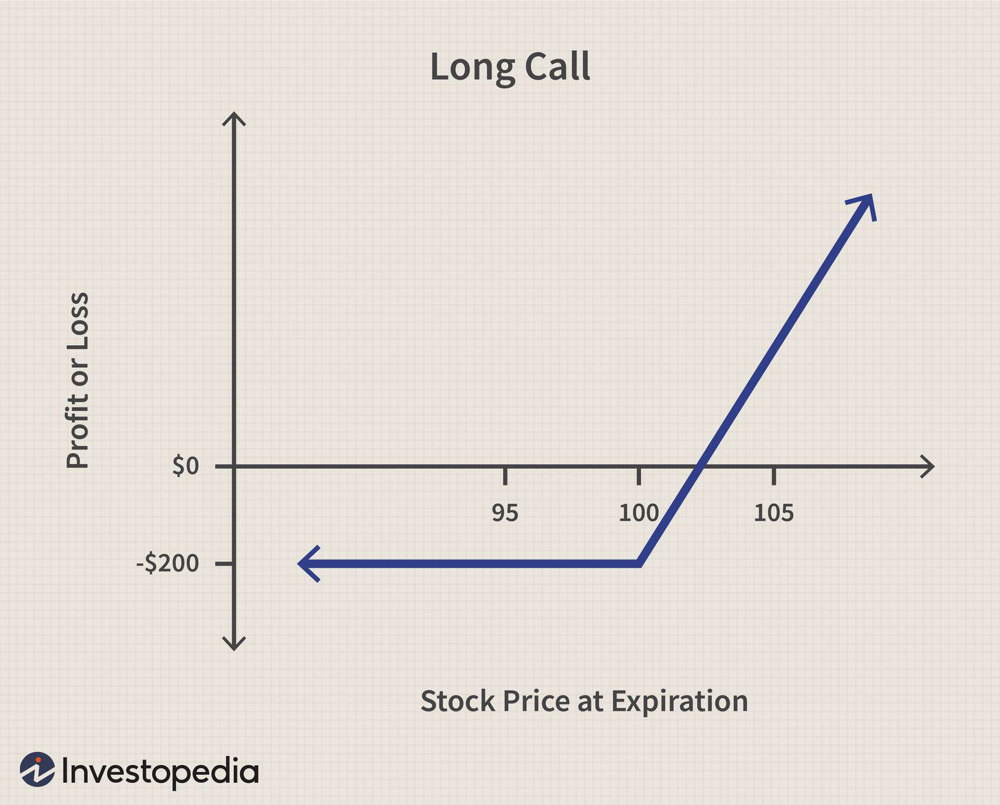

Cash-or-Nothing options are a significant aspect of digital options trading, offering traders a direct and uncomplicated financial instrument. These options provide a binary outcome: a trader receives a fixed amount of cash if the option expires "in the money" (where the underlying asset's price is above a predetermined strike price, in the case of a call option), or the trader receives nothing if this condition is not met. This distinctive payout structure simplifies the decision-making process, making Cash-or-Nothing options particularly appealing to those who prefer well-defined risk-reward scenarios.

The fundamental simplicity of Cash-or-Nothing options distinguishes them from traditional options, where payouts are determined by the asset's price relative to the strike price at expiration. Traditional options often require calculating the intrinsic value and considering the potential for unlimited losses or gains. In contrast, the payoff for a Cash-or-Nothing option is predefined and directly related to the underlying asset's price crossing a specific threshold. The payout formula is expressed as:



$$
\text{Payout} = \begin{cases} 
D, & \text{if } S_T > K \\
0, & \text{otherwise}
\end{cases}
$$

Where $D$ is the fixed payout, $S_T$ is the price of the underlying asset at expiration, and $K$ is the strike price.

The straightforward nature of these options makes them suitable for speculative purposes, allowing traders to take clear positions on the price movements of an asset. Additionally, Cash-or-Nothing options serve as effective tools for strategic hedging, providing a method to secure potential payouts without the complexities associated with traditional derivatives. This binary nature offers traders the ability to design portfolios that reflect specific market views and manage risk with precision.

By their design, Cash-or-Nothing options can cater to a wide range of trading strategies, from simple to complex, offering traders the versatility to adapt to varying market conditions while maintaining a clear understanding of potential outcomes and risks.

## Table of Contents

## Understanding Cash-or-Nothing Call Binary Options

Cash-or-Nothing call options are a form of binary options characterized by their binary pay-out structure. These options have a predetermined cash payout that activates when the underlying asset's price at expiration is above a specified strike price, such as a stock, index, or commodity price. 

The simplicity of Cash-or-Nothing options is highlighted by their cash-settlement nature, meaning there are no deliveries of the underlying asset upon exercise. Unlike Asset-or-Nothing options, which pay the market value of the underlying asset if the strike condition is met, Cash-or-Nothing options offer a straightforward, fixed monetary reward. This fixed payout is independent of the degree by which the asset’s price exceeds the strike price. Consequently, whether the asset beats the strike by a penny or a hundred dollars, the payout remains constant, minimizing the complexity often encountered with traditional options that vary with the magnitude of being "in the money".

To illustrate this, consider an example where an option has a strike price of $50 and a fixed payout of $100. If the price of the underlying asset is $51 at expiration, the payout is $100, not influenced by the fact that it is only $1 above the strike price. This feature provides investors with a clear, consistent risk-reward profile, because the investment yields either the full payout or nothing at all, with no scope for partial payments.

Mathematically, the payoff $P$ of a Cash-or-Nothing call option can be expressed as:

$$

P = 
\begin{cases} 
C, & \text{if } S_T > K \\
0, & \text{otherwise}
\end{cases}
$$

where $C$ is the fixed cash payout, $S_T$ is the underlying asset's price at expiry, and $K$ is the strike price.

The primary allure of Cash-or-Nothing options is their transparency and predictability, making them favored by traders interested in hedging against market [volatility](/wiki/volatility-trading-strategies) or speculating on future price movements. The binary nature of the options simplifies trading strategies by reducing the need to consider nuanced market movements and complex valuation methodologies, focusing instead on the simplicity of a predefined payoff condition.

## The Appeal of Cash-or-Nothing Options in Trading

Cash-or-Nothing options present a compelling choice for traders due to their straightforward binary outcomes, which effectively streamline decision-making processes. The binary nature of these options—yielding either a predetermined cash payout or nothing at all—eliminates the complexity often associated with traditional options pricing, where the payoff depends on the price movement of the underlying asset.

One of the primary advantages of Cash-or-Nothing options is their cost efficiency. These options typically demand lower premiums than their traditional counterparts, making them accessible for traders seeking to limit upfront costs. This cost efficiency is possible because the option's maximum payoff is fixed, reducing risk for the issuer and, consequently, the premium required from the purchaser.

Furthermore, Cash-or-Nothing options can be employed as hedging tools within a diversified investment portfolio. By leveraging these instruments, traders can implement strategies designed to protect against unfavorable market movements while still allowing for participation in positive trends. For instance, a trader might use Cash-or-Nothing options to hedge against potential declines in a stock portfolio by selecting options with strike prices that align with anticipated support levels.

These options also serve as indicators of market sentiment, providing insights into investor expectations and potential price movements. The fixed nature of their payoff structure means traders can align their strategies with broader market conditions, utilizing these options to express bullish or bearish outlooks succinctly.

Additionally, the broad strategic flexibility of Cash-or-Nothing options allows traders to integrate them with other financial instruments to manage risk precisely. This flexibility is particularly advantageous in constructing complex trading strategies, such as straddles or strangles, where traders anticipate significant price movements without a clear direction. By incorporating Cash-or-Nothing options, traders can better balance risk and reward, tailoring their positions to align with specific market views and objectives.

In summary, Cash-or-Nothing options provide a versatile approach to options trading, combining simplicity with strategic depth, affordability, and risk management capabilities. These instruments offer traders a powerful way to express market views, hedge investments, and optimize their overall trading strategies.

## Risk Management in Cash-or-Nothing Option Trading

Risk management is a critical aspect of trading Cash-or-Nothing options due to their binary nature, which results in either a full payout or the loss of the premium. Effectively managing risk involves several key strategies:

1. **Due Diligence and Market Analysis**: Traders must conduct thorough research to understand market trends and the factors that may impact asset prices. This analysis could include technical analysis, macroeconomic indicators, and market sentiment. By staying informed about market conditions, traders can make more educated predictions about asset price movements.

2. **Diversification**: Mitigating the risks associated with binary options can be achieved through diversification across various assets. By spreading investments across different assets, traders can reduce the impact of any single asset's poor performance on the overall portfolio. This strategy helps in balancing the risks and can provide a cushion against market volatility.

3. **Capital Allocation Strategies**: It is advisable for traders to implement capital allocation strategies that prevent overexposure to any single trade or asset. This can be managed by setting a predetermined portion of the capital for each trade, often referred to as the Kelly Criterion. The formula for the Kelly Criterion is:
$$
   f^* = \frac{bp - q}{b}

$$

   where $f^*$ is the fraction of the capital to bet, $b$ is the odds received on the wager, $p$ is the probability of winning, and $q$ is the probability of losing (where $q = 1 - p$).

4. **Authentic Risk Management Strategies**: Employing genuine risk management plans can significantly enhance the predictability and reliability of trading outcomes. Techniques such as stop-loss orders, position sizing, and regular portfolio reviews contribute to reducing potential losses while capitalizing on profitable trades. 

By integrating these strategies, traders can better navigate the inherent risks of Cash-or-Nothing option trading, fostering a more secure and potentially more profitable trading experience.

## Algorithmic Trading and Binary Options

Algorithmic trading significantly enhances the execution of binary options strategies by leveraging computational algorithms for decision-making. Automated systems are empowered to swiftly analyze market conditions, identifying potential opportunities and executing trades efficiently. This acceleration in processing enables traders to capitalize on market movements that may be too rapid for manual intervention.

One of the primary benefits of [algorithmic trading](/wiki/algorithmic-trading) lies in its ability to eliminate emotional biases that often hinder manual trading. By adhering strictly to predefined strategies, algorithms ensure consistency in executing trades, bypassing the emotional rollercoaster of human decision-making that can lead to erratic trading behaviors.

Moreover, [backtesting](/wiki/backtesting) is a critical component of algorithmic trading, allowing traders to optimize strategies using historical data. By simulating trades on past data, algorithms can evaluate the effectiveness and robustness of trading methodologies, enabling fine-tuning before actual implementation. This practice enhances the predictability of future performance and refines strategic deployment.

Integrating algorithmic trading within binary options markets provides traders with advantages in terms of prompt entry and [exit](/wiki/exit-strategy) points. Such precision is crucial in the binary options landscape due to its highly dynamic nature and time-sensitive opportunities. The ability to quickly respond to market fluctuations without human latency can be the difference between profit and loss.

For those interested in implementing algorithmic strategies, programming skills, particularly in Python, can be beneficial. Python's extensive libraries for data analysis and its user-friendly syntax make it a popular choice for developing trading algorithms. For instance, the following Python code snippet demonstrates a simple moving average crossover strategy, a common approach in algorithmic trading:

```python
import pandas as pd

def moving_average_crossover(prices, short_window=40, long_window=100):
    signals = pd.DataFrame(index=prices.index)
    signals['price'] = prices
    signals['short_mavg'] = prices.rolling(window=short_window, min_periods=1, center=False).mean()
    signals['long_mavg'] = prices.rolling(window=long_window, min_periods=1, center=False).mean()
    signals['signal'] = 0.0
    signals['signal'][short_window:] = np.where(signals['short_mavg'][short_window:] > signals['long_mavg'][short_window:], 1.0, 0.0)
    signals['position'] = signals['signal'].diff()

    return signals
```

This example highlights how traders can implement simple yet effective strategies to automate decision-making processes, thereby enhancing trading efficiency in binary options markets.

## Comparing Cash-or-Nothing to Asset-or-Nothing Options

Both Cash-or-Nothing and Asset-or-Nothing options are forms of binary options that provide traders with an all-or-nothing result based on the conditions of the contract at expiration. These options serve different strategic and financial purposes due to their unique payout structures.

Cash-or-Nothing options deliver a fixed cash payout if the option expires in the money, meaning the conditions of the option contract are favorable at expiration (e.g., the underlying asset's price exceeds the strike price for a call option). This predetermined cash amount is beneficial for traders who prefer simplified reward predictions. For instance, if the fixed payout of a Cash-or-Nothing call option is $100, the trader receives this amount regardless of how much the asset price exceeds the strike price, making the potential payoff easy to calculate and anticipate.

In contrast, Asset-or-Nothing options provide a payout equal to the current market value of the underlying asset if the option expires in the money. This payout structure introduces a layer of complexity, as the potential reward varies with the asset's market value at expiration. As an example, if an Asset-or-Nothing call option is in the money and the underlying asset's market value is $150, the trader receives an asset worth $150. This variability can appeal to traders who are willing to embrace fluctuations in asset value as part of their strategy.

Choosing between these two depends on the trader's financial goals and strategy. Investors focused on clear cash flow might lean towards Cash-or-Nothing options, whereas those seeking exposure to changes in asset value and potential appreciation might prefer Asset-or-Nothing options. The decision also hinges on funding requirements or asset value appreciation forecasts, making it crucial for traders to align their strategy with their market expectations and risk tolerance.

Understanding these distinctions helps in crafting strategies that match traders' financial objectives while leveraging the structured simplicity of binary outcomes from both types of options.

## Legal and Regulatory Considerations

Digital options, including binary options like Cash-or-Nothing options, operate within a framework of strict regulatory oversight and legal constraints. This regulation is essential to maintain fair practices, protect traders, and ensure the integrity of financial markets. 

Regulations are critical for several reasons. They help prevent fraudulent activities and ensure that market participants adhere to ethical standards. Regulatory measures provide transparency for investors, creating a safer environment for trading. This protection is vital due to the high-risk nature of binary options, where investors can potentially lose their entire premium.

Different jurisdictions classify and regulate digital options in unique ways. In the United States, for example, the Securities and Exchange Commission (SEC) and the Commodity Futures Trading Commission (CFTC) play significant roles in overseeing these financial instruments. The CFTC, for instance, has jurisdiction over the trading of commodity futures and options, including binary options traded on exchanges located in the U.S. Meanwhile, the SEC regulates securities and electronic trading platforms offering binary options.

In Europe, the European Securities and Markets Authority (ESMA) is responsible for regulatory oversight. ESMA has implemented regulations such as imposing restrictions on the marketing, distribution, or sale of binary options to retail clients. These regulations aim to mitigate risks associated with binary options due to their speculative nature.

Compliance with these regulations is essential for maintaining a secure trading environment for market participants. Brokerages and trading platforms must adhere to local laws and regulatory requirements to operate legally and maintain their credibility. For traders, understanding the regulatory environment is crucial to making informed decisions and ensuring that their trading activities align with legal standards.

Furthermore, the involvement of regulatory bodies like the SEC, CFTC, and ESMA is crucial for the credibility of binary options as financial instruments. Their oversight enhances market transparency and investor trust, essential components for any financial market's healthy functioning. As such, both traders and platforms must continuously stay informed about regulatory changes to adapt their strategies and operations accordingly.

In summary, the legal and regulatory landscape for digital options, including binary options, is complex and varies across jurisdictions. Thorough knowledge and compliance with these regulations are necessary for protecting market participants and sustaining a credible trading environment.

## Conclusion

Cash-or-Nothing options represent a viable trading strategy for those seeking clear, defined outcomes due to their straightforward and binary nature. They provide the appeal of simplicity, offering traders an easy-to-understand mechanism: either achieve a fixed payout when the predetermined conditions are met or incur the loss of the initial premium. This element of predictability allows market participants to effectively plan around the potential outcomes, which can include significant returns.

The incorporation of algorithmic trading strategies can further enhance the execution and risk management capabilities inherent in trading Cash-or-Nothing options. Algorithmic trading automates decision processes, thus minimizing emotional biases and enhancing consistency in trade execution. By utilizing algorithms, traders can backtest and optimize strategies based on historical data, potentially leading to better performance outcomes. Moreover, algorithmic trading offers agility in swiftly entering and exiting positions, which is vital in the rapidly changing financial markets in which binary options are traded.

A comprehensive understanding and adherence to legal frameworks is essential when trading these financial instruments. Digital and binary options, including Cash-or-Nothing options, are subject to stringent regulatory oversight aimed at maintaining market integrity and protecting traders. As these regulations can vary across jurisdictions, it is crucial for participants to stay informed about local legal requirements. Bodies such as the Securities and Exchange Commission (SEC), the Commodity Futures Trading Commission (CFTC), and the European Securities and Markets Authority (ESMA) play significant roles in overseeing these markets, thus ensuring a secure trading environment.

Ultimately, for traders to effectively leverage the benefits of Cash-or-Nothing options, employing informed and well-researched strategies is vital. This involves not only understanding market dynamics and employing robust risk management but also aligning trading actions with appropriate regulatory guidelines. By doing so, traders can capitalize on the potential upsides of these digital instruments while mitigating the inherent risks.

## References & Further Reading

[1]: Rebonato, R. (1996). "Interest Rate Option Models: Understanding, Analysing and Using Models for Exotic Interest Rate Options." Wiley.

[2]: Hull, J. C. (2014). "Options, Futures, and Other Derivatives." Pearson Education.

[3]: Crack, T. F. (2004). "Heard on the Street: Quantitative Questions from Wall Street Job Interviews." Timothy Crack.

[4]: Wilmott, P. (2006). "Paul Wilmott Introduces Quantitative Finance." Wiley.

[5]: [Commodity Futures Trading Commission (CFTC) website](https://www.cftc.gov/) for regulatory guidelines and oversight information on options trading in the U.S.

[6]: [European Securities and Markets Authority (ESMA) website](https://www.esma.europa.eu/) for information on regulatory measures in the EU relating to digital options.

[7]: [Securities and Exchange Commission (SEC) website](https://www.sec.gov/) for updates on regulations governing binary options trading in the U.S.