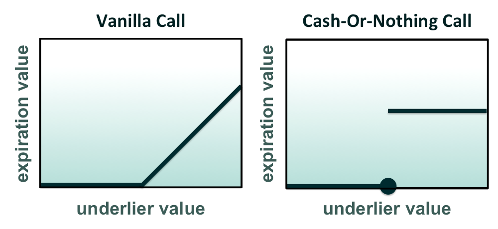

## Table of Contents

## What are Cash-Or-Nothing Call Options?

Cash-Or-Nothing Call Options are a type of exotic option where you get a fixed amount of cash if the option's price ends up above a certain level at expiration. If it doesn't, you get nothing. It's like betting on whether a stock's price will be higher than a set point by a specific date.

For example, if you buy a Cash-Or-Nothing Call Option with a strike price of $50 and a payout of $100, you will receive $100 if the stock price is above $50 when the option expires. If the stock price is $50 or below, you get nothing. These options can be useful for investors who want to take a big risk for a potentially big reward, but they can also lose all their money if the bet doesn't pay off.

## How do Cash-Or-Nothing Call Options differ from traditional call options?

Cash-Or-Nothing Call Options and traditional call options work differently. With a traditional call option, if the price of the stock goes above the strike price at expiration, you can buy the stock at the strike price. The more the stock price goes above the strike price, the more money you can make. But with a Cash-Or-Nothing Call Option, you don't get to buy the stock. Instead, if the stock price is above the strike price at expiration, you get a fixed amount of cash. If it's not above the strike price, you get nothing.

The big difference is in how you make money. With traditional call options, your potential profit can keep growing as the stock price rises. But with Cash-Or-Nothing Call Options, your profit is limited to that fixed amount of cash, no matter how high the stock price goes. This makes Cash-Or-Nothing Call Options simpler but also riskier because you either win the fixed amount or lose everything, with no in-between.

## What is the payoff structure of a Cash-Or-Nothing Call Option?

The payoff structure of a Cash-Or-Nothing Call Option is straightforward. If the price of the stock is above the strike price when the option expires, you get a fixed amount of cash. For example, if you have a Cash-Or-Nothing Call Option with a strike price of $50 and a payout of $100, you will receive $100 if the stock price is over $50 at expiration.

If the stock price is at or below the strike price when the option expires, you get nothing. There's no middle ground with these options. You either win the fixed cash amount or you lose all the money you paid for the option. This makes Cash-Or-Nothing Call Options a high-risk, high-reward type of investment.

## Can you explain the concept of a fixed payout in Cash-Or-Nothing Call Options?

A fixed payout in Cash-Or-Nothing Call Options means you get a set amount of money if the stock price is above a certain level when the option expires. For example, if you buy a Cash-Or-Nothing Call Option with a strike price of $50 and a fixed payout of $100, you will get $100 if the stock price is over $50 at the end. It's like a bet where you win a specific prize if you guess right.

The important thing about a fixed payout is that it doesn't change no matter how much higher the stock price goes above the strike price. If the stock price is $51 or $100, you still only get the $100 payout. This is different from regular call options where your profit can keep growing as the stock price rises. With Cash-Or-Nothing Call Options, you either win the fixed amount or you get nothing if the stock price is at or below the strike price.

## What are the key features that a beginner should know about Cash-Or-Nothing Call Options?

Cash-Or-Nothing Call Options are a type of investment where you bet on a stock's price being above a certain level at a specific time. If the stock price is higher than the set price when the option ends, you get a fixed amount of money. For example, if you have an option with a strike price of $50 and a payout of $100, you'll get $100 if the stock is over $50 when the option expires. But if the stock price is $50 or below, you get nothing. It's like a simple bet where you either win a set prize or lose your bet.

These options are different from regular call options because with regular options, the more the stock price goes up, the more money you can make. But with Cash-Or-Nothing Call Options, your profit is always the same fixed amount, no matter how high the stock price goes. This makes them simpler but also riskier. You could win big, but you could also lose all your money if the stock price doesn't go above the set level. It's important for beginners to understand that these options are high-risk and should be used carefully.

## How are Cash-Or-Nothing Call Options priced?

The price of a Cash-Or-Nothing Call Option is based on a few things. One big thing is how likely it is that the stock price will be above the strike price when the option ends. If it seems very likely, the option will cost more. Another thing is how long the option lasts. Longer options are usually more expensive because there's more time for the stock price to go up. Also, the size of the fixed payout matters. A bigger payout means a higher price for the option.

Another thing that affects the price is the overall ups and downs of the stock market. If the stock price moves a lot, the option might cost more because there's a bigger chance it could end up above the strike price. The price of the option is also affected by things like interest rates and how much it costs to borrow money. All these things together help figure out how much you have to pay to buy a Cash-Or-Nothing Call Option.

## What are the common uses of Cash-Or-Nothing Call Options in financial markets?

Cash-Or-Nothing Call Options are often used by investors who want to make a big bet on a stock's price going up. They might use these options if they think a stock is going to jump above a certain price by a specific date. For example, if an investor believes a company's new product will be a big hit and push the stock price up, they might buy a Cash-Or-Nothing Call Option to try to make a lot of money if they're right. It's like betting on a sports game where you win a set amount if your team wins, but you lose your bet if they don't.

These options can also be used by companies or investors who want to hedge their risks. For instance, if a company knows it will need to pay a certain amount of money in the future and wants to make sure it has enough, it might buy a Cash-Or-Nothing Call Option. If the stock price goes up, they get the fixed payout which helps them cover their costs. If the stock price doesn't go up, they don't get anything, but they also haven't lost more than what they paid for the option. It's a way to try to protect against some risks without spending too much money.

## Can you provide a simple example of how a Cash-Or-Nothing Call Option works?

Imagine you buy a Cash-Or-Nothing Call Option for a stock that's currently trading at $45. The strike price of your option is $50, and the fixed payout is $100. This means that if the stock price goes above $50 when the option expires, you will get $100. If the stock price stays at $50 or below, you get nothing. You paid $10 for this option, so you're hoping the stock price will go up and you'll make a profit.

Let's say the option expires in one month. If the stock price is $55 on the expiration date, you win and get the $100 payout. After subtracting the $10 you paid for the option, your profit is $90. But if the stock price is $48 when the option expires, you get nothing and lose the $10 you paid for the option. It's like a bet where you either win a set amount of money or lose what you paid for the bet.

## What are the risks associated with trading Cash-Or-Nothing Call Options?

Trading Cash-Or-Nothing Call Options can be risky because you could lose all the money you paid for the option if the stock price doesn't go above the strike price when the option expires. For example, if you pay $10 for an option and the stock price stays below the strike price, you get nothing back and lose the whole $10. This is different from regular call options where you might still get something back even if the stock price doesn't go up as much as you hoped.

Another risk is that these options can be hard to predict because they depend on the stock price hitting a specific level at a specific time. If the stock price is close to the strike price, it might be hard to know if you'll win or lose. Plus, the price of the option can change a lot because it's based on how likely people think it is that the stock price will go above the strike price. This means you could end up paying more for the option than it's worth if the market's guess about the stock price is wrong.

## How do market conditions affect the value of Cash-Or-Nothing Call Options?

Market conditions can have a big impact on the value of Cash-Or-Nothing Call Options. If people think the stock price is more likely to go above the strike price when the option expires, the option will be worth more. This can happen if there's good news about the company or if the overall market is doing well. On the other hand, if the market is doing badly or there's bad news about the company, people might think the stock price won't go up as much, so the option will be worth less. The time until the option expires also matters. The longer the option has before it expires, the more time there is for the stock price to go up, so the option might be worth more.

Another thing that affects the value of these options is how much the stock price moves around. If the stock price tends to change a lot, the option might be worth more because there's a bigger chance it could go above the strike price. Interest rates can also play a role. If interest rates go up, the cost of borrowing money goes up, which can affect how people value these options. All these things together help decide how much you'll have to pay for a Cash-Or-Nothing Call Option, and they can change a lot depending on what's happening in the market.

## What are some advanced strategies involving Cash-Or-Nothing Call Options?

One advanced strategy involving Cash-Or-Nothing Call Options is combining them with other options to create a spread. For example, you could buy a Cash-Or-Nothing Call Option and sell another Cash-Or-Nothing Call Option with a higher strike price. This is called a bull spread. The idea is to limit your risk while still being able to make money if the stock price goes up. If the stock price ends up between the two strike prices, you can make a profit, but it will be less than if you just bought the first option. This strategy can help you manage your risk better because you're not betting everything on one option.

Another strategy is using Cash-Or-Nothing Call Options to hedge other investments. If you own a stock and you're worried about its price going down, you could buy a Cash-Or-Nothing Call Option with a strike price above the current stock price. If the stock price goes up, you get the fixed payout from the option, which can help cover any losses from your stock going down. This way, you're not losing as much money if the stock price drops, but you can still make money if it goes up. It's like having a safety net that can also give you a bonus if things go well.

These strategies show how Cash-Or-Nothing Call Options can be used in more complex ways than just betting on a stock's price going up. They can help you manage risk and potentially make money in different market conditions. But remember, these options are still risky, and you need to understand them well before using them in advanced strategies.

## How do regulatory environments impact the trading of Cash-Or-Nothing Call Options?

The rules set by financial regulators can have a big impact on how you can trade Cash-Or-Nothing Call Options. Different countries have different rules about who can trade these options and how they can be used. Some places might only let people with a lot of experience or money trade them because they're seen as risky. Other places might have rules about how much you can buy or sell at one time, or they might require you to report your trades to make sure everything is fair and open.

Regulators also keep an eye on the companies that offer these options to make sure they're following the rules. They might check to see if the companies are being honest about the risks and costs of the options. If a company breaks the rules, the regulators can fine them or stop them from selling the options. This can affect how easy or hard it is to find and trade Cash-Or-Nothing Call Options, and it can also change how much they cost. Knowing the rules in your area is important if you want to trade these options safely and legally.

## What are Cash-or-Nothing Call Binary Options and how do they work?

Cash-or-Nothing call options are a form of binary options characterized by their binary pay-out structure. These options have a predetermined cash payout that activates when the underlying asset's price at expiration is above a specified strike price, such as a stock, index, or commodity price. 

The simplicity of Cash-or-Nothing options is highlighted by their cash-settlement nature, meaning there are no deliveries of the underlying asset upon exercise. Unlike Asset-or-Nothing options, which pay the market value of the underlying asset if the strike condition is met, Cash-or-Nothing options offer a straightforward, fixed monetary reward. This fixed payout is independent of the degree by which the asset’s price exceeds the strike price. Consequently, whether the asset beats the strike by a penny or a hundred dollars, the payout remains constant, minimizing the complexity often encountered with traditional options that vary with the magnitude of being "in the money".

To illustrate this, consider an example where an option has a strike price of $50 and a fixed payout of $100. If the price of the underlying asset is $51 at expiration, the payout is $100, not influenced by the fact that it is only $1 above the strike price. This feature provides investors with a clear, consistent risk-reward profile, because the investment yields either the full payout or nothing at all, with no scope for partial payments.

Mathematically, the payoff $P$ of a Cash-or-Nothing call option can be expressed as:

$$

P = 
\begin{cases} 
C, & \text{if } S_T > K \\
0, & \text{otherwise}
\end{cases}
$$

where $C$ is the fixed cash payout, $S_T$ is the underlying asset's price at expiry, and $K$ is the strike price.

The primary allure of Cash-or-Nothing options is their transparency and predictability, making them favored by traders interested in hedging against market [volatility](/wiki/volatility-trading-strategies) or speculating on future price movements. The binary nature of the options simplifies trading strategies by reducing the need to consider nuanced market movements and complex valuation methodologies, focusing instead on the simplicity of a predefined payoff condition.

## What are the strategies for risk management in cash-or-nothing option trading?

Risk management is a critical aspect of trading Cash-or-Nothing options due to their binary nature, which results in either a full payout or the loss of the premium. Effectively managing risk involves several key strategies:

1. **Due Diligence and Market Analysis**: Traders must conduct thorough research to understand market trends and the factors that may impact asset prices. This analysis could include technical analysis, macroeconomic indicators, and market sentiment. By staying informed about market conditions, traders can make more educated predictions about asset price movements.

2. **Diversification**: Mitigating the risks associated with binary options can be achieved through diversification across various assets. By spreading investments across different assets, traders can reduce the impact of any single asset's poor performance on the overall portfolio. This strategy helps in balancing the risks and can provide a cushion against market volatility.

3. **Capital Allocation Strategies**: It is advisable for traders to implement capital allocation strategies that prevent overexposure to any single trade or asset. This can be managed by setting a predetermined portion of the capital for each trade, often referred to as the Kelly Criterion. The formula for the Kelly Criterion is:
$$
   f^* = \frac{bp - q}{b}

$$

   where $f^*$ is the fraction of the capital to bet, $b$ is the odds received on the wager, $p$ is the probability of winning, and $q$ is the probability of losing (where $q = 1 - p$).

4. **Authentic Risk Management Strategies**: Employing genuine risk management plans can significantly enhance the predictability and reliability of trading outcomes. Techniques such as stop-loss orders, position sizing, and regular portfolio reviews contribute to reducing potential losses while capitalizing on profitable trades. 

By integrating these strategies, traders can better navigate the inherent risks of Cash-or-Nothing option trading, fostering a more secure and potentially more profitable trading experience.

## References & Further Reading

[1]: Rebonato, R. (1996). "Interest Rate Option Models: Understanding, Analysing and Using Models for Exotic Interest Rate Options." Wiley.

[2]: Hull, J. C. (2014). "Options, Futures, and Other Derivatives." Pearson Education.

[3]: Crack, T. F. (2004). "Heard on the Street: Quantitative Questions from Wall Street Job Interviews." Timothy Crack.

[4]: Wilmott, P. (2006). "Paul Wilmott Introduces Quantitative Finance." Wiley.

[5]: [Commodity Futures Trading Commission (CFTC) website](https://www.cftc.gov/) for regulatory guidelines and oversight information on options trading in the U.S.

[6]: [European Securities and Markets Authority (ESMA) website](https://www.esma.europa.eu/) for information on regulatory measures in the EU relating to digital options.

[7]: [Securities and Exchange Commission (SEC) website](https://www.sec.gov/) for updates on regulations governing binary options trading in the U.S.