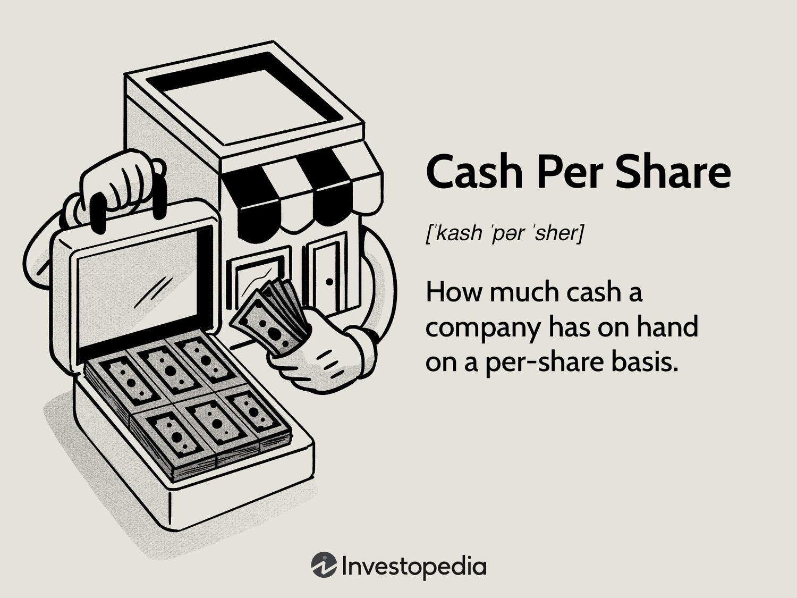

## Table of Contents

## What is Cash Per Share?

Cash per share is a financial measure that shows how much cash a company has for each of its outstanding shares of stock. It is calculated by taking the total amount of cash and cash equivalents a company has and dividing it by the total number of shares outstanding. This number can give investors an idea of how much cash is available to them if the company were to liquidate all its assets and distribute the cash to shareholders.

This measure is useful for investors who want to understand the liquidity of a company. If a company has a high cash per share, it might mean that the company is in a good financial position and has enough cash to cover its expenses and invest in new opportunities. On the other hand, a low cash per share might suggest that the company is struggling to generate cash or is using its cash for other purposes, like paying down debt or funding operations.

## How is Cash Per Share calculated?

Cash per share is figured out by dividing a company's total cash and cash equivalents by the number of its outstanding shares. Cash and cash equivalents include money in the bank, short-term investments that can be quickly turned into cash, and other liquid assets. The number of outstanding shares is the total amount of shares that the company has issued and are currently owned by shareholders.

This calculation gives investors a clear picture of how much cash is available for each share of stock they own. If a company has $1 million in cash and 100,000 shares outstanding, the cash per share would be $10. This means that if the company were to liquidate all its assets and distribute the cash equally among shareholders, each share would get $10. It's a useful measure for understanding a company's financial health and liquidity.

## Why is Cash Per Share important for investors?

Cash per share is important for investors because it shows how much cash a company has for each share of stock. This helps investors understand if a company is in a good financial position. If a company has a lot of cash per share, it might mean they can pay their bills easily, invest in new projects, or even give money back to shareholders through dividends or buying back shares.

On the other hand, if a company has a low cash per share, it might be a sign that they are struggling to make money or are using their cash for other things like paying off debts. Investors can use this information to decide if a company is a good investment. Knowing how much cash a company has per share can help investors make smarter choices about where to put their money.

## What does a high Cash Per Share indicate about a company?

A high Cash Per Share means a company has a lot of cash for each share of its stock. This is a good sign because it shows the company is doing well financially. It means the company can easily pay its bills, invest in new projects, or even give money back to shareholders through dividends or buying back shares. When investors see a high Cash Per Share, they feel more confident about the company's future because it has the cash to handle any problems that might come up.

Having a lot of cash also gives the company the freedom to make smart business decisions. They can take advantage of new opportunities, like buying other companies or starting new products, without worrying about money. This can make the company grow and become more successful. So, a high Cash Per Share is a positive sign for investors because it shows the company is strong and has a lot of potential for the future.

## How does Cash Per Share differ from Earnings Per Share?

Cash Per Share and Earnings Per Share are two different ways to look at a company's financial health. Cash Per Share tells you how much cash the company has for each share of its stock. It's calculated by taking the total amount of cash and dividing it by the number of shares. This number shows how much money the company could give to each shareholder if it decided to give out all its cash. It's useful for seeing how much cash the company has on hand and how well it can pay its bills or invest in new things.

Earnings Per Share, on the other hand, tells you how much profit the company made for each share of its stock. It's calculated by taking the company's total profit (or net income) and dividing it by the number of shares. This number shows how much money the company is making from its business activities. It's important for investors because it shows how profitable the company is. While Cash Per Share focuses on the company's cash reserves, Earnings Per Share focuses on its profitability. Both are important, but they give different information about the company's financial situation.

## Can Cash Per Share be negative, and what does that signify?

Cash Per Share cannot be negative because it's a measure of how much cash a company has for each share of its stock. If a company has no cash, the Cash Per Share would be zero, but it can't go below that. So, if you see a negative number, it's probably a mistake or a misunderstanding of the calculation.

A negative Cash Per Share doesn't make sense because it would mean the company owes more cash than it has, which isn't how the calculation works. If a company is in a bad financial situation, it might have negative cash flow or negative earnings, but not negative Cash Per Share. It's important to understand the difference because negative numbers in other financial measures can be a warning sign, but not for Cash Per Share.

## How often is Cash Per Share reported by companies?

Companies usually report Cash Per Share in their financial statements, which they share with the public every three months. This is called a quarterly report. Investors can find this information in the company's balance sheet, which shows how much cash the company has at that time.

Sometimes, companies also include Cash Per Share in their annual reports, which they release once a year. These reports give a more detailed look at the company's financial health over the whole year. By looking at both quarterly and annual reports, investors can keep track of how much cash the company has and how it changes over time.

## What are the limitations of using Cash Per Share as a financial metric?

Cash Per Share is a helpful number for investors, but it has some problems. One big problem is that it only shows how much cash a company has right now. It doesn't tell you anything about how the company is making money or if it's going to have enough cash in the future. A company might have a lot of cash today but be losing money every month. This means the cash could run out quickly.

Another issue is that Cash Per Share doesn't tell the whole story about a company's financial health. A company might have a lot of cash but also have a lot of debts. If the debts are bigger than the cash, the company could still be in trouble. Investors need to look at other numbers, like debt and earnings, to get a full picture of how the company is doing. So, while Cash Per Share is useful, it's not enough by itself to decide if a company is a good investment.

## How can Cash Per Share be used in conjunction with other financial ratios?

Cash Per Share is a good number to look at, but it's even better when you use it with other financial ratios. For example, if you look at Cash Per Share along with the Debt-to-Equity ratio, you can see how much cash the company has compared to how much it owes. This can help you understand if the company has enough money to pay its debts. Another useful ratio to use with Cash Per Share is the Current Ratio, which shows if the company can pay its short-term bills. If the company has a lot of cash per share but a low Current Ratio, it might mean the cash isn't being used to pay bills, which could be a problem.

You can also use Cash Per Share with the Price-to-Earnings (P/E) ratio. The P/E ratio tells you how much investors are willing to pay for each dollar of the company's earnings. If a company has a high Cash Per Share and a low P/E ratio, it might mean the stock is undervalued and could be a good investment. By looking at these ratios together, you get a fuller picture of the company's financial health. It's like putting together pieces of a puzzle to see the whole picture, which helps you make smarter decisions about where to invest your money.

## What trends in Cash Per Share should investors look for over time?

Investors should look for trends in Cash Per Share over time to understand how a company's financial health is changing. If Cash Per Share is going up, it's a good sign. It means the company is getting more cash and is in a better position to pay its bills, invest in new projects, or give money back to shareholders. A steady increase in Cash Per Share can show that the company is managing its money well and is likely to keep doing well in the future.

On the other hand, if Cash Per Share is going down, it could be a warning sign. It might mean the company is using up its cash faster than it's bringing in new money. This could happen if the company is losing money, paying off big debts, or spending a lot on new projects that aren't making money yet. Investors need to watch this trend closely and look at other financial numbers to see if the company is in trouble or if it's just going through a temporary rough patch.

## How do industry standards affect the interpretation of Cash Per Share?

Industry standards can change how investors see a company's Cash Per Share. Different industries have different needs for cash. For example, a tech company might need a lot of cash to invest in new technology and research, so a high Cash Per Share is good. But a grocery store might not need as much cash because it makes money more steadily, so a lower Cash Per Share might be okay. Knowing what's normal for the industry helps investors decide if a company's cash level is good or not.

Also, some industries can have big changes in how much cash they need at different times. For example, a construction company might need a lot of cash when starting a new project but less cash when the project is done. So, investors should look at how Cash Per Share changes over time and compare it to other companies in the same industry. This way, they can tell if a company is doing well with its cash or if it's falling behind.

## What advanced analytical techniques can be applied to Cash Per Share for deeper insights?

To get a deeper look at Cash Per Share, investors can use something called time series analysis. This means looking at how Cash Per Share changes over time, like over months or years. By doing this, investors can see if the company is getting better at saving cash or if it's using up its cash too fast. They can also use a technique called trend analysis to spot patterns. For example, if Cash Per Share goes up every time the company launches a new product, that could mean the new products are bringing in more money. This helps investors predict what might happen next and make smarter choices.

Another useful technique is comparing Cash Per Share to other financial ratios in a method called ratio analysis. For example, investors might look at Cash Per Share along with the company's Debt-to-Equity ratio to see if the company has enough cash to pay its debts. They could also use regression analysis to see how Cash Per Share affects other important numbers, like stock prices or earnings. By looking at these relationships, investors can understand how important cash is for the company's overall health. Using these advanced techniques helps investors get a fuller picture of the company's financial situation and make better decisions about where to put their money.

## What is Understanding Cash Per Share?

Cash Per Share (CPS) is a fundamental financial ratio that provides insights into a company's available cash relative to its shares outstanding. This metric is instrumental for investors aiming to assess a company’s liquidity and its capacity to reinvest in business operations, distribute dividends, or manage debt effectively. Calculating CPS involves dividing the total cash available on a company's balance sheet by the total number of its outstanding shares. The formula for CPS is:

$$
\text{CPS} = \frac{\text{Total Cash}}{\text{Outstanding Shares}}
$$

CPS serves as a crucial measure because it offers a clear view of how much cash is available to each shareholder, which is essential for evaluating the financial health and [liquidity](/wiki/liquidity-risk-premium) position of a company. By understanding CPS, investors can gain insights into how well a company can support its operations without additional financing, manage unexpected expenses, or capitalize on investment opportunities.

Moreover, CPS is often regarded as a more reliable indicator of financial health than Earnings Per Share (EPS). While EPS focuses on a company’s profitability, it can be influenced by non-cash items, accounting policies, or changes in capital structure. In contrast, CPS directly reflects cash reserves, making it a more straightforward measure of liquidity. This distinction is particularly important during market [volatility](/wiki/volatility-trading-strategies) or financial downturns, where actual cash availability becomes critical for business continuity.

Investors often utilize CPS to compare companies within the same industry to discover those with stronger liquidity positions. A higher CPS might indicate that a company has the cash necessary to weather economic storms, innovate, expand, or return value to shareholders through dividends or buybacks. However, a disproportionately high CPS might also signal that the company is not efficiently utilizing its cash reserves for growth or strategic activities.

In summary, CPS is a significant financial metric for assessing a company's liquidity and operational potential. It allows investors to make informed decisions by highlighting the real, tangible cash backing each share, offering an unmatched snapshot of a company’s financial stature compared to earnings-based metrics like EPS.

## What is the role of Cash Per Share in Investment Strategies?

Investors utilize Cash Per Share (CPS) to assess a company's financial viability and growth potential. The CPS metric measures liquidity by indicating how much cash a company has per share of its stock. It is calculated using the formula:

$$

\text{CPS} = \frac{\text{Total Cash}}{\text{Number of Outstanding Shares}} 
$$

A high CPS value can be an attractive indicator of a company's strong liquidity position, signifying that the company has readily available cash. This liquidity means the company can easily reinvest in new business opportunities or manage unforeseen economic challenges. Additionally, robust CPS may suggest the potential for returning cash to shareholders through dividends or share buybacks, which can be appealing to income-focused investors.

However, a high CPS value might not always be favorable. It can indicate that the company is holding excessive cash, perhaps due to a lack of strategic investment opportunities. This scenario may suggest underutilized resources, which could be perceived negatively by growth-oriented investors who prefer companies that actively reinvest earnings into growth initiatives.

To align CPS with long-term investment strategies, investors must assess the broader context of the company's operations. It's important to determine whether high cash reserves are part of a strategic plan to fuel future expansion, such as acquisitions, R&D investments, or other growth strategies. Investors should evaluate management's track record in deploying cash effectively to drive sustainable growth and shareholder value.

A balanced approach involves scrutinizing the company's strategic objectives alongside its financial metrics. By understanding how CPS fits into the larger puzzle of the company's plans and market conditions, investors can make more informed decisions that align with their long-term goals. This alignment ensures that high liquidity is effectively utilized to enhance growth prospects rather than masking inefficiencies in capital deployment.

## How can Cash Per Share be integrated with Algorithmic Trading?

Algo trading, or algorithmic trading, involves employing computer algorithms to automate and execute trades based on predetermined criteria. By incorporating financial metrics such as Cash Per Share (CPS) into these algorithmic parameters, decision-making can be significantly enhanced. This integration allows for more informed trading actions based on solid financial indicators, ultimately optimizing trade executions.

### Integrating CPS into Algo Trading

The integration of CPS into algorithmic trading systems requires a strategic approach. CPS, calculated as:

$$
\text{CPS} = \frac{\text{Total Cash}}{\text{Number of Shares Outstanding}}
$$

serves as a robust indicator of a company’s liquidity position. Applying this metric within an algorithmic framework involves setting up specific rules that match trading criteria with the liquidity status of targeted companies.

**Algorithm Optimization through Cash Flow Metrics**

By leveraging cash flow metrics such as CPS, algorithms can fine-tune their trade executions. This fine-tuning might include identifying companies with high CPS values, which may indicate strong liquidity and the potential for share buybacks or dividends, thus providing investment opportunities that align with the desired risk-reward profile.

Here's a simple example in Python, demonstrating how a trading algorithm might integrate CPS:

```python
class TradingAlgorithm:
    def __init__(self, cash_per_share_threshold):
        self.cash_per_share_threshold = cash_per_share_threshold

    def evaluate_investment(self, company_data):
        cps = company_data['total_cash'] / company_data['outstanding_shares']
        if cps > self.cash_per_share_threshold:
            return True  # Signal to buy
        else:
            return False  # Signal to hold or sell

# Example usage
company_data = {'total_cash': 5000000, 'outstanding_shares': 1000000}
algorithm = TradingAlgorithm(cash_per_share_threshold=4.5)
decision = algorithm.evaluate_investment(company_data)
```

In this hypothetical scenario, the algorithm makes a buy decision if a company’s CPS exceeds a specified threshold, signifying good liquidity and financial health.

### Case Studies

Several case studies underline the effectiveness of incorporating CPS into algo trading strategies. In one instance, a [hedge fund](/wiki/hedge-fund-trading-strategies) implemented CPS-based stochastics to refine its trading algorithms. It was observed that companies exceeding their historical CPS averages by a set margin were more likely to experience positive stock performance over the subsequent quarters. This led to an optimized portfolio that consistently outperformed market benchmarks.

Another example involves a fintech startup that developed an AI-driven trading system incorporating CPS as a key metric in its algorithms. This system detected patterns in cash flow data, predicting future price movements with notable accuracy, consequently increasing the firm’s average return on investment.

### Conclusion

Integrating Cash Per Share into algorithmic trading frameworks proves to be a powerful method for enhancing investment decisions. By focusing on cash flow metrics, algorithms can better predict and exploit market opportunities, leading to improved investment returns and empowered trading strategies.

## References & Further Reading

[1]: ["Cash Per Share: Definition, Formula, and Example"](https://www.investopedia.com/terms/c/cash-per-share.asp) by Investopedia

[2]: ["Algorithmic Trading: Winning Strategies and Their Rationale"](https://www.wiley.com/en-us/Algorithmic+Trading%3A+Winning+Strategies+and+Their+Rationale-p-9781118746912) by Ernest P. Chan

[3]: Narang, R. K. (2013). ["Inside the Black Box: A Simple Guide to Quantitative and High-Frequency Trading."](https://onlinelibrary.wiley.com/doi/book/10.1002/9781118662717) Wiley Finance

[4]: ["Machine Learning in Asset Management—Part 1: Portfolio Construction; Part 2: Return Forecasting and Alpha Models; and Part 3: Applications of Machine Learning"](https://www.cfainstitute.org/-/media/documents/book/rf-lit-review/2021/rflr-v16-n1-1.ashx) by CFA Institute

[5]: ["Backtesting Strategies with R"](https://timtrice.github.io/backtesting-strategies/) by Brett N. Steenbarger