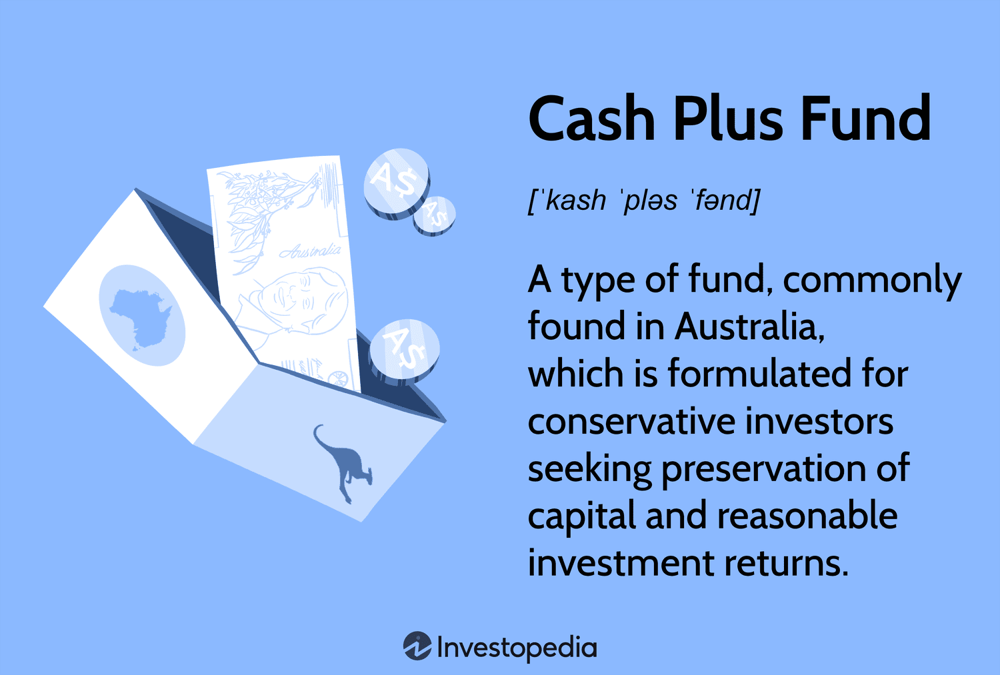

In today's dynamic financial landscape, investors are continually seeking strategies that balance potential returns and risks. The emergence of Cash Plus Funds and algorithmic trading (algo trading) are two notable trends that offer unique advantages and pose certain challenges. As technological advancements continue to reshape financial markets, these tools have gained prominence for their ability to cater to different investment philosophies and risk appetites.

Cash Plus Funds appeal to conservative investors by prioritizing capital preservation while striving to provide reasonable returns. These funds generally invest in high-yield fixed-income and money market securities, emphasizing stability and low volatility. This makes them an attractive option in volatile markets, particularly for individuals who wish to maintain liquidity without compromising their risk tolerance.



Conversely, algorithmic trading leverages computer algorithms to automatically execute trades at speeds and frequencies that are impossible for human traders. This method is particularly known for its speed, precision, and capability to handle vast volumes of securities transactions. Algo trading not only supports high-frequency trading but also minimizes the impact of human emotions, such as fear and greed, thereby lowering the risk of suboptimal trading decisions.

Understanding the merits and demerits of Cash Plus Funds and algorithmic trading is crucial for making informed investment decisions. Investors must navigate the intricate trade-offs between potential yields and inherent risks associated with each tool. This article explores the mechanics, benefits, and potential pitfalls associated with these financial instruments, providing a comprehensive guide for both novice and seasoned investors.

## Table of Contents

## Understanding Cash Plus Funds

Cash Plus Funds are investment vehicles tailored for conservative investors seeking capital preservation while earning reasonable returns. These funds are structured to minimize risk exposure by focusing on investments in high-yield fixed-income securities and money market instruments, primarily emphasizing short-term debt. 

The principal objective of Cash Plus Funds is to shield the invested capital from market volatility while generating income that surpasses standard savings accounts and traditional cash funds. By prioritizing short-maturity debt securities, these funds lessen [interest rate](/wiki/interest-rate-trading-strategies) risks, which can negatively impact long-term investments. These assets often include government bonds, corporate bonds, and certificates of deposit, each chosen for their potential to provide stable returns with minimal risk.

The distinguishing feature of Cash Plus Funds lies in their operational strategies compared to traditional cash funds. While both are low-risk investment options, Cash Plus Funds often incorporate a wider array of longer-duration securities, resulting in somewhat higher yields than pure cash funds, albeit with a marginal increase in risk. This enables investors to achieve higher returns without a significant escalation in risk, preserving the primary goal of capital protection.

In markets such as Australia, Cash Plus Funds have gained traction due to their alignment with the needs of conservative investors looking for alternatives to conventional savings products. The regulatory environment and stable economic conditions make Australia a fertile ground for these funds. The Australian market's robust financial infrastructure and regulated investment dynamics further enhance the appeal of Cash Plus Funds, supporting their growth and stability.

Overall, the strategic allocation in high-quality, short-duration debt and the careful selection of money market instruments make Cash Plus Funds an attractive option for investors focused on capital preservation and modest income. With a balanced approach to risk and reward, these funds continue to be a reliable choice for those seeking to navigate uncertain financial landscapes while safeguarding their investments.

## Advantages of Cash Plus Funds

Cash Plus Funds present several compelling advantages for investors, particularly for those seeking a conservative approach with a keen eye on cost efficiency. One of the primary benefits is their low management fees and operational expenses. By minimizing costs, these funds become more accessible to a broad range of investors, ensuring that a larger portion of returns is retained rather than eroded by high fees.

Diversification is a notable strength of Cash Plus Funds. These funds typically invest in high-quality securities across a range of sectors, mitigating the risk associated with individual asset [volatility](/wiki/volatility-trading-strategies). This diversified approach can help stabilize yields even when certain sectors or assets underperform, as gains from other investments can compensate for these losses.

Despite their shorter investment horizon compared to long-term equity funds, Cash Plus Funds can still achieve competitive long-term performance. The strategic selection of high-yield fixed-income securities and money market investments enables these funds to capitalize on income opportunities while preserving capital. Over extended periods, this approach can result in cumulative returns that rival those of riskier investments.

Lastly, Cash Plus Funds provide stable and predictable income streams, which are particularly valuable in periods of market volatility. By focusing on consistent returns, these funds reassure investors with a steady income, helping them weather economic uncertainties and maintain financial confidence. This reliability makes Cash Plus Funds a prudent choice for those who prioritize stability in their investment portfolio.

## Risks of Cash Plus Funds

Cash Plus Funds, despite their conservative nature, are not immune to risks, especially in volatile market environments. One of the primary risks is the potential for capital loss when the value of underlying securities declines. These funds primarily invest in short-term debt and high-yield fixed-income securities, which can be sensitive to market conditions.

Regulatory changes also pose a risk to Cash Plus Funds. New regulations may necessitate changes in investment strategies or force the sale of certain assets, which could adversely affect fund performance. For instance, alterations in rules governing the types of securities a fund can hold or changes in taxation laws may lead to unforeseen performance outcomes.

Furthermore, market fluctuations significantly impact the securities within Cash Plus Funds. Interest rate volatility is a critical [factor](/wiki/factor-investing); as interest rates rise, the market value of existing bonds may fall, adversely affecting the fund's overall returns. Conversely, declining interest rates can enhance bond values but may also limit future yield opportunities.

The ability of a fund to meet its investment objectives relies heavily on the skill of the fund managers to navigate these risks effectively. This often involves tactical asset allocation and adjustments in response to changing market conditions. Investors should be aware that while Cash Plus Funds aim to offer stability, the integration of short-term, higher-yield investments introduces an element of risk that requires careful management. 

Understanding these risks allows investors to better align their portfolios with their financial goals and risk tolerance, ensuring they make informed decisions about their investments in Cash Plus Funds.

## Exploring Algorithmic Trading

Algorithmic trading, often referred to as algo trading, leverages computer programs to execute trading strategies automatically based on a set of predefined rules. This approach has revolutionized financial markets by increasing the speed and precision of trade execution. In an environment where every millisecond matters, algo trading stands out by allowing trades to be executed within microseconds, thereby maximizing the potential to capitalize on fleeting market opportunities.

One of the defining characteristics of [algorithmic trading](/wiki/algorithmic-trading) is its ability to operate without human intervention, eliminating emotional biases such as fear and greed from the trading process. This is achieved through a systematic application of complex mathematical models and algorithms, which can analyze vast amounts of market data to identify optimal trading opportunities.

Algo trading encompasses a variety of strategies, each tailored to different market conditions and investment goals. Among these, high-frequency trading ([HFT](/wiki/high-frequency-trading-strategies)) is perhaps the most well-known. HFT strategies focus on executing a large number of orders at incredibly fast speeds, seeking to profit from small price discrepancies across multiple markets or financial instruments. This form of trading plays a significant role in enhancing market [liquidity](/wiki/liquidity-risk-premium).

Another popular strategy is statistical [arbitrage](/wiki/arbitrage), which exploits price differences between related securities to generate profit. This involves sophisticated statistical models to identify and capitalize on discrepancies before they are corrected by the market. Mean reversion strategies, on the other hand, are based on the expectation that asset prices will revert to their historical averages, allowing traders to identify potential overbought or oversold conditions.

Momentum-based algorithms analyze trends and determine the strength of price movements to predict future market directions. These strategies are particularly prevalent in [forex](/wiki/forex-system) and [cryptocurrency](/wiki/cryptocurrency) markets, where trends can often be more pronounced and longer-lasting.

Algorithmic trading also finds applications beyond traditional markets, gaining traction in emerging markets like cryptocurrencies, where volatility and market inefficiencies present lucrative opportunities for automated strategies. In the stock market, algo trading is used not only for speculative trades but also for executing large orders in a manner that minimizes market impact.

With advances in [machine learning](/wiki/machine-learning) and [artificial intelligence](/wiki/ai-artificial-intelligence), the sophistication and capabilities of algorithmic trading strategies continue to grow. These technologies provide algorithms with the ability to learn from data patterns, further enhancing their predictive accuracies and adaptive capabilities.

In conclusion, algorithmic trading serves as a vital tool in modern financial markets, offering speed, efficiency, and the ability to execute complex strategies seamlessly. As technology progresses, the landscape of algo trading is expected to evolve, unlocking new opportunities and challenges for traders across various markets.

## Advantages of Algo Trading

Algorithmic trading, commonly known as algo trading, offers significant advantages for investors and traders. One of the primary benefits is its ability to eliminate human emotions from trading decisions. Emotions like fear and greed can cloud judgment and lead to suboptimal investment choices. By utilizing comprehensive computer programs to execute trades, investors can ensure more systematic and consistent decision-making.

Algo trading enables the [backtesting](/wiki/backtesting) of strategies using historical data, which is crucial for predicting how a strategy might perform in different market conditions. Backtesting involves simulating a trading strategy against past market data to evaluate its effectiveness. This process helps traders fine-tune their strategies, leading to enhanced performance when applied in real-world market conditions. It can involve the use of sophisticated algorithms to find actionable patterns in data, optimizing trading strategies for better returns.

Moreover, algo trading allows for the execution of high volumes of trades at unprecedented speeds, often within microseconds. This speed advantage means that traders can capitalize on short-lived opportunities in the market, like small price discrepancies, that would be impossible to exploit with manual trading. This rapid activity enhances market liquidity, benefiting all market participants by making it easier to enter and [exit](/wiki/exit-strategy) positions without significant price impacts.

To illustrate, consider a simple Python script using historical stock data to backtest a moving average crossover strategy:

```python
import pandas as pd

def moving_average_strategy(prices, short_window, long_window):
    signals = pd.DataFrame(index=prices.index)
    signals['price'] = prices
    signals['short_mavg'] = prices.rolling(window=short_window, min_periods=1).mean()
    signals['long_mavg'] = prices.rolling(window=long_window, min_periods=1).mean()
    signals['signal'] = 0.0
    signals['signal'][short_window:] = \
        np.where(signals['short_mavg'][short_window:] > signals['long_mavg'][short_window:], 1.0, 0.0)
    signals['positions'] = signals['signal'].diff()
    return signals

# Example usage with dummy data
prices = pd.Series([100, 102, 104, 103, 105, 107, 106, 108])
signals = moving_average_strategy(prices, short_window=2, long_window=3)
print(signals)
```

The script calculates the moving averages over specified short and long windows to generate buy and sell signals. With this algorithmic method, traders can programmatically test and refine strategies before deploying them in live markets.

In summary, algorithmic trading provides clear advantages, such as emotional neutrality, strategy backtesting with historical data, and the ability to handle large trade volumes at high speed. These attributes enhance the effectiveness of trading strategies, making algo trading an appealing choice for those looking to leverage technology in modern financial markets.

## Risks and Challenges of Algo Trading

Algorithmic trading, while offering significant advantages in terms of speed and efficiency, is not without its risks and challenges. One primary concern is its inherent reliance on technology. The effectiveness of algorithmic trading systems is heavily dependent on their underlying software and hardware infrastructures. Any system failure or connectivity issue can lead to substantial financial losses. For example, a sudden technology malfunction might prevent the execution of a trade at a critical moment, possibly resulting in missed opportunities or unintended financial positions.

Initial costs and complexity represent another significant hurdle, particularly for individual investors. Developing an algorithmic trading system involves considerable investment in technology and expertise. Not only does this require initial capital outlay on computing resources but also ongoing expenses for system maintenance and upgrades. The complexity of creating effective trading algorithms can be challenging; developers must possess a deep understanding of both financial markets and programming.

Regulatory scrutiny is another important challenge facing algorithmic trading. High-frequency trading has come under increased regulatory focus due to its potential to amplify market volatility. Regulatory bodies across the globe are continuously updating their rules to ensure fair trading practices and market stability. Algorithmic traders must be diligent in updating their systems to comply with current regulations. Failure to do so can result in significant legal and financial repercussions.

Rapid changes in market conditions can also impact algorithm performance. Because these systems operate based on predefined rules, unexpected market events or changes can render them inadequate. Traders must ensure their algorithms include robust risk management protocols and adapt swiftly to market conditions. This necessitates continuous monitoring and the ability to modify algorithms quickly and efficiently to maintain their effectiveness.

To mitigate these challenges, traders can consider several strategies. Regularly testing and backtesting algorithms with historical data is crucial to identify and address potential vulnerabilities. Diversifying across various algorithms and asset classes can also reduce the risk associated with technological and market-specific issues. Moreover, maintaining a solid understanding of the regulatory environment and employing compliance checks ensures that algorithmic trading remains within legal bounds. Employing these measures can help traders mitigate the inherent risks and effectively navigate the complex landscape of algorithmic trading.

## Conclusion

Both Cash Plus Funds and algorithmic trading (algo trading) are integral to contemporary investment strategies, offering distinct advantages tailored to different investor profiles. Cash Plus Funds are particularly suited for conservative investors seeking to preserve capital while enjoying moderate returns. These funds provide a reliable mechanism to diversify portfolios with minimal exposure to high volatility assets, aligning well with investors prioritizing stability and predictability.

In contrast, algo trading represents a sophisticated approach, enabling dynamic engagement with financial markets through high-frequency and precision trading. This method capitalizes on the speed of technological advancements, allowing investors to execute a multitude of trades with minimal delay, often outperforming human capabilities in seizing market opportunities. The automation of strategies in algo trading helps eliminate emotional biases that commonly affect human decision-making, therefore enhancing the robustness of trading strategies through backtesting and optimization.

Both investment vehicles require a profound understanding of their inherent risks. Investors considering Cash Plus Funds should be mindful of potential capital loss and regulatory impacts, while those interested in algo trading must account for the technical demands and associated costs of maintaining high-performance systems. Furthermore, regulatory scrutiny and rapid market shifts continually challenge the efficacy of algorithmic strategies. 

Ultimately, successful engagement with these financial tools hinges on a clear assessment of one's risk appetite, resource availability, and investment goals. By aligning these variables, investors can strategically harness the advantages of Cash Plus Funds and algo trading to achieve their financial objectives.

## References and Further Reading

To support further exploration of Cash Plus Funds and algorithmic trading, readers are encouraged to consult a variety of primary sources and financial investment publications. These include academic papers, industry reports, and reputable financial news outlets, which provide valuable insights and data-driven analyses on these topics. Key resources that are often highlighted in discussions about Cash Plus Funds and algo trading include:

1. **Academic Journals**: Publications such as the "Journal of Financial Economics" and the "Journal of Portfolio Management" frequently cover the latest research on investment strategies, risk management, and market dynamics associated with both Cash Plus Funds and algorithmic trading.

2. **Industry Reports**: Reports from leading financial institutions like Bloomberg, Goldman Sachs, and McKinsey provide in-depth analyses and market forecasts that can enhance understanding of the current trends affecting these investment vehicles.

3. **Financial News Outlets**: Websites and platforms such as The Wall Street Journal, Financial Times, and CNBC offer up-to-date news and expert commentary on financial markets, including developments in Cash Plus Funds and algo trading technologies.

4. **Books on Investment Strategies**: Books such as "Algorithmic Trading and DMA: An Introduction to Direct Access Trading Strategies" by Barry Johnson and "Modern Portfolio Theory and Investment Analysis" by Edwin J. Elton et al. provide foundational knowledge and advanced techniques applicable to both investment tools.

5. **Online Courses and Workshops**: Platforms like Coursera, edX, and Udacity offer courses that cover quantitative finance, Python programming for trading, and risk management, catering to both beginners and advanced practitioners interested in mastering Cash Plus Funds and algorithmic trading.

Understanding the nuances of these financial tools requires continual education and staying updated with the latest market trends. Engaging with these resources ensures that investors and traders can make informed decisions and effectively navigate the evolving financial landscape.

## References & Further Reading

[1]: Elton, E. J., Gruber, M. J., Brown, S. J., & Goetzmann, W. N. (2014). ["Modern Portfolio Theory and Investment Analysis"](https://books.google.com/books/about/Modern_Portfolio_Theory_and_Investment_A.html?id=181CEAAAQBAJ). Wiley.

[2]: Johnson, B. (2010). ["Algorithmic Trading & DMA: An Introduction to Direct Access Trading Strategies"](https://archive.org/details/algorithmictradi0000john). 4Myeloma Press.

[3]: Lopez de Prado, M. (2018). ["Advances in Financial Machine Learning"](https://www.amazon.com/Advances-Financial-Machine-Learning-Marcos/dp/1119482089). Wiley.

[4]: Chan, E. (2008). ["Quantitative Trading: How to Build Your Own Algorithmic Trading Business"](https://github.com/ftvision/quant_trading_echan_book). Wiley.

[5]: Bergstra, J., Bardenet, R., Bengio, Y., & Kégl, B. (2011). ["Algorithms for Hyper-Parameter Optimization."](https://dl.acm.org/doi/10.5555/2986459.2986743) Advances in Neural Information Processing Systems, 24.

[6]: Jansen, S. (2018). ["Machine Learning for Algorithmic Trading: Predictive models to extract signals from market and alternative data for systematic trading strategies with Python"](https://github.com/stefan-jansen/machine-learning-for-trading). Packt Publishing.

[7]: Aronson, D. R. (2006). ["Evidence-Based Technical Analysis: Applying the Scientific Method and Statistical Inference to Trading Signals"](https://www.amazon.com/Evidence-Based-Technical-Analysis-Scientific-Statistical/dp/0470008741). Wiley.