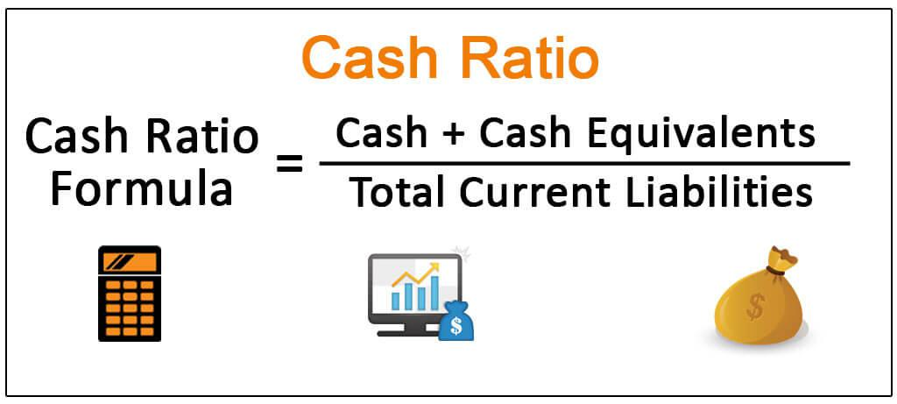

In today's rapidly evolving financial landscape, the integration of algorithmic trading, cash management, and financial ratios is essential for maximizing financial performance. The financial sector has witnessed a revolution with the advent of technology, making it imperative for businesses to adapt to these changes to remain competitive. This article explores how fundamental components such as cash position financial ratios and cash management form the backbone of modern investment strategies, including algorithmic trading.

Cash position financial ratios provide insights into the liquidity and operational efficiency of a business, serving as crucial indicators for both short-term financial health and long-term strategic planning. Companies that effectively manage their cash positions can not only meet their immediate obligations but also capitalize on emerging investment opportunities. By evaluating cash position ratios, businesses can ensure they maintain adequate liquidity, a core determinant of financial stability.



Furthermore, the role of liquidity ratios cannot be overstated. Ratios such as the current ratio and quick ratio offer a snapshot of a firm's ability to cover its short-term liabilities without the need to sell long-term assets, promoting prudent financial management. Such ratios are integral to sustaining operations, especially in times of economic uncertainty.

Algorithmic trading has reshaped the investment landscape by using sophisticated mathematical models and algorithms to execute trades with precision and speed unattainable by human traders alone. By combining algorithmic trading strategies with robust cash management practices, organizations can optimize trade executions, reduce the risk of human error, and enhance overall financial management.

Readers of this article will gain insights into optimizing cash positions, utilizing financial ratios effectively, and implementing cutting-edge algorithmic trading strategies. We will cover the importance of maintaining a strong cash position, the pivotal role liquidity ratios play, and how algorithmic trading serves as a tool to enhance financial performance and decision-making. Through these insights, businesses can better navigate the complexities of today's financial world, ensuring not only survival but growth and prosperity.

## Table of Contents

## Understanding Cash Position and its Importance

A cash position is a critical marker of an entity's liquidity, reflecting the amount of cash or cash equivalents readily available at any given time. This financial indicator is pivotal for assessing how well an organization can fulfill its short-term obligations, such as payroll, rent, or immediate supplier payments. Effective cash management practices enable organizations to maintain this liquidity, ensuring not only the ability to meet these obligations but also to leverage opportunities that may arise unexpectedly.

Managing an optimal cash position is essential for safeguarding against unforeseen expenses, such as sudden repairs, regulatory fines, or operational disruptions. It serves as a cushion that enhances an entity's creditworthiness, as lenders often favor businesses and individuals who demonstrate strong cash reserves. This is due to their perceived lower default risk, allowing these entities to secure favorable terms for loans and credit lines.

Furthermore, companies holding significant cash reserves are strategically positioned to navigate economic fluctuations and downturns efficiently. In times of uncertainty, such as recessions or market [volatility](/wiki/volatility-trading-strategies), these organizations can continue operations without the immediate need for external funding, which could be more costly or restrictive. Additionally, with ample cash, a company can capitalize on growth opportunities, such as mergers and acquisitions, investments in innovation, or expansion into new markets, without the delay of arranging external financing.

Therefore, understanding and optimizing cash positions is not just about ensuring [liquidity](/wiki/liquidity-risk-premium) for immediate needs but is also a foundational strategy for long-term stability and growth. It allows businesses to operate with agility and confidence, turning potential challenges into opportunities for development and success.

## Key Financial Ratios for Cash Management

Liquidity ratios are essential tools for assessing an entity's short-term financial health, offering a snapshot of its ability to meet immediate obligations. Among these, the current ratio and quick ratio are widely regarded for their effectiveness in cash management strategies.

The current ratio is a fundamental metric that measures the relationship between an entity's current assets and current liabilities. It is calculated using the formula:

$$
\text{Current Ratio} = \frac{\text{Current Assets}}{\text{Current Liabilities}}
$$

A current ratio greater than 1 indicates that the entity has more current assets than current liabilities, suggesting a healthy capacity to cover short-term debts. However, a ratio that is too high might imply inefficient use of resources or excessive inventory levels. Businesses often strive for a balanced current ratio to ensure both liquidity and resource optimization.

The quick ratio, also known as the acid-test ratio, refines the assessment of liquidity by excluding inventory from current assets. This ratio provides a more stringent measure of liquidity, offering insights into an entity's ability to meet short-term liabilities with its most liquid assets. The quick ratio is calculated using the formula:

$$
\text{Quick Ratio} = \frac{\text{Current Assets} - \text{Inventory}}{\text{Current Liabilities}}
$$

This ratio is particularly useful for entities whose inventories are not readily convertible to cash, indicating a more conservative assessment of their short-term financial stability.

Monitoring these liquidity ratios allows businesses to maintain adequate cash flow, critical for timely financial decision-making. These ratios enable organizations to anticipate cash shortages or surpluses and adjust their cash management strategies accordingly. Effective utilization of liquidity ratios aids in minimizing the risk of insolvency and enhancing overall financial resilience.

## Algorithmic Trading and Cash Management

Algorithmic trading involves utilizing complex mathematical models and algorithms to execute trades, thereby minimizing human error and emotional influence on decision-making. The integration of cash position strategies and financial ratios with [algorithmic trading](/wiki/algorithmic-trading) can significantly enhance market efficiency and portfolio management.

Algorithmic trading systems operate on pre-set rules and logic that allow for rapid decision-making and trade execution. This is particularly advantageous in capitalizing on fleeting market opportunities, where speed and precision are crucial. By leveraging automated systems, traders can ensure the optimal use of cash reserves, aligning closely with cash management objectives.

Cash management plays a pivotal role in supporting algorithmic trading systems by ensuring that liquidity is readily available for immediate trade execution. Effective cash management strategies involve maintaining a balance between available cash and investments, ensuring that there is enough liquidity to cover trades without disrupting operations. This balance is crucial when employing algorithms in trading, as sufficient cash flow must be maintained to take advantage of market conditions without incurring unnecessary risk.

The use of financial ratios such as the liquidity ratio strengthens this automated process. Liquidity ratios, such as the current ratio (current assets divided by current liabilities) and the quick ratio (liquid assets divided by current liabilities), provide insights into an organization's ability to meet its short-term liabilities with its liquid assets. By incorporating these ratios into algorithmic trading systems, accurate evaluations of cash positions can be made, allowing for informed decision-making that supports both trade execution and broader financial objectives.

For example, consider a Python snippet to calculate liquidity ratios:

```python
def calculate_liquidity_ratios(current_assets, liabilities, inventory):
    current_ratio = current_assets / liabilities
    quick_ratio = (current_assets - inventory) / liabilities
    return current_ratio, quick_ratio

current_assets = 1000000
liabilities = 500000
inventory = 200000

current_ratio, quick_ratio = calculate_liquidity_ratios(current_assets, liabilities, inventory)
print(f"Current Ratio: {current_ratio}, Quick Ratio: {quick_ratio}")
```

In this code, `calculate_liquidity_ratios` computes both the current and the quick ratios, assessing whether sufficient liquidity exists to support trading activities.

In summary, the integration of algorithmic trading with cash management and financial ratios provides a comprehensive framework that enhances both reactivity to market conditions and financial stability. This synergy ensures that trades are executed efficiently and cash reserves are optimized, catering to both immediate trading needs and long-term strategic goals.

## The Synergy Between Algos, Ratios, and Cash Management

Combining algorithmic trading with cash management and financial ratios creates a robust financial strategy by optimizing financial performance through informed and precise decision-making. Algorithmic trading employs mathematical models and computational algorithms, enabling rapid processing of vast amounts of data to identify and exploit market inefficiencies. By aligning these capabilities with effective cash management and financial ratios, organizations can enhance their ability to respond dynamically to market changes while safeguarding their financial stability.

One critical aspect of this synergy is the ability to optimize returns. Algorithmic trading, supported by well-managed cash positions, allows for swift allocation of funds to high-potential opportunities. Liquidity ratios, such as the current ratio and quick ratio, provide a snapshot of an organization's financial health, guiding decisions regarding cash allocation. This integration ensures that organizations maintain enough liquidity to seize opportunities without exceeding their risk thresholds.

For instance, an algorithm might include a trigger based on the quick ratio, ensuring that trades are only executed when liquidity levels are deemed safe. A Python snippet illustrating this logic could be:

```python
def execute_trade(current_assets, current_liabilities, inventory, threshold):
    quick_ratio = (current_assets - inventory) / current_liabilities
    if quick_ratio >= threshold:
        # Proceed with the algorithmic trade
        return "Trade executed"
    else:
        return "Trade not executed due to insufficient liquidity"
```

Precision in executing trades is further enhanced when supported by sophisticated risk management systems that continuously monitor liquidity conditions. The automation provided by algorithmic trading reduces the impact of human error and emotional decision-making, ensuring trades are executed based on pre-defined criteria and financial metrics.

Case studies from financial institutions demonstrate the competitive advantage achieved through this integrated approach. Firms that successfully combine algorithmic trading with cash management and financial ratios report improved profitability, reduced risks, and enhanced capital efficiency. These organizations leverage detailed analytical frameworks to synchronize trading strategies with liquidity conditions, leading to a harmonious balance between aggressive market participation and prudent financial management.

In summary, the inherent synergy between algorithmic trading, cash management, and financial ratios allows organizations to achieve optimized returns while maintaining risk control and liquidity. This integrated strategy is essential for navigating the complexities of modern financial markets, providing a sustainable path towards achieving financial objectives.

## Challenges and Considerations

While automation in financial markets offers considerable efficiency improvements, reliance on algorithms also introduces a series of challenges and considerations that need to be diligently managed. Continuous monitoring and updates are imperative due to the dynamic nature of financial markets and the rapid advancements in technology. Even the most advanced algorithms, if not updated and monitored, can become obsolete or, worse, detrimental to trading outcomes.

One major challenge is market volatility, which can significantly impact algorithmic performance. Algorithms are designed to operate under certain market conditions, and extreme volatility can disrupt their expected behavior. To mitigate such risks, firms must implement robust risk management strategies within their algorithmic frameworks. This includes setting strict stop-loss limits, diversifying trading strategies, and employing [machine learning](/wiki/machine-learning) techniques to adapt to changing market patterns.

Another critical consideration is ensuring the quality of data that drives both cash management and algorithmic trading. Poor data quality or inaccuracies in financial ratios can lead to erroneous decision-making and trading actions. Therefore, maintaining high data integrity through regular audits and validation processes is crucial. Utilizing real-time data feeds and employing data-cleaning algorithms can help ensure that the information guiding trading decisions is both precise and reliable.

Regulatory and compliance considerations also play a pivotal role in the deployment and operation of algorithmic trading systems. Automated environments must adhere to an array of regulations to avoid legal penalties and operational restrictions. Compliance with frameworks such as the Markets in Financial Instruments Directive (MiFID II) in the EU or the Dodd-Frank Act in the US requires firms to maintain transparency, audit trails, and proper documentation of their trading activities. This includes meeting requirements for best execution, transaction reporting, and ensuring market stability.

Overall, while the integration of algorithmic trading with cash management and financial ratios offers numerous benefits, it also necessitates a comprehensive understanding of potential challenges. This includes the necessity for continuous system updates, robust risk management, unwavering data integrity, and strict regulatory compliance. Successfully navigating these factors can significantly enhance the effectiveness and reliability of automated trading strategies.

## Conclusion

Integrating cash position management, financial ratios, and algorithmic trading offers significant advantages in modern financial contexts. This strategy empowers businesses to maintain optimal liquidity, ensuring they can meet short-term obligations and capitalize on unforeseen opportunities. Effective cash management forms a solid foundation for investment strategies by enabling precise allocations and enhancing creditworthiness.

By employing financial ratios like the current ratio and quick ratio, organizations gain crucial insights into their liquidity health. The current ratio, calculated as $\text{Current Ratio} = \frac{\text{Current Assets}}{\text{Current Liabilities}}$, and the quick ratio, $\text{Quick Ratio} = \frac{\text{Current Assets - Inventory}}{\text{Current Liabilities}}$, provide a clearer picture of financial standing, guiding decision-making processes.

Key to this strategy is the incorporation of algorithmic trading, which automates trade executions through sophisticated mathematical models. This reduces human error, emotional biases, and enhances the efficiency of market operations. Algorithmic trading, when coupled with robust cash management principles, allows businesses to exploit fleeting market opportunities with precision and agility.

However, the integration of these components necessitates careful planning and continuous monitoring. A profound understanding of both financial metrics and trading technologies is crucial to mitigate risks such as market volatility and data reliability. Additionally, staying abreast of regulatory and compliance requirements is vital in automated trading environments.

Overall, by strategically leveraging cash position management, financial ratios, and algorithmic trading, organizations can optimize trade execution, augment liquidity, and foster financial stability and growth. This integrated approach not only strengthens competitive advantage but also positions businesses to navigate the complexities of the financial landscape effectively.

## References & Further Reading

[1]: ["Advances in Financial Machine Learning"](https://www.amazon.com/Advances-Financial-Machine-Learning-Marcos/dp/1119482089) by Marcos Lopez de Prado

[2]: ["Evidence-Based Technical Analysis: Applying the Scientific Method and Statistical Inference to Trading Signals"](https://www.amazon.com/Evidence-Based-Technical-Analysis-Scientific-Statistical/dp/0470008741) by David Aronson

[3]: ["Machine Learning for Algorithmic Trading"](https://github.com/stefan-jansen/machine-learning-for-trading) by Stefan Jansen

[4]: ["Quantitative Trading: How to Build Your Own Algorithmic Trading Business"](https://www.amazon.com/Quantitative-Trading-Build-Algorithmic-Business/dp/1119800064) by Ernest P. Chan

[5]: ["Corporate Financial Analysis"](https://corporatefinanceinstitute.com/resources/accounting/types-of-financial-analysis/) by Patricia Dechow & Richard Sloan

[6]: ["The Evolving Role of Quantitative Methods in Finance"](https://www.cqf.com/blog/what-quantitative-finance-brief-history) by Christian Dunis, Peter W. Middleton, Andreas Karathanasopolous & Konstantinos Theofilatos