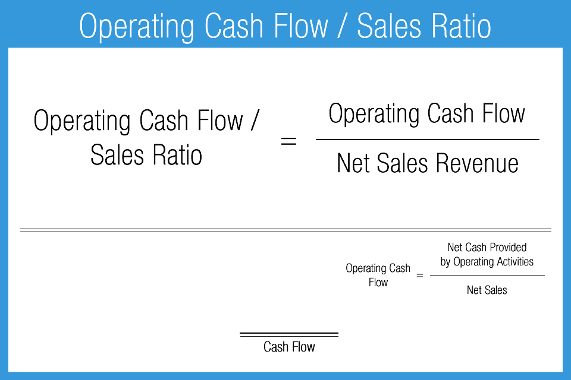

## Table of Contents

## What is cash position in financial terms?

Cash position refers to the amount of cash a company has on hand at a specific point in time. This includes physical cash, as well as money in bank accounts and other easily accessible funds. It's an important measure because it shows how well a company can pay its short-term debts and expenses.

A strong cash position means a company has enough money to cover its immediate needs, like paying employees or buying supplies. It also gives the company the flexibility to take advantage of new opportunities or handle unexpected challenges. On the other hand, a weak cash position can signal financial trouble, making it hard for the company to meet its obligations and potentially leading to more serious problems.

## Why is monitoring cash position important for a business?

Monitoring cash position is really important for a business because it helps them know if they have enough money to pay for things they need right away, like salaries, bills, and supplies. If a business keeps an eye on its cash, it can make sure it doesn't run out of money at a bad time. This is crucial because if a business can't pay its bills, it might have to borrow money at high interest rates or, in the worst case, go bankrupt.

Also, knowing the cash position helps a business plan better for the future. If they see they have extra cash, they might decide to invest in new projects or expand their business. On the flip side, if they see they're running low on cash, they can take steps to cut costs or find ways to bring in more money quickly. By keeping a close watch on their cash, businesses can make smarter decisions and avoid financial surprises.

## How can a company calculate its cash position?

To calculate its cash position, a company needs to add up all the money it has that can be used right away. This includes the cash in the cash registers, money in the bank accounts, and any other funds that can be quickly turned into cash, like money market accounts or short-term investments. By adding all these together, the company gets a total number that shows how much cash it has on hand at that moment.

This total is important because it helps the company know if it can pay for things it needs right away, like salaries and bills. If the cash position is high, the company can feel more secure and might even decide to invest in new projects or expand. But if the cash position is low, the company might need to be careful and find ways to save money or bring in more cash quickly to avoid running into financial trouble.

## What are financial ratios and why are they used?

Financial ratios are numbers that help people understand how a business is doing by comparing different parts of its financial information. They are like special tools that let you see if a company is making money, if it can pay its bills, or if it's growing. You figure out these ratios by taking numbers from the company's financial statements, like its income statement or balance sheet, and doing some simple math with them.

People use financial ratios because they make it easier to understand big and complicated financial reports. By looking at these ratios, you can quickly see if a company is doing well or if it might be in trouble. They also help compare one company to another, even if the companies are different sizes. This way, investors, managers, and other people interested in the business can make smarter decisions about where to put their money or how to run the company better.

## Can you explain the difference between liquidity ratios and solvency ratios?

Liquidity ratios and solvency ratios both help us understand a company's financial health, but they focus on different things. Liquidity ratios tell us if a company can pay its short-term bills, like salaries and supplies, with the cash and other assets it can quickly turn into cash. These ratios are important because they show if a company can keep running day-to-day without running out of money. Common [liquidity](/wiki/liquidity-risk-premium) ratios include the current ratio and the quick ratio, which compare the company's current assets to its current liabilities.

Solvency ratios, on the other hand, look at a company's long-term financial health. They help us see if a company can pay off all its debts, not just the ones due soon, over time. This is important because it shows if a company is using too much borrowed money or if it's on a solid financial footing for the future. Common solvency ratios include the debt to equity ratio and the interest coverage ratio, which compare the company's debt to its equity or its earnings to its interest expenses.

In simple terms, liquidity ratios are about the company's ability to handle short-term financial needs, while solvency ratios focus on its ability to manage long-term financial obligations. Both types of ratios are crucial for understanding a company's overall financial stability and for making informed decisions about investing in or managing the company.

## How does the cash ratio differ from the current ratio?

The cash ratio and the current ratio are both types of liquidity ratios that help us see if a company can pay its short-term bills. The main difference between them is what they count as assets that can be used to pay those bills. The current ratio looks at all the company's current assets, which are things like cash, money in the bank, inventory, and money that other people owe the company that they will pay back soon. The current ratio is calculated by dividing these current assets by the company's current liabilities, which are the bills the company needs to pay soon.

The cash ratio, on the other hand, is more strict. It only counts the most liquid assets, which means cash and money in the bank that the company can use right away. The cash ratio is calculated by dividing just these very liquid assets by the company's current liabilities. This ratio gives a more conservative view of the company's ability to pay its short-term bills because it doesn't include assets like inventory, which might take longer to turn into cash. So, while the current ratio gives a broader picture of liquidity, the cash ratio focuses on the most immediate sources of cash.

## What impact does a company's cash position have on its financial ratios?

A company's cash position can really change its financial ratios because it affects how much money the company has right away to use. For example, if a company has a lot of cash, its liquidity ratios like the cash ratio and current ratio will be higher. This makes the company look good because it shows they can easily pay their short-term bills. On the other hand, if a company doesn't have much cash, these ratios will be lower, and it might look like the company could have trouble paying what it owes soon.

The cash position also impacts solvency ratios, but in a different way. Having a lot of cash can make a company's debt to equity ratio look better because it means the company is relying less on borrowed money and more on its own cash. But, if a company is holding onto a lot of cash and not using it to pay down its debts, it might not look as good in terms of solvency. So, the cash position can make a big difference in how investors and others see the company's financial health, depending on how it's used and what ratios are being looked at.

## How can changes in cash position affect a company's operational decisions?

Changes in a company's cash position can have a big impact on its day-to-day operations. If a company has more cash, it might feel more confident to spend money on things like hiring new workers, buying new equipment, or starting new projects. This can help the company grow and improve its business. On the other hand, if the company's cash position goes down, it might need to be more careful with its spending. It might have to cut back on hiring, delay buying new things, or even stop some projects to make sure it has enough money to pay its bills.

These changes can also affect how the company plans for the future. If the cash position is strong, the company might decide to invest in new opportunities or expand into new markets. It can take risks and try new things because it has the money to back it up. But if the cash position is weak, the company might need to focus on saving money and finding ways to bring in more cash quickly. This can mean changing its plans, like focusing on selling products that bring in cash faster or looking for loans to help cover costs until things get better.

## What are some common financial ratios used to assess a company's cash position?

Financial ratios help us see how much cash a company has and if it's enough to pay its bills. One common ratio is the cash ratio, which looks at how much cash and money in the bank a company has compared to what it needs to pay soon. If the cash ratio is high, it means the company can easily pay its short-term bills. Another ratio is the current ratio, which is similar but also includes other things the company can turn into cash quickly, like inventory. A high current ratio shows the company has enough assets to cover its short-term needs, but it's not as strict as the cash ratio.

Another important ratio is the quick ratio, also known as the acid-test ratio. This ratio is like the current ratio but leaves out inventory because it might take longer to sell. The quick ratio gives a clearer picture of how well a company can pay its bills without relying on selling its products. These ratios help investors and managers see if a company is doing well with its cash or if it might run into money problems soon. By keeping an eye on these ratios, a company can make better decisions about how to spend its money and plan for the future.

## How can a company improve its cash position using financial ratios as indicators?

A company can improve its cash position by looking at financial ratios like the cash ratio, current ratio, and quick ratio. These ratios help show if the company has enough cash to pay its short-term bills. If the cash ratio is low, the company might need to find ways to bring in more cash quickly. This could mean selling off assets that aren't being used, cutting back on spending, or speeding up the collection of money that customers owe. By keeping an eye on these ratios, the company can see if its efforts to improve its cash position are working.

Another way to use these ratios is to make smart decisions about how to use the company's cash. If the current ratio and quick ratio are high, it means the company has a lot of assets that can be turned into cash quickly. The company might decide to use some of this cash to pay down debts, invest in new projects, or even buy back its own stock. By doing this, the company can improve its overall financial health and make sure it has enough cash to handle any surprises that come up. Keeping a close watch on these ratios helps the company plan better and stay on top of its cash needs.

## What are the limitations of relying solely on cash position and financial ratios for financial analysis?

Relying only on cash position and financial ratios for financial analysis can miss out on important details about a company's health. These numbers give a quick look at how much cash a company has and if it can pay its bills, but they don't tell the whole story. For example, a company might have a lot of cash right now, but if it's losing money every month, that cash won't last long. Also, financial ratios don't show things like how happy the customers are, how good the company's products are, or if there are any big risks coming up that could hurt the business.

Another problem with just looking at cash position and financial ratios is that they can be affected by things that don't really show how well the company is doing. For instance, a company might borrow a lot of money to make its cash position look better, but this could mean more debt and risk in the future. Financial ratios also don't take into account the bigger picture, like what's happening in the economy or with the company's competitors. So, while these numbers are helpful, they should be used with other information to get a full understanding of a company's financial health.

## How can advanced statistical models enhance the analysis of cash position and financial ratios?

Advanced statistical models can really help when looking at a company's cash position and financial ratios. These models can look at a lot of data at once and find patterns that might be hard to see just by looking at the numbers. For example, they can predict how the cash position might change in the future based on past trends and current conditions. This can help a company plan better and make sure it has enough money to cover its needs. Also, these models can help compare a company's financial ratios with others in the same industry, giving a clearer picture of how well the company is doing compared to its competitors.

Another way advanced statistical models help is by taking away some of the guesswork in financial analysis. They can use techniques like regression analysis to see how different factors, like sales or costs, affect the cash position and financial ratios. This can show which parts of the business are most important for keeping a good cash position. By using these models, a company can make smarter decisions about where to spend its money and how to manage its finances. Even though these models need a lot of data and some technical know-how, they can give a deeper and more accurate understanding of a company's financial health.

## What are the key financial ratios for cash management?

Liquidity ratios are essential tools for assessing an entity's short-term financial health, offering a snapshot of its ability to meet immediate obligations. Among these, the current ratio and quick ratio are widely regarded for their effectiveness in cash management strategies.

The current ratio is a fundamental metric that measures the relationship between an entity's current assets and current liabilities. It is calculated using the formula:

$$
\text{Current Ratio} = \frac{\text{Current Assets}}{\text{Current Liabilities}}
$$

A current ratio greater than 1 indicates that the entity has more current assets than current liabilities, suggesting a healthy capacity to cover short-term debts. However, a ratio that is too high might imply inefficient use of resources or excessive inventory levels. Businesses often strive for a balanced current ratio to ensure both liquidity and resource optimization.

The quick ratio, also known as the acid-test ratio, refines the assessment of liquidity by excluding inventory from current assets. This ratio provides a more stringent measure of liquidity, offering insights into an entity's ability to meet short-term liabilities with its most liquid assets. The quick ratio is calculated using the formula:

$$
\text{Quick Ratio} = \frac{\text{Current Assets} - \text{Inventory}}{\text{Current Liabilities}}
$$

This ratio is particularly useful for entities whose inventories are not readily convertible to cash, indicating a more conservative assessment of their short-term financial stability.

Monitoring these liquidity ratios allows businesses to maintain adequate cash flow, critical for timely financial decision-making. These ratios enable organizations to anticipate cash shortages or surpluses and adjust their cash management strategies accordingly. Effective utilization of liquidity ratios aids in minimizing the risk of insolvency and enhancing overall financial resilience.

## References & Further Reading

[1]: ["Advances in Financial Machine Learning"](https://www.amazon.com/Advances-Financial-Machine-Learning-Marcos/dp/1119482089) by Marcos Lopez de Prado

[2]: ["Evidence-Based Technical Analysis: Applying the Scientific Method and Statistical Inference to Trading Signals"](https://www.amazon.com/Evidence-Based-Technical-Analysis-Scientific-Statistical/dp/0470008741) by David Aronson

[3]: ["Machine Learning for Algorithmic Trading"](https://github.com/stefan-jansen/machine-learning-for-trading) by Stefan Jansen

[4]: ["Quantitative Trading: How to Build Your Own Algorithmic Trading Business"](https://www.amazon.com/Quantitative-Trading-Build-Algorithmic-Business/dp/1119800064) by Ernest P. Chan

[5]: ["Corporate Financial Analysis"](https://corporatefinanceinstitute.com/resources/accounting/types-of-financial-analysis/) by Patricia Dechow & Richard Sloan

[6]: ["The Evolving Role of Quantitative Methods in Finance"](https://www.cqf.com/blog/what-quantitative-finance-brief-history) by Christian Dunis, Peter W. Middleton, Andreas Karathanasopolous & Konstantinos Theofilatos