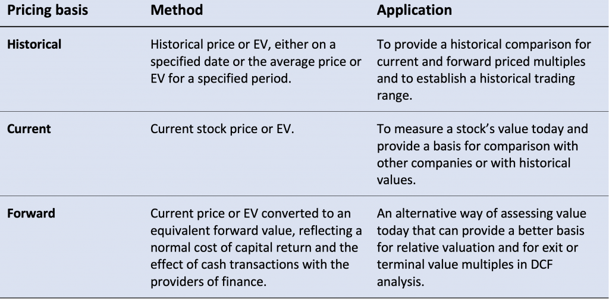

The financial landscape has witnessed a significant shift due to technological advancements, dramatically altering the utilization of pricing models. These models are essential tools for determining the value of assets in financial and commodity markets. With the advent of sophisticated algorithmic trading systems, understanding the nuances of these models has become crucial for market participants. The precision and speed offered by advanced technology allow for the application of complex models that integrate large datasets for more accurate predictions.

A critical component of this understanding is cash pricing, also known as the spot price. The spot price represents the current market value at which an asset, commodity, or currency can be bought or sold for immediate delivery. This price forms the foundation for various financial instruments and trading strategies, directly influencing futures contracts and motivating the convergence of future and spot prices in trade settlements.



Furthermore, financial comparisons play an integral role in assessing different algorithmic trading strategies. These comparisons involve analyzing various models' effectiveness, which helps in selecting the most suitable strategy based on performance metrics such as risk/reward ratios, execution speed, and adaptability. Evaluating models against historical data is a common practice to establish their reliability and effectiveness in real-time trading environments.

This article aims to provide a comprehensive understanding of pricing models, elucidate the concept of cash pricing, and offer insights into financial comparisons within the context of algorithmic trading. Understanding these elements is crucial for traders and investors navigating the evolving market landscape, where technology continues to redefine traditional trading paradigms.

## Table of Contents

## Understanding Pricing Models

Pricing models are essential tools in finance, designed to determine the selling price of goods or assets across various markets. These models facilitate the assessment of value, leveraging mathematical formulas and algorithms to enhance decision-making processes. Depending on the market or asset type, several pricing models are applied, such as those used for stocks, commodities, and derivatives.

In stock markets, pricing models like the Gordon Growth Model (GGM) and the Discounted Cash Flow (DCF) model are prevalent. The GGM, a part of the dividend discount model spectrum, assumes that dividends will increase at a constant growth rate. Its formula is expressed as:

$$
P = \frac{D_1}{r - g}
$$

where $P$ is the price of the stock, $D_1$ is the expected dividend, $r$ is the required rate of return, and $g$ is the growth rate of the dividends. The DCF model, on the other hand, discounts projected cash flows to the present value, providing a comprehensive evaluation of an asset's worth.

In commodities markets, the pricing of goods often relies on market supply and demand dynamics but can also employ models like the Cost Plus model, which calculates prices based on production costs plus a specified profit margin.

Derivatives markets employ models such as the Black-Scholes model for options pricing. This model estimates the price of European call or put options and is based on parameters like the underlying asset price, strike price, [volatility](/wiki/volatility-trading-strategies), risk-free rate, and time to expiration.

Algorithmic trading, which utilizes computer algorithms to automate trading processes, increasingly relies on sophisticated pricing models. These models incorporate large datasets and algorithms, enabling traders to execute orders at speeds unachievable by human traders. Machine learning algorithms, such as [deep learning](/wiki/deep-learning) networks, are particularly potent, given their capability to analyze historical market data and predict future price movements. Python, with its robust libraries like NumPy, pandas, and scikit-learn, serves as a popular programming language in developing and implementing these pricing models:

```python
import numpy as np
from sklearn.linear_model import LinearRegression

# Assume historical price data for a commodity
prices = np.array([100, 102, 101, 105, 107]).reshape(-1, 1)
times = np.array([1, 2, 3, 4, 5]).reshape(-1, 1)

# Linear Regression Model for Price Prediction
model = LinearRegression()
model.fit(times, prices)

# Predict future price
future_price = model.predict(np.array([[6]]))
print(f"Predicted future price: {future_price[0][0]}")
```

This Python code snippet demonstrates a simple application of linear regression to predict future prices based on historical data. While linear regression is fundamental, more complex algorithms like neural networks offer superior accuracy for modeling financial markets due to their ability to capture nonlinear relationships and adapt to market fluctuations.

Through the integration of advanced mathematical models and [machine learning](/wiki/machine-learning) techniques, pricing models provide the analytical backbone for effective asset valuation and trading strategies, supporting the increasingly quantitative landscape of modern financial markets.

## What is Cash Price?

Cash price, often referred to as the spot price, represents the current price at which an asset or commodity can be bought or sold for immediate settlement. This price is determined by the interaction of supply and demand within the market, and it fluctuates continuously as market conditions change. The cash price is essential for various market participants, including speculators, hedgers, and arbitrageurs, as it provides the most basic and immediate valuation of an asset.

Understanding cash pricing dynamics is crucial for traders, particularly those operating in spot and futures markets. In the spot market, transactions occur immediately, and goods or assets are exchanged at the cash price. For example, if an investor wishes to purchase gold and take immediate possession, they would pay the cash price. This contrasts with futures markets, where settlements are executed at a predetermined future date, typically at a price agreed upon today.

The relationship between cash prices and futures prices is intrinsic to market operations. Futures prices are essentially predictions of what the cash price of an asset or commodity will be at a future point in time. As the expiration date of a futures contract approaches, futures prices tend to converge with the cash price of the underlying asset. This convergence is a critical aspect of [arbitrage](/wiki/arbitrage) opportunities; traders can profit from price differences in cash and futures markets by buying in the cheaper market and selling in the more expensive market until equilibrium is achieved.

The arbitrage process continues until no significant price difference exists, ensuring that the futures price aligns closely with the cash price at the contract's maturity. This principle is fundamentally based on the law of one price, which suggests that in efficient markets, identical goods must have only one price. The consistent monitoring and understanding of cash prices enable traders to identify entry and [exit](/wiki/exit-strategy) points, hedge against potential risks, and optimize their trading strategies efficiently.

Mathematically, the convergence of futures and cash prices can be modeled using the equation for the cost of [carry](/wiki/carry-trading):

$$
F_t = S_t \times e^{r(T-t)}
$$

where:
- $F_t$ is the futures price at time $t$
- $S_t$ is the spot price at time $t$
- $r$ is the risk-free interest rate
- $T$ is the time to maturity of the futures contract
- $e$ represents the base of the natural logarithm

This formula considers factors such as interest rates, storage costs, and convenience yields, allowing traders to predict how futures prices will adjust relative to current cash prices under various conditions. By accurately computing and interpreting these variables, market participants can execute more informed decisions and maintain an edge in fast-paced trading environments.

## Financial Comparison in Algo Trading

Financial comparison in [algorithmic trading](/wiki/algorithmic-trading) involves evaluating different trading strategies and models to determine their effectiveness and potential profitability. This process is critical in selecting the best approach for trading in various financial markets.

Testing models against historical data, or [backtesting](/wiki/backtesting), is a foundational element in this comparison. By applying a strategy to historical data, traders can assess its potential performance under similar market conditions. Backtesting provides insights into the strategy's strengths and weaknesses and determines whether it could be profitable in the future. Python libraries like pandas and [backtrader](/wiki/backtrader) are commonly used for this purpose. For example, a simple backtest for a moving average crossover strategy might be implemented as follows:

```python
import pandas as pd
import backtrader as bt

# Define a basic moving average strategy
class MovingAverageStrategy(bt.Strategy):
    params = (("fast", 10), ("slow", 30),)

    def __init__(self):
        # Initialize moving averages
        self.fast_ma = bt.indicators.SMA(self.data.close, period=self.params.fast)
        self.slow_ma = bt.indicators.SMA(self.data.close, period=self.params.slow)
        self.crossover = bt.indicators.CrossOver(self.fast_ma, self.slow_ma)

    def next(self):
        if self.crossover > 0:  # Fast MA crosses above slow MA
            self.buy()
        elif self.crossover < 0:  # Fast MA crosses below slow MA
            self.sell()

# Load data into a dataframe
data = bt.feeds.YahooFinanceData(dataname='AAPL', fromdate=pd.Timestamp('2020-01-01'), todate=pd.Timestamp('2022-01-01'))

cerebro = bt.Cerebro()
cerebro.addstrategy(MovingAverageStrategy)
cerebro.adddata(data)
cerebro.run()
cerebro.plot()
```

Key elements compared include the risk/reward ratio, speed of execution, and adaptability of the models.

1. **Risk/Reward Ratio**: This measures the expected return of a strategy relative to the risk taken. A favorable risk/reward ratio is critical in choosing viable strategies, as it helps traders optimize returns while managing potential losses.

2. **Speed of Execution**: In algorithmic trading, the speed at which orders are executed can significantly impact profitability, especially in high-frequency trading environments. Strategies that execute trades too slowly may miss profitable opportunities or suffer from price slippage.

3. **Adaptability**: The ability of a model to adjust to changing market conditions is essential. Markets are dynamic, and strategies that cannot adapt may quickly become outdated, leading to reduced performance. Machine learning algorithms, with their ability to learn and adjust from new data, often play a crucial role in enhancing the adaptability of trading models.

Therefore, financial comparisons in algorithmic trading require rigorous evaluation of strategies to ensure they meet the desired criteria. By systematically analyzing and comparing these elements, traders can enhance their decision-making process, ultimately improving their success in the financial markets.

## Role of Machine Learning in Pricing Models

Machine learning (ML) plays a transformative role in the development of pricing models by offering advanced predictive analytics based on historical data. This capability is fundamental in financial markets where conditions evolve rapidly and unpredictably. The application of ML algorithms in asset pricing is particularly profound, with decision trees, neural networks, and support vector machines being prominent choices.

Decision trees are used to model decision-making processes in pricing. They partition the data into subsets based on the value of input features, creating a tree-like model of decisions. The logic behind decision trees is intuitive, making them an accessible choice for constructing pricing models. For example, a decision tree might evaluate market conditions and choose an adequate market price for a security depending on its characteristics.

Neural networks, inspired by the human brain's structure, consist of interconnected nodes (neurons) that can learn complex patterns from data. These models are particularly useful for identifying non-linear relationships in financial data. The power of neural networks lies in their capacity to learn representations and approximate any function, a property known as the universal approximation theorem. Consequently, they can model intricate dependencies in asset price movements that might be missed by linear models.

Support Vector Machines (SVM) classify data points by finding the hyperplane that best separates different classes. For regression tasks in finance, SVMs aim to find a hyperplane that accurately predicts continuous values such as asset prices. SVMs are particularly effective in high-dimensional spaces, making them suitable for financial data, which often involves numerous features.

One of the key advantages of ML models is their ability to adapt swiftly to changing market conditions, which is crucial in high-frequency trading. High-frequency trading necessitates rapid decision-making, often in milliseconds, and the ability of ML models to process extensive datasets and provide real-time predictions offers a competitive edge. These models continuously learn from incoming data, enabling them to adjust their strategies based on evolving market trends and anomalies.

In practice, implementing an ML-based pricing model involves several steps:

```python
import numpy as np
from sklearn.tree import DecisionTreeRegressor
from sklearn.model_selection import train_test_split
from sklearn.metrics import mean_squared_error

# synthetic dataset
np.random.seed(42)
X = np.random.rand(100, 3)  # 100 samples, 3 features
y = X @ [1.5, -2.0, 1.0] + np.random.normal(0, 0.1, 100)

# Split data
X_train, X_test, y_train, y_test = train_test_split(X, y, test_size=0.2, random_state=42)

# Decision Tree Regressor
tree = DecisionTreeRegressor()
tree.fit(X_train, y_train)

# Predict and evaluate the model
predictions = tree.predict(X_test)
mse = mean_squared_error(y_test, predictions)
print(f"Mean Squared Error: {mse:.2f}")
```

This code demonstrates a basic decision tree regressor applied to a synthetic dataset, showcasing the process of data preparation, model training, and evaluation. In a real-world scenario, the data and features would be more extensive and tailored to the specific asset or market being analyzed.

In summary, by integrating ML algorithms into pricing models, practitioners gain predictive power that can significantly enhance decision-making processes. These models are capable of capturing complex and dynamic patterns within financial data, thereby providing crucial insights that support strategy development and execution in algorithmic trading.

## Challenges and Considerations

Machine learning models offer substantial benefits in pricing algorithms, but they also come with several challenges that can hinder their effectiveness. One primary issue is data quality. Inaccurate, insufficient, or biased datasets can lead to poor model performance. For these models to generate reliable predictions, the datasets must be clean, comprehensive, and appropriately representative of the market conditions they aim to simulate. Therefore, ensuring high-quality data is a foundational step in the deployment of machine learning models in algorithmic trading. 

Another significant challenge is model transparency. Many advanced machine learning models, such as neural networks, operate as black boxes, making it difficult to understand how decisions are made. This lack of transparency can cause issues when models behave unexpectedly or when explaining model decisions to stakeholders. Emphasis should be placed on creating interpretable models or employing techniques such as feature importance and local interpretable model-agnostic explanations (LIME) to provide insights into model behavior.

Overfitting remains a common problem with machine learning models. Overfitting occurs when a model is too complex and captures noise rather than the underlying data patterns. This issue results in models that perform exceedingly well on historical data but fail when applied to new, unseen market conditions. To mitigate overfitting, techniques such as cross-validation, regularization, and pruning are employed. For instance, in Python, regularization can be implemented as follows:

```python
from sklearn.linear_model import Ridge

# Ridge regularization:
ridge_model = Ridge(alpha=1.0)  # alpha is the regularization strength
ridge_model.fit(X_train, y_train)
```

Traders must commit to continual validation and testing to ensure model accuracy and reliability. This includes conducting backtests against different datasets and market conditions to assess the robustness of the model. They should also implement retraining processes to keep models current with the latest market trends. Employing walk-forward validation is one such technique used to test the model's performance iteratively by training it on a growing dataset and testing on the most recent data:

```python
from sklearn.model_selection import TimeSeriesSplit

tscv = TimeSeriesSplit(n_splits=5)
for train_index, test_index in tscv.split(X):
    X_train, X_test = X[train_index], X[test_index]
    y_train, y_test = y[train_index], y[test_index]
    model.fit(X_train, y_train)
    predictions = model.predict(X_test)
    # Evaluate predictions
```

In summary, while machine learning models offer transformative capabilities in algorithmic trading, challenges like data quality, model transparency, and overfitting must be carefully addressed. Continuous monitoring and validation are essential to maintain the integrity and reliability of these models in dynamic market environments.

## Conclusion

The integration of advanced pricing models with a comprehensive understanding of cash prices is essential for achieving success in algorithmic trading. These models aid traders in accurately assessing market conditions, thus facilitating more informed decision-making. As technology continues to advance, particularly with the advent of machine learning, financial markets and trading strategies are undergoing significant transformation. Machine learning algorithms provide critical insights by enabling the prediction of asset pricing, leading to more effective model construction and execution.

The continuous evolution of machine learning techniques offers traders adaptive models capable of responding to rapidly changing market dynamics. This adaptability provides a competitive advantage, particularly in high-frequency trading environments where speed and accuracy are paramount. However, it is crucial for traders and investors to be vigilant regarding the challenges accompanying these advanced models, such as data quality issues, overfitting, and model transparency.

Navigating these tools and challenges effectively allows traders and investors to gain a strategic edge. By embracing technological advancements while ensuring robust validation practices, they can enhance the reliability and accuracy of their trading models. This balance of innovation and scrutiny empowers market participants to position themselves more advantageously, ultimately contributing to their success in the financial markets.

## References & Further Reading

[1]: Bergstra, J., Bardenet, R., Bengio, Y., & Kégl, B. (2011). ["Algorithms for Hyper-Parameter Optimization."](https://dl.acm.org/doi/10.5555/2986459.2986743) Advances in Neural Information Processing Systems.

[2]: ["Advances in Financial Machine Learning"](https://www.amazon.com/Advances-Financial-Machine-Learning-Marcos/dp/1119482089) by Marcos Lopez de Prado

[3]: ["Evidence-Based Technical Analysis: Applying the Scientific Method and Statistical Inference to Trading Signals"](https://books.google.com/books/about/Evidence_Based_Technical_Analysis.html?id=MeoJAQAAMAAJ) by David Aronson

[4]: ["Machine Learning for Algorithmic Trading"](https://github.com/stefan-jansen/machine-learning-for-trading) by Stefan Jansen

[5]: ["Quantitative Trading: How to Build Your Own Algorithmic Trading Business"](https://www.amazon.com/Quantitative-Trading-Build-Algorithmic-Business/dp/1119800064) by Ernest P. Chan