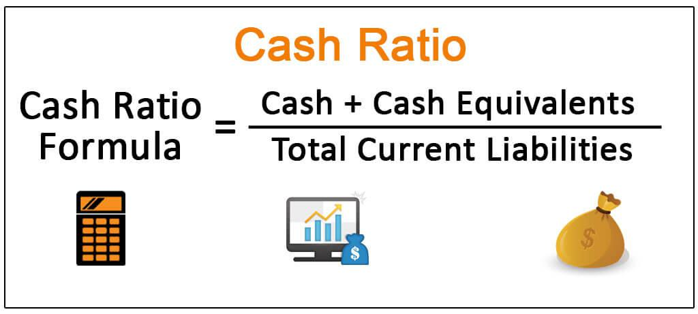

## Table of Contents

## What is the cash ratio?

The cash ratio is a measure that shows how well a company can pay off its short-term debts using only its cash and cash equivalents. It's like checking if someone has enough money in their pocket to pay what they owe right away. To find the cash ratio, you divide the company's cash and cash equivalents by its current liabilities. A higher cash ratio means the company is in a better position to pay its debts quickly.

This ratio is important because it gives a clear picture of a company's immediate financial health. If the cash ratio is high, it shows the company has a good safety net. But, if it's too high, it might mean the company is not using its cash efficiently to grow or invest. On the other hand, a low cash ratio could signal that the company might struggle to pay its debts if they come due suddenly. So, it's a useful tool for investors and managers to understand the company's liquidity and financial stability.

## How is the cash ratio calculated?

The cash ratio is calculated by dividing a company's cash and cash equivalents by its current liabilities. Cash and cash equivalents include money in the bank, currency, and short-term investments that can be quickly turned into cash. Current liabilities are the debts and obligations a company needs to pay within a year.

To find the cash ratio, you take the total amount of cash and cash equivalents and divide it by the total amount of current liabilities. For example, if a company has $50,000 in cash and cash equivalents and $100,000 in current liabilities, the cash ratio would be $50,000 divided by $100,000, which equals 0.5. This means the company has half the cash it needs to cover its short-term debts.

## What are the components of the cash ratio formula?

The cash ratio formula has two main parts: cash and cash equivalents, and current liabilities. Cash and cash equivalents are all the money a company has that it can use right away. This includes actual cash, money in bank accounts, and short-term investments that can be turned into cash quickly. Think of it like the money in your wallet or your checking account that you can spend immediately.

Current liabilities are all the bills and debts a company needs to pay within the next year. This can include things like money owed to suppliers, short-term loans, and other immediate financial obligations. When you calculate the cash ratio, you divide the total amount of cash and cash equivalents by the total amount of current liabilities. This tells you how well the company can pay off its short-term debts using just the money it has on hand.

## Why is the cash ratio important for a business?

The cash ratio is important for a business because it shows how easily the company can pay its short-term debts with the money it has right now. It's like checking if you have enough cash in your pocket to pay your bills today. If the cash ratio is high, it means the business is in a good spot and can cover its debts without any trouble. This makes investors and lenders feel more confident about the company's financial health.

However, if the cash ratio is too high, it might mean the company is not using its money wisely. Instead of keeping too much cash sitting around, the business could be investing it to grow or improve. On the flip side, a low cash ratio can be a warning sign. It might mean the company could struggle to pay its bills if they all came due at once. So, the cash ratio helps businesses and investors see if the company has a good balance of cash on hand and is managing its money well.

## How does the cash ratio differ from other liquidity ratios like the current ratio and quick ratio?

The cash ratio, current ratio, and quick ratio are all used to check a company's ability to pay its short-term debts, but they each look at different things. The cash ratio is the strictest of the three because it only considers the company's cash and cash equivalents to pay off its current liabilities. This means it only looks at the money a company has right now, like what's in the bank or in cash. It's like checking if you have enough money in your wallet to pay your bills right away.

The current ratio and quick ratio are a bit less strict. The current ratio looks at all the company's current assets, not just cash. This includes things like inventory and money owed to the company by customers. It's like seeing if you can pay your bills with everything you own that you can turn into cash within a year. The quick ratio is in between. It doesn't count inventory but includes other quick assets like money owed by customers. It's like checking if you can pay your bills with your cash and other things you can turn into cash quickly, but not with stuff you need to sell first. So, the cash ratio gives the most conservative view of a company's liquidity, while the current and quick ratios give a broader picture.

## What is considered a good cash ratio for a company?

A good cash ratio for a company depends on the industry it's in and its own financial goals. Usually, a cash ratio between 0.5 and 1 is seen as healthy. This means the company has enough cash to cover half to all of its short-term debts, which shows it's in a good position to pay what it owes.

But, what's "good" can change. Some industries need more cash on hand because they might have to pay bills quickly. Other industries might be okay with a lower cash ratio because they can turn other assets into cash fast. Also, if a company keeps too much cash, it might not be using that money to grow or invest, so a very high cash ratio isn't always the best. It's all about finding the right balance for the company's situation.

## How can a company improve its cash ratio?

A company can improve its cash ratio by increasing its cash and cash equivalents or by reducing its current liabilities. One way to boost cash is by selling off assets that aren't being used much or by collecting money owed from customers faster. Another way is by cutting down on costs, so there's more money left over at the end of the day. The company could also look for ways to make more money, like starting new projects or finding new customers.

On the other hand, reducing current liabilities can also help. This means paying off debts quicker or negotiating better terms with suppliers so bills don't have to be paid as soon as they come in. By managing debts well, the company can lower the amount it owes in the short term, which makes the cash ratio go up. It's all about balancing how much cash the company has with how much it needs to pay out soon.

## What are the limitations of using the cash ratio as a financial metric?

The cash ratio can be a bit too strict when looking at a company's health. It only counts the cash a company has right now to pay its short-term debts. But, a company might have other things it can quickly turn into cash, like money owed by customers or short-term investments. If the cash ratio is too low, it might make a company look like it's in trouble even if it can pay its bills with these other assets. Also, keeping too much cash just to have a high cash ratio might mean the company isn't using its money to grow or invest in new projects, which could be a missed opportunity.

Another thing to think about is that different industries have different needs. Some businesses need more cash on hand because they have to pay bills quickly, while others can get by with less because they can turn other assets into cash fast. So, what's a good cash ratio for one company might not be good for another. It's important to look at the whole picture and not just focus on the cash ratio alone. Using it with other financial metrics gives a better idea of how well a company is doing.

## How does the cash ratio impact a company's creditworthiness?

The cash ratio can show lenders and investors how easily a company can pay its short-term debts with the cash it has right now. If a company has a high cash ratio, it means it has a lot of cash compared to what it owes. This makes the company look more creditworthy because it seems like it can pay back loans or other debts without any trouble. Lenders feel more confident lending money to a company that has a strong cash position.

However, a very high cash ratio might also make lenders wonder if the company is using its money wisely. If a company is holding onto too much cash instead of investing it or growing the business, it might not be making the best use of its resources. On the other hand, a low cash ratio could worry lenders because it suggests the company might struggle to pay its debts quickly. So, the cash ratio is just one part of the puzzle when figuring out a company's creditworthiness. It's important to look at other financial measures too to get a full picture.

## Can the cash ratio be used to compare companies across different industries?

The cash ratio can be used to compare companies, but it's not always the best way to do it, especially across different industries. Each industry has its own way of doing things, and what's a good cash ratio for one industry might not be good for another. For example, a tech company might need less cash on hand than a retail store because it can turn other assets into cash quickly. So, when you compare companies from different industries just by looking at their cash ratios, you might not get a fair picture of how well they're doing.

It's better to look at other things along with the cash ratio to really understand a company's financial health. Things like the current ratio, quick ratio, and how the company makes money can give you a fuller picture. Also, knowing what's normal for the industry can help. So, while the cash ratio is a useful tool, it's just one piece of the puzzle when comparing companies across different industries.

## How do seasonal fluctuations affect the cash ratio?

Seasonal fluctuations can change a company's cash ratio because the amount of cash a company has and the bills it needs to pay can go up and down at different times of the year. For example, a toy store might have a lot more cash right after the holiday season because it sold a lot of toys. But, before the holidays, it might have less cash because it had to buy a lot of toys to sell. So, the cash ratio could be higher after the holidays and lower before.

This up and down can make it hard to use the cash ratio to understand how well a company is doing if you only look at one time of the year. It's better to look at the cash ratio over several seasons to see the full picture. That way, you can see if the company usually has enough cash to pay its bills, even when things change throughout the year.

## What advanced techniques can be used to analyze trends in the cash ratio over time?

To analyze trends in the cash ratio over time, one useful technique is to look at moving averages. A moving average smooths out the ups and downs you might see in the cash ratio from month to month or quarter to quarter. By calculating the average cash ratio over a set period, like three months or a year, you can see if the company's ability to pay its short-term debts with cash is getting better or worse over time. This can help you spot patterns and understand if changes in the cash ratio are just temporary or part of a bigger trend.

Another technique is to use trend analysis, where you compare the cash ratio to past periods to see how it has changed. This can involve plotting the cash ratio on a graph to see if it's going up, down, or staying the same over time. You can also look at the percentage change in the cash ratio from one period to the next to see how fast it's changing. By doing this, you can get a better sense of the company's financial health and whether its cash management is improving or if there are problems that need to be fixed.

## What are Liquidity Ratios and How Do We Understand Them?

Liquidity ratios are crucial financial metrics that assist in evaluating a company's capacity to meet its short-term liabilities with its liquid assets. These ratios are pivotal for determining a firm's financial health and operational efficiency. Among the most prevalent liquidity ratios are the current ratio, quick ratio, and cash ratio, each offering unique insights into a company's liquidity position.

The **current ratio** is calculated by dividing a company's current assets by its current liabilities. This ratio indicates how well a company can pay its short-term debts with assets that are readily convertible into cash. A higher current ratio suggests better [liquidity](/wiki/liquidity-risk-premium) and a stronger ability to pay off short-term obligations.

The **quick ratio**, or acid-test ratio, refines the current ratio by excluding inventory from current assets. It provides a more stringent measure of a company's liquidity by considering only the most liquid assets, such as cash, marketable securities, and accounts receivable. The quick ratio is calculated as follows:

$$
\text{Quick Ratio} = \frac{\text{Cash and Cash Equivalents + Marketable Securities + Accounts Receivable}}{\text{Current Liabilities}}
$$

The exclusion of inventory is based on the assumption that it may not be as readily convertible to cash in a pinch, thus offering a clearer picture of a company's immediate liquidity.

Lastly, the **cash ratio** focuses solely on cash and cash equivalents, thereby providing the most conservative picture of liquidity. This ratio assesses a company's ability to pay off its current liabilities using only its cash resources. The formula for the cash ratio is:

$$
\text{Cash Ratio} = \frac{\text{Cash and Cash Equivalents}}{\text{Current Liabilities}}
$$

Investigating these liquidity ratios allows investors and financial analysts to appraise the risk associated with a company's financial operations. A company maintaining healthy liquidity ratios generally signifies that it can sustain operations and meet obligations without requiring external financing, thereby reducing investment risk. Consequently, analyzing liquidity ratios is integral to forecasting a business's ability to uphold short-term solvency and financial stability.

## What is the Cash Ratio?

The cash ratio serves as a critical gauge of a company's liquidity, representing its capacity to settle current liabilities exclusively through cash and cash equivalents. Unlike other liquidity ratios such as the current ratio and quick ratio, the cash ratio provides a more stringent measure of liquidity, strictly focusing on the most liquid assets at a company's disposal. It is computed using the following formula:

$$
\text{Cash Ratio} = \frac{\text{Cash and Cash Equivalents}}{\text{Current Liabilities}}
$$

A cash ratio greater than 1 is indicative of a company possessing more cash than its immediate financial obligations, thereby reflecting robust liquidity. This can be an assurance of financial stability, especially in circumstances requiring immediate payments or during economic challenges. However, a high cash ratio, while beneficial for meeting short-term obligations, might suggest an under-utilization of assets. Organizations maintain cash for various reasons, but excessive reserves could imply missed opportunities for investment and growth if those funds are not effectively deployed in revenue-generating activities.

For companies, achieving an optimal cash ratio is crucial, striking a balance between having enough liquidity to cover unexpected financial needs and investing in opportunities that contribute to long-term profitability. Investors and analysts often scrutinize the cash ratio alongside other financial metrics to assess a company's operational efficiency and strategic financial management.

## What is the relationship between Algorithmic Trading and Financial Ratios?

Algorithmic trading uses computer algorithms to automate and execute trading decisions based on vast amounts of financial data and real-time market conditions. This advanced trading approach benefits from incorporating various financial metrics, such as liquidity ratios, to enhance decision-making processes and optimize trading outcomes.

Liquidity ratios, including the cash ratio, provide valuable insights into a company's financial health, assessing its ability to meet short-term obligations. When algorithmic traders integrate these ratios into their trading strategies, they gain a clearer understanding of the target companies' financial stability. This understanding allows traders to select investments that align with their risk preferences and performance goals.

The cash ratio, calculated as:

$$
\text{Cash Ratio} = \frac{\text{Cash and Cash Equivalents}}{\text{Current Liabilities}}
$$

offers a direct measure of liquidity by evaluating how well a company can cover its current liabilities using its most liquid assets. For algorithmic trading, incorporating such financial ratios can refine risk assessment models, highlighting companies with sufficient liquidity to withstand economic fluctuations or unexpected financial stress.

By utilizing liquidity ratios, [algorithmic trading](/wiki/algorithmic-trading) systems can set specific criteria that trigger buy or sell orders when certain financial health thresholds are met. For instance, a trader might program an algorithm to initiate trades only with companies exhibiting a cash ratio above a specific value, thereby prioritizing firms with strong liquidity positions.

Moreover, liquidity ratios help algorithmic traders navigate market [volatility](/wiki/volatility-trading-strategies). By gauging the financial soundness of potential investments, traders can construct portfolios that are robust against sudden market shifts. They can avoid overexposing themselves to entities with poor financial health, reducing susceptibility to external economic changes.

Furthermore, the integration of liquidity ratios streamlines the selection process for trading opportunities. Algorithms equipped with these metrics can automatically identify companies demonstrating financial resilience, enabling traders to capitalize on investment opportunities swiftly and efficiently. This capability helps maintain an edge in fast-paced and ever-evolving markets, where prompt decision-making is crucial for success.

## References & Further Reading

[1]: ["Liquidity Measures in Financial Markets"](https://www.imf.org/en/Publications/WP/Issues/2016/12/30/Measuring-Liquidity-in-Financial-Markets-16211) by CFAM Institute

[2]: ["Financial Analysis and Algorithmic Trading in Python"](https://www.freecodecamp.org/news/algorithmic-trading-in-python/) by Wiley Finance

[3]: ["Advanced Financial Risk Management: Tools and Techniques for Integrated Credit Risk and Interest Rate Risk Management"](https://www.wiley.com/en-us/Advanced+Financial+Risk+Management%3A+Tools+and+Techniques+for+Integrated+Credit+Risk+and+Interest+Rate+Risk+Managements+-p-9780470821268) by Donald R. van Deventer, Kenji Imai, and Mark Mesler

[4]: ["Liquidity Risk Measurement and Management: Basel III and Beyond"](https://www.amazon.com/Liquidity-Risk-Measurement-Management-Beyond/dp/1462892442) by Leonard Matz 

[5]: ["High-Frequency Trading: A Practical Guide to Algorithmic Strategies and Trading Systems"](https://www.ahmetbeyefendi.com/wp-content/uploads/2020/07/High-Frequency-Trading-Irene-Aldridge.pdf) by Irene Aldridge

[6]: ["Python for Finance: Analyze Big Financial Data"](https://books.google.com/books/about/Python_for_Finance.html?id=E93SBQAAQBAJ) by Yves Hilpisch
