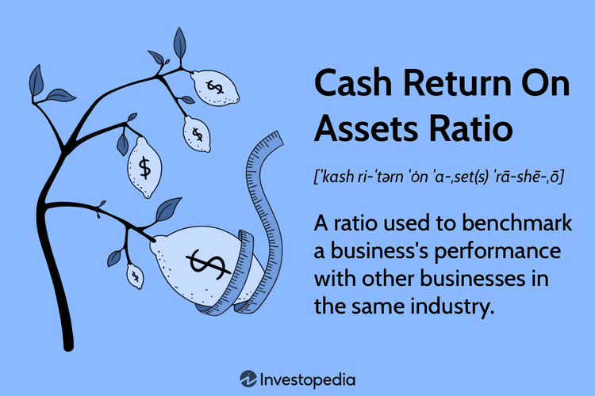

In today's fast-paced financial world, understanding the efficiency and profitability of companies is crucial for investors and financial analysts. As market dynamics become increasingly complex, financial health assessment tools are necessary for informed decision-making. One of the key financial ratios employed for this purpose is the Cash Return on Assets (CROA), a metric that measures a company's efficiency in generating cash from its assets. CROA provides insights into how well a company can convert its asset base into cash, compared to traditional profitability measures that focus on net income.

The significance of the Cash Return on Assets ratio extends beyond mere evaluation of operational efficiency. It is crucial in corporate finance for assessing asset quality and a company's ability to maintain liquidity. In today's data-driven investment landscape, CROA is also finding application in algorithmic trading as a critical input for automated trading strategies. By incorporating CROA into trading algorithms, investors can potentially enhance their investment strategies, focusing on companies with superior cash-flow generation capabilities.



This article will explore the multifaceted applications of CROA, highlighting its place in financial analysis by comparing it to traditional financial ratios. Through this comprehensive understanding, investors and financial experts can better leverage CROA in their analytical frameworks, paving the way for more informed investment decisions.

## Table of Contents

## Understanding Cash Return on Assets Ratio

The Cash Return on Assets (CROA) ratio serves as a critical financial metric that helps evaluate a company's efficiency in generating cash flows from its asset base. This ratio provides a quantitative measurement of how effectively a company can convert its asset investments into cash, which is vital for both short-term liquidity and long-term financial stability.

Mathematically, CROA is computed using the formula:

$$
\text{CROA} = \frac{\text{Operating Cash Flow}}{\text{Average Total Assets}}
$$

Where:

- **Operating Cash Flow** is the total cash generated by the core business operations of a company, exclusive of capital investments and financing activities.
- **Average Total Assets** is assessed by calculating the mean of the asset balances at the beginning and end of a financial reporting period. This computes the average amount of assets employed during the period.

Understanding CROA is essential for investors as it offers insight into a company's operational efficiency, notably its proficiency in converting its assets into cash. This metric provides a clearer image of financial health than earnings alone because it emphasizes [liquidity](/wiki/liquidity-risk-premium) and cash flow, which are critical for meeting obligations and funding future growth.

For financial analysts and investors, CROA aids in differentiating between companies with tangible growth prospects and those that primarily show accounting profits without substantial cash generation. A high CROA suggests that a company is efficient in its use of assets to generate cash, which can make it more attractive for investment. In contrast, a lower CROA might indicate inefficiencies that could warrant further investigation.

## Importance of CROA in Corporate Finance

Cash Return on Assets (CROA) plays a significant role in corporate finance by providing insights into a company’s cash-generating capabilities and operational efficiency. This ratio helps determine the quality of a company's assets and their ability to be converted into cash, which is crucial for liquidity management and making informed investment decisions. For investors and analysts, assessing how efficiently a company generates cash from its assets allows a clearer understanding of its financial health and operational performance.

CROA is calculated using the formula:

$$
\text{CROA} = \frac{\text{Operating Cash Flow}}{\text{Average Total Assets}}
$$

A higher CROA indicates enhanced efficiency in generating cash, making the company a more attractive investment. This is because a better cash flow generation enhances a firm’s ability to finance operations, invest in new opportunities, and return value to shareholders without relying heavily on external funding sources.

Efficient cash conversion is particularly beneficial during economic downturns or times of financial distress. A company with a strong CROA can maintain operational stability due to its intrinsic ability to generate cash, thus avoiding potential liquidity crises. This operational resilience makes companies with high CROA more appealing to investors looking for stable returns in volatile markets.

In summary, CROA is an essential tool in corporate finance that helps stakeholders assess and compare the intrinsic cash-generating efficiency of different companies, fostering enhanced investment decisions and contributing to a more detailed evaluation of financial stability.

## Comparing ROA and CROA

Return on Assets (ROA) and Cash Return on Assets (CROA) are two key financial ratios that serve distinct purposes in evaluating a company's financial performance. ROA is widely used to determine how efficiently a company is able to generate net income from its total assets. It is calculated with the formula:

$$
\text{ROA} = \frac{\text{Net Income}}{\text{Average Total Assets}}
$$

In contrast, CROA focuses on a company's ability to convert its assets into cash flow, providing a measure of cash generation efficiency. It is computed as:

$$
\text{CROA} = \frac{\text{Operating Cash Flow}}{\text{Average Total Assets}}
$$

The primary distinction between these two ratios lies in their approach to measuring a company's performance. ROA emphasizes profitability by reflecting the net income or profit generated from assets. This ratio is crucial for assessing the overall profitability of a company and serves as a key metric for investors seeking to understand the potential return on their investment in terms of profit.

On the other hand, CROA sheds light on the liquidity and cash-flow health of a company, focusing on the cash that is actually generated from its operational activities. This is particularly important in understanding a company's ability to meet its financial obligations and invest in new opportunities without relying on external financing. A high CROA may indicate robust cash generation capabilities, which can play a critical role during periods of economic uncertainty or tight credit conditions.

By analyzing both ROA and CROA, investors and financial analysts can obtain a more comprehensive understanding of a company's financial health. For instance, a company might have a high ROA, signaling strong profitability, yet a low CROA could suggest issues with cash flow management or higher accruals, which could impact its long-term solvency.

These discrepancies between the two ratios can uncover potential areas for improvement such as cash flow management, operational efficiency, or changes needed in the investment strategy. In summary, while ROA provides insights on profit-generation potential, CROA offers a deeper examination of cash generation, allowing stakeholders to make more informed decisions regarding a company's financial standing.

## Application in Algorithmic Trading

Algorithmic trading employs mathematical models and computational algorithms to execute trades automatically, often at speeds and frequencies beyond human capability. A critical component in these algorithms is the use of financial ratios, which help determine the viability and attractiveness of investment opportunities. The Cash Return on Assets (CROA) ratio, focusing on a company’s cash-generating ability, serves as an essential indicator in this context.

CROA's emphasis on cash generation makes it an invaluable input for [algorithmic trading](/wiki/algorithmic-trading) strategies. By concentrating on cash flows rather than accounting profits, CROA provides a more stable and intrinsic measure of a company's operational effectiveness. This stability is particularly advantageous in algorithmic trading, where dynamic and responsive strategies are crucial. The logic follows that companies with higher CROA ratios are potentially more resilient and financially sound, attributes attractive for stable and profitable trading algorithms.

Algorithms structured around CROA can identify companies exhibiting superior cash flow efficiency and resilience to economic fluctuations. This is especially pertinent in volatile markets, where cash flow reliability can be a predictor of long-term viability. Traders could implement strategies that prioritize companies with robust CROA ratings, thus incorporating a measure of inherent financial health that traditional profit-focused ratios might overlook.

For example, a trading algorithm can be designed in Python to filter and rank companies based on their CROA:

```python
import pandas as pd

# Sample data of companies with their Operating Cash Flow and Average Total Assets
data = {
    'Company': ['A', 'B', 'C'],
    'Operating Cash Flow': [500000, 750000, 250000],
    'Average Total Assets': [2000000, 3000000, 1000000]
}

# Create a DataFrame
df = pd.DataFrame(data)

# Calculate CROA
df['CROA'] = df['Operating Cash Flow'] / df['Average Total Assets']

# Sort companies by CROA in descending order
df_sorted = df.sort_values(by='CROA', ascending=False)

print(df_sorted)
```

This code snippet demonstrates how algorithmic traders can target investments by identifying companies with the highest cash flow efficiency, as indicated by CROA. Algorithms could rank these companies, [factor](/wiki/factor-investing) in market conditions, and then execute trades based on the enhanced cash flow prospects.

In conclusion, integrating CROA into algorithmic trading frameworks can improve the robustness of trading strategies by emphasizing core cash-generative capabilities. This approach supports the development of resilient and effective trading systems, capable of navigating diverse financial environments while focusing on sustainable cash flow creation.

## Example of Cash Return on Assets Calculation

To calculate the Cash Return on Assets (CROA), we use a straightforward formula that links a company's operating cash flow to its average total assets. Specifically, the CROA is calculated as follows:

$$
\text{CROA} = \left( \frac{\text{Operating Cash Flow}}{\text{Average Total Assets}} \right) \times 100\%
$$

Consider a practical example: Assume a company reports an operating cash flow of $500,000 and its average total assets amount to $2,000,000. By applying the formula, the CROA is determined as:

$$
\text{CROA} = \left( \frac{500,000}{2,000,000} \right) \times 100\% = 25\%
$$

This calculation suggests that for every dollar of assets, the company generates $0.25 in cash, highlighting its efficiency in converting assets into cash.

Analyzing such examples offers valuable insights into the operational cash effectiveness of companies. A CROA of 25% is an indicator of strong cash flow generation relative to the value of total assets, often making such a company attractive to investors focused on cash efficiency. It reflects not only the company's ability to maintain liquidity but also signals potential for reinvestment and growth.

## Conclusion

The Cash Return on Assets (CROA) ratio is a crucial metric that provides insights into a company's ability to generate cash from its assets. This evaluation of cash flow efficiency is particularly useful for investors and financial analysts seeking to understand the operational strength of a company beyond traditional profit-based measures. By focusing on cash generation, CROA offers a clear lens into the liquidity status and financial resilience of a business.

Incorporating CROA into financial analysis allows stakeholders to make more informed investment decisions. This ratio becomes particularly valuable in algorithmic trading, where precise input is critical for the development of robust trading strategies. By identifying companies that excel in converting their asset base into cash, algorithmic systems can potentially enhance portfolio performance through the selection of firms with superior cash flow dynamics.

The use of CROA complements traditional financial analysis, offering a detailed picture of financial health that goes beyond net income figures. While profitability remains an essential indicator, the emphasis on cash flows highlighted by CROA provides a more nuanced understanding of a company's operational efficiency. This comprehensive perspective aids in evaluating the true viability of a firm's financial strategies and long-term sustainability.

Overall, the Cash Return on Assets ratio is an indispensable tool for modern financial analysis. Its focus on cash efficiency furnishes investors and analysts with valuable insights, supporting the development of informed investment strategies and enhancing the broader understanding of a company's financial architecture.

## References & Further Reading

[1]: Bergstra, J., Bardenet, R., Bengio, Y., & Kégl, B. (2011). ["Algorithms for Hyper-Parameter Optimization."](https://papers.nips.cc/paper/4443-algorithms-for-hyper-parameter-optimization) Advances in Neural Information Processing Systems 24.

[2]: ["Advances in Financial Machine Learning"](https://www.amazon.com/Advances-Financial-Machine-Learning-Marcos/dp/1119482089) by Marcos Lopez de Prado

[3]: ["Evidence-Based Technical Analysis: Applying the Scientific Method and Statistical Inference to Trading Signals"](https://www.amazon.com/Evidence-Based-Technical-Analysis-Scientific-Statistical/dp/0470008741) by David Aronson

[4]: ["Machine Learning for Algorithmic Trading"](https://github.com/stefan-jansen/machine-learning-for-trading) by Stefan Jansen

[5]: ["Quantitative Trading: How to Build Your Own Algorithmic Trading Business"](https://www.amazon.com/Quantitative-Trading-Build-Algorithmic-Business/dp/1119800064) by Ernest P. Chan