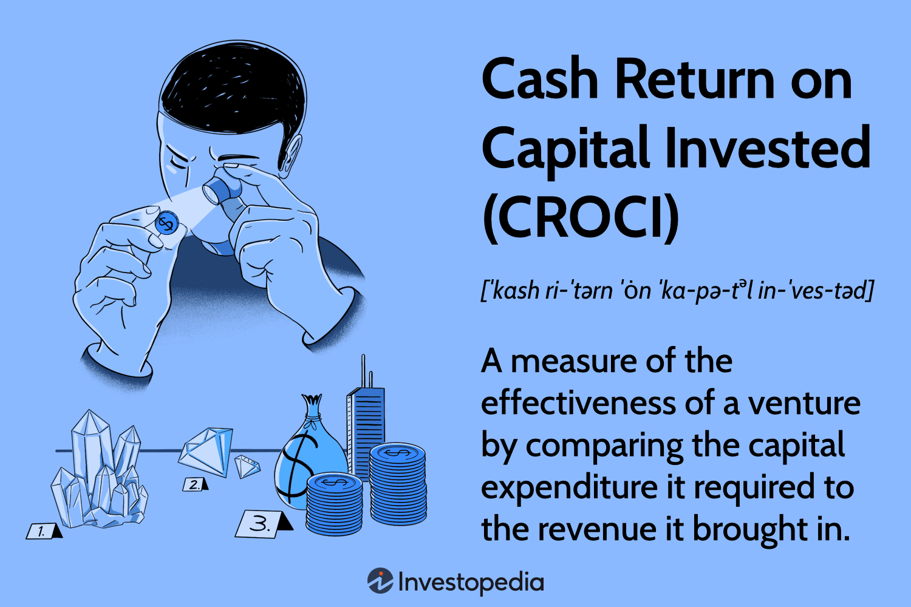

## Table of Contents

## What is Cash Return on Capital Invested (CROCI)?

Cash Return on Capital Invested (CROCI) is a financial metric that helps investors understand how well a company is using its money to make profits. It looks at the cash profits a company makes and compares it to the total amount of capital, or money, that has been invested in the business. This gives investors an idea of how efficiently a company is turning the money it has into more money.

CROCI is useful because it focuses on cash, which is harder to manipulate than other accounting figures. By using cash profits, CROCI provides a clearer picture of a company's performance. Investors can use this information to compare different companies and see which ones are better at using their investments to generate cash returns. This can help them make smarter decisions about where to put their money.

## How is CROCI calculated?

To calculate Cash Return on Capital Invested (CROCI), you start by figuring out the cash profits a company makes. This is usually found by looking at the company's cash flow statement, where you can see the money coming in from the business's operations. You want to focus on the cash flow from operations because it shows how much cash the company is actually generating from its core business activities.

Next, you need to know the total capital invested in the company. This includes all the money that has been put into the business, like money from shareholders and any long-term debt. Once you have these two numbers, you divide the cash profits by the total capital invested. The result is the CROCI, which you can then turn into a percentage by multiplying by 100. This percentage tells you how much cash return the company is getting for every dollar invested.

## Why is CROCI important for investors?

CROCI is important for investors because it helps them see how good a company is at making money from the cash it has. By looking at the cash profits instead of just profits on paper, investors get a clearer picture of how well a company is doing. This is useful because cash is real money that can be used to pay for things like growing the business or paying back loans. When investors know the CROCI, they can compare different companies and see which ones are better at turning their investments into cash.

This helps investors make smarter choices about where to put their money. If a company has a high CROCI, it means they are using their money well to make more cash. This can be a sign that the company is a good investment. On the other hand, a low CROCI might mean the company is not using its money effectively, which could be a warning sign for investors. By using CROCI, investors can find companies that are likely to give them a good return on their investment.

## How does CROCI differ from other return metrics like ROE or ROIC?

CROCI, or Cash Return on Capital Invested, focuses on the cash profits a company makes compared to the total money invested in the business. This is different from Return on Equity (ROE), which looks at the profit a company makes compared to the money shareholders have put in. ROE uses net income, which can be affected by accounting rules and might not show the real cash the company is making. CROCI, on the other hand, uses cash flow from operations, which is harder to change and gives a clearer picture of how well a company is doing.

Another common metric is Return on Invested Capital (ROIC), which looks at the profit a company makes compared to all the money invested, including both debt and equity. Like ROE, ROIC uses net income, which can be influenced by accounting practices. CROCI stands out because it focuses on cash, making it a more reliable measure of a company's efficiency in using its capital to generate cash returns. This focus on cash helps investors see the real performance of a company, making CROCI a valuable tool for investment decisions.

## Can you provide an example of how to calculate CROCI for a company?

Let's say we want to calculate CROCI for a company called "TechCo." First, we need to find out how much cash TechCo made from its operations. We look at their cash flow statement and see that they made $50 million in cash flow from operations last year. This is the cash profit we'll use for our calculation.

Next, we need to know how much money has been invested in TechCo. This includes money from shareholders and any long-term debt the company has. Let's say the total capital invested in TechCo is $250 million. To find the CROCI, we divide the cash profit by the total capital invested. So, we do $50 million divided by $250 million, which gives us 0.2. When we turn this into a percentage by multiplying by 100, we get a CROCI of 20%. This means for every dollar invested in TechCo, they are making 20 cents in cash returns.

## What are the key components that affect CROCI?

The main things that affect CROCI are the cash profits a company makes and the total amount of money invested in the business. Cash profits come from the money a company earns from its main business activities, like selling products or services. This is shown in the cash flow statement as "cash flow from operations." If a company can make more cash from its operations, its CROCI will go up because it's getting more return on the money it has invested.

The total amount of money invested in the company, or capital, includes money from shareholders and any long-term debt. If a company needs to borrow more money or get more investment to grow, this can increase the total capital invested. This might make the CROCI go down if the cash profits don't grow enough to keep up with the increase in capital. So, to keep a high CROCI, a company needs to find a good balance between making more cash and managing the money it has invested wisely.

## How can a company improve its CROCI?

A company can improve its CROCI by making more cash from its main business activities. This means they need to sell more products or services and make sure they are getting paid quickly. They can do this by finding new customers, making their products better, or figuring out ways to cut costs. If the company can make more cash without spending a lot more money, their CROCI will go up because they are getting a better return on the money they have already invested.

Another way to improve CROCI is by being smart about the money they have invested. This means not borrowing too much money or getting too much investment if it's not needed. If a company can use the money it already has more effectively, it can improve its CROCI. For example, they might sell off parts of the business that are not making much money and use that money to focus on parts that are doing better. By balancing how they make more cash and how they manage their investments, a company can make its CROCI higher.

## What are the limitations or potential pitfalls of using CROCI as a performance metric?

One limitation of using CROCI is that it focuses only on cash profits, which might not tell the whole story about a company's performance. Sometimes, a company might have good cash flow but still be struggling with other important things like paying off debts or investing in new projects. Also, CROCI doesn't consider how a company's profits might change in the future. If a company is making a lot of cash now but its business is shrinking, CROCI might make it look better than it really is.

Another potential pitfall is that CROCI can be affected by how a company manages its money. For example, if a company delays paying its bills to make its cash flow look better, this can make its CROCI look higher than it should be. This means investors need to look at other things too, like how the company is doing overall and what its plans are for the future. Relying only on CROCI might lead to missing important details about a company's health and growth potential.

## How does CROCI relate to a company's valuation?

CROCI can help investors figure out how much a company is worth by showing how well it uses its money to make cash. If a company has a high CROCI, it means it's good at turning the money it has into more money. This can make the company seem more valuable because it's using its money well. Investors might be willing to pay more for a company that has a high CROCI because they think it will keep making good returns on their investment.

But CROCI is just one piece of the puzzle when it comes to figuring out a company's value. It doesn't tell you everything about the company's future or how it's doing in other ways. For example, a company might have a high CROCI now, but if it's losing customers or facing big problems, its value might not be as high as the CROCI suggests. So, investors need to look at other things too, like the company's growth plans and how it's doing compared to other companies, to get a full picture of its value.

## What industries typically have higher CROCI, and why?

Some industries usually have higher CROCI because they are good at making money from the cash they have. For example, technology companies often have high CROCI because they can sell software or digital services without needing to spend a lot on things like factories or raw materials. Once they create a product, it can be sold to many people without much extra cost, which means they can make a lot of cash from their investments.

Another industry that often has high CROCI is the consumer goods sector, especially companies that make popular brands. These companies can charge more for their products because people want them, and this helps them make more cash from their operations. They also know how to manage their money well, like spending on advertising to keep their brands strong, which helps keep their CROCI high.

## How can CROCI be used in conjunction with other financial metrics for a more comprehensive analysis?

CROCI can be used with other financial metrics to give a fuller picture of a company's health. For example, if you look at CROCI along with Return on Equity (ROE), you can see both how well a company is using its cash and how it's doing with the money shareholders have put in. ROE might show profits on paper, but CROCI tells you about real cash, so together they help you understand if the company's profits are solid or if they might be affected by accounting tricks. Another useful metric to use with CROCI is Return on Invested Capital (ROIC), which looks at all the money put into the company, including debt. By comparing CROCI and ROIC, you can see if the company is good at making cash from all its investments, not just the money from shareholders.

Using CROCI with other metrics like debt ratios and growth rates can also help. Debt ratios tell you how much money a company owes, which is important because too much debt can hurt a company's ability to make cash. If a company has a high CROCI but also a lot of debt, it might not be as healthy as it looks. Growth rates show how fast a company is getting bigger, which is good to know because a company with a high CROCI might not be growing fast enough to keep making good returns in the future. By looking at all these metrics together, you get a better idea of whether a company is a good investment or if there are risks you should be worried about.

## What advanced techniques can be used to adjust CROCI for more accurate comparisons across different companies or industries?

To make CROCI more useful for comparing different companies or industries, you can use a few advanced techniques. One way is to adjust for different accounting practices. Companies in different countries or industries might use different rules to report their money, which can make CROCI look different even if the companies are doing the same thing. By making adjustments to put all companies on the same accounting rules, you can get a fairer comparison. Another technique is to look at the economic life of the company's assets. Some industries, like tech, have assets that don't last as long as others, like utilities. If you adjust CROCI to take into account how long the assets will be useful, you can see how well a company is doing with the money it has now, not just how long its stuff will last.

Another important adjustment is to consider the different levels of risk in different industries. Some businesses, like banks, might have higher CROCI because they take more risks, while others, like grocery stores, might have lower CROCI because they are safer. By adjusting CROCI to account for risk, you can see how well a company is doing compared to others in its industry, not just compared to all companies everywhere. These adjustments help make CROCI a better tool for investors to understand how well a company is really using its money, no matter what industry it's in or where it's located.

## What is CROCI and how can it be understood?

CROCI, or Cash Return on Capital Invested, is an important financial metric for assessing a company's cash profitability in relation to its invested capital. This metric is particularly valued for its emphasis on cash flows, distinguishing it from other commonly used return metrics such as Return on Equity (ROE) or Return on Invested Capital (ROIC). While ROE and ROIC often rely on accrual accounting measures, which may include non-cash items such as depreciation and amortization, CROCI prioritizes liquid, cash-based earnings, offering a more authentic perspective on a company's financial viability.

The formula used to calculate CROCI is as follows:

$$
\text{CROCI} = \frac{\text{EBITDA}}{\text{Total Capital}}
$$

where EBITDA stands for Earnings Before Interest, Taxes, Depreciation, and Amortization. Total Capital includes both equity and long-term debt. This formula effectively quantifies the efficiency with which a company generates cash earnings from its capital base.

EBITDA, as a proxy for cash earnings, mitigates distortions caused by variations in depreciation policies or tax regimes, providing a clearer picture of operational performance. By using EBITDA, CROCI negates fictitious elements that might otherwise present a misleading image of profitability. The denominator, Total Capital, reflects all long-term financial resources deployed by a company. This aggregation includes equity, representing owners' stake in the enterprise, and long-term debt, reflecting borrowed funds with a maturity extending beyond one year.

Ultimately, CROCI is designed to gauge the efficacy of a company's capital utilization in generating cash flows, facilitating more robust financial analysis and comparison across companies with different structures and accounting practices. By focusing on cash return rather than accounting profits, CROCI offers investors an insightful metric to assess the true economic profitability of their investments.

## What is the Methodology and Formula?

Calculating Cash Return on Capital Invested (CROCI) requires a precise methodology to ensure the metric accurately reflects a company's cash profitability relative to its invested capital. The process involves several steps, including determining cash flow, adjusting for non-cash charges such as depreciation and amortization, and calculating the economic book value of the invested capital.

To begin with, the primary focus is on cash flow, specifically Earnings Before Interest, Taxes, Depreciation, and Amortization (EBITDA). EBITDA is preferred because it excludes non-cash expenses, providing a clearer indication of a company's cash-generating ability. The formula for CROCI can be expressed as:

$$
\text{CROCI} = \frac{\text{EBITDA}}{\text{Economic Book Value of Capital}}
$$

The Economic Book Value of Capital includes both equity and long-term debt, reflecting the total invested capital a company uses to generate returns. It is crucial to make several adjustments to ensure consistency and comparability across different firms. These adjustments account for variations in accounting methods, such as different depreciation schedules or varying treatment of amortization. This alignment is essential as it allows for equivalent appraisal of companies operating under diverse accounting regulations.

Moreover, understanding the underlying assumptions of CROCI calculations is vital. Different industries and geographic locations might have varying approaches to financial reporting, which can influence key figures like EBITDA and the book value of capital. For example, companies may adopt different valuation standards for assets, leading to discrepancies in reported capital values.

To ensure accurate comparisons, analysts often standardize these differences where possible. This may involve normalizing certain financial inputs to align with commonly accepted accounting standards or making sector-specific adjustments if required. Adjustments might include excluding one-off revenues or expenses, which can distort the true cash profitability of an enterprise.

In summary, calculating CROCI involves a systematic approach to adjust cash flows and capital values for comparability. Being aware of these nuances ensures that CROCI remains a useful tool for evaluating a company's efficiency in generating cash returns from its invested capital across various industries and accounting frameworks.

## How can CROCI be leveraged in algorithmic trading?

The application of Cash Return on Capital Invested (CROCI) in [algorithmic trading](/wiki/algorithmic-trading) offers a promising approach for traders seeking to enhance their strategy by focusing on robust cash flow insights. CROCI measures the cash profitability of a company relative to its total capital investment, providing a clear indicator of financial health that is less susceptible to accounting manipulations compared to traditional earnings metrics. In algorithmic trading, where decisions must often be made swiftly and based on quantitative signals, the incorporation of CROCI can significantly improve decision-making processes.

Algorithmic trading systems rely on predefined criteria and mathematical models to make trading decisions. By integrating CROCI into these systems, traders can develop algorithms that prioritize companies demonstrating strong cash returns on their invested capital. This approach ensures that the trading strategy is aligned with the selection of financially sound securities, potentially leading to better investment outcomes.

To incorporate CROCI into a trading algorithm, traders need to first retrieve and calculate the CROCI values for the companies of interest. This involves pulling financial data to compute Earnings Before Interest, Taxes, Depreciation, and Amortization (EBITDA) and the total capital value. The formula for CROCI is:

$$
\text{CROCI} = \frac{\text{EBITDA}}{\text{Total Capital}}
$$

Once the CROCI values are computed, these metrics can be integrated into the algorithm's decision criteria. By setting thresholds on CROCI values, an algorithm can be programmed to buy or sell stocks based on whether a company's CROCI meets the desired criteria. Higher CROCI values often signal more efficient use of capital and a better cash flow position, informing the algorithm of potentially profitable trading opportunities.

For example, using Python, a basic implementation of CROCI-based filtering could be executed through libraries like pandas for data manipulation and NumPy for numerical calculations:

```python
import pandas as pd

# Sample data of companies' financials
data = {
    'Company': ['A', 'B', 'C'],
    'EBITDA': [500, 400, 300],
    'TotalCapital': [2000, 1800, 1600]
}

df = pd.DataFrame(data)

# Calculate CROCI
df['CROCI'] = df['EBITDA'] / df['TotalCapital']

# Filter companies with CROCI above a specific threshold
croci_threshold = 0.2
selected_companies = df[df['CROCI'] > croci_threshold]

print(selected_companies)
```

This example demonstrates a straightforward strategy to evaluate companies based on their CROCI, providing a list of potential investment candidates. By linking such calculations to trading platforms via APIs, traders can execute orders automatically once the conditions regarding CROCI are met.

Furthermore, incorporating CROCI into multi-[factor](/wiki/factor-investing) models can strengthen the robustness of trading algorithms. In conjunction with other metrics such as [momentum](/wiki/momentum) or [volatility](/wiki/volatility-trading-strategies) indicators, CROCI helps create diversified strategies that adjust to varying market conditions. Thus, employing CROCI in algorithmic trading ensures that decisions are driven by a focus on cash-generating efficiency, improving the probability of successful investment outcomes.

## References & Further Reading

[1]: Damodaran, A. (2007). ["Return on Capital (ROC), Return on Invested Capital (ROIC), and Return on Equity (ROE): Measurement and Implications."](https://pages.stern.nyu.edu/~adamodar/pdfiles/papers/returnmeasures.pdf)

[2]: Stern, J. M., Stewart, G. B., & Chew, D. H. (1995). ["The EVA® Financial Management System."](https://onlinelibrary.wiley.com/doi/abs/10.1111/j.1745-6622.1995.tb00285.x) Journal of Applied Corporate Finance.

[3]: Ehrhardt, M. C., & Brigham, E. F. (2013). ["Corporate Finance: A Focused Approach"](https://www.cengage.com/c/corporate-finance-a-focused-approach-7e-ehrhardt-brigham/9781337909747/?searchIsbn=9781337909747) (5th ed.). South-Western Cengage Learning.

[4]: de la Fuente, A., & Velasco Pineda, J. (2015). ["Understanding Firm-level Cash Flow and Capital Adequacies for Economic Performance."](https://en.wikipedia.org/wiki/List_of_Real_Madrid_CF_players).pdf)

[5]: Montier, J. (2008). ["Behavioural Investing: A Practitioner's Guide to Applying Behavioural Finance."](https://onlinelibrary.wiley.com/doi/book/10.1002/9781118673430) Wiley.