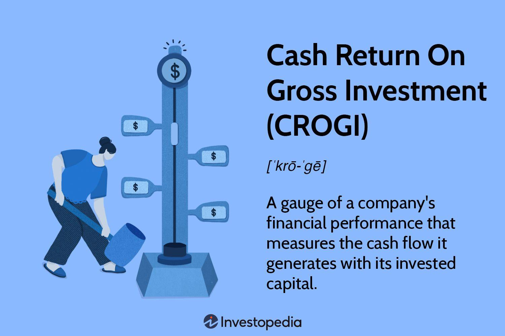

## Table of Contents

## What is Cash Return on Gross Investment (CROGI)?

Cash Return on Gross Investment (CROGI) is a financial measure that helps investors understand how well a company is using its money to make profits. It looks at the cash profits a company makes compared to the total amount of money it has invested in its business. This total investment includes things like buildings, machines, and other assets the company uses to operate. By focusing on cash profits, CROGI gives a clear picture of the actual money a company is earning, which can be different from the profits shown on paper.

CROGI is useful because it helps investors see if a company is making good use of its investments. A higher CROGI means the company is generating more cash from its investments, which is a good sign for investors. It's a bit like checking if a plant is growing well by looking at how much fruit it produces compared to the care and resources put into it. This measure can help investors decide if a company is worth investing in, based on how efficiently it turns its investments into cash.

## How is CROGI calculated?

To calculate CROGI, you start by figuring out the cash profit the company makes. This is not the same as the profit you see on the income statement. Instead, you look at the cash flow statement to find the cash that the company actually earns from its operations. This cash profit is often called "gross cash flow." Once you have the gross cash flow, you subtract the taxes the company would have to pay if it only made this amount of money. This gives you the after-tax gross cash flow, which is the numerator in the CROGI formula.

Next, you need to find out the total amount of money the company has invested in its business. This is called the gross investment, and it includes everything the company owns that helps it make money, like buildings, machines, and equipment. You add up the value of all these assets to get the gross investment, which is the denominator in the CROGI formula. To find CROGI, you divide the after-tax gross cash flow by the gross investment and then multiply by 100 to get a percentage. This percentage tells you how much cash profit the company makes for every dollar it has invested.

## Why is CROGI important for investors?

CROGI is important for investors because it shows how well a company is using its money to make profits. It tells investors if the company is good at turning its investments into cash. When a company has a high CROGI, it means it's making a lot of cash from the money it has put into its business. This is a good sign for investors because it means the company is efficient and could be a smart place to invest their money.

Investors also like CROGI because it focuses on real cash, not just numbers on a paper. Sometimes, the profits a company reports can be confusing or not tell the whole story. But CROGI looks at the actual cash coming in, which is easier to understand and trust. By using CROGI, investors can get a clearer picture of a company's health and decide if it's a good investment based on how well it's using its money to generate cash.

## What does a high CROGI indicate about a company?

A high CROGI tells investors that a company is doing a great job at making money from the things it has bought, like buildings and machines. It means the company is good at turning its investments into real cash that it can use or give to its owners. When a company has a high CROGI, it shows that it's using its money wisely and making more cash than it needs to cover the costs of its investments.

This is important because it shows the company is healthy and efficient. Investors like to see a high CROGI because it means the company is a good place to put their money. A high CROGI can make investors feel confident that the company will keep making money and growing, which is what they want when they invest.

## Can you compare CROGI to other financial metrics like ROE or ROA?

CROGI, or Cash Return on Gross Investment, is different from other financial metrics like Return on Equity (ROE) and Return on Assets (ROA) because it focuses on the cash a company makes from its investments. ROE looks at the profit a company makes compared to the money its owners have put in, or their equity. ROA, on the other hand, looks at the profit compared to all the things the company owns, or its assets. But CROGI is special because it uses cash profits, which are the real money a company gets, not just the profits shown on paper.

While ROE and ROA can tell you how well a company is doing in terms of profits, they might not show the whole picture. For example, ROE might look good if a company borrows a lot of money, but that could be risky. ROA can be affected by how a company values its assets, which can be tricky. CROGI gives a clearer view of how well a company is using its money to make cash, which is important for investors who want to know if the company is really making money in a way that can be trusted and used.

## How does CROGI differ from Return on Invested Capital (ROIC)?

CROGI and Return on Invested Capital (ROIC) are both ways to see how well a company uses its money, but they look at different things. CROGI focuses on the cash profits a company makes from its investments, like buildings and machines. It uses the cash flow statement to find out how much real money the company is earning, then compares this to the total value of all its investments. This gives investors a clear picture of how well the company is turning its investments into cash.

ROIC, on the other hand, looks at the profit a company makes compared to the total money it has used to run its business, including both equity and debt. It uses the net operating profit after taxes (NOPAT) and compares it to the total invested capital. ROIC gives a broader view of how efficiently a company is using all its money, not just the cash part. So while CROGI is all about the cash, ROIC looks at the bigger picture of profits and total investment.

## What industries typically have higher CROGI?

Industries that usually have higher CROGI are often those that need less money to start and run, like software and technology companies. These businesses can make a lot of cash from their investments because they don't need to spend a lot on big things like factories or machines. Instead, they might spend money on computers and software, which can help them make money quickly and efficiently. This means they can turn their investments into cash faster and with less cost, leading to a higher CROGI.

On the other hand, industries like manufacturing or heavy industry might have lower CROGI because they need a lot of money to buy big machines and buildings. These investments take a long time to start making money, and they cost a lot to keep running. So even though these companies might make a lot of money eventually, it takes longer for them to turn their big investments into cash, which can lead to a lower CROGI compared to tech companies.

## How can a company improve its CROGI?

A company can improve its CROGI by focusing on making more cash from its investments. One way to do this is by finding ways to make their products or services more profitable. This could mean cutting costs, like spending less on materials or making things more efficiently. It could also mean finding ways to charge more for what they sell, by adding new features or improving the quality. When a company can make more money from what it sells without spending a lot more, it can increase its cash profits and improve its CROGI.

Another way to boost CROGI is by being smart about what the company invests in. Instead of buying big, expensive things that take a long time to start making money, a company might choose to invest in smaller, quicker projects that can start earning cash sooner. For example, a tech company might choose to develop a new app instead of building a new factory. By choosing investments that turn into cash faster, the company can improve its CROGI. It's all about making the most out of the money the company has already put into its business.

## What are the limitations of using CROGI as a performance metric?

Using CROGI as a performance metric has some limitations. One big problem is that it focuses only on the cash a company makes, not on other important things like how much debt the company has. A company might have a high CROGI, but if it's also borrowing a lot of money, it could be risky. CROGI doesn't tell you about these risks, so it's not the whole story about a company's health.

Another issue with CROGI is that it can be hard to compare between different companies. This is because companies in different industries might have very different kinds of investments. For example, a tech company might have a high CROGI because it doesn't need to spend a lot on big things like factories. But a manufacturing company might have a lower CROGI because it does need to spend a lot on big machines. So, CROGI might not be fair when you're trying to see how well different companies are doing.

## How does depreciation affect CROGI?

Depreciation can make CROGI look different because it's about how companies account for their investments over time. When a company buys something big like a machine, it doesn't count the whole cost right away. Instead, it spreads the cost over many years, which is called depreciation. This means the gross investment part of CROGI, which is the total value of all the company's assets, gets smaller each year because of depreciation. So, if the cash profits stay the same but the gross investment goes down, CROGI can go up.

However, depreciation doesn't change the actual cash a company makes. It's just an accounting trick to spread out the cost of big investments. So, while depreciation can make CROGI look better over time, it doesn't mean the company is actually making more cash. Investors need to remember this when they look at CROGI and understand that it's not always a perfect way to see how well a company is doing.

## Can CROGI be manipulated by management, and if so, how?

Yes, CROGI can be manipulated by management. One way they can do this is by changing how they report their cash profits. For example, they might delay paying some bills to make it look like they have more cash coming in than they really do. Or, they might sell some assets to get a quick boost in cash, even if it's not good for the company in the long run. By doing these things, management can make the cash profit part of CROGI look better, even if the company isn't really doing better.

Another way management can manipulate CROGI is by playing with the gross investment part of the formula. They might decide to write down the value of their assets faster than they need to, which is called depreciation. This makes the total investment look smaller, and since CROGI is cash profit divided by gross investment, a smaller investment can make CROGI look bigger. So, even though the company isn't making more cash, the way they account for their investments can make CROGI look better.

## How can CROGI be used in conjunction with other metrics for a comprehensive analysis?

Using CROGI with other metrics can give investors a fuller picture of a company's health. For example, CROGI shows how well a company turns its investments into cash, but it doesn't tell you about the company's debts. By looking at the Debt to Equity ratio alongside CROGI, investors can see if the company is using a lot of borrowed money. This is important because a high CROGI might look good, but if the company has a lot of debt, it could be risky. Also, looking at the Return on Equity (ROE) can help investors see how well the company is making profits from the money its owners have put in. Together, these metrics can show if a company is both efficient and financially stable.

Another useful metric to use with CROGI is the Return on Assets (ROA). ROA tells you how well a company is using all its assets to make profits, not just the cash part like CROGI. By comparing CROGI and ROA, investors can see if the company is good at turning its investments into both cash and overall profits. This can help them understand if the company's high CROGI is due to good management or just because of how they account for their assets. Using CROGI with these other metrics helps investors make smarter decisions by looking at different parts of the company's performance.

## What is Cash Return on Gross Investment (CROGI)?

Cash Return on Gross Investment (CROGI) is a financial metric designed to evaluate the cash efficiency of a company's capital utilization. It is particularly focused on understanding how effectively a company can generate cash flow from the total capital it has invested. CROGI is calculated by taking the gross cash flow after taxes and dividing it by the gross investment. The formula can be expressed as:

$$
\text{CROGI} = \frac{\text{Gross Cash Flow After Taxes}}{\text{Gross Investment}}
$$

This metric provides insight into a company's ability to convert its investment into cash, which can be crucial for investors seeking to understand the cash generation capabilities of a business. 

One of the key characteristics of CROGI is its use of gross figures rather than net figures. This approach entails using the total amounts before deductions, such as depreciation, taxes, and costs, thus providing a broader view of cash generation without the adjustments typically reflected in net figures. As a consequence, CROGI may overlook several financial nuances including costs, taxes, depreciation, and potential inflation effects. 

The preference for gross figures means CROGI offers a high-level view that can quickly indicate investment effectiveness. However, it might not capture the complete financial picture as accurately as other, more detailed financial metrics, which make adjustments for these factors. As such, while CROGI is a useful initial tool for evaluating capital efficiency, it should be complemented by other metrics for a comprehensive financial analysis.

## What are the differences between CROGI and other financial metrics?

While Cash Return on Gross Investment (CROGI) provides a straightforward and broad view of a company's cash flow efficiency, other financial metrics offer more nuanced insights into performance and capital utilization. Understanding the distinctions and applications of these metrics is crucial for investors to make well-rounded decisions.

**Return on Gross Invested Capital (ROGIC)** is one such metric that utilizes net operating profit after tax (NOPAT) in its calculation, giving it a net perspective on returns. By focusing on NOPAT, ROGIC effectively measures the profitability and operational efficiency of a company's capital without the distortions of taxes and interest expenses. This approach allows investors to gauge a company's true operating performance:

$$
\text{ROGIC} = \frac{\text{NOPAT}}{\text{Gross Invested Capital}}
$$

This metric is particularly useful in comparing companies within the same industry, especially those with significant variations in leverage or tax rates, as it focuses on operational outcomes rather than financing structure.

On the other hand, **Return on Invested Capital (ROIC)** considers both equity and debt, providing a comprehensive evaluation of a firm's performance. ROIC measures how efficiently a company converts its capital, which includes debt, into profits. By incorporating net figures, ROIC accounts for the entire capital base:

$$
\text{ROIC} = \frac{\text{Net Income} - \text{Dividends}}{\text{Debt} + \text{Equity}}
$$

This metric is highly regarded for its ability to reflect the return generated from all sources of capital, making it particularly valuable for assessing companies with varying capital structures. ROIC is a preferred measure when detailed insights into capital efficiency across both equity and debt components are necessary.

CROGI, with its usage of gross figures, offers a quick assessment but lacks the granularity provided by ROGIC and ROIC. It does not adjust for costs, taxes, and the capital structure, which can be essential for comprehensive financial evaluation. Therefore, investors often pair CROGI with these metrics to gain a fuller understanding of a company's financial health and performance efficacy. These combined insights enable more sophisticated analyses and more informed investment decisions.

## References & Further Reading

[1]: ["Advances in Financial Machine Learning"](https://www.amazon.com/Advances-Financial-Machine-Learning-Marcos/dp/1119482089) by Marcos Lopez de Prado

[2]: ["Evidence-Based Technical Analysis: Applying the Scientific Method and Statistical Inference to Trading Signals"](https://www.amazon.com/Evidence-Based-Technical-Analysis-Scientific-Statistical/dp/0470008741) by David Aronson

[3]: ["Machine Learning for Algorithmic Trading"](https://github.com/stefan-jansen/machine-learning-for-trading) by Stefan Jansen

[4]: ["Quantitative Trading: How to Build Your Own Algorithmic Trading Business"](https://www.amazon.com/Quantitative-Trading-Build-Algorithmic-Business/dp/1119800064) by Ernest P. Chan