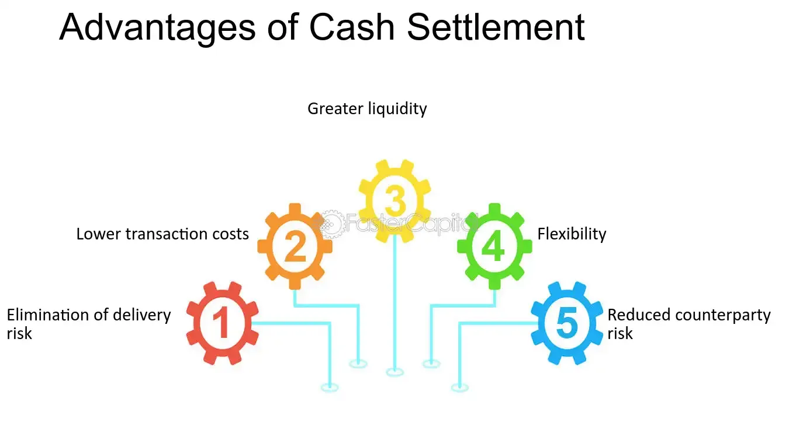

## Table of Contents

## What are cash-settled options?

Cash-settled options are a type of financial option where, upon expiration, the buyer receives a cash payment instead of the underlying asset. This is different from physically settled options, where the actual asset, like stocks or commodities, is delivered. The cash payment is based on the difference between the option's strike price and the market price of the underlying asset at expiration.

These options are often used for assets that are difficult or impractical to physically deliver, such as stock indices or certain commodities. For example, if you have a cash-settled option on an index like the S&P 500, you won't receive the actual stocks in the index. Instead, you'll get a cash amount that reflects the index's performance relative to your option's strike price. This makes cash-settled options a convenient tool for investors looking to gain exposure to these kinds of assets without dealing with the complexities of physical delivery.

## How do cash-settled options differ from physically-settled options?

Cash-settled options and physically-settled options are two different ways that options can be settled when they expire. With cash-settled options, you don't get the actual thing the option is based on, like stocks or commodities. Instead, you get paid in cash. The amount of cash you get depends on how much the price of the thing changed from when you bought the option to when it expires. This is useful when it's hard to give someone the actual thing, like with stock indexes or some commodities.

On the other hand, physically-settled options work differently. When these options expire, you actually get the thing the option is based on. For example, if you have an option on a stock, you'll get the stock itself. This can be good if you want to own the actual asset, but it can also be more complicated because you have to deal with transferring the physical asset. So, cash-settled options are simpler in terms of what you get at the end, while physically-settled options give you the real thing but can be more complex to handle.

## What is the mechanism behind cash-settled options?

When you buy a cash-settled option, you're betting on the price of something, like a stock index or a commodity, without actually getting that thing at the end. Instead, if your guess about the price is right when the option expires, you get paid in cash. The amount of cash you get depends on the difference between the price you guessed (the strike price) and the actual price of the thing at expiration. If the actual price is higher than your strike price for a call option, or lower for a put option, you make money.

The process is pretty straightforward. Let's say you have a cash-settled call option on an index like the S&P 500, with a strike price of 4,000. If the S&P 500 is at 4,100 when your option expires, you get paid the difference, which is 100 points. If each point is worth $100, you'd get $10,000. It's a simple way to bet on price movements without having to deal with owning the actual asset, making it easier and more convenient for many investors.

## What are the key components involved in a cash-settled option contract?

A cash-settled option contract has a few main parts that are important to understand. The first part is the underlying asset, which is what the option is based on. This can be things like stock indexes, commodities, or other financial products. The second part is the strike price, which is the price you guess the underlying asset will be at when the option expires. If you're right, you make money based on how much the actual price is different from your guess.

The third part is the expiration date, which is when the option ends. If the price of the underlying asset is better than your strike price when the option expires, you get paid in cash. The amount of cash you get depends on the difference between the actual price and your strike price. This makes cash-settled options a simple way to bet on price changes without having to deal with the actual asset.

## How is the settlement price determined for cash-settled options?

The settlement price for cash-settled options is figured out by looking at the price of the thing the option is based on when it expires. This thing could be a stock index, a commodity, or another financial product. The exact way to find the settlement price can be different depending on the rules of the exchange where the option is traded. But usually, it's the closing price of the underlying asset on the day the option expires.

Once the settlement price is known, the amount of cash you get is easy to calculate. If you have a call option and the settlement price is higher than your strike price, you get paid the difference between those two prices. For a put option, you get paid if the settlement price is lower than your strike price. The cash you get is based on this difference, making it a straightforward way to make money from guessing the price right without needing to own the actual asset.

## What are the advantages of using cash-settled options for investors?

Cash-settled options have a few big pluses for investors. One big advantage is they're easier to deal with. You don't have to worry about getting the actual thing the option is based on, like stocks or commodities. This makes things simpler because you just get paid in cash if you're right about the price. It's especially handy when you're betting on things like stock indexes, which you can't actually own. Plus, it saves you from having to deal with the hassle of buying and selling the real stuff.

Another good thing about cash-settled options is they let you bet on price changes without needing a lot of money upfront. Since you're not buying the actual asset, you can use these options to try and make money from price movements without having to put down a big chunk of cash. This can make investing more accessible for people who don't have a lot of money to start with. It's a way to get into the game without having to own the actual stocks or commodities, making it a flexible tool for many investors.

## Can you explain the tax implications of trading cash-settled options?

When you trade cash-settled options, the tax rules can be a bit tricky. If you make money from these options, you'll usually have to pay taxes on your profits. The tax rate depends on how long you held the option before it expired or you sold it. If you held it for less than a year, your profits are considered short-term capital gains, and you'll pay your regular income tax rate on them. If you held it for more than a year, it's a long-term capital gain, and you'll pay a lower tax rate, usually between 0% and 20%, depending on your income.

Another thing to keep in mind is that if you lose money on cash-settled options, you might be able to use those losses to reduce your taxes. You can use these losses to offset any gains you made from other investments. If your losses are more than your gains, you can deduct up to $3,000 of those losses from your regular income each year. Any leftover losses can be carried over to future years. It's always a good idea to talk to a tax professional to make sure you're doing everything right and taking advantage of all the tax breaks you can.

## How do cash-settled options impact market liquidity?

Cash-settled options can make the market more liquid. Liquidity means how easy it is to buy or sell something without changing its price too much. When investors trade cash-settled options, they can do so without needing to buy or sell the actual thing the option is based on. This means more people can trade these options, making the market busier and easier to trade in. Since cash-settled options are simpler to deal with, more people might want to use them, which can increase the number of trades and make the market more liquid.

However, there can also be some challenges. If a lot of people are using cash-settled options to bet on the price of something, it might affect the price of that thing in the real market. This can happen because people might change their trading behavior based on what they think will happen with the options. But overall, cash-settled options usually help make the market more liquid by making it easier for more people to trade and bet on price changes without needing to own the actual asset.

## What are some common strategies used with cash-settled options?

One common strategy with cash-settled options is called "speculation." This is when investors use these options to bet on whether the price of something, like a stock index, will go up or down. They buy call options if they think the price will go up, and put options if they think it will go down. If they're right, they make money from the difference between the price they guessed and the actual price when the option expires. This strategy can be risky, but it's a way to try and make money from price changes without having to own the actual asset.

Another strategy is "hedging." This is when investors use cash-settled options to protect other investments they have. For example, if someone owns a lot of stocks and is worried that the stock market might go down, they might buy put options on a stock index. If the market does go down, the money they make from the options can help make up for the losses in their stocks. It's like buying insurance for their investments, making it a safer way to deal with the ups and downs of the market.

A third strategy is "income generation." Investors can sell cash-settled options to earn extra money. For example, if someone thinks a stock index won't move much, they might sell options and collect the money people pay to buy them. If the index stays within the expected range, they keep the money they collected. This can be a good way to make some extra cash, especially if the market is calm and not moving a lot.

## How do regulatory frameworks affect the use of cash-settled options?

Regulatory frameworks can have a big impact on how cash-settled options are used. These rules are made by groups like the Securities and Exchange Commission (SEC) or other financial regulators. They set the rules for how these options can be traded, who can trade them, and what information needs to be shared. For example, some regulations might limit who can trade certain kinds of options or set rules about how much money someone needs to have before they can start trading. These rules are there to make sure the market is fair and safe for everyone, but they can also make it harder for some people to use cash-settled options.

The rules can also change how cash-settled options are designed and how they work. Regulators might set standards for things like how options are settled, how prices are reported, and what kinds of options can be offered. This can affect the strategies investors use and how they manage their risks. For example, if a new rule changes how options are settled, investors might need to adjust their plans. Overall, while regulations help keep the market safe and fair, they can also make things more complicated for people who want to use cash-settled options.

## What are the risks associated with cash-settled options?

One big risk with cash-settled options is that they can be very risky if the price of the thing you're betting on moves a lot. If you guess wrong about which way the price will go, you could lose all the money you put into the option. This is because you're betting on the price difference, and if the price goes the wrong way, you don't get anything back. It's like gambling, and just like in gambling, you can lose a lot if you're not careful.

Another risk is that cash-settled options can be hard to understand. If you don't know how they work, you might make bad choices and lose money. Also, the market for these options can be less busy than for other investments, which can make it harder to buy or sell them when you want to. This can be a problem if you need to get out of a trade quickly. It's important to learn about these options and be careful with how you use them.

## How do cash-settled options fit into broader financial market dynamics?

Cash-settled options are an important part of the financial markets because they let people bet on the price of things like stock indexes or commodities without having to own the actual stuff. This makes it easier for more people to trade and can make the market more active. When lots of people are trading, it can help keep prices steady and make it easier for everyone to buy and sell. Plus, these options can help investors try new strategies or protect their other investments from big price swings.

But cash-settled options can also affect the market in other ways. If a lot of people are using them to bet on prices, it might push the prices of the things they're betting on to move in certain ways. This can make the market a bit unpredictable. Also, because these options are settled in cash, they can be a bit trickier to understand and use right. So, while they add a lot of flexibility and can help make the market more lively, they also come with their own set of challenges and risks that investors need to be careful about.

## What are successful strategies for trading cash-settled options?

Successful strategies for trading cash-settled options encompass various approaches tailored to different market conditions, risk appetites, and strategic goals. Three prominent strategies include covered calls, protective puts, and long straddles, each suited to distinct market outlooks and trader objectives.

### Covered Calls
The covered call is a conservative strategy employed by investors holding a long position in an asset, selling call options against the same asset. This approach generates additional income from option premiums while potentially capping the asset's upside potential. If the market remains neutral or experiences slight appreciation, the strategy profits from the premium collected. The formula for profit from a covered call strategy can be expressed as:

$$
\text{Profit} = \text{Premium Collected} + \min(0, \text{Market Price} - \text{Strike Price})
$$

### Protective Puts
Protective puts act as a form of insurance for long positions. By purchasing put options, traders protect their investments from significant downside risk. This strategy is particularly beneficial in volatile markets or bearish trends. It involves owning the underlying asset and buying a put option to hedge against potential losses. The cost of this strategy is the premium paid for the put options. The total payoff can be calculated as:

$$
\text{Payoff} = \max(0, \text{Strike Price} - \text{Market Price}) - \text{Premium Paid}
$$

### Long Straddles
A long straddle is an advanced strategy designed for capitalizing on significant price movements in either direction, often implemented during times of anticipated [volatility](/wiki/volatility-trading-strategies). It involves buying both a call and a put option at the same strike price and expiration date. The strategy profits when the asset's price deviates significantly from the strike price, surpassing the combined cost of the options. The profit can be depicted as:

$$
\text{Profit} = \max(\text{Market Price} - \text{Strike Price}, \text{Strike Price} - \text{Market Price}) - (\text{Call Premium} + \text{Put Premium})
$$

### Algorithmic Trading in Strategies
Algorithmic trading plays a vital role in executing these strategies with precision and speed, especially in rapidly changing markets. Algorithms can scan market conditions, automatically triggering trades based on predefined criteria. Python, a popular language for developing trading algorithms, allows for the automation of strategy execution, optimizing entry and [exit](/wiki/exit-strategy) timing. This automation helps in mitigating human error and emotional decision-making, enhancing the strategy's effectiveness.

### Strategy Selection
Choosing the appropriate strategy requires a comprehensive assessment of several factors, including market conditions, volatility, and an individual's risk tolerance. Traders must analyze the market environment, evaluate implied volatility, and align strategies with their risk management objectives to optimize outcomes in cash-settled options trading.

In summary, successful trading of cash-settled options is achievable through understanding and applying strategies like covered calls, protective puts, and long straddles. Algorithmic trading enhances these strategies by enabling agile responses to market dynamics, thereby increasing the likelihood of achieving desired financial outcomes.

## References & Further Reading

[1]: Hull, J. (2014). ["Options, Futures, and Other Derivatives."](https://books.google.com/books/about/Options_Futures_and_Other_Derivatives_eB.html?id=2iopDwAAQBAJ) Prentice Hall.

[2]: Black, F. & Scholes, M. (1973). ["The Pricing of Options and Corporate Liabilities."](https://www.cs.princeton.edu/courses/archive/fall09/cos323/papers/black_scholes73.pdf) Journal of Political Economy, 81(3), 637–654.

[3]: Lopez de Prado, M. (2018). ["Advances in Financial Machine Learning."](https://www.amazon.com/Advances-Financial-Machine-Learning-Marcos/dp/1119482089) Wiley.

[4]: Chan, E. P. (2009). ["Quantitative Trading: How to Build Your Own Algorithmic Trading Business."](https://github.com/ftvision/quant_trading_echan_book) Wiley.

[5]: Durbin, M. (2010). ["All About Derivatives: The Easy Way to Get Started."](https://www.amazon.com/All-About-Derivatives-Second/dp/0071743510) McGraw-Hill.

[6]: Jarrow, R. & Turnbull, S. (1996). ["Derivative Securities."](https://archive.org/details/derivativesecuri0000jarr_r8m0) South-Western College Publishing.

[7]: Narang, R. (2009). ["Inside the Black Box: The Simple Truth About Quantitative Trading."](https://onlinelibrary.wiley.com/doi/book/10.1002/9781118267738) Wiley.

[8]: Johnson, H. & Stulz, R. M. (1987). ["The Pricing of Options with Default Risk."](https://onlinelibrary.wiley.com/doi/abs/10.1111/j.1540-6261.1987.tb02567.x) The Journal of Finance, 42(2), 267–280.