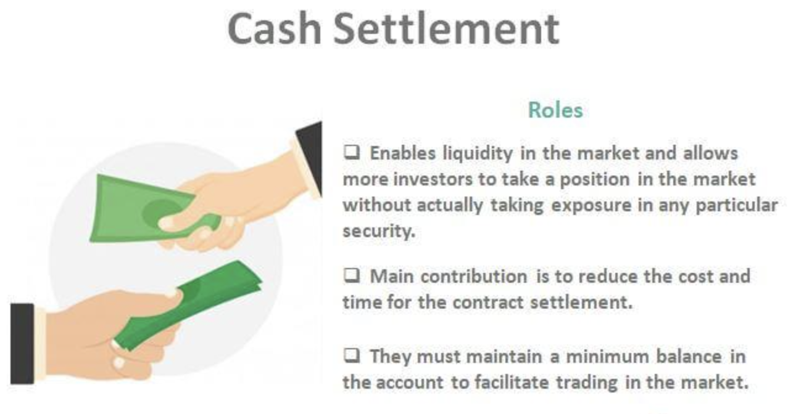

## Table of Contents

## What is cash settlement?

Cash settlement is a way to finish a trade without using the actual thing being traded. Instead of giving the real item, like stocks or commodities, the people involved in the trade just exchange money. The amount of money is based on the price of the item at the time the trade ends. This method is often used in financial markets for things like futures and options, where it's easier to pay the difference in cash than to move the actual goods.

Using cash settlement makes trading simpler and faster. It saves time and money because there's no need to handle, store, or transport the physical items. This is especially useful for traders who don't want to deal with the hassle of moving big or hard-to-handle goods. It also helps keep the markets running smoothly by making it easier to complete trades quickly and accurately.

## How does cash settlement differ from physical settlement?

Cash settlement and physical settlement are two ways to finish a trade, but they work differently. In cash settlement, instead of giving the actual thing being traded, like stocks or commodities, the people involved just pay each other the difference in cash. This is based on the price of the item at the end of the trade. It's like betting on the price and then settling up with money at the end. This method is often used for things like futures and options where it's easier to just use cash.

On the other hand, physical settlement means actually handing over the real item that was traded. If you bought stocks, you'd get the stock certificates. If it's commodities like oil or wheat, the seller would deliver the actual product to the buyer. This can be more complicated because it involves moving, storing, and sometimes even inspecting the goods. Physical settlement is used when the buyer wants to own and use the actual item, not just bet on its price.

## What are the basic steps involved in a cash settlement process?

When a trade is set to be settled in cash, the first step is to determine the final price of the item being traded at the end of the contract. This could be the price of a stock, a commodity, or any other asset that was part of the trade. Once the final price is known, the next step is to calculate the difference between the price agreed upon at the start of the trade and this final price. If the final price is higher than the agreed price, the buyer pays the seller the difference. If it's lower, the seller pays the buyer.

After calculating the difference, the actual cash settlement happens. This means transferring the money from one party to the other. This is usually done through a clearinghouse, which acts like a middleman to make sure the trade is settled fairly and on time. The clearinghouse ensures that the money goes from the person who owes it to the person who is owed it, completing the trade without any physical goods changing hands.

## Can you explain the concept of cash settlement with an example?

Imagine you and your friend made a bet on the price of a barrel of oil. You bet that in one month, the price would be $70, and your friend bet it would be higher. At the end of the month, the price of oil is actually $75. Since the price went up to $75, your friend wins the bet. Instead of giving each other a real barrel of oil, you just pay your friend the difference between the price you bet on and the actual price. So, you would give your friend $5, because $75 minus $70 is $5.

This is how cash settlement works. You don't need to deal with the actual oil; you just settle the bet with money. It's simpler and quicker this way, especially when you're betting on things that are hard to move around, like oil. Cash settlement is used a lot in trading futures and options, where people bet on prices without wanting to own the actual thing they're betting on.

## What types of financial instruments typically use cash settlement?

Cash settlement is commonly used with financial instruments like futures and options. Futures are agreements to buy or sell something at a set price on a future date. Options give you the right, but not the obligation, to buy or sell something at a set price before a certain date. When these contracts end, instead of giving the actual thing, like wheat or stocks, people just pay each other the difference in cash based on the final price.

Another type of financial instrument that often uses cash settlement is swaps. Swaps are agreements between two parties to exchange cash flows or other financial instruments. For example, in an [interest rate](/wiki/interest-rate-trading-strategies) swap, one party might pay a fixed interest rate while the other pays a floating rate. At the end of the swap, they settle up in cash based on the difference between the rates they agreed on and the actual rates at the end. This makes it easier and quicker to finish the deal without moving actual assets.

## What are the advantages of cash settlement for individual investors?

Cash settlement makes things easier for individual investors. When you trade using cash settlement, you don't have to worry about getting or storing the actual thing you're trading, like stocks or commodities. This saves a lot of time and hassle. Imagine if you had to find a place to keep a bunch of wheat or oil after trading it. With cash settlement, you just get or pay the difference in money, which is much simpler.

Another advantage is that cash settlement can be faster and cheaper. Since you're not moving physical stuff around, the whole process can be done quickly through a computer. This means you can get your money faster and don't have to pay for things like storage or shipping. For individual investors, this can make trading more efficient and less costly, letting them focus more on making smart investment choices.

## How does cash settlement impact the efficiency of financial markets?

Cash settlement makes financial markets work better and faster. When trades are settled with cash instead of actual goods, it speeds up the whole process. There's no need to move or store big things like oil or wheat, which can take a lot of time and money. With cash settlement, the money just changes hands based on the price difference, and this can be done quickly through computers. This means trades can be finished faster, and the markets can keep running smoothly without delays.

This quick and simple way of settling trades also helps make the markets more efficient. Since it's cheaper to use cash settlement, more people can join in the trading, which makes the markets more active and liquid. When markets are liquid, it's easier to buy and sell things without big price changes. This helps keep the markets stable and makes it easier for everyone to trade, from big companies to individual investors. Overall, cash settlement helps the financial markets work better for everyone involved.

## What are the potential risks associated with cash settlement?

One big risk of cash settlement is that it depends a lot on the final price of the thing being traded. If the price at the end of the trade is very different from what was expected, one side might have to pay a lot more money than they thought. This can be a problem if they don't have enough money to cover the difference. It's like betting on a game and then finding out you owe a lot more than you planned for.

Another risk is that cash settlement can sometimes make it easier for people to do risky things with their money. Because it's quick and easy to settle trades with cash, some people might be tempted to trade more often or take bigger risks than they should. This can lead to big losses if the trades don't go their way. It's important for people to be careful and understand the risks before they start trading with cash settlement.

## How do regulatory frameworks affect cash settlement practices?

Regulatory frameworks play a big role in how cash settlement works. They set rules to make sure that cash settlement is done fairly and safely. These rules help stop fraud and make sure that everyone follows the same steps when settling trades. For example, regulators might require that trades go through a clearinghouse, which checks that the money is transferred correctly and on time. This helps keep the financial markets stable and trustworthy.

Regulations also affect how much risk people can take with cash settlement. They might set limits on how much money someone can trade with or require that people have enough money to cover potential losses. This is to stop people from taking too many risks and losing more than they can afford. By setting these rules, regulators help protect investors and make sure the markets work well for everyone.

## What technological advancements have influenced cash settlement processes?

Technology has made cash settlement a lot easier and faster. Before, people had to do a lot of paperwork and wait for the mail to settle trades. Now, with computers and the internet, everything can be done online. This means that when a trade is finished, the money can be moved from one person to another almost instantly. This makes the whole process quicker and more efficient, so people don't have to wait as long to get their money.

Another big change is the use of blockchain and other new technologies. Blockchain is like a digital ledger that keeps track of all the trades in a secure way. It makes it easier to check that everything is done correctly and helps stop fraud. With these new tools, cash settlement can be even safer and more reliable. This helps keep the financial markets running smoothly and makes it easier for everyone to trade.

## How do financial institutions manage cash settlement risks?

Financial institutions manage cash settlement risks by using special systems and rules. They use something called a clearinghouse, which is like a middleman that makes sure the money goes from one person to another correctly. The clearinghouse checks that everyone has enough money to cover their trades and helps stop big problems if someone can't pay. This makes the whole process safer and more reliable.

They also set limits on how much people can trade and make sure that everyone has enough money to cover any losses. This is to stop people from taking too many risks and losing more than they can handle. By having these rules and systems in place, financial institutions help protect everyone involved in the trading and keep the markets stable.

## What are the future trends and innovations expected in cash settlement?

In the future, cash settlement is likely to become even faster and more secure thanks to new technology. One big trend is the use of blockchain, which is like a digital ledger that keeps track of all trades in a safe way. This can make cash settlement quicker and more reliable because it's harder for people to cheat or make mistakes. Another innovation is the use of [artificial intelligence](/wiki/ai-artificial-intelligence) (AI) to help manage and predict risks. AI can look at lots of data and find patterns that humans might miss, which can help financial institutions make better decisions and keep the markets stable.

Another trend is the move towards real-time settlement. Right now, it can take a day or more to finish a trade, but with new systems, it could happen almost instantly. This would make trading even more efficient and help people get their money faster. There's also a focus on making cash settlement more accessible to everyone, not just big investors. This means using mobile apps and other easy-to-use tools so that more people can join in the trading and benefit from the financial markets.

## References & Further Reading

[1]: Hull, J. C. (2017). *Options, Futures, and Other Derivatives*. Pearson Education Limited.

[2]: De Prado, M. L. (2018). *Advances in Financial Machine Learning*. John Wiley & Sons.

[3]: Chan, E. (2009). *Quantitative Trading: How to Build Your Own Algorithmic Trading Business*. John Wiley & Sons.

[4]: Jansen, S. (2020). *Machine Learning for Algorithmic Trading: Predictive Models to Extract Signals from Market and Alternative Data for Systematic Trading Strategies with Python*. Packt Publishing.

[5]: Harris, L. (2003). *Trading and Exchanges: Market Microstructure for Practitioners*. Oxford University Press.

[6]: Lewis, M. (2014). *Flash Boys: A Wall Street Revolt*. W.W. Norton & Company.

[7]: Aronson, D. R. (2007). *Evidence-Based Technical Analysis: Applying the Scientific Method and Statistical Inference to Trading Signals*. John Wiley & Sons.

[8]: Aldridge, I. (2013). *High-Frequency Trading: A Practical Guide to Algorithmic Strategies and Trading Systems*. John Wiley & Sons.