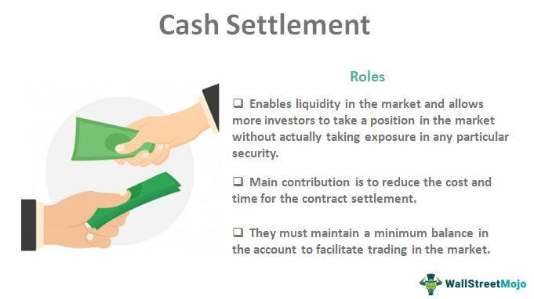

The financial world encompasses a diverse array of methods for settling investments and trades, each offering distinct advantages and potential drawbacks. Among these, cash settlements stand out as a prevalent method, especially in trading futures and options. This approach involves settling transactions in cash rather than exchanging the underlying asset, making it a vital component of modern financial markets.

Cash settlements are beneficial for multiple reasons. They streamline the trading process by eliminating the need for the physical delivery of assets, thus reducing logistical complexities and associated costs. This mechanism is particularly advantageous in markets characterized by high volatility, where quick and efficient settlement processes are crucial for maintaining liquidity and minimizing risks.



Furthermore, as financial markets continue to evolve, algorithmic trading has become increasingly integral to enhancing the efficiency of cash settlements. Algorithmic systems utilize computer algorithms to automate and execute trades with remarkable speed and precision, reducing human error and optimizing transaction times. This integration not only facilitates high-frequency trading strategies but also ensures that market participants can capitalize on fleeting market opportunities without delay.

In this article, we focus on understanding cash settlements, their financial benefits, and how they are utilized within algorithmic trading. We will explore how this method provides unique advantages and why it is essential for investors and traders looking to optimize their market strategies.

## Table of Contents

## Understanding Cash Settlements

Cash settlements occur in trading when the physical delivery of an asset is bypassed, and a financial position is settled in cash instead. Instead of transferring the actual underlying asset, like a commodity or security, cash settlements streamline the process by focusing on the financial differential between the contract price and the market price at the time of settlement.

This mechanism is predominantly used in futures and options contracts. In a futures contract, for instance, rather than delivering the commodity, such as [crude oil](/wiki/crude-oil) or wheat, the parties involved agree to pay or receive the cash equivalent of the price movements observed in the market. Options contracts follow a similar process, where the right to buy or sell an asset is resolved through cash payouts, reflecting the intrinsic value change of the option at expiration.

Cash settlements present several advantages. One of the primary benefits is cost reduction. By eliminating the need for transportation, storage, and insuring physical assets, market participants can significantly decrease transaction costs. This cost-effectiveness also contributes to the increased speed of transaction finalization, as the logistical hurdles associated with transferring physical assets are removed.

Furthermore, cash settlements offer significant benefits in markets characterized by high [volatility](/wiki/volatility-trading-strategies). In such environments, asset prices can fluctuate rapidly, potentially complicating the delivery process. By settling in cash, traders and investors maintain greater flexibility in managing positions and adjusting strategies according to market dynamics. This method also preserves market [liquidity](/wiki/liquidity-risk-premium), as participants can easily enter and [exit](/wiki/exit-strategy) positions without the restrictions imposed by physical asset logistics.

The simplicity of cash settlements enhances market efficiency, making it a preferred method for many traders, especially those engaging in markets with frequent price shifts. By focusing on cash flow rather than the physical state of assets, cash settlements provide an adaptable and efficient means of managing financial contracts.

## Financial Benefits of Cash Settlements

Cash settlements offer several financial advantages that make them a preferred choice in futures and options markets. One of the most prominent benefits is the reduction of delivery-related costs. Unlike traditional settlement methods that necessitate the logistical processes of storage and transportation, cash settlements eliminate these needs entirely. This not only cuts down on expenses associated with the physical handling of goods but also reduces the complexities involved in such operations.

Another significant advantage is the enhancement of market liquidity. Cash settlements facilitate easier and more frequent trading because they avoid the cumbersome procedures required for the physical exchange of assets. With cash readily available, traders can swiftly enter and exit positions, thus fostering a more vibrant and dynamic market environment. This liquidity is crucial in markets with high volatility, where swift transactions can be necessary to capitalize on fleeting opportunities.

Moreover, cash settlements effectively mitigate the risk of physical asset deterioration or loss. In scenarios where physical delivery is required, assets such as commodities can be susceptible to spoilage, damage, or theft during transit or storage. By settling in cash, these risks are virtually non-existent, providing peace of mind for investors and reducing insurance costs associated with physical asset handling.

Investors also benefit from quicker access to funds following a cash settlement. Once the position is settled, the cash is immediately available for reinvestment or withdrawal. This rapid turnaround enhances cash flow management, allowing traders to efficiently allocate their capital across different investment opportunities without delays. In contrast, traditional settlements could tie up capital for extended periods, potentially leading to missed opportunities or liquidity crunches.

In summary, cash settlements not only reduce expenses and logistical burdens but also enhance market functioning by increasing liquidity and minimizing risks related to the physical handling of assets. These advantages contribute to cash settlements being a strategic choice for investors aiming to optimize their financial strategies efficiently.

## Cash Settlement Examples

Cash settlements are a critical aspect of futures and options trading, offering practicality and efficiency over physical delivery. For instance, in a futures contract for gold, rather than the complexities and costs associated with transporting and transferring physical gold, the involved parties settle by exchanging the monetary difference between the contracted price and the market price at the settlement date. This approach reduces logistical burdens and financial risks linked to the handling of tangible assets.

In agricultural futures, cash settlements serve as a practical alternative to delivering physical commodities such as wheat or corn. The agriculture sector often faces volatile market conditions and intricate logistical challenges, including transportation and storage. By opting for cash settlements, traders and producers can efficiently manage price risks without the constraints of physically handling the commodities. This way, market participants can protect themselves against price fluctuations and ensure smoother transactions.

Within the options market, cash settlement mechanisms allow investors to benefit from changes in asset values without the necessity of owning the physical asset. For example, in a stock option that settles in cash, if the option is exercised, the option holder receives or pays the difference between the market value and the strike price in cash, negating the need to acquire or sell the actual shares. This capability provides flexibility and avoids the costs associated with taking ownership of underlying securities.

The application of cash settlements in these scenarios enhances liquidity and simplifies the settlement process, making trading more accessible and efficient across diverse markets.

## The Role of Algorithmic Trading in Cash Settlements

Algorithmic trading harnesses the power of computer-driven algorithms to automate trading processes, significantly enhancing the efficiency of cash settlements. By using these algorithms, traders can execute transactions swiftly and accurately, which is particularly beneficial in the context of cash settlements where speed and precision are crucial.

One of the primary advantages of [algorithmic trading](/wiki/algorithmic-trading) in cash settlements is its ability to swiftly calculate settlement amounts and execute trades. This automation minimizes human error and reduces transaction times, critical in volatile markets where delays can result in substantial financial repercussions. Let's consider an example of how this might work in practice:

```python
# Example to calculate settlement using a simple algorithm
def calculate_settlement(contract_price, market_price, contract_size):
    settlement_amount = (market_price - contract_price) * contract_size
    return settlement_amount

# Example values
contract_price = 1500  # hypothetical future price
market_price = 1550  # market price at settlement
contract_size = 100  # size of the contract

settlement_amount = calculate_settlement(contract_price, market_price, contract_size)
print(f"Settlement Amount: ${settlement_amount}")
```

In this Python script, an algorithm calculates the cash settlement amount by determining the difference between the contract price and the market price, multiplied by the contract size. Such calculations can be automated and executed within milliseconds, showcasing the power of algorithmic trading.

Automation in algorithmic trading also supports high-frequency trading ([HFT](/wiki/high-frequency-trading-strategies)) strategies, where the speed of execution is crucial. HFT involves executing numerous trades at lightning speed, capitalizing on small market movements. Algorithms enable traders to maintain consistency across trades, ensuring that opportunities are exploited efficiently and without delay.

Moreover, algorithmic trading allows traders to respond to market movements almost instantaneously. With predefined strategies encoded in algorithms, traders can make split-second decisions based on market data, optimizing their trading performance. This capability is invaluable when managing cash settlements, allowing for prompt reaction to price fluctuations and market conditions.

In summary, algorithmic trading significantly bolsters the cash settlement process by providing enhanced speed, accuracy, and consistency. As financial markets continue to evolve, the integration of such technology will remain essential for traders seeking to optimize their performance and gain competitive advantages.

## Challenges and Considerations

Cash settlements, while advantageous, necessitate meticulous risk management strategies to ensure that market positions are appropriately covered. Since these settlements circumvent the transfer of physical assets, investors must proactively manage potential mismatches in their financial positions, particularly at contract expiration. For instance, if an investor has used futures contracts for hedging, they need to be vigilant about aligning their financial instruments with the underlying market movements to avoid liquidation losses.

At the expiration of futures or options contracts, investors face the challenge of reconciling their positions without a physical asset. This can complicate the hedging strategies that rely on physical delivery. The absence of physical assets in cash settlements means that investors might have to adjust their portfolio to account for any discrepancies between the hedge and the actual position.

Additionally, algorithmic trading, which often underpins cash settlements, introduces specific operational risks and compliance requirements. Algorithms can execute trades at rapid speeds and large volumes, making transparency and regulatory adherence critical. Financial regulatory bodies impose strict guidelines to ensure that algorithmic trading does not lead to market abuse or financial instability. Traders and firms must implement comprehensive compliance checks and maintain clear audit trails of their algorithmic operations.

Moreover, algorithms require constant updating and monitoring to adapt to changing market conditions and regulatory standards. This involves regular back-testing of strategies, performance evaluation, and ensuring all trading activities are in line with the established frameworks. Given the pace at which these systems operate, any software glitches or errors could result in significant financial repercussions.

In summary, while cash settlements offer efficiency and cost benefits, they demand a robust framework for risk management and compliance to mitigate the intricacies involved and adhere to regulatory expectations. Traders must ensure their algorithms are not only efficient but also transparent and compliant with the prevailing financial regulations.

## Conclusion

Cash settlements are a pivotal component of modern financial trading, providing substantial benefits in cost and efficiency. This settlement method eliminates the need for physical delivery of assets, reducing associated costs such as storage and transportation and allowing investors quicker access to their liquidity. As a result, cash flow management is enhanced, and market participants can engage in more frequent trading activities, thereby increasing market liquidity.

The ongoing evolution in financial technology further boosts the effectiveness of cash settlements. Algorithmic trading, which utilizes computer algorithms to automate trading processes, plays a crucial role in optimizing settlement efficiency. By quickly executing trades and calculating settlement amounts, algorithmic trading minimizes human error and reduces transaction times. This automation is especially critical for high-frequency trading strategies, where every millisecond counts.

Investors and traders who understand and leverage these advancements position themselves advantageously in financial markets. By integrating algorithmic trading techniques with cash settlement strategies, they can maintain consistency in trade execution and capitalize promptly on market opportunities. The combination of speed, accuracy, and enhanced liquidity makes cash settlements a vital tool for modern investors seeking to enhance their market strategies.

## References & Further Reading

[1]: Hull, J. C. (2017). *Options, Futures, and Other Derivatives*. Pearson Education Limited.

[2]: De Prado, M. L. (2018). *Advances in Financial Machine Learning*. John Wiley & Sons.

[3]: Chan, E. (2009). *Quantitative Trading: How to Build Your Own Algorithmic Trading Business*. John Wiley & Sons.

[4]: Jansen, S. (2020). *Machine Learning for Algorithmic Trading: Predictive Models to Extract Signals from Market and Alternative Data for Systematic Trading Strategies with Python*. Packt Publishing.

[5]: Harris, L. (2003). *Trading and Exchanges: Market Microstructure for Practitioners*. Oxford University Press.

[6]: Lewis, M. (2014). *Flash Boys: A Wall Street Revolt*. W.W. Norton & Company.

[7]: Aronson, D. R. (2007). *Evidence-Based Technical Analysis: Applying the Scientific Method and Statistical Inference to Trading Signals*. John Wiley & Sons.

[8]: Aldridge, I. (2013). *High-Frequency Trading: A Practical Guide to Algorithmic Strategies and Trading Systems*. John Wiley & Sons.