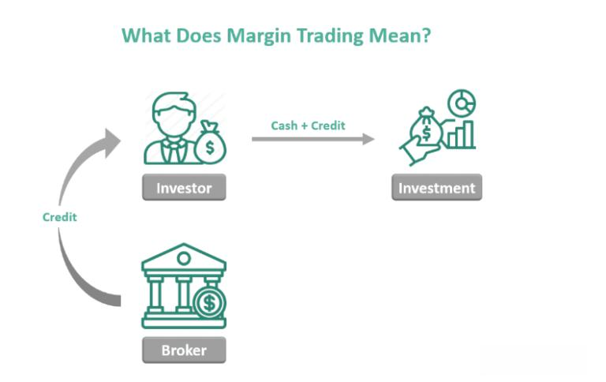

Trading is a multifaceted domain characterized by various methodologies, each with distinct rules and attributes. This discussion focuses on three prominent trading strategies: margin trading, cash trading, and algorithmic trading. Understanding these strategies and their foundational rules is essential for investors who aspire to enhance returns while managing associated risks. By adopting a well-informed approach, traders can efficiently steer through market complexities and make strategic decisions. This guide aims to deliver insightful knowledge on each trading type, presenting a thorough exploration of their core principles.

## Table of Contents



## Understanding Margin Trading

Margin trading is a strategy that involves borrowing funds from a broker to trade financial assets, thereby allowing investors to access greater market exposure than they could through their available capital alone. This amplified exposure can potentially lead to higher returns compared to traditional cash trading methods. However, it also introduces significant risk, as the potential for both profits and losses is magnified.

A critical rule in margin trading is to ensure sufficient margin to cover potential losses. Margin refers to the collateral or equity the trader must deposit with the broker to open and maintain a leveraged position. Brokers typically require a minimum margin, known as the initial margin, before a trader can initiate a trade. Furthermore, a maintenance margin is also established, which represents the minimum equity level that must be maintained in the account to keep positions open. If the account equity falls below this level due to unfavorable market movements, a margin call occurs. This is a demand from the broker for the trader to deposit additional funds or margin to restore the account to the required level.

The advantages of margin trading include the prospect of higher potential returns. For example, if an investor uses $10,000 to buy a stock that appreciates by 10%, the investor's profit is $1,000. However, if the investor instead borrows an additional $10,000 on margin to double their position, the total profit would be $2,000, effectively doubling the return on investment. Below is a simple explanation in Python demonstrating the potential increase in returns using margin:

```python
initial_investment = 10000
borrowed_funds = 10000
total_investment = initial_investment + borrowed_funds

stock_price_initial = 100
stock_price_final = 110

profit_without_margin = initial_investment * (stock_price_final - stock_price_initial) / stock_price_initial
profit_with_margin = total_investment * (stock_price_final - stock_price_initial) / stock_price_initial

print("Profit without margin: $", profit_without_margin)
print("Profit with margin: $", profit_with_margin)
```

Despite the allure of amplified profits, margin trading also carries the risk of significant losses. If the market moves against the trader's position, losses are not only incurred on the trader's initial capital but also on the borrowed funds, potentially leading to a loss greater than the original investment. This underscores the importance of managing risks and understanding the implications of leveraging.

Traders must be vigilant about potential margin calls, which can be initiated quickly in rapidly changing market conditions. Failing to meet a margin call can result in positions being liquidated at a loss, furthering the trader's financial risk.

In summary, while margin trading offers the opportunity for increased returns, it demands a thorough understanding of its mechanics and risks. Successful margin trading requires not only strategic execution but also careful consideration of market [volatility](/wiki/volatility-trading-strategies) and adept risk management practices.

## Cash Trading Explained

Cash trading involves the purchasing and selling of securities strictly within the limits of the funds available in the trader's account. This approach to trading is characterized by its straightforwardness and its reduced risk profile, primarily because it avoids the use of borrowed funds or leverage. In cash trading, investors utilize only the capital they possess, eliminating the potential burden of debt and the associated interest costs that come with margin trading. Consequently, this method provides traders with full control over their investments, removing the risk of a margin call, which is a demand for additional capital to maintain trading positions.

One of the prime advantages of cash trading is its simplicity and the clear understanding it offers of one’s financial position. Traders maintain full ownership of their securities, and there are no margin requirements to monitor. This results in focused and strategic financial management, as individuals must carefully assess their purchasing decisions within the scope of their available budget.

However, a notable downside to cash trading is the limitation in purchasing power. Without the enhancement of leverage, which allows for potentially amplifying returns by controlling a larger position with borrowed funds, cash traders may find themselves restricted in terms of the size of potential profit gains. This limitation is particularly evident in bullish markets, where leveraged positions could yield substantially higher returns.

In conclusion, cash trading is suited for individuals who prefer direct control over their investments and are content with potentially lower returns in exchange for reduced financial risk. This trading style encourages disciplined budget management and provides a clear framework for investment without the complexities of leveraged positions.

## Algorithmic Trading: A Modern Approach

Algorithmic trading utilizes computer programs to conduct trades automatically based on predefined criteria such as timing, price, quantity, or a mathematical model. This approach allows traders to analyze vast datasets and execute trades at speeds beyond human capability, which is crucial in markets where milliseconds can determine the success of a transaction.

One of the major advantages of [algorithmic trading](/wiki/algorithmic-trading) is its ability to remove emotional biases from trading decisions. Human traders are often influenced by emotions such as fear and greed, which can lead to inconsistent and sometimes irrational trading behavior. Algorithmic systems, being emotionless, can operate solely based on logic and data, potentially leading to more consistent results over time.

The development of effective algorithms is a critical challenge in algorithmic trading. The algorithms must be able to adapt to changing market conditions and incorporate a multitude of factors that could affect asset prices. These factors include historical price movements, trading volumes, interest rates, and economic indicators, among others. Advanced programming skills and a solid understanding of mathematical models and statistical techniques are essential for creating these systems.

Python is often the language of choice for developing algorithmic trading strategies, due to its extensive libraries like NumPy for numerical computations and Pandas for data manipulation. Here’s a basic example of a strategy using Python:

```python
import pandas as pd
import numpy as np

# Importing historical data
data = pd.read_csv('historical_prices.csv')

# Calculating simple moving averages
data['SMA_50'] = data['Close'].rolling(window=50).mean()
data['SMA_200'] = data['Close'].rolling(window=200).mean()

# Defining trading signals based on moving averages
data['Signal'] = np.where(data['SMA_50'] > data['SMA_200'], 1, 0)

# Executing trades
data['Position'] = data['Signal'].diff()

# Displaying the result
print(data[['Close', 'SMA_50', 'SMA_200', 'Signal', 'Position']].tail())
```

In this example, a simple moving average crossover strategy is implemented, where a 'buy' signal is generated when the 50-day moving average crosses above the 200-day moving average, and a 'sell' signal is triggered when the opposite occurs.

Algorithmic trading also faces challenges, particularly related to market volatility and the risk of overfitting the algorithm to historical data. Overfitting occurs when a model is too complex and captures noise rather than the underlying trend, leading to poor performance on new, unseen data. Robust [backtesting](/wiki/backtesting) procedures and ongoing optimization are required to ensure that the algorithms remain effective under various market conditions.

In conclusion, while algorithmic trading can provide significant advantages in terms of speed and consistency, it requires a high level of expertise in both programming and financial markets to develop and maintain successful trading systems.

## Trading Rules and Risk Management

Effective trading rules are fundamental in managing risk and ensuring consistent performance across different trading strategies. This requires an understanding of the specific rules and risk management techniques associated with each trading style, such as cash trading, margin trading, and algorithmic trading.

Cash trading is a straightforward method where trades are executed using only the funds available in a trader's account. The primary rule for cash trading is to stick to the available capital, avoiding any form of leverage. This method inherently mitigates risk as traders cannot lose more money than they own. It emphasizes the importance of managing liquid assets and avoiding overtrading, which can deplete resources. Cash traders should also implement stop-loss orders to limit potential losses. A stop-loss order is an instruction to sell a security once it reaches a certain price, thus protecting the trader from excessive loss.

Margin trading introduces complexity with its use of borrowed funds, known as leverage, to increase market exposure. To manage risks in this type of trading, traders need to maintain margin requirements, which are the minimum amounts that must be held in the account to keep a trade open. Inadequately managing these requirements can lead to margin calls, where traders must deposit additional funds or liquidate positions to comply with margin rules. Adhering to these rules is vital, as failing to do so can result in substantial financial losses. Risk management in margin trading often involves setting stop-loss limits that are more dynamic due to market volatility and the potential for quick, significant losses.

Algorithmic trading leverages automated systems to execute trades based on predefined rules and algorithms. Risk management in algorithmic trading focuses on the development and continuous refinement of these algorithms to respond to ever-changing market conditions. This involves not only programming efficiency but also the ability to adapt to unforeseen market shifts. Effective algorithmic trading requires a robust approach to backtesting strategies against historical data to evaluate performance before actual deployment. Python, for example, offers libraries like `pandas` and `numpy` for data handling and `[backtrader](/wiki/backtrader)` for backtesting trading strategies. Additionally, employing [machine learning](/wiki/machine-learning) techniques can aid in adapting algorithms to dynamic markets. Here is a simple Python example for setting a basic moving average crossover strategy as a risk management tool:

```python
import pandas as pd
import numpy as np
import backtrader as bt

class MovingAverageCrossStrategy(bt.Strategy):
    params = (('short_period', 50), ('long_period', 200),)

    def __init__(self):
        self.short_mavg = bt.indicators.SimpleMovingAverage(
            self.data.close, period=self.params.short_period)
        self.long_mavg = bt.indicators.SimpleMovingAverage(
            self.data.close, period=self.params.long_period)

    def next(self):
        if self.short_mavg > self.long_mavg:
            self.buy()
        elif self.short_mavg < self.long_mavg:
            self.sell()

data = bt.feeds.PandasData(dataname=pd.read_csv('historical_data.csv'))
cerebro = bt.Cerebro()
cerebro.addstrategy(MovingAverageCrossStrategy)
cerebro.adddata(data)
cerebro.run()
```

Overall, sound risk management practices across all forms of trading include setting limits on losses, understanding when to enter and [exit](/wiki/exit-strategy) trades, and continuously monitoring and adjusting strategies to optimize performance. This strategic approach allows traders to safeguard their capital while pursuing potential gains.

## Pros and Cons of Different Trading Strategies

Margin trading, cash trading, and algorithmic trading each have distinct advantages and disadvantages. Understanding these nuances is critical for investors aiming to tailor their investment strategies to their unique financial goals and risk tolerance.

Margin trading is well-known for the potential of high returns, primarily because it allows traders to leverage borrowed funds to amplify their market exposure. The primary advantage of leverage in margin trading is the ability to control a significantly larger position than what would be possible with cash trading. However, the flip side of leveraging is the increased risk. This risk arises because losses can also be magnified, potentially leading to margin calls where traders must inject additional funds to maintain their positions. These calls can result in forced liquidation of positions if additional margin is not provided, leading to substantial losses.

Cash trading, contrastingly, involves transacting securities with funds that are currently available in the trader's account. This method reduces risk because it does not involve borrowed funds or leverage. One significant advantage of cash trading is the complete control over investment without the added cost of interest associated with margin accounts. However, the downside is relatively limited purchasing power, which restricts the potential for profit gains compared to margin trading. Thus, while it offers stability, it lacks the capability for explosive growth.

Algorithmic trading stands apart by employing automated systems for executing trades based on predefined strategies and rules. A major benefit of this approach is its capacity for speedy execution and the ability to analyze vast datasets with minimal human emotion interference. This can lead to more consistent trading results. However, the technical nature of algorithmic trading can be a barrier, as it requires sophisticated technology and substantial expertise to develop effective algorithms. Moreover, the dynamic nature of financial markets demands continuous adaptation and refinement of these algorithms to remain effective.

Balancing these strategies is integral for seasoned traders who seek to align their investment approaches with their risk tolerance. While margin trading may appeal to those with higher risk appetites seeking higher returns, cash trading might be preferred by risk-averse individuals looking for more predictable outcomes. Algorithmic trading offers a tech-savvy approach for those equipped with the resources and knowledge to leverage its advantages effectively.

By understanding the pros and cons of each trading strategy, investors can better align their strategies according to personal financial objectives, ensuring a disciplined and informed approach to trading.

## Implementing Trading Rules: Steps for Success

Evaluating financial goals and risk tolerance is crucial when selecting an appropriate trading strategy. This foundational step helps align trading practices with individual objectives and reduces the likelihood of taking on excessive risk. Once goals and tolerance levels are clear, the next step is to develop a comprehensive set of trading rules. These rules should encompass both entry and exit strategies as well as robust risk management techniques.

Entry and exit strategies are essential components of any trading plan. Entry strategies determine the precise conditions under which a trade should be initiated, using indicators such as moving averages, [momentum](/wiki/momentum), or support and resistance levels. Exit strategies, on the other hand, define when to close a position, which may involve achieving a target profit, hitting a stop-loss level, or a combination of both.

Risk management is another critical element, ensuring that potential losses are kept within acceptable limits while aiming to maximize gains. This typically involves setting stop-loss orders, position sizing, and diversification of the investment portfolio. For example, a common risk management formula is the position size calculation:

$$
\text{Position Size} = \frac{\text{Account Risk \%} \times \text{Account Balance}}{\text{Stop Loss in Points}}
$$

This ensures that traders do not risk more than a determined percentage of their account on a single trade.

Backtesting is an effective method for evaluating the soundness of a trading strategy. It involves simulating the strategy on historical data to assess its performance. This process helps identify potential weaknesses and strengths before applying the strategy in live trading. Python, with libraries like pandas and backtrader, is excellent for backtesting. A simple Python snippet for backtesting a moving average crossover strategy might look like this:

```python
import pandas as pd
import backtrader as bt

class MovingAverageStrategy(bt.Strategy):
    def __init__(self):
        self.ma_short = bt.indicators.SimpleMovingAverage(self.data.close, period=10)
        self.ma_long = bt.indicators.SimpleMovingAverage(self.data.close, period=30)

    def next(self):
        if self.ma_short > self.ma_long and not self.position:
            self.buy()
        elif self.ma_short < self.ma_long and self.position:
            self.sell()

cerebro = bt.Cerebro()
data = bt.feeds.YahooFinanceData(dataname='AAPL', fromdate=pd.Timestamp('2020-01-01'),
                                 todate=pd.Timestamp('2021-01-01'))
cerebro.adddata(data)
cerebro.addstrategy(MovingAverageStrategy)
cerebro.run()
```

Continually refining and adapting trading rules is necessary to stay effective in the face of ever-changing market conditions. As markets evolve, so too should the strategies that traders employ. Adaptive strategies, including revising algorithms and updating indicators to reflect new data or changing trends, can greatly enhance trading success. Moreover, regular analysis of market conditions and performance reviews of past trades can provide valuable insights, leading to more informed decisions in future trades.

In summary, implementing trading rules is a systematic process that begins with clear financial objectives and realistic risk assessments. Developing specific entry and exit strategies, establishing risk management practices, and backtesting with historical data are crucial steps. Finally, ongoing refinement ensures that strategies remain viable in dynamic markets.

## Conclusion

Incorporating robust trading rules is imperative for achieving success across margin trading, cash trading, and algorithmic trading. Each trading style presents unique advantages and drawbacks that necessitate careful consideration based on the trader's individual objectives and risk tolerance. Margin trading offers the opportunity for higher returns through leverage but also carries increased risks; cash trading provides a safer, straightforward approach with limited growth potential; and algorithmic trading can optimize efficiency and consistency while requiring extensive technological expertise and resources.

In this dynamic environment, maintaining informed and adaptable strategies is crucial. Market conditions are inherently volatile and continuously evolving, necessitating that traders adapt their strategies to reflect current realities. This may involve constantly updating algorithms in algorithmic trading or adjusting margin levels and cash reserves in corresponding strategies.

Successful trading is not only about maximizing profits but also about effective risk management, which involves setting clear, precise rules for entry and exit points, and safeguarding investments against potential losses. By maintaining a disciplined approach and adhering to well-defined trading rules, investors can mitigate risks and enhance their ability to navigate the intrinsic complexities of financial markets. Ultimately, a well-structured framework for trading can provide the consistent footing needed to thrive in a competitive and ever-changing landscape.

## References & Further Reading

[1]: Bergstra, J., Bardenet, R., Bengio, Y., & Kégl, B. (2011). ["Algorithms for Hyper-Parameter Optimization."](https://dl.acm.org/doi/10.5555/2986459.2986743) Advances in Neural Information Processing Systems 24.

[2]: ["Advances in Financial Machine Learning"](https://www.amazon.com/Advances-Financial-Machine-Learning-Marcos/dp/1119482089) by Marcos Lopez de Prado

[3]: ["Evidence-Based Technical Analysis: Applying the Scientific Method and Statistical Inference to Trading Signals"](https://www.amazon.com/Evidence-Based-Technical-Analysis-Scientific-Statistical/dp/0470008741) by David Aronson

[4]: ["Machine Learning for Algorithmic Trading"](https://github.com/stefan-jansen/machine-learning-for-trading) by Stefan Jansen

[5]: ["Quantitative Trading: How to Build Your Own Algorithmic Trading Business"](https://www.amazon.com/Quantitative-Trading-Build-Algorithmic-Business/dp/1119800064) by Ernest P. Chan