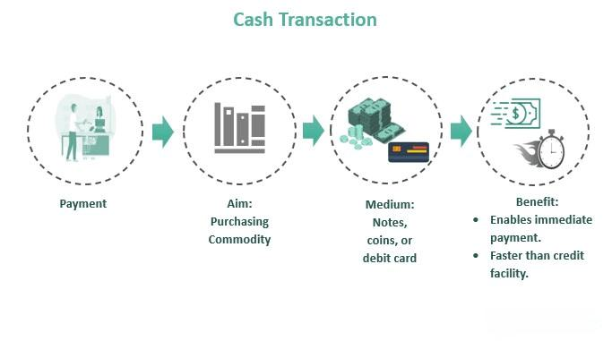

## Table of Contents

## What is a cash transaction?

A cash transaction is when you buy something or pay for a service using physical money, like coins and banknotes. It's different from using a credit card, debit card, or online payment because you hand over actual money to the person or store you're buying from. Cash transactions are quick and don't need any machines or internet connection, which makes them handy for small purchases or when you're in a hurry.

Cash transactions are also private because they don't leave a digital record like electronic payments do. This can be good if you want to keep your spending private, but it can also make it harder to keep track of your money or get it back if you lose it. Many people still use cash because it's widely accepted and easy to use, especially in places where electronic payment systems are not common or trusted.

## How does a cash transaction differ from other types of transactions?

A cash transaction is when you use physical money, like coins and bills, to pay for something. This is different from other types of transactions, like using a credit card, debit card, or digital payment apps. When you use a card or an app, the money doesn't change hands right away. Instead, the payment is processed electronically, and the money is taken from your bank account or charged to your card later. With cash, you give the exact amount of money to the seller, and the transaction is complete right then and there.

Another big difference is that cash transactions are private and leave no digital trail. When you use a card or an app, the transaction is recorded electronically, which can be helpful for keeping track of your spending or getting a refund if something goes wrong. But it also means that others, like banks or companies, can see where and how you're spending your money. With cash, there's no record of the transaction, so it's more private. However, this also means if you lose cash, it's usually gone for good, whereas with electronic payments, you might be able to get your money back.

## What are the advantages of using cash for transactions?

Using cash for transactions has several advantages. One big advantage is that it's simple and fast. When you pay with cash, you don't need a machine or the internet to complete the purchase. You just hand over the money, and the transaction is done. This makes it easy to use anywhere, even in places where electronic payments might not work or be accepted. Also, paying with cash can help you stick to a budget because you can see and feel the money leaving your hands, which can make you think more about your spending.

Another advantage of cash is privacy. When you use cash, there's no record of the transaction, so no one else can see what you bought or how much you spent. This can be important if you want to keep your spending private. Plus, cash doesn't rely on technology, so you don't have to worry about things like card fees, bank charges, or the risk of electronic fraud. If you're in a situation where you need to pay quickly and safely, cash is a reliable choice.

## What are the disadvantages of using cash for transactions?

One big problem with using cash is that it can be lost or stolen easily. If you lose cash or someone steals it, it's usually gone for good. You can't call your bank and get it back like you can with a credit or debit card. This can be a big worry, especially if you're carrying a lot of money. Also, cash can be heavy and hard to [carry](/wiki/carry-trading) around, especially if you need to bring a lot of it.

Another issue is that cash can be hard to keep track of. When you pay with cash, there's no record of where your money went. This can make it tough to remember how much you spent or what you bought. It can also make it harder to keep a budget or see where your money is going. If you need to return something, it can be more complicated without a receipt or a record of the transaction.

Lastly, not everyone accepts cash anymore. Some stores and businesses are moving to card-only or digital payments. This can be a problem if you only have cash and the place you want to buy from doesn't take it. Also, in some countries, using cash a lot can be seen as suspicious because it's harder to track where the money came from or went.

## Can you provide examples of common cash transactions?

A common cash transaction happens when you buy something small, like a coffee at a café. You go to the counter, order your drink, and hand the barista some bills or coins. They give you your change, and that's it. You walk away with your coffee, and the café has the money right away. It's quick and easy, and you don't need any cards or machines.

Another example is when you pay for a taxi ride. After the ride is over, you tell the driver where you're going, and when you get there, you give them the fare in cash. They might give you some change back if you gave them more than the cost of the ride. It's simple and doesn't need any technology, which is handy if you're in a hurry or if the taxi doesn't take cards.

Lastly, think about buying something at a local farmer's market. You pick out some fresh fruits and vegetables, and when you're ready to pay, you hand the seller cash. They might put the money in a box or their pocket, and you take your goods home. It's a direct and personal way to buy things, and many people like it because it supports local sellers and is easy to do.

## How is cash handled in retail environments?

In retail environments, cash is handled at the checkout counter. When a customer wants to buy something, they bring their items to the cashier. The cashier rings up the total on the register and tells the customer how much they owe. The customer then gives the cashier the money, usually in bills and coins. The cashier counts the money to make sure it's the right amount. If the customer gave more money than the price, the cashier gives back the change. The money is then put into the cash drawer, which is part of the register.

To keep track of the cash, the store might have rules about how to handle it. For example, the cashier might have to count the money at the start and end of their shift to make sure nothing is missing. Sometimes, a manager will come and do a surprise check to make sure everything is right. The cash from the day's sales is usually taken out of the register at the end of the day and put into a safe place, like a safe or a bank deposit bag. This helps keep the money safe and makes it easier to count how much money the store made that day.

## What are the tax implications of cash transactions for businesses?

When businesses use cash for transactions, it can make it harder to keep track of their money for taxes. With cash, there's no automatic record like there is with credit or debit card payments. This means the business has to be very careful to write down every cash sale and keep good records. If they don't, they might not report all their income correctly on their tax return. This could lead to problems with the tax office, like getting fined or even facing legal trouble if they're caught not reporting all their earnings.

On the other hand, some businesses might try to hide some of their cash income to pay less in taxes. This is called tax evasion and it's against the law. The tax office knows that some businesses might do this, so they have ways to check if businesses are reporting all their money. For example, they might look at how much stock a business buys compared to how much they say they sold. If the numbers don't match up, it could be a sign that the business is not reporting all its cash sales. So, while cash can be convenient, it also means businesses need to be extra careful with their tax records.

## How do cash transactions impact financial tracking and budgeting?

Cash transactions can make it harder to keep track of your money and stick to a budget. When you pay with cash, you don't get a receipt or an electronic record of what you bought. This means you have to remember or write down every cash purchase you make. If you don't, it's easy to forget how much money you spent or where you spent it. This can mess up your budget because you might think you have more money left than you actually do.

On the other hand, using cash can help some people stick to a budget better. When you use cash, you can see and feel the money leaving your hands, which can make you think more about your spending. If you only bring a certain amount of cash with you, you can't spend more than that. This can help you avoid overspending and stick to your budget. But, you still need to keep good records to make sure you know where all your money is going.

## What security measures should be taken when dealing with large cash transactions?

When dealing with large cash transactions, it's important to keep the money safe. One way to do this is by using a secure place to store the cash, like a safe or a locked drawer. If you're moving the cash, use a secure bag or envelope, and don't show the money to other people. It's also a good idea to have more than one person handle the cash, so someone else can watch and make sure everything is done right. This can help prevent theft or mistakes.

Another important thing is to keep good records of the cash transactions. Write down how much money you received, who it came from, and what it was for. This can help you if there's a problem later, like if someone says they didn't get the money or if you need to show the records to the tax office. Also, be careful about who you trust with the cash. Only let people you know well and trust handle the money, and always double-check the amounts to make sure no one is taking any for themselves.

## How have cash transactions evolved with the introduction of digital payment methods?

Cash transactions have changed a lot since digital payment methods came around. Before, people mostly used cash for everything. Now, with things like credit cards, debit cards, and apps like PayPal or Venmo, you can pay for stuff without using cash. This has made it easier to buy things online or when you're far away from the person you're paying. A lot of people like using these digital methods because they're quick and you don't have to carry around a lot of money. But even with all these new ways to pay, cash is still used a lot, especially for small purchases or in places where digital payments aren't common.

The way businesses handle cash has also changed. Now, they have to keep track of both cash and digital payments. Some stores even have machines that can count cash and check if it's real, which helps stop people from using fake money. Even though digital payments are popular, businesses still need to be careful with cash because it can be lost or stolen easily. So, they use safes and keep good records to make sure their money stays safe. Overall, while digital payments have made a big difference, cash is still an important part of how people buy things.

## What are the regulatory considerations for businesses primarily dealing in cash?

Businesses that mostly deal in cash need to follow certain rules to make sure they're doing things the right way. One big rule is keeping good records of all their cash transactions. This helps them report all their money correctly when they do their taxes. If they don't keep good records, they could get in trouble with the tax office and might have to pay fines or even face legal problems. Another rule is about making sure the cash they get is real and not fake. Some businesses use special machines to check this, and they have to be careful not to accept money that isn't real.

Also, businesses need to think about anti-money laundering laws. These laws are there to stop people from using businesses to hide money they got from doing bad things, like crime. If a business deals with a lot of cash, they might have to report big cash transactions to the government. This helps the government keep an eye on where big amounts of money are coming from and going to. So, even though dealing in cash can be simple, businesses need to be careful and follow these rules to stay out of trouble.

## How can businesses optimize their cash handling processes to improve efficiency?

Businesses can make their cash handling better by using technology. They can get machines that count cash fast and check if it's real. This saves time and helps stop people from using fake money. Also, using a point-of-sale (POS) system can help keep track of cash transactions easily. The system can record every sale and make reports, so the business knows how much money they made and where it came from. This makes it easier to do their taxes and keep everything organized.

Another way to make cash handling more efficient is to have clear rules about who can touch the cash and how it should be stored. Businesses can train their workers to follow these rules, like counting the money at the start and end of their shift and putting it in a safe place. Having more than one person check the cash can also help stop mistakes or theft. By making sure everyone knows what to do, the business can handle cash better and keep everything running smoothly.

## What is the interplay between cash transactions and algo trading?

The synergy between cash transactions and [algorithmic trading](/wiki/algorithmic-trading) in financial markets has become increasingly pivotal in shaping contemporary investment strategies. This interplay significantly enhances financial decision-making and [liquidity](/wiki/liquidity-risk-premium) management, providing a framework that allows firms to efficiently respond to shifting market conditions. 

Algorithmic trading, by design, adjusts transactions dynamically to meet the liquidity requirements dictated by an organization’s cash flow. This adaptability is crucial as it enables companies to swiftly capitalize on investment opportunities without jeopardizing their operational efficiency. For instance, algorithms are programmed to process real-time financial data, such as cash inflows and outflows, to ensure that trades are executed in a manner that optimizes liquidity while minimizing potential costs associated with immediate transaction needs.

A practical example of this dynamic adjustment is the deployment of algorithmic models to determine optimal trade execution strategies. These models assess real-time cash flow metrics to decide when to enter or [exit](/wiki/exit-strategy) positions, thus aligning trading activities with the company’s liquidity status. This alignment not only facilitates operational efficiency but also allows firms to maintain a strategic backup of liquidity, which can be critical during financial downturns.

In mathematical terms, consider a simple algorithmic trading strategy that needs to decide the timing of trades based on available liquidity. Suppose $L(t)$ represents the liquidity at time $t$, which directly influences the trade amount $T(t)$. An algorithmic model could adjust $T(t)$ dynamically using a function like:

$$
T(t) = f(L(t), m, \sigma)
$$

where $m$ is the expected market return, and $\sigma$ is the market volatility. Such equations are designed to ensure that the trading volume remains within the constraints posed by available liquidity, thereby preventing over-leveraging and maintaining financial stability. 

Furthermore, organizations can employ such algorithmic strategies to synchronize trade execution with cash flow analysis, optimizing the balance between asset acquisition and divestment. This strategic alignment ensures that businesses can attain their financial objectives with enhanced precision and flexibility, ultimately contributing to sustainable growth and increased competitiveness in volatile markets.

## References & Further Reading

- **Bergstra, J., et al. (2011). Algorithms for Hyper-Parameter Optimization.** This foundational work discusses algorithms designed to optimize hyper-parameters, which are crucial for improving the performance of machine learning models in various contexts, including algorithmic trading. The study provides insights into techniques such as random search and Bayesian optimization, essential in crafting sophisticated trading algorithms that respond efficiently to market data.

- **Jansen, S. Machine Learning for Algorithmic Trading.** This resource provides a comprehensive guide to integrating machine learning techniques with algorithmic trading strategies. Jansen's work offers practical examples and includes Python implementations, enabling readers to effectively apply machine learning for analyzing financial markets and executing trades with precision.

- **Lopez de Prado, M. Advances in Financial Machine Learning.** Lopez de Prado's work is a pivotal resource for understanding the intersection of finance and machine learning. It investigates into advanced techniques for financial data analysis, such as backtesting and feature engineering, equipping investors and analysts with the tools to create robust algorithmic trading strategies that can adapt to evolving market conditions.

- **Investopedia on cash transactions and algorithmic trading.** Investopedia is a valuable source for understanding fundamental and advanced financial concepts, including cash transactions and algorithmic trading. It provides accessible explanations and real-world examples, helping readers grasp how these financial elements function and their implications for modern trading and investment practices.

- **Additional readings in financial literature and strategy applications.** Exploring a breadth of literature, this category includes a variety of studies and resources that expand one's understanding of strategic financial planning and the application of both traditional and modern trading methods. These readings offer a blend of theoretical insights and practical strategies, enabling investors and organizations to achieve greater financial outcomes.

