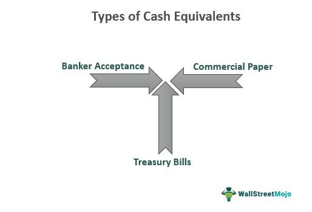

The evolution of currency marks a significant milestone in the development of modern financial systems. From the rudimentary days of barter to the complex monetary frameworks that govern global economies today, understanding how money has evolved is crucial. Modern currency systems provide the foundation for economies, facilitating trade, promoting financial stability, and shaping monetary policy. Historically, as societies grew more complex, there was a need for standardized forms of exchange, leading to the inception of coins and later, paper money. These developments not only streamlined trade but also embedded social trust in these systems.

In recent times, the financial landscape has experienced a transformative shift with the introduction of algorithmic trading. This highly sophisticated trading method uses advanced mathematical models and algorithms to make transaction decisions at speeds and frequencies beyond human capability. Algorithmic trading has become a significant component of the financial markets, enhancing liquidity, reducing costs, and opening new avenues for profitability. It underscores the increasing relevance of technology in the economic sphere, highlighting how computational advancements are reshaping traditional economic activities.



This article aims to provide comprehensive coverage of the evolution, types, and technological advancements in currency. By examining the origins of currency, the transition to digital and cryptocurrencies, and the revolutionary impact of algorithmic trading, we aim to create an interdisciplinary narrative. This narrative combines historical insights with the latest financial technologies, offering a holistic perspective on the ongoing transformations in financial systems.

Readers can expect an insightful journey through the history of currency, exploring the variety of cash forms that exist globally, and examining the rise of digital currencies and their implications. Additionally, the article will investigate how algorithmic trading is revolutionizing markets and the intersection of technology and traditional cash systems. The ultimate goal is to equip readers with a nuanced understanding of how past developments inform present dynamics and future trends in global finance.

## Table of Contents

## The History of Currency

Currency has undergone a profound transformation since the earliest days of human trade. Initially, the barter system was the primary mechanism for exchange, where goods and services were directly traded without a standardized medium. As societies evolved, the inefficiencies of barter, such as the double coincidence of wants, necessitated a more reliable means of trade, paving the way for the emergence of currency.

The origins of currency can be traced back to the use of commodity money, which possessed intrinsic value. Commodity money often consisted of objects that were universally accepted for their inherent usefulness—cattle, grains, and tools, for example. However, as trade networks expanded, the limitations of the bulk and divisibility of these goods led to the advent of metallic money.

Precious metals such as gold and silver became central to currency development due to their durability, divisibility, and intrinsic value. These metals were fashioned into coins, which facilitated easier transactions. The first known coins were produced in the region of Lydia (modern-day Turkey) around 600 BCE. These coins were stamped with images and symbols to denote authenticity and value, simplifying trade and establishing a more standardized monetary system.

The transition from coins to paper money marked a significant milestone in currency evolution. During the Tang Dynasty in China (618–907 CE), the inconvenience of carrying large amounts of coins led to the development of "exchange certificates" issued by merchants, which eventually transformed into state-sanctioned paper currency in the Song Dynasty (960–1279 CE). Paper money offered a lighter, more portable alternative to metal coins, facilitating larger and more complex trade activities.

The establishment of modern fiat currency transformed global economic frameworks. Fiat currency, unlike metal coins or commodity money, holds no intrinsic value; its worth is derived solely from the trust and authority of the issuing government. This transition to fiat money became evident in the 20th century when most countries decoupled their currencies from precious metals with the abandonment of the gold standard, which had underpinned global monetary systems in previous centuries.

Several historical milestones have significantly shaped the evolution of currency. The introduction of banknotes in Europe during the 17th century by institutions such as the Bank of England revolutionized finance by promoting an economy truly based on credit and trust. The Bretton Woods Conference of 1944 further established a new monetary order, resulting in the creation of the International Monetary Fund (IMF) and the World Bank, and ushered in a period where the U.S. dollar became the world’s reserve currency.

In summary, the journey from barter to modern currency is marked by pivotal transitions and innovations. The use of precious metals, the invention of coins, the emergence of paper money, and the dominance of fiat currency each represent significant shifts that have enabled complex economic systems and global trade networks. Understanding these evolutionary stages provides critical insights into the current and future role of money in society.

## Types of Cash

Cash serves as one of the most fundamental components of the modern financial landscape, traditionally manifesting in two primary forms: coins and paper money. These tangible assets facilitate everyday transactions, showcasing significant global variations in their usage and design, yet sharing a common role as the trusted medium for face-to-face commerce. 

Coins, typically fashioned from metal, have a long historical pedigree as a durable medium of exchange. Their material composition—often including metals such as copper, nickel, and zinc—assures longevity and resistance to wear. Coins often bear intricate designs featuring national symbols, famous individuals, or historical events, reflecting cultural values and national pride. Conversely, paper money, made from cotton or polymer blends, offers lightweight portability and is easily stored. It usually features complex anti-counterfeiting measures like watermarks, holograms, and intricate art, designed to ensure security and authenticity.

Globally, cash usage varies significantly, shaped by cultural, economic, and technological factors. Nations such as Japan and Germany maintain a strong preference for cash transactions due to cultural norms valuing privacy and security. In contrast, countries like Sweden and South Korea have progressively reduced cash usage in favor of digital payment systems, driven by technological advancements and government policies promoting electronic transactions.

Despite the technological advancements reshaping financial transactions, physical cash continues to play a pivotal role in everyday commerce. Routine activities—such as shopping at local markets, tipping service workers, or managing small personal exchanges—often rely on cash, especially in rural or less technologically advanced regions where electronic payment systems might be less prevalent.

Nevertheless, the advent and proliferation of digital payment methods have triggered a noticeable decline in cash usage across various regions. Technologies like mobile payments, e-wallets, and contactless cards are growing in popularity due to their convenience and the increasing digitization of societies. This shift towards cashless transactions is particularly prominent in nations with robust digital infrastructure, such as the Nordic countries, where cash transactions have become noticeably scarce.

Central banks hold a critical responsibility in issuing and regulating cash, ensuring the stability and integrity of the nation's currency. These institutions dictate minting regulations, manage currency distribution, and implement monetary policy to control inflation and stabilize the economy. Furthermore, central banks have the authority to phase out outdated denominations, introduce new features to combat counterfeiting, and determine the overall money supply, aligning with broader economic strategies.

In conclusion, while digital payment methods increasingly encroach upon cash's traditional domain, the role of physical currency remains entrenched and multifaceted, shaped by central banking policies and enduring cultural practices. The dynamic interplay between cash and emerging financial technologies continues to evolve, reflecting and influencing broader economic trends globally.

## The Rise of Digital and Cryptocurrencies

Digital currencies, a broad term encompassing electronic currencies and cryptocurrencies, represent significant advancements in the financial sector. These innovations have begun to challenge traditional cash systems by offering an alternative form of payment and value storage. The rise of cryptocurrencies, particularly Bitcoin and Ethereum, marks a pivotal shift towards decentralized financial systems that leverage blockchain technology—an immutable ledger system underpinning digital currency transactions.

Bitcoin, introduced in 2009, and Ethereum, launched in 2015, are prominent examples of cryptocurrencies that have revolutionized digital finance. Bitcoin was conceptualized as a peer-to-peer electronic cash system, providing an alternative to fiat currencies. Its decentralized nature allows for transactions to occur without intermediaries, reducing costs and increasing efficiency. Ethereum expanded upon the concept by introducing smart contracts, self-executing contracts with terms directly written into code, thereby automating and securing transactions over the blockchain.

Technological advancements are fundamental to the proliferation of digital currencies. Blockchain technology, with its decentralized and distributed ledger system, ensures transparency and security in transactions, minimizing the risk of fraud and enhancing trust among users. Additionally, cryptography secures transactions and controls the creation of new units, maintaining the integrity of the currency.

Despite the promising advantages of digital currencies, they pose significant regulatory challenges. The decentralized and often anonymous nature of cryptocurrencies complicates regulatory oversight, raising concerns about their potential use in illicit activities such as money laundering and tax evasion. Market [volatility](/wiki/volatility-trading-strategies) is another issue; cryptocurrencies are subject to significant price fluctuations, influenced by factors like investor speculation and regulatory news. This volatility poses risks to investors and can hinder widespread adoption as a stable currency.

The future of digital currencies holds the potential to reshape economic systems fundamentally. As traditional financial institutions and governments explore digital currency applications, such as central bank digital currencies (CBDCs), a hybrid financial ecosystem could emerge, integrating conventional banking with blockchain-based solutions. Digital currencies could enhance financial inclusion, enabling access to financial services for unbanked populations, and revolutionize cross-border transactions by reducing costs and settlement times.

In conclusion, the rise of digital and cryptocurrencies presents opportunities and challenges that may significantly influence the evolution of financial systems. As technological advancements continue to drive innovation in digital currency transactions, their impact on global economies will likely be profound, prompting the need for adaptive regulatory frameworks to balance potential risks and benefits.

## Algorithmic Trading: Revolutionizing Markets

Algorithmic trading refers to the automated trading of financial instruments using complex algorithms to make decisions and execute trades in modern financial markets. The process relies heavily on pre-defined sets of rules and calculations, allowing for the swift execution of trades without human intervention. This form of trading has transformed market dynamics by leveraging technological advancements to increase the speed and efficiency of transactions.

At the core of [algorithmic trading](/wiki/algorithmic-trading) are algorithms that analyze vast amounts of data and derive optimal trading strategies. High-frequency trading ([HFT](/wiki/high-frequency-trading-strategies)) systems are a subset of algorithmic trading, characterized by executing a large number of orders at incredibly high speeds. Such systems can complete trades in fractions of a second, often benefiting from even the slightest price discrepancies across markets. Python, for instance, is extensively used to write trading algorithms due to its rich scientific libraries like NumPy and Pandas, which facilitate data manipulation and analysis.

Algorithmic trading offers several advantages. Its speed and efficiency surpass human capabilities, executing trades in milliseconds and enabling rapid responses to market changes. This reduces human error, as algorithms can precisely follow their programmed logic without the influence of emotional or psychological factors. Additionally, algorithms can process and analyze massive datasets that would otherwise be unmanageable, identifying patterns and opportunities that may not be visible to human traders.

However, algorithmic trading is not without its risks and criticisms. The reliance on technology means that software bugs or system failures can lead to significant financial losses. A notable example is the "Flash Crash" of May 6, 2010, when the U.S. stock market saw a rapid and deep decline in prices, partly attributed to algorithmic trading. Such events highlight the potential for extreme market volatility induced by automated systems. Critics also argue that algorithmic trading may contribute to market unfairness, as firms with access to superior technology can gain undue advantages over other market participants, leading to unequal playing fields.

Several case studies underscore the impact of algorithmic trading on financial markets. For instance, algorithms are often employed to exploit [arbitrage](/wiki/arbitrage) opportunities, buying and selling the same asset in different markets to profit from price discrepancies. A practical application is [statistical arbitrage](/wiki/statistical-arbitrage), which involves leveraging statistical models to predict price movements and execute trades based on historical correlations between securities.

In summary, algorithmic trading has revolutionized financial markets by enhancing trade execution speed, efficiency, and data processing capabilities. Yet, it also presents significant risks and ethical concerns that necessitate robust regulatory frameworks and continuous oversight to ensure market stability and fairness. As technology advances, the role of algorithmic trading is likely to expand further, shaping the future landscape of global financial markets.

## The Intersection of Cash and Technology

The integration of cash and technology has transformed traditional payment systems, exemplified by the rise of mobile payments. Mobile payment systems, such as Apple Pay, Google Wallet, and Samsung Pay, utilize near-field communication (NFC) technology and secure authentication methods to facilitate seamless and contactless transactions. These innovations have redefined the way consumers interact with their finances, enabling the convenience of paying directly from mobile devices without the need for physical cash or cards.

Furthermore, fintech innovations have disrupted traditional banking and cash handling. Financial technology companies have introduced platforms like Venmo and PayPal, which allow peer-to-peer transfers without the necessity of visiting a bank or handling physical money. These platforms often offer lower transaction fees and faster processing times, posing significant competition to conventional banking services. Consequently, banks have been compelled to innovate, incorporating digital services and mobile banking apps to retain customer engagement.

The advent of cashless societies has had profound impacts on global economies. In countries like Sweden and China, where digital transactions overwhelmingly surpass cash transactions, economic activities have become more streamlined and efficient. Cashless transactions reduce the costs associated with printing, transporting, and securing physical currency. However, economic disparities can emerge, as those without access to digital infrastructure are potentially marginalized.

Digitizing financial transactions carries significant security implications. While electronic payments improve transactional efficiency, they also introduce vulnerabilities, including cybersecurity threats such as hacking and identity theft. Secure encryption, multi-[factor](/wiki/factor-investing) authentication, and transaction monitoring systems are essential in safeguarding digital financial transactions from malicious actors. Enhanced security protocols are vital to maintaining trust in digital payment systems.

Looking forward, the integration of cash, digital currencies, and algorithmic trading suggests a complex yet promising financial landscape. As digital currencies like Bitcoin and Ethereum continue to gain traction, their coexistence with traditional cash systems presents opportunities for innovative payment solutions that leverage the security and decentralization of blockchain technology. Algorithmic trading could further enhance these possibilities by optimizing currency exchange rates and transfer times through advanced computational models and data analysis.

Python, for instance, can be used to simulate algorithmic trading strategies with digital currencies. An example script might look like this:

```python
import numpy as np
from binance.client import Client

# Configure API
client = Client('api_key', 'api_secret')

# Retrieve historical data
candlesticks = client.get_historical_klines("BTCUSDT", Client.KLINE_INTERVAL_1DAY, "1 Jan, 2020", "1 Oct, 2023")

# Simple moving average strategy
def moving_average(data, window):
    return np.convolve(data, np.ones(window), 'valid') / window

closing_prices = np.array([float(candle[4]) for candle in candlesticks])  # extract closing prices
sma = moving_average(closing_prices, window=50)

# Analyze trading signals
for i in range(1, len(sma)):
    if closing_prices[i + 49] > sma[i - 1]:  # Buy signal
        print(f"Buy at {closing_prices[i + 49]}")
    elif closing_prices[i + 49] < sma[i - 1]:  # Sell signal
        print(f"Sell at {closing_prices[i + 49]}")
```

This script extracts historical data of Bitcoin to USDT exchange rates from Binance, calculates a simple moving average, and identifies buy and sell signals based on price movements relative to this average. Such integration of algorithmic trading strategies into digital currency markets highlights the future potential for optimizing and enhancing the dynamic interaction between cash, digital currencies, and innovative financial technologies.

## Conclusion

In exploring the intricate tapestry of currency's history and the continual advancements in financial technology, this article provides a comprehensive overview of how financial systems have evolved and adapted over time. Recognizing the roots of currency, from the barter system to the intricate systems of fiat and digital currencies, sheds light on the crucial shifts that have shaped current economic landscapes. Understanding this evolution is essential for comprehending how societies have reached today's complex financial systems and what the future may hold.

Cash, in its various forms—from metal coins to paper money—has been pivotal in shaping economic interactions globally. Despite a gradual decline in physical cash usage propelled by the rise of digital payment methods, its role remains significant. Concurrently, the emergence of cryptocurrencies, fueled by technological innovation, poses both opportunities and challenges for the future of transactions. These digital currencies offer an alternative to traditional currency systems, potentially reshaping economic frameworks but also bringing about regulatory and volatility concerns.

Algorithmic trading further exemplifies the revolution in financial markets, where speed and efficiency are enhanced through technology-driven solutions. Although this practice presents risks and criticisms, its impact underscores the necessity for ongoing adaptation and understanding of these dynamic environments.

It is imperative for readers, whether individuals or industry stakeholders, to remain informed about these changes. As financial systems continue to evolve, driven by technological breakthroughs and changing societal needs, staying updated becomes a valuable asset. The convergence of cash, digital currencies, and algorithmic trading epitomizes a significant transitional phase in modern economics.

In conclusion, with currency at the intersection of history and future potential, stakeholders must embrace these transformations responsibly. Whether through policy, innovation, or adaptation, it is crucial to navigate the path forward with informed consideration of the past and present. This vigilance ensures not only participation in but also shaping of the future economic landscape.

## References & Further Reading

[1]: Ferguson, Niall. ["The Ascent of Money: A Financial History of the World."](https://www.amazon.com/Ascent-Money-Financial-History-World/dp/0143116177) Penguin Books, 2009.

[2]: Harford, Tim. ["The Undercover Economist Strikes Back: How to Run—or Ruin—an Economy."](https://www.amazon.com/Undercover-Economist-Strikes-Run-Ruin/dp/159463291X) Riverhead Books, 2014.

[3]: Rothbard, Murray N. ["What Has Government Done to Our Money?"](https://mises.org/library/book/what-has-government-done-our-money) Ludwig von Mises Institute, 1990.

[4]: Kelly, J. (2014). ["Algorithmic Trading: Winning Strategies and Their Rationale."](https://www.wiley.com/en-us/Algorithmic+Trading%3A+Winning+Strategies+and+Their+Rationale-p-9781118460146) Wiley.

[5]: Nakamoto, Satoshi. ["Bitcoin: A Peer-to-Peer Electronic Cash System."](https://nakamotoinstitute.org/library/bitcoin/) 2008.

[6]: Mougayar, William. ["The Business Blockchain: Promise, Practice, and Application of the Next Internet Technology."](https://books.google.com/books/about/The_Business_Blockchain.html?id=CEsPDAAAQBAJ) Wiley, 2016.

[7]: Cuthbertson, Keith, and Dirk Nitzsche. ["Financial Engineering: Derivatives and Risk Management."](https://books.google.com/books/about/Financial_Engineering.html?id=yVdWEAAAQBAJ) Wiley, 2001.