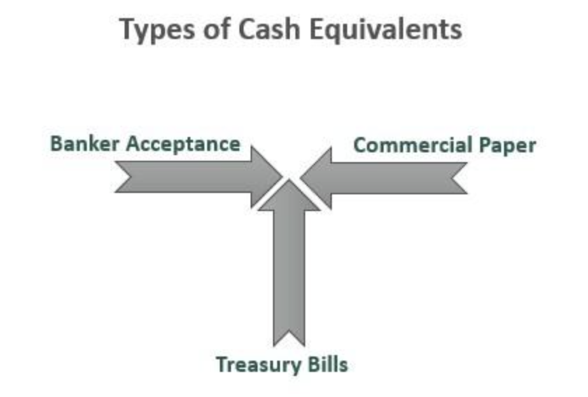

## Table of Contents

## What is cash?

Cash is money in the form of coins or paper notes. It is the most common and direct way people use to buy things and pay for services. When you use cash, you hand over physical money to someone else. This can be done without any special equipment, like a card reader or an internet connection. Cash is accepted almost everywhere, making it very useful for everyday purchases.

Cash is also easy to use because it does not need any technology to work. You can give cash to someone and they can use it right away. It is private too, because when you pay with cash, no one else knows about it except the people involved. However, carrying a lot of cash can be risky because it can be lost or stolen. Despite this, many people still prefer using cash because it is simple and familiar.

## What are the different types of cash?

Cash comes in two main forms: coins and paper money. Coins are made of metal and come in different sizes and values. They are often used for small amounts, like buying a candy or paying for a bus ride. Paper money, or banknotes, are made of paper or a special material that feels like paper. They come in larger amounts and are used for bigger purchases, like buying groceries or paying for a meal at a restaurant.

There are also different kinds of cash around the world. Each country has its own currency, which means its own type of money. For example, in the United States, people use dollars and cents. In Europe, many countries use euros. In Japan, people use yen. Even though these are all types of cash, you can't use dollars in Japan or yen in the United States because they are different currencies. When you travel to another country, you might need to change your money into the local currency to use it as cash there.

## How has the use of cash evolved historically?

A long time ago, people didn't use cash. They traded things they had, like food or tools, for things they needed. This was called bartering. As time went on, people started using items like shells or beads as a way to trade because they were easy to [carry](/wiki/carry-trading) and everyone agreed they had value. Then, around 600 B.C., the first coins made of metal were used in places like Lydia, which is now part of Turkey. These coins were easier to use than shells or beads because they were made of valuable metal and had a set value.

As time passed, paper money started to be used. In China, around the 7th century, people used paper money because it was easier to carry than heavy coins. This idea spread to other parts of the world over time. In the 17th century, banks in Europe started to issue paper notes that people could exchange for gold or silver. Today, most countries have their own paper money and coins. While cash is still very common, people also use cards and digital payments, which are becoming more popular. Even though the way we use money has changed a lot, cash remains important because it's easy to use and accepted almost everywhere.

## What are the physical characteristics of cash?

Cash comes in two main forms: coins and paper money. Coins are made of metal and can be round or have other shapes. They have different sizes and weights depending on their value. Coins often have a picture or symbol on one side, called the heads, and a number or another symbol on the other side, called the tails. The edges of coins can be smooth or have ridges. Paper money, or banknotes, are made of paper or a special material that feels like paper. They are usually rectangular and come in different colors and sizes. Banknotes have pictures, numbers, and special designs to show how much they are worth and to stop people from making fake money.

Both coins and paper money have special features to make them hard to copy. Coins might have tiny letters or numbers that you can only see with a magnifying glass. Paper money often has watermarks, which are pictures you can see when you hold the note up to the light. There can also be shiny strips or special ink that changes color. These features help keep cash safe and trusted. Even though cash looks different in every country, these physical characteristics help people know what is real money and what is not.

## What is the difference between coins and banknotes?

Coins and banknotes are both types of cash, but they are different in many ways. Coins are made of metal and come in different sizes and weights. They are usually round, but sometimes they can have other shapes. Coins are used for smaller amounts of money, like a few cents or dollars. They have pictures or symbols on one side and numbers or other symbols on the other side. The edges of coins can be smooth or have ridges. Coins are very durable and can last a long time.

Banknotes, on the other hand, are made of paper or a special material that feels like paper. They are usually rectangular and come in different colors and sizes. Banknotes are used for larger amounts of money, like tens, hundreds, or even thousands of dollars. They have pictures, numbers, and special designs to show their value and to make them hard to copy. Banknotes can have watermarks, shiny strips, and special ink that changes color. While banknotes are not as durable as coins, they are easier to carry around when you need to pay for something big.

## How is cash produced and distributed?

Cash is made in special places called mints for coins and printing presses for banknotes. For coins, metal is heated and pressed into the right shape with the correct pictures and numbers on them. For banknotes, special paper or material is used and printed with pictures, numbers, and other designs to make sure they are hard to copy. After they are made, the cash is checked to make sure it is good quality. Then, it is sent to banks, where it is kept safe until it is needed.

Once the cash is at the banks, it is given out to people in different ways. People can go to the bank and take out cash from their accounts, or they can use ATMs, which are machines that give out cash. Banks also send cash to businesses, like stores and restaurants, so they can give change to their customers. Sometimes, the government might send new cash directly to people, like when they want to change the look of the money. This is how cash gets from the places where it is made to the people who use it every day.

## What are the security features of modern cash?

Modern cash has many security features to make it hard for people to make fake money. Coins have tiny letters or numbers that you can only see with a magnifying glass. The edges of coins can be special, like having ridges or being smooth in a certain way. Banknotes have watermarks, which are pictures you can see when you hold the note up to the light. They also have shiny strips or special ink that changes color. All these things help to make sure that the cash is real and not fake.

These security features are important because they help keep the money safe and trusted. People and machines can check these features to make sure the cash is good. For example, some machines at stores can tell if a banknote is real by looking at the special ink or the watermark. If someone tries to use fake money, these features can help catch them. This makes modern cash more secure and helps everyone trust the money they use every day.

## How do different countries manage their cash supply?

Different countries manage their cash supply through their central banks, which are special banks that control the money for the whole country. The central bank decides how much money should be made and sent out to people and businesses. They look at how much money people are using and how the economy is doing to make these decisions. If people need more money, the central bank tells the mints and printing presses to make more coins and banknotes. If there is too much money, they might take some out of circulation by destroying old or damaged cash.

Central banks also work with regular banks to make sure cash gets to where it is needed. They send new cash to these banks, which then give it to people and businesses. Sometimes, the central bank might change the look of the money to make it harder to copy or to celebrate something important. They keep track of how much cash is out there and make sure it stays safe and trusted. This way, everyone in the country can use cash easily and without worry.

## What impact has digital currency had on the use of cash?

Digital currency has changed how people use cash. More people are using digital money, like Bitcoin or money in their bank accounts, to buy things. This means they don't need to carry cash as much. Stores and businesses are also using more digital payments, like credit cards or apps on phones, which makes it easier for people to pay without cash. Because of this, some people use less cash now than before.

Even though digital currency is becoming more popular, cash is still important. Many people like using cash because it's simple and works everywhere. Some people don't have bank accounts or digital wallets, so they still need to use cash. Also, when there are problems with technology or the internet, cash can still be used. So, while digital currency is changing how we use money, cash still has a big role in our lives.

## What are the economic theories related to cash and its circulation?

Economic theories about cash and its circulation help explain how money moves around in an economy. One important theory is the quantity theory of money, which says that the amount of money in an economy affects prices. If there is more money, prices go up, and if there is less money, prices go down. This theory helps central banks decide how much money to print and send out. Another theory is the velocity of money, which looks at how quickly money changes hands. If money moves fast, it means people are buying and selling a lot, which can make the economy grow.

Another theory is about the demand for money, which looks at why people want to hold onto cash instead of spending it. People might keep cash for everyday spending, to save for the future, or just to be safe in case they need it. This demand affects how much money is circulating in the economy. If people want to hold more cash, less money is moving around, which can slow down the economy. On the other hand, if people spend more, the economy can grow faster. These theories help economists and policymakers understand and manage the flow of cash in an economy.

## How does cash function in different economic systems?

In different economic systems, cash plays important roles but works a bit differently. In a market economy, cash is used by people to buy and sell things freely. People can choose what they want to buy and how much they want to spend. Businesses use cash to pay for things they need and to give change to customers. The government controls how much cash is in the economy by printing more or taking some out. This helps keep the economy stable and growing.

In a planned economy, the government has more control over cash. They decide how much money people can have and what they can spend it on. Cash is still used for buying things, but the choices are limited by the government's plans. The government might also use cash to pay people for working and to make sure everyone has what they need. Even though the way cash works is different, it is still important for making the economy run smoothly.

## What are the future trends and potential developments in the use of cash?

In the future, the use of cash might change a lot because more people are using digital payments. Things like credit cards, phone apps, and digital currencies like Bitcoin are becoming more popular. This means people might carry less cash and use it less often. Stores and businesses are also starting to accept more digital payments, which makes it easier for people to buy things without needing cash. Even though cash is still important, the way we use money is changing, and digital payments might become the main way people pay for things.

However, cash will not go away completely. Many people still like using cash because it's simple and works everywhere. Some people don't have bank accounts or digital wallets, so they need to use cash. Also, when there are problems with technology or the internet, cash can still be used. Governments and central banks might keep making new cash with better security features to stop people from making fake money. So, even though digital payments are growing, cash will still have a place in our lives for a long time.

## References & Further Reading

[1]: Ferguson, Niall. ["The Ascent of Money: A Financial History of the World."](https://www.amazon.com/Ascent-Money-Financial-History-World/dp/0143116177) Penguin Books, 2009.

[2]: Harford, Tim. ["The Undercover Economist Strikes Back: How to Run—or Ruin—an Economy."](https://www.amazon.com/Undercover-Economist-Strikes-Run-Ruin/dp/159463291X) Riverhead Books, 2014.

[3]: Rothbard, Murray N. ["What Has Government Done to Our Money?"](https://mises.org/library/book/what-has-government-done-our-money) Ludwig von Mises Institute, 1990.

[4]: Kelly, J. (2014). ["Algorithmic Trading: Winning Strategies and Their Rationale."](https://www.wiley.com/en-us/Algorithmic+Trading%3A+Winning+Strategies+and+Their+Rationale-p-9781118460146) Wiley.

[5]: Nakamoto, Satoshi. ["Bitcoin: A Peer-to-Peer Electronic Cash System."](https://nakamotoinstitute.org/library/bitcoin/) 2008.

[6]: Mougayar, William. ["The Business Blockchain: Promise, Practice, and Application of the Next Internet Technology."](https://books.google.com/books/about/The_Business_Blockchain.html?id=CEsPDAAAQBAJ) Wiley, 2016.

[7]: Cuthbertson, Keith, and Dirk Nitzsche. ["Financial Engineering: Derivatives and Risk Management."](https://books.google.com/books/about/Financial_Engineering.html?id=yVdWEAAAQBAJ) Wiley, 2001.