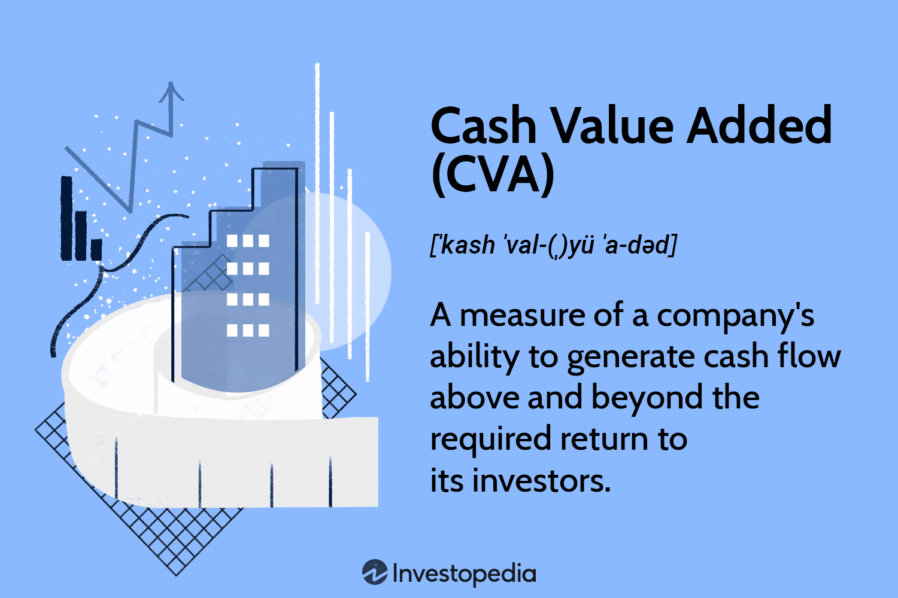

## Table of Contents

## What is Cash Value Added (CVA)?

Cash Value Added (CVA) is a way to measure how well a business is doing by looking at how much cash it makes after paying for the costs of running the business. It's different from other ways of measuring success because it focuses on actual cash, not just numbers on paper. CVA helps business owners see if they are making more money than they are spending, which is important for knowing if the business is healthy and growing.

To calculate CVA, you start with the cash the business brings in, then subtract the costs of running the business, like salaries and rent. After that, you also subtract the cost of the money the business borrowed or used from investors. If the number you get is positive, it means the business is doing well because it's making more cash than it's spending. If it's negative, the business might need to find ways to cut costs or make more money.

## How does Cash Value Added differ from traditional financial metrics like ROI or ROE?

Cash Value Added (CVA) and traditional financial metrics like Return on Investment (ROI) and Return on Equity (ROE) look at different things to measure how well a business is doing. CVA focuses on the actual cash a business makes after paying all its bills and the cost of the money it uses. This means CVA is all about real money that you can see and touch. On the other hand, ROI and ROE use numbers from the company's financial statements, like profits and the value of the company's assets or equity. ROI looks at how much profit you get from an investment compared to how much you put in, while ROE shows how much profit a company makes with the money shareholders have invested.

The big difference is that CVA gives you a clearer picture of the cash flow, which is really important for making sure a business can keep going day to day. It helps business owners see if they have enough cash to pay for things like new projects or unexpected costs. ROI and ROE are more about long-term growth and how well the business is doing overall, but they don't tell you if there's enough cash on hand right now. So, while ROI and ROE are great for understanding overall performance and attracting investors, CVA is better for managing the day-to-day cash needs of a business.

## What are the key components needed to calculate Cash Value Added?

To calculate Cash Value Added, you need to know the cash the business brings in and the cash it spends. The cash the business brings in is called cash inflow. This includes money from selling products or services, and any other money coming into the business. The cash the business spends is called cash outflow. This includes costs like salaries, rent, and any other expenses the business has to pay.

After you find out the cash inflow and cash outflow, you subtract the cash outflow from the cash inflow. This gives you the net cash flow. But to find the Cash Value Added, you need to do one more thing. You have to subtract the cost of the money the business used. This cost is called the cost of capital. It's the price the business pays for using money from loans or investors. If the net cash flow is more than the cost of capital, the Cash Value Added is positive, which means the business is doing well with its cash.

## Can you provide a simple example of how to calculate CVA for a business?

Let's say we have a small bakery. In one year, the bakery makes $100,000 from selling cakes and cookies. This is the cash inflow. The bakery also spends $70,000 on things like flour, sugar, and paying the workers. This is the cash outflow. When we subtract the cash outflow from the cash inflow, we get $100,000 - $70,000 = $30,000. This is the net cash flow.

Now, the bakery borrowed some money to buy new ovens, and the cost of this money, or the cost of capital, is $10,000 for the year. To find the Cash Value Added, we subtract the cost of capital from the net cash flow. So, $30,000 - $10,000 = $20,000. The Cash Value Added for the bakery is $20,000, which means the bakery made more cash than it spent, even after paying for the money it borrowed.

## What are the benefits of using Cash Value Added as a performance metric?

Using Cash Value Added as a performance metric helps business owners see how much real cash their business is making. This is important because cash is what pays the bills and keeps the business running. When you know your Cash Value Added, you can tell if you're making enough money to cover all your costs and still have some left over. This is different from other metrics that might show profit on paper but don't tell you if there's enough cash in the bank.

Another benefit of using CVA is that it helps you make better decisions about where to spend money. If your CVA is high, you might decide to invest in new projects or expand your business. If it's low, you'll know you need to cut costs or find ways to bring in more cash. By focusing on actual cash flow, CVA gives you a clear picture of your business's health and helps you plan for the future.

## How can CVA be used to assess the financial health of a company?

Cash Value Added, or CVA, helps business owners see if their company is making more cash than it is spending. This is important because cash is what keeps the business going day to day. If a company has a high CVA, it means it's making enough money to cover all its costs and still have some left over. This is a good sign that the business is healthy and can keep running without money problems. On the other hand, if the CVA is low or negative, it means the business might be spending more than it's making, which can lead to trouble paying bills and staying open.

CVA also helps business owners make smart choices about where to spend money. If the CVA is high, a business might decide to invest in new projects or grow the company. But if the CVA is low, it's a warning that the business needs to find ways to cut costs or bring in more money. By looking at CVA, business owners can get a clear picture of their company's financial health and plan for the future. It's like a check-up for the business's cash flow, helping to make sure it stays strong and healthy.

## What are the limitations or potential drawbacks of using CVA?

Using Cash Value Added can be helpful, but it also has some problems. One big issue is that CVA only looks at cash coming in and going out right now. It doesn't tell you about things that might happen later, like if a big customer is going to stop buying from you or if you have to pay a big bill soon. This means CVA might make a business look healthy when it's not, because it doesn't see the whole picture.

Another problem with CVA is that it can be hard to compare between different businesses. Each business might have different costs of capital, and what counts as a good CVA can be different for each one. Also, CVA doesn't take into account things like how much the business is growing or how happy its customers are. So, while CVA is good for looking at cash flow, it's not enough by itself to understand everything about how a business is doing.

## How does CVA impact strategic decision-making within a company?

Cash Value Added, or CVA, helps business owners make smart choices about what to do next. When a company sees that its CVA is high, it means it's making more cash than it's spending. This can make business owners feel confident about spending money on new projects or growing the business. For example, if a bakery has a high CVA, the owner might decide to open a new location or buy new equipment to make more cakes and cookies. By using CVA, the owner can see if these big decisions will keep the business healthy and profitable.

On the other hand, if the CVA is low or negative, it sends a warning that the business might be in trouble. This can lead the owner to look for ways to cut costs or find new ways to bring in more money. For instance, if the bakery's CVA is low, the owner might decide to stop buying expensive ingredients or start selling more popular items. CVA helps the owner see the cash flow clearly, so they can make choices that keep the business strong and avoid money problems.

## In what ways can CVA be integrated into a company's overall financial management system?

Cash Value Added, or CVA, can be a big help in a company's financial management system by showing how much real cash the business is making. A company can use CVA to keep an eye on its cash flow and make sure it has enough money to pay its bills and keep running smoothly. By looking at CVA regularly, the company can see if it's doing well or if it needs to make changes. This information can be put into the company's financial reports and shared with managers and owners so everyone knows how the business is doing with its cash.

CVA can also help the company plan for the future. If CVA is high, the company might decide to spend money on new projects or grow the business because it knows it has enough cash to cover these costs. But if CVA is low, the company will know it needs to be careful and maybe cut costs or find new ways to bring in more money. By using CVA as part of its financial management, the company can make smarter decisions and keep its cash flow healthy, which is important for staying strong and growing over time.

## How does CVA relate to other value-based management techniques?

Cash Value Added, or CVA, is a way to measure how well a business is doing by looking at the cash it makes after paying all its costs. It fits into value-based management techniques, which are all about making choices that help the business grow and make money over time. Other value-based management tools, like Economic Value Added (EVA) and Market Value Added (MVA), also focus on how much value a business is creating, but they use different ways to measure it. EVA looks at the profit a business makes after paying for the cost of the money it uses, while MVA looks at how much the business is worth in the market compared to the money put into it. CVA is different because it's all about the real cash the business has, which is important for day-to-day running and making sure there's enough money to keep going.

Even though CVA, EVA, and MVA look at different things, they all help business owners make smart choices. For example, if a business sees that its CVA is high, it might decide to spend money on new projects or grow because it knows it has enough cash. If EVA is high, it means the business is making more profit than the cost of the money it uses, which is good for long-term growth. And if MVA is high, it shows that the business is doing well in the eyes of investors. By using CVA along with these other tools, a business can get a full picture of its health and make choices that help it do better over time.

## What are some advanced applications of CVA in financial analysis and planning?

Cash Value Added, or CVA, can be used in more advanced ways to help businesses plan for the future and make smart choices. One way is by using CVA to do what-if planning. This means the business can look at different scenarios, like what would happen if they started selling a new product or if they had to pay more for supplies. By using CVA, the business can see how these changes would affect their cash flow and decide if they are good ideas or not. This kind of planning helps the business be ready for different situations and make choices that keep their cash flow strong.

Another advanced use of CVA is in performance benchmarking. This means the business can compare its CVA to other businesses in the same industry to see how well it's doing. If a business's CVA is lower than others, it might need to find ways to cut costs or bring in more money. On the other hand, if its CVA is higher, it might be doing something right that other businesses could learn from. By using CVA for benchmarking, a business can see where it stands and find ways to do even better.

## How can companies optimize their operations based on CVA metrics?

Companies can use Cash Value Added, or CVA, to find ways to make their business run better. By looking at CVA, a company can see which parts of the business are making the most cash and which parts are costing too much. If a part of the business has a low CVA, the company might decide to cut costs there. For example, if making a certain product is not bringing in enough cash, the company might stop making it or find cheaper ways to do it. By focusing on the parts of the business with high CVA, the company can put more effort and money into what's working well and make even more cash.

CVA also helps companies decide where to spend money on new projects or growing the business. If the CVA is high, it means the company has enough cash to try new things without worrying about money problems. For instance, if a store sees that selling clothes has a high CVA, it might decide to open a new store or add more clothes to its collection. But if the CVA is low, the company will know it needs to be careful and maybe wait to spend money on big projects until the cash flow gets better. By using CVA to guide their choices, companies can make sure they're using their money in the best way to keep the business strong and growing.

## What is Cash Value Added (CVA) and how can it be understood?

Cash Value Added (CVA) is a financial metric developed to assess a company's effectiveness in generating net cash earnings beyond its cost of capital. Emerging from the broader pursuit of more precise profitability measurements, CVA offers an alternative to traditional metrics by focusing on cash flow generation rather than accounting profits.

CVA can be defined as the difference between the cash flow generated by a company and the cash flow required to cover its costs, including the opportunity cost of capital employed. This metric is crucial in evaluating whether a firm is creating or destroying shareholder value. By focusing on cash flows, CVA provides a more accurate reflection of a firm's ability to sustain operations and fund growth without external financing.

To understand how CVA is calculated, consider its formula, which can be expressed as:

$$
\text{CVA} = \text{Gross Cash Flow} - \text{Economic Depreciation} - \text{Capital Charge}
$$

In this formula:
- **Gross Cash Flow** represents the total cash earnings of the company before accounting expenses.
- **Economic Depreciation** is the calculated reduction in value of the firm's assets over time, beyond the traditional accounting figure, aligning more closely with actual economic loss.
- **Capital Charge** reflects the cost of using capital, calculated as the cost of capital multiplied by the amount of capital employed.

CVA measures a company's ability to generate cash flows that cover its capital costs and more. This is essential because, unlike accounting profits that can be influenced by non-cash items such as depreciation, CVA provides a clear view of cash profitability. A positive CVA indicates that the company is producing sufficient cash flows not only to meet operational requirements but also to provide a return that exceeds the cost of capital. Conversely, a negative CVA suggests that the company is unable to cover its capital costs, potentially indicating value destruction.

Beyond conventional profit metrics like net income, CVA offers insights into real profitability by highlighting cash flow efficiency and capital utilization. It identifies whether the operational strategies and capital investments are yielding desirable returns, facilitating more informed decision-making for management and investors. As such, CVA serves as a vital tool for companies to analyze true economic performance and strategize value creation more effectively.

## How does CVA work and what are the calculation methods?

Cash Value Added (CVA) is a financial metric designed to measure a company’s ability to generate cash flows above the required return on capital expenditures. To assess this, two primary calculation methods are utilized: the Direct Method and the Indirect Method. These methods provide different approaches to evaluating a company’s cash flow performance relative to its invested capital, offering a comprehensive picture of real profitability.

### Direct Method

The Direct Method of calculating CVA is based on the straightforward subtraction of costs and charges from gross cash flow. The formula for this method is:

$$
\text{CVA} = \text{Gross Cash Flow} - \text{Economic Depreciation} - \text{Capital Charge}
$$

- **Gross Cash Flow**: This represents the total cash generated by the company's core operations before any consideration of investment or financing activities. It is a critical component, reflecting the company's operational efficiency.

- **Economic Depreciation**: Unlike accounting depreciation, economic depreciation measures the actual wear and tear of assets, aiming to account for their real economic obsolescence over time. This ensures that the cash flow calculation is not overstated.

- **Capital Charge**: This is the opportunity cost of the capital employed, reflecting the required return investors expect from the capital invested in the company. It accounts for both debt and equity, offering a holistic view of capital costs.

### Indirect Method

The Indirect Method is another approach for calculating CVA, which involves comparing Cash Flow Return on Investment (CFROI) with the company's cost of capital. The formula employed is:

$$
\text{CVA} = (\text{CFROI} - \text{Cost of Capital}) \times \text{Gross Investment}
$$

- **CFROI (Cash Flow Return on Investment)**: This metric evaluates the return that a company generates on its invested capital based on its cash flows. It essentially informs how effectively a company is utilizing its investments to produce cash.

- **Cost of Capital**: Reflective of the hurdle rate, this represents the average rate of return required by investors to compensate for the risk of holding the company’s financial instruments. It incorporates all capital sources, including equity and debt.

- **Gross Investment**: This figure encompasses all invested capital needed for the company’s operations, taking into account any new investments made in the company’s asset base.

By applying these two methods, businesses can gauge their financial health in terms of cash generation and capital efficiency. While both methods aim to provide insights into profitability beyond traditional accounting metrics, the choice between them may depend on the specific analytical context or data availability for the company. Each component plays a crucial role in these calculations, helping stakeholders to understand the performance in generating cash relative to economic costs and investments.

## What is the difference between CVA and EBITDA?

Earnings Before Interest, Taxes, Depreciation, and Amortization (EBITDA) is a widely utilized financial metric that helps assess a company's operational efficiency by focusing on its earnings before the impact of non-operating expenses like interest and taxes, as well as non-cash items such as depreciation and amortization. EBITDA provides a snapshot of a company's financial performance and is particularly useful for comparing profitability across firms and industries, as it standardizes earnings potential by removing the factors that can vary widely between businesses.

Cash Value Added (CVA), on the other hand, provides a more comprehensive measure of a company's profitability. Unlike EBITDA, which centers on operational earnings, CVA considers the cash flows a company generates over and above the cost of capital invested in the business. The formula for CVA is:

$$
\text{CVA} = (\text{CFROI} - \text{cost of capital}) \times \text{gross investment}
$$

Where CFROI (Cash Flow Return on Investment) measures the cash flow per unit of investment, and cost of capital accounts for the required rate of return on invested capital.

The distinctions between CVA and EBITDA lie primarily in their focus and methodology. While EBITDA emphasizes income statement performance by ignoring capital structure and investment returns, CVA evaluates overall cash generation effectiveness, after covering the cost of capital used for investments. This distinction makes CVA a more holistic approach to understanding profitability, as it accounts for both the return on assets and the economic charge associated with those assets.

CVA's comprehensive nature offers deeper insights into a company’s value creation process. It factors in whether a company is not only profitable but also growing shareholder value by generating returns above the weighted cost of capital. Conversely, EBITDA may present an overly optimistic picture, as it excludes crucial financial obligations and investment return rates that influence long-term value.

In summary, while EBITDA is an effective tool for analyzing operational efficiency and potential earnings without financial or investment distortions, CVA provides a broader perspective on financial health by encompassing both profitability and capital efficiency. This often makes CVA a preferred metric for long-term value assessment, especially in strategic financial planning and investment analysis.

## References & Further Reading

[1]: Young, S. D., & O’Byrne, S. F. (2001). ["Economic Value Added: A Shareholder's Best Friend."](https://www.semanticscholar.org/paper/EVA-and-Value-Based-Management%3A-A-Practical-Guide-Young-O'Byrne/8ed783cf633dcfb35f50fd9884b071347083078c) Harvard Business Review.

[2]: Stewart, B. (1991). ["The Quest for Value: A Guide for Senior Managers."](https://www.amazon.com/Quest-Value-Guide-Senior-Managers/dp/0887304184) HarperCollins.

[3]: Koller, T., Goedhart, M., & Wessels, D. (2010). ["Valuation: Measuring and Managing the Value of Companies."](https://www.wiley.com/en-us/Valuation%3A+Measuring+and+Managing+the+Value+of+Companies%2C+7th+Edition-p-9781119610885) John Wiley & Sons.

[4]: Damodaran, A. (1999). ["Value Creation and Enhancement: Back to the Future."](https://pages.stern.nyu.edu/~adamodar/pdfiles/papers/valcre.pdf) NYU Stern School of Business.

[5]: Rappaport, A. (1998). ["Creating Shareholder Value: A Guide for Managers and Investors."](https://www.amazon.com/Creating-Shareholder-Value-Managers-Investors/dp/0684844109) Free Press.

[6]: "How Algorithmic Trading Works" by Futures Magazine. Available at: [https://www.futuresmag.com/2019/05/16/algorithmic-trading-how-it-works-and-why-you-should-care](https://tradeveda.com/does-algorithmic-trading-work/)

[7]: Jensen, M. C. (1986). ["Agency Costs of Free Cash Flow, Corporate Finance, and Takeovers."](https://www.jstor.org/stable/1818789) American Economic Review.