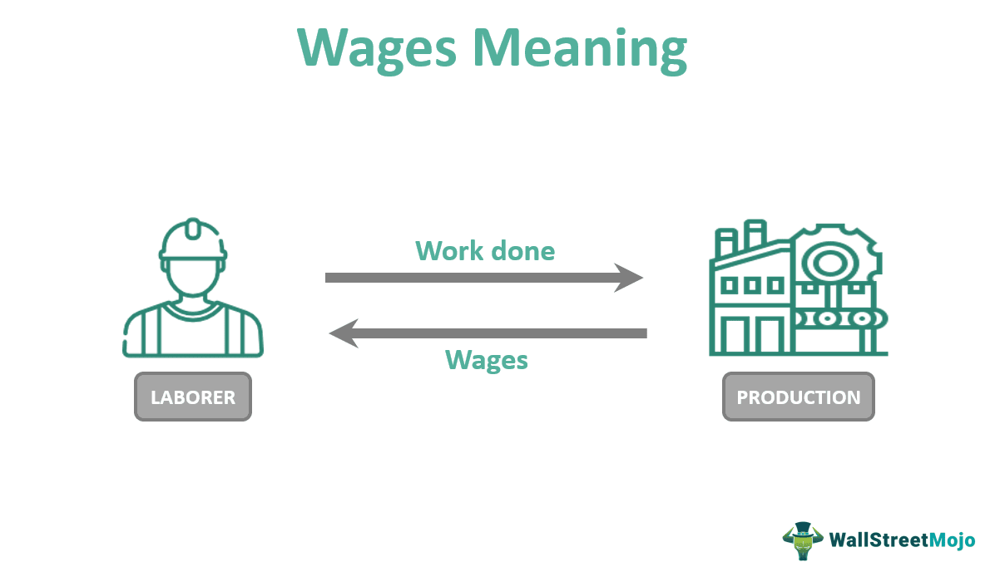

Cash wages, the simplest form of compensation, are payments made directly to employees in the form of physical currency or electronic transfers, distinct from non-cash benefits such as stock options, bonuses, or healthcare benefits. This form of wages remains particularly prevalent in industries like hospitality, retail, and construction, where immediate liquidity is often valued by workers. The significance of cash wages lies in their straightforward nature and immediate accessibility, making them a critical component of compensation for many individuals.

Wage reporting, especially for cash wages, plays a crucial role in ensuring transparency and compliance with tax regulations. Accurate reporting is mandated by tax authorities to uphold fiscal integrity and ensure that individuals and businesses meet their tax obligations. However, challenges such as underreporting or evasion can arise, leading to legal and financial consequences. Proper wage reporting helps mitigate these risks and maintains economic stability by ensuring that public funds are adequately sourced.



Algorithmic trading, an innovation reshaping financial markets, involves executing pre-programmed trading instructions at high speeds and volumes. It leverages complex algorithms and vast data sets to optimize trading decisions, offering precision and efficiency. With technological advancements, algo trading has transcended institutional investors, becoming accessible to retail investors. This democratization of trading empowers individuals with the tools to engage in sophisticated market strategies, contributing to increased market participation and liquidity.

The intersection of cash wages and algorithmic trading opens avenues for individuals seeking alternative investment strategies. Those earning cash wages can allocate portions of their income into algorithmic trading platforms, potentially enhancing their financial growth. However, this requires a keen understanding of both investment strategies and the tax implications associated with such activities. For businesses, integrating cash wage structures with algo trading principles could provide innovative approaches to employee compensation and capital management. Understanding this intersection is crucial for individuals and businesses aiming to optimize financial strategies in an evolving economic landscape.

## Table of Contents

## Understanding Cash Wages

Cash wages refer to the direct monetary compensation that employees receive for their labor, paid out in physical cash or deposited electronically into their bank accounts. Unlike non-cash components of compensation packages such as stock options, benefits, or profit-sharing plans, cash wages are liquid assets, immediately accessible for everyday expenses and needs. This direct form of payment allows employees increased financial flexibility compared to compensation tied up in company stocks or deferred in benefit schemes.

Cash wages are prevalently used across various sectors, particularly in industries characterized by lower skill or entry-level positions, such as hospitality, retail, and certain service trades. These industries often rely on straightforward compensation structures to attract and retain workers who may prioritize immediate payment over more complex remuneration packages. For example, a restaurant server might receive a base cash wage supplemented by cash tips, forming the core of their total income. This immediacy aligns with the financial needs of workers in these sectors, many of whom may not have substantial financial reserves.

The emphasis on cash wages in these industries often emerges from both practical and economic reasons. Practically, the simplicity of cash payment systems reduces administrative overheads associated with more complex benefits management. Economically, offering cash wages can be an effective strategy for businesses seeking to maintain flexibility in labor costs, especially in environments with variable demand patterns.

Furthermore, cash wages play an essential role in the overall compensation package, ensuring that employees have the financial resources necessary to cover immediate living expenses. While non-cash compensation can serve as an attractive incentive for long-term retention and motivation, the utility of cash wages in providing immediate economic relief cannot be understated. They form the bedrock of an employee's financial stability, enabling savings, consumption, and the fulfillment of basic economic responsibilities. 

In summary, cash wages constitute a fundamental component of employment compensation, providing immediate financial means and flexibility to workers, especially in industries relying heavily on manual and service-oriented labor. Their role in supporting the economic well-being of workers highlights their significance within compensation strategies.

## Wage Reporting and Its Importance

Wage reporting plays a crucial role in maintaining transparent and fair financial records, particularly in the context of cash wages, where transactions might not always be documented as rigorously as electronic payments. Legally, employers are obligated to report cash wages to tax authorities just as they would for any other form of compensation. In the United States, this involves filing Form W-2 for employees, ensuring that all earnings, including cash wages, are accurately reported to both the Internal Revenue Service (IRS) and the employee. This requirement is mirrored in many countries where tax systems necessitate comprehensive compensation disclosures. 

Among the challenges associated with wage reporting are the manual tracking and administrative burdens that cash transactions impose on businesses, particularly those that operate with less sophisticated financial reporting systems. Small businesses or those in cash-heavy industries, such as hospitality or domestic services, may find it difficult to implement rigorous accounting practices. Common practices to overcome these challenges include maintaining detailed financial records, employing accounting software, or seeking professional financial advice to ensure compliance and accuracy. Furthermore, there is often a need for employers to stay updated with the ever-evolving tax laws and guidelines concerning wage reporting.

Failing to correctly report cash wages can have significant legal and financial repercussions. Non-reporting or underreporting wages is considered tax evasion, which can lead to penalties, fines, and even criminal charges against the employer. For employees, incorrect reporting may affect their eligibility for certain benefits, such as social security or unemployment insurance, which are calculated based on reported income. In addition, both parties may face audits or investigations, which can be costly and time-consuming. Consequently, understanding and adhering to wage reporting requirements are essential for both employers and employees to avoid the potential pitfalls of non-compliance and ensure that all parties meet their legal obligations.

## Example of Cash Wages in Practice

A pertinent example of cash wages in practice can be seen within the hospitality industry, particularly among restaurant workers such as servers and bartenders. In this sector, cash wages frequently constitute a significant portion of total compensation, primarily due to the inclusion of tips, which are often received in cash. For example, in the United States, servers may earn a base hourly wage that is lower than the federal minimum wage, a structure permitted by law due to the expectation of tip income. As of 2022, the federal tipped minimum wage is $2.13 per hour, while the standard federal minimum wage is $7.25 per hour.

In this context, the typical compensation breakdown for a server in a busy city might look like this: 

- **Base Salary (Cash Wages):** $2.13 per hour for 40 hours = $85.20 per week.
- **Tips (Cash or Cash Equivalent):** $300 per week, varying based on service quality and customer volume.

This results in a total expected weekly income of approximately $385.20, with tips constituting the substantial portion. While tips can be paid in cash, they are considered part of cash wages when it comes to tax reporting.

The dynamics between cash wages and non-cash compensation in the hospitality industry are sharply defined. Non-cash compensation may include meal allowances or free meals during shifts, which contribute to the total remuneration package but do not offer the [liquidity](/wiki/liquidity-risk-premium) that cash income does. These non-cash benefits reduce out-of-pocket living expenses for employees but are not substitutes for cash when addressing immediate financial needs.

The blend of cash wages and non-cash compensation can have significant implications for financial planning and stability of workers. Cash wages, being immediate and liquid, are critical for meeting day-to-day expenses, whereas non-cash compensation can enhance overall job satisfaction and provide long-term financial benefits through cost savings. Employers might use non-cash benefits strategically to attract and retain staff while managing labor costs.

In summary, cash wages, particularly in industries reliant on tipping, are central to the income of employees. However, despite their evident liquidity advantages, they demand careful management, especially concerning tax obligations and personal financial planning, to ensure long-term stability and compliance.

 to Algorithmic Trading

Algorithmic trading, commonly referred to as algo trading, is a method of executing orders using automated and pre-programmed trading instructions. These can include variables such as timing, price, and order size, without the need for human intervention. Algo trading leverages mathematical models and algorithms to make high-speed trading decisions in various financial markets, such as equities, foreign exchange, and commodities.

Modern financial markets have evolved significantly with the integration of technology, making [algorithmic trading](/wiki/algorithmic-trading) a cornerstone for traders seeking efficiency and precision. The rapid growth of high-frequency trading ([HFT](/wiki/high-frequency-trading-strategies)) and complex financial strategies are direct outcomes of this evolution. HFT is characterized by a high turnover rate and order-to-trade ratios executed within milliseconds, enabling traders to capitalize on minute price discrepancies across different markets.

The rise of technological advancements, particularly improvements in computing power and the widespread availability of internet access, has democratized algo trading. Retail investors now have access to affordable algorithmic trading platforms that were once exclusive to institutional investors. These platforms often provide user-friendly interfaces and customizable algorithms, allowing individuals from various backgrounds and experience levels to participate in algo trading.

Algorithmic trading offers several benefits, including the elimination of emotional biases associated with human traders, enhanced accuracy, and the ability to backtest strategies against historical data to validate their effectiveness. Furthermore, algo trading can execute large volumes of trade at speeds beyond human capability, achieving optimal price discovery and limiting market impact.

Despite its advantages, algorithmic trading also incurs significant risks. The reliance on technology and algorithms exposes traders to technical malfunctions, which can result in substantial financial losses. Flash crashes, where markets drop or spike sharply within a very short period, exemplify the risks posed by high-speed algorithms operating in the financial markets. Moreover, flawed algorithms can lead to erroneous trades, potentially causing market manipulation and loss of investor confidence.

Traders engaging in algorithmic trading must also consider regulatory requirements and market compliance to ensure fair and transparent trading practices. As algorithmic trading continues to grow, ongoing developments in [artificial intelligence](/wiki/ai-artificial-intelligence) and [machine learning](/wiki/machine-learning) are expected to further refine trading strategies, offering a blend of instruments that can adapt dynamically to changing market conditions.

## The Intersection of Cash Wages and Algo Trading

Individuals receiving cash wages might view algorithmic trading as an attractive opportunity to supplement their income or invest disposable cash. Algorithmic trading, or algo trading, employs computer algorithms to execute trades based on predefined criteria, offering a potentially lucrative venture for those with the necessary resources and knowledge.

**Investment with Cash Wages**

Using cash wages as a source of investment in algo trading necessitates a strategic approach. An individual must first decide how much of their liquid capital can be allocated without hampering immediate financial obligations. For those engaging in this practice, establishing a separate account specifically for trading can help manage funds and track performance effectively. 

**Potential Strategies and Models**

There are several algorithmic strategies individuals may consider:

1. **Mean Reversion**: This strategy assumes that asset prices will revert to their historical averages over time. By developing algorithms to buy assets priced lower than the historical average and sell them at higher prices, individuals can potentially capitalize on price deviations.

    ```python
    def mean_reversion_strategy(prices, window):
        mean_prices = prices.rolling(window=window).mean()
        signals = prices < mean_prices
        return signals
    ```

2. **Trend Following**: Based on the assumption that prices moving in a particular direction for a period will continue to do so, trend-following algorithms identify trend signals and execute trades accordingly.

    ```python
    def moving_average_strategy(prices, short_window, long_window):
        short_ma = prices.rolling(window=short_window).mean()
        long_ma = prices.rolling(window=long_window).mean()
        signals = (short_ma > long_ma)
        return signals
    ```

3. **Arbitrage**: Utilizing arbitrage involves exploiting price discrepancies between markets. This method requires quick execution speeds and might be more complex for regular individuals but could be achieved for simpler arbitrage opportunities in digital assets.

**Financial Literacy and Tax Implications**

Financial literacy is crucial when investing cash wages in algorithmic trading. Understanding market fundamentals, risk management, and the specific algorithms used is essential for mitigating losses. Additionally, individuals must be aware of the regulatory environment and tax obligations associated with trading profits. In many jurisdictions, trading income is taxable and failing to report such income can [carry](/wiki/carry-trading) legal repercussions.

Seeking advice from financial advisors or tax professionals can aid in optimizing trading strategies and ensuring compliance with tax regulations. Furthermore, keeping detailed records of all trades and related financial transactions is advisable for both personal tracking and tax purposes.

In conclusion, while algorithmic trading presents a compelling avenue for those [earning](/wiki/earning-announcement) cash wages, it demands careful attention to strategy choices and an in-depth understanding of both financial mechanics and pertinent legalities.

## Conclusion

Cash wages, as a fundamental component of compensation in many industries, form the basis of an individual's earnings, distinguishing them from non-cash compensations such as stock options and benefits. Understanding and correctly reporting these wages to tax authorities is a crucial requirement, with serious legal and financial repercussions for errors or omissions. Thus, proper wage reporting is not just a compliance issue but a vital aspect of personal financial management.

The advent of algorithmic trading has presented a novel avenue for those earning cash wages to potentially increase their income streams. With advances in technology, these sophisticated trading strategies have become accessible to retail investors, enabling individuals to employ algorithmic models to trade in financial markets. Such investments can serve as a supplement to traditional income, potentially enhancing financial stability and growth opportunities for individuals with limited repayment options.

However, transitioning cash wages into algo trading requires careful consideration of personal financial literacy and understanding of tax implications. Proper management of personal finances, which includes being informed about taxation issues related to investment income, is essential for optimizing the benefits from algorithmic trading. Engaging in algo trading demands attention to detail and strategic planning to harness the maximum potential from cash wages.

For those interested in exploring this intersection of cash wages and algo trading further, valuable resources include educational platforms that offer courses on financial literacy and trading strategies. Books and online forums discussing personal finance management can provide foundational knowledge. Algorithmic trading platforms often have educational resources and demo accounts for beginners to familiarize themselves without financial risk. Additionally, consulting with financial advisors who specialize in investments can provide personalized strategies tailored to individual circumstances, ensuring informed decision-making and effective cash wage investment.

By combining a deep understanding of cash wages with insights into algorithmic trading, individuals can effectively navigate their financial landscapes and potentially derive enhanced value from their earnings.

## References & Further Reading

[1]: Bergstra, J., Bardenet, R., Bengio, Y., & Kégl, B. (2011). ["Algorithms for Hyper-Parameter Optimization."](https://dl.acm.org/doi/10.5555/2986459.2986743) Advances in Neural Information Processing Systems 24.

[2]: ["Advances in Financial Machine Learning"](https://www.amazon.com/Advances-Financial-Machine-Learning-Marcos/dp/1119482089) by Marcos Lopez de Prado

[3]: ["Evidence-Based Technical Analysis: Applying the Scientific Method and Statistical Inference to Trading Signals"](https://www.amazon.com/Evidence-Based-Technical-Analysis-Scientific-Statistical/dp/0470008741) by David Aronson

[4]: ["Machine Learning for Algorithmic Trading"](https://github.com/stefan-jansen/machine-learning-for-trading) by Stefan Jansen

[5]: ["Quantitative Trading: How to Build Your Own Algorithmic Trading Business"](https://www.amazon.com/Quantitative-Trading-Build-Algorithmic-Business/dp/1119800064) by Ernest P. Chan