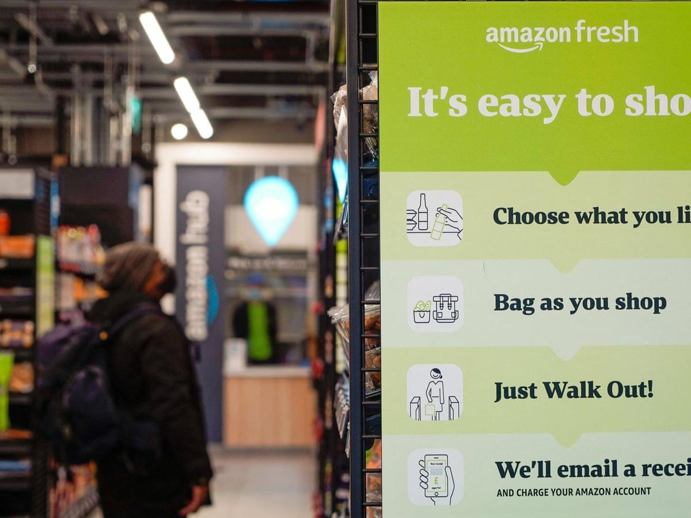

## Table of Contents

## What is cashier-free shopping?

Cashier-free shopping is a way to buy things without needing to check out with a cashier. You walk into a store, pick up what you want, and then leave. The store uses technology like cameras and sensors to keep track of what you take. When you leave, the cost of the items is automatically charged to your account. This makes shopping quicker and easier because you don't have to wait in line.

This type of shopping is becoming more common in places like big cities where people are always in a hurry. Stores like Amazon Go have been using this technology to let people shop without waiting. It's good for customers because it saves time, and it's good for stores because it can help them serve more people without hiring more cashiers. However, some people worry about privacy because of all the cameras and sensors watching them while they shop.

## How does machine learning enable cashier-free shopping?

Machine learning helps make cashier-free shopping work by using computers to learn from what people do in the store. When you walk into a store with no cashiers, cameras and sensors watch you pick up items. Machine learning algorithms look at all this information and figure out what you're taking and what you're putting back. Over time, these algorithms get better at telling the difference between someone picking up a product and someone just looking at it. This means the store can charge you correctly for what you actually buy.

This technology also helps the store understand how people shop. By looking at patterns in the data, [machine learning](/wiki/machine-learning) can tell store owners which items are popular, where people tend to walk, and even when the store is busiest. This information can help stores arrange their products better and plan for busy times. However, using machine learning this way means the store needs a lot of data, and it has to be careful about keeping that data private and secure.

## What are the key technologies used in cashier-free shopping systems?

The main technology behind cashier-free shopping is computer vision. This means using cameras all over the store to watch what people do. The cameras see when you pick up an item and when you put it back. They send this information to computers that use machine learning to understand what's happening. Machine learning is like teaching a computer to learn from examples. The more it sees people shopping, the better it gets at knowing what they're doing.

Another important technology is sensors. These can be on shelves or in the floor. They help the system know exactly where you are in the store and what you're touching. When you take something off a shelf, the sensor might notice the weight change and tell the computer. Together with the cameras, this helps the store keep track of what you're buying.

The last key technology is payment systems. When you leave the store, the system adds up everything you took and charges your account. This can be done through an app on your phone or a card you link to the store's system. It all happens automatically, so you don't need to stop at a checkout. These technologies work together to make shopping quick and easy, but they also need to be careful about keeping your information private and safe.

## Can you explain the process of a typical cashier-free shopping experience?

When you walk into a cashier-free store, you first need to have an account set up with the store's app on your phone. You enter the store by scanning a QR code or using the app to unlock the door. Once inside, cameras and sensors start watching you. As you pick up items from the shelves, the system knows what you're taking. If you change your mind and put something back, the system sees that too. You can shop as usual, walking around and choosing what you want without worrying about checking out.

When you're done shopping, you just walk out of the store. The cameras and sensors have been keeping track of everything you picked up, and the store's computer system adds up the total cost. This total is automatically charged to your account linked to the app. You get a receipt sent to your phone, and that's it. You don't have to wait in line or talk to a cashier. The whole process is quick and easy, making your shopping experience smoother and faster.

## What are the benefits of implementing cashier-free shopping for retailers?

Implementing cashier-free shopping can help retailers save money and work more efficiently. Without cashiers, stores don't have to pay as many employees. This can lower their costs. Also, because customers don't have to wait in line, more people can shop in less time. This means the store can serve more customers each day, which can lead to more sales. The technology also helps stores learn about how people shop, so they can put popular items in better spots and plan for busy times.

Another benefit is that cashier-free shopping can make customers happier. People like shopping when it's quick and easy. If customers have a good experience, they are more likely to come back. Happy customers can also tell their friends about the store, which can bring in new shoppers. This kind of word-of-mouth advertising is free and can help the store grow. Overall, using this technology can help retailers make more money and keep their customers satisfied.

## How do cashier-free shopping systems handle payment processing?

When you shop at a store with no cashiers, the payment process is automatic. You need to have an account set up with the store's app on your phone. When you enter the store, you scan a QR code or use the app to unlock the door. As you shop, cameras and sensors watch what you pick up and put back. When you're done and leave the store, the system adds up everything you took. The total cost is then charged to your account that's linked to the app. You get a receipt sent to your phone, so you don't need to wait in line or talk to anyone to pay.

This automatic payment system makes shopping quick and easy. It saves time for both the store and the customers. The store doesn't need as many people working as cashiers, which can save money. Customers like it because they can shop and leave without any wait. The technology keeps track of everything, so the payment is always correct. This way, everyone can focus on shopping instead of waiting to pay.

## What challenges do retailers face when adopting cashier-free shopping technology?

When retailers decide to use cashier-free shopping technology, they face some big challenges. One big problem is the cost. Setting up all the cameras, sensors, and computers needed for this kind of shopping can be very expensive. Stores have to spend a lot of money to buy and install the technology. They also need to keep paying for things like electricity and internet to make sure it all works. Another challenge is training. Store workers need to learn how to use the new system, and this can take time and money too.

Another issue is privacy. People might not like the idea of cameras watching them while they shop. Stores have to be very careful about how they use the information they collect. They need to make sure it's safe and not used in ways that make customers uncomfortable. Also, there can be technical problems. Sometimes the cameras or sensors might not work right, which can lead to mistakes in what people are charged. Stores need to have good ways to fix these problems quickly so customers stay happy.

## How does machine learning improve the accuracy of item recognition in cashier-free stores?

Machine learning helps make cashier-free stores better at knowing what items people pick up. It does this by looking at lots of pictures and videos from the store's cameras. Over time, the computer learns to tell different products apart, even if they look similar. For example, it can learn to see the difference between a bag of chips and a bag of cookies. The more data the system sees, the better it gets at recognizing items correctly. This means fewer mistakes when charging customers for what they take.

The system also gets smarter about understanding what people are doing. It learns to know when someone is just looking at an item versus when they are actually taking it. This is important because it helps the store charge people only for what they really buy. By using machine learning, the store can make sure the shopping experience is smooth and that customers are happy with how accurate the system is.

## What are the privacy concerns associated with cashier-free shopping and how are they addressed?

Cashier-free shopping uses a lot of cameras and sensors to watch what people do in the store. This can make some people worried about their privacy. They might not like the idea of being watched all the time. There's also a concern about what the store does with the information it collects. People want to know if their data is safe and if it's used in ways they don't agree with.

Stores that use this technology try to address these concerns by being clear about what they do with the data. They often tell customers that the cameras are there to help with shopping and not to spy on them. Stores also use strong security measures to keep the data safe. They make sure that the information is only used for the store's needs and not shared with others without permission. By being open and careful with data, stores hope to make people feel more comfortable with cashier-free shopping.

## How do cashier-free shopping systems manage inventory and prevent theft?

Cashier-free shopping systems use technology to keep track of inventory. When someone takes an item off a shelf, sensors and cameras notice the change. The system then updates the inventory count right away. This helps the store know exactly how many of each item they have at any time. If something is running low, the store can order more before it runs out. This makes sure that customers can always find what they need.

To prevent theft, these systems watch everything that happens in the store. If someone tries to take something without paying, the cameras and sensors will see it. The system can then alert store staff or security. It's hard to steal because the technology keeps a close eye on all the items. This makes the store safer and helps keep prices down by reducing losses from theft.

## What are the future trends in cashier-free shopping technology?

In the future, cashier-free shopping technology will get even better. Stores will use more advanced cameras and sensors that can see and understand more about what people are doing. This will help the system make fewer mistakes when it charges customers. Machine learning will keep improving, too. It will get better at recognizing different items and understanding how people shop. This means the shopping experience will be smoother and more accurate. Stores might also start using robots to help with shopping, like robots that can pick up items for customers or help them find things in the store.

Another trend will be more focus on privacy and security. As people become more worried about their data, stores will need to be very clear about what they do with the information they collect. They will use better ways to keep data safe and make sure it's only used for shopping. Stores might also let customers choose how much information they want to share. This way, people can feel more comfortable using cashier-free shopping. Overall, these trends will make shopping easier, faster, and more private for everyone.

## How can machine learning algorithms be optimized for better performance in cashier-free environments?

To make machine learning algorithms work better in cashier-free stores, they need to see a lot of different shopping situations. The more data the system gets, the better it can learn to tell the difference between items and understand what shoppers are doing. For example, if the system sees people [picking](/wiki/asset-class-picking) up and putting back many different kinds of products, it can learn to recognize these items more accurately. This helps the store charge the right amount for what people take. The system can also use special ways to learn, like [deep learning](/wiki/deep-learning), which is good at understanding pictures and videos. This can help the system see small differences between similar items, like different brands of chips.

Another way to improve the algorithms is to use them to learn from mistakes. If the system charges someone the wrong amount, it can look at what went wrong and learn from it. This way, it won't make the same mistake again. Stores can also use feedback from customers to make the system better. If a customer says the system got something wrong, the store can use that information to teach the system how to do better next time. By always learning and getting better, the machine learning algorithms can make cashier-free shopping smoother and more accurate for everyone.