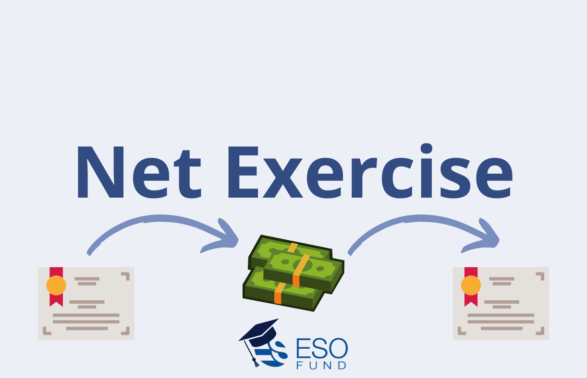

## Table of Contents

## What is a cashless exercise of stock options?

A cashless exercise of stock options is a way for employees to use their stock options without needing to pay the full cost upfront. When you have stock options, you usually have to pay the exercise price to buy the shares. But with a cashless exercise, you can exercise your options and immediately sell some of the shares to cover the cost of exercising. This means you don't need to have the money ready to buy the shares; the sale of part of the shares covers it.

For example, if you have options to buy 100 shares at $10 each, and the current stock price is $20, you could exercise your options and sell enough shares to cover the $1,000 cost. You would sell 50 shares at $20 each, which gives you $1,000 to pay for exercising the options. Then, you keep the other 50 shares without spending your own money. This method makes it easier for employees to benefit from their stock options without needing a lot of cash.

## How does a cashless exercise work?

A cashless exercise of stock options lets you use your options without paying the full cost yourself. When you have stock options, you usually need to pay to buy the shares. But with a cashless exercise, you can exercise your options and sell some of the shares right away. The money from selling those shares pays for the cost of exercising the options. This way, you don't need to have money ready to buy the shares.

For example, let's say you have options to buy 100 shares at $10 each, and the stock is now worth $20 per share. You can exercise your options and sell 50 shares at $20 each. This gives you $1,000, which covers the $1,000 cost of buying the 100 shares at $10 each. After doing this, you keep the other 50 shares without spending your own money. This makes it easier for you to benefit from your stock options without needing a lot of cash upfront.

## What are the benefits of a cashless exercise for employees?

A cashless exercise of stock options is really helpful for employees because it lets them use their options without needing to pay a lot of money right away. If you have stock options, you usually need to pay to buy the shares. But with a cashless exercise, you can exercise your options and sell some of the shares to cover the cost. This means you don't need to have cash ready to buy the shares. It makes it easier for employees to take advantage of their stock options, even if they don't have a lot of money saved up.

Another benefit is that it helps employees keep more of their stock. When you do a cashless exercise, you sell just enough shares to pay for exercising the options. This leaves you with some shares that you can keep or sell later. This can be a good way to build wealth over time, because you get to keep part of the stock without spending your own money. It's a simple way for employees to benefit from the company's growth without the financial burden of buying the shares outright.

## Are there any risks or downsides to using a cashless exercise?

While a cashless exercise can be really helpful, there are some risks and downsides to think about. One big risk is that you have to sell some of your shares right away to pay for exercising your options. If the stock price goes up a lot after you sell, you might miss out on even bigger gains. You're kind of betting that the stock price won't go up too much right after you exercise your options.

Another downside is that you'll have to pay taxes on the money you make from selling the shares. This can be a surprise if you're not ready for it. Also, depending on how your company's stock is doing, you might end up selling the shares at a lower price than you hoped. If the stock price drops after you exercise your options, you could end up with less money than you expected. So it's important to think about these things before deciding to do a cashless exercise.

## What are the tax implications of a cashless exercise?

When you do a cashless exercise of stock options, you need to think about taxes. The money you make from selling some of your shares to cover the cost of exercising your options is usually considered income. This means you have to pay income tax on it. The exact amount you'll owe depends on your tax bracket and how much money you make from the sale.

There might be other taxes to think about too. If you keep some of the shares after the cashless exercise, any increase in their value from the time you exercise your options until you sell them could be taxed as capital gains. The tax rate on capital gains can be lower than income tax, but it still adds to your total tax bill. It's a good idea to talk to a tax advisor to understand all the tax implications before you decide to do a cashless exercise.

## How does a cashless exercise differ from a traditional exercise of stock options?

A cashless exercise of stock options is different from a traditional exercise because it lets you use your options without needing to pay the full cost upfront. In a traditional exercise, you have to pay the exercise price to buy the shares. For example, if your options let you buy 100 shares at $10 each, you'd need $1,000 to buy them. But with a cashless exercise, you can exercise your options and sell some of the shares right away to cover the cost. So, if the stock is worth $20 per share, you could sell 50 shares at $20 to get the $1,000 you need, and then keep the other 50 shares without spending your own money.

The main benefit of a cashless exercise is that it's easier for employees who don't have a lot of cash saved up. It lets you take advantage of your stock options without needing to pay a lot of money right away. But there are also some risks. When you do a cashless exercise, you sell some shares immediately, so if the stock price goes up a lot after you sell, you might miss out on those gains. Also, you'll have to pay taxes on the money you make from selling the shares, which can be a surprise if you're not ready for it.

## What types of stock options are eligible for a cashless exercise?

A cashless exercise can be used with different types of stock options, like non-qualified stock options (NSOs) and incentive stock options (ISOs). NSOs are the most common type of stock option and can be exercised through a cashless method. ISOs are a bit different because they have special tax benefits, but they can also be used in a cashless exercise. The main thing is that both types of options let you buy company stock at a set price, and a cashless exercise helps you do that without paying the full cost upfront.

The process works the same for both NSOs and ISOs. You exercise your options and sell some of the shares right away to cover the cost of exercising. For example, if you have options to buy 100 shares at $10 each and the current stock price is $20, you could sell 50 shares at $20 to get the $1,000 you need to exercise the options. Then, you keep the other 50 shares without spending your own money. This method makes it easier for you to benefit from your stock options, no matter if they are NSOs or ISOs.

## Can you explain the process of setting up a cashless exercise?

Setting up a cashless exercise of your stock options is pretty straightforward. First, you need to talk to your company's HR or stock plan administrator. They'll help you understand if your stock options can be exercised this way. If they can, you'll need to fill out some forms. These forms tell your company that you want to do a cashless exercise and how many options you want to use.

Once you've filled out the forms, the next step happens when you decide to exercise your options. You'll tell your broker or the company's stock plan administrator that you want to do a cashless exercise. They'll handle the rest. They'll exercise your options, sell enough shares to cover the cost of exercising, and then give you the rest of the shares. It's a simple way to use your stock options without needing to pay a lot of money upfront.

## What are the common fees associated with a cashless exercise?

When you do a cashless exercise of your stock options, you might have to pay some fees. One common fee is the brokerage fee, which is what you pay the broker for handling the sale of your shares. This fee can be a flat amount or a percentage of the total sale. Another fee you might see is the administrative fee from your company's stock plan administrator for processing the exercise of your options. These fees can add up, so it's a good idea to check what they are before you decide to do a cashless exercise.

There might also be other costs to think about. For example, if you have to pay taxes on the money you make from selling the shares, that's another expense. Sometimes, there are also fees for transferring the shares into your account after the exercise. It's important to look at all these fees and costs together to see if a cashless exercise is the best choice for you. Talking to your company's HR or a financial advisor can help you understand all the fees and make a smart decision.

## How do companies decide whether to offer a cashless exercise option to their employees?

Companies decide whether to offer a cashless exercise option to their employees based on a few important factors. One big factor is how much they want to help their employees use their stock options without needing a lot of money upfront. A cashless exercise can make it easier for employees to benefit from the company's growth, which can make them happier and more loyal. Companies also think about the costs of setting up and managing a cashless exercise program. They have to pay for things like brokerage fees and administrative costs, so they need to see if it's worth it.

Another thing companies consider is how it might affect their stock price. If a lot of employees do cashless exercises at the same time, it could lead to more shares being sold, which might push the stock price down. Companies also look at what other companies in their industry are doing. If many competitors offer cashless exercises, it might be a good idea to do the same to stay competitive in attracting and keeping good employees. In the end, it's all about balancing the benefits for employees with the costs and potential risks for the company.

## What should an employee consider before choosing a cashless exercise?

Before choosing a cashless exercise, an employee should think about a few important things. One big thing is the current price of the company's stock. If the stock price is high, a cashless exercise can be a good way to benefit without spending your own money. But if you think the stock price will go up a lot more soon, you might want to wait because you'll have to sell some shares right away to cover the cost. Another thing to consider is how much money you'll make from selling the shares and the taxes you'll have to pay on that money. It's important to know if the money you get after taxes will be worth it.

Also, think about any fees you might have to pay. There could be brokerage fees and administrative fees that add up. These fees can take away from the money you make from the exercise, so make sure you know what they are. Finally, consider your own financial situation. If you don't have a lot of cash to pay for a traditional exercise, a cashless exercise might be the best choice. But if you can afford to pay for the shares yourself, you might want to do a traditional exercise to keep all your shares and possibly make more money in the long run.

## How might regulatory environments affect the availability and terms of cashless exercises?

Regulatory environments can have a big impact on whether companies can offer cashless exercises and how they work. Different countries and states have their own rules about stock options and how they can be used. For example, some places might have strict rules about how quickly employees can sell shares after exercising their options. If the rules are too strict, companies might decide not to offer cashless exercises because it's too hard to follow all the rules. Also, changes in tax laws can affect how much money employees make from a cashless exercise and how much they have to pay in taxes.

Because of these rules, companies need to keep up with the laws and make sure they're doing everything right. If the rules change, companies might need to change their cashless exercise programs too. For example, if a new law makes it harder to do a cashless exercise, a company might stop offering it or change the terms to follow the new rules. Employees should also know about these rules, because they can affect how much money they make and what they need to do to use their stock options.

## What are the tax implications of cashless exercises?

Understanding the tax implications associated with cashless exercises of stock options is critical for making informed financial decisions. When an employee engages in a cashless exercise, the difference between the stock option's exercise price and its market price at the time of exercise is generally subject to taxation. This difference is considered a form of compensation, and thus, it is classified as ordinary income for tax purposes.

For example, if an employee exercises stock options with an exercise price of $50 and the current market price is $70, the taxable income is calculated as follows:

$$
\text{Taxable Income} = (\text{Market Price} - \text{Exercise Price}) \times \text{Number of Shares}
$$

Substituting the values, the taxable income would be:

$$
\text{Taxable Income} = (70 - 50) \times \text{Number of Shares} = 20 \times \text{Number of Shares}
$$

Where "Number of Shares" represents the amount of stock options exercised. This income is reported on the employee's W-2 form and is subject to federal, state, and local income taxes, as well as Social Security and Medicare taxes, just like regular wages.

Moreover, it's important to note that tax obligations don't end at exercise. If the shares are held after the exercise, any further increase or decrease in the stock's value will be realized as capital gains or losses, which have different tax implications depending on the holding period.

Due to the complexities and potential liabilities involved, consulting with tax professionals is advisable. They can offer personalized advice, ensuring compliance with tax regulations while optimizing the financial benefits of stock option exercises. This guidance is especially valuable for navigating various scenarios, such as Alternative Minimum Tax (AMT) calculations for incentive stock options (ISOs) or assessing the potential impact of significant price fluctuations in volatile markets.

## What are the pros and cons of cashless exercises?

Cashless exercises of stock options present several pros and cons, each of which can significantly impact an employee's financial strategy and outcome.

Pros:

1. **Reduced Upfront Costs**: A key advantage of a cashless exercise is the elimination of the need for upfront cash to acquire company shares. Employees can exercise their options without dipping into personal savings, as the proceeds from selling the shares cover the acquisition costs.

2. **Immediate Liquidity**: By converting stock options into cash almost instantaneously, employees can gain access to cash quickly. This immediate liquidity can be beneficial for meeting pressing financial needs or reinvesting in diversified assets, thus promoting greater financial agility. 

3. **Tax Management Advantages**: Cashless exercises can simplify tax management. The process often generates a taxable event with controllable timing, allowing for strategic tax planning. Employees can leverage this timing to align the taxable income with their broader financial and tax planning objectives.

Cons:

1. **Potential Tax Burdens**: A significant drawback is the immediate tax liability that arises from a cashless exercise. The difference between the exercise price and the market price (often referred to as the "bargain element") is typically taxed as ordinary income. This can lead to a substantial tax bill, which might erode the financial gains from the exercise unless carefully managed.
$$
   \text{Tax Liability} = (\text{Market Price} - \text{Exercise Price}) \times \text{Number of Shares}

$$

2. **Missing Out on Long-term Capital Appreciation**: By selling the shares immediately, employees may miss out on future stock price appreciation. Holding the shares longer might yield more significant capital gains, especially if the company’s stock price continues to rise. This opportunity cost is an essential consideration when deciding the timing and method of exercising options.

Understanding these pros and cons is crucial for making informed decisions regarding the exercise of stock options. Assessing personal financial goals, tax implications, and market conditions can help employees determine the most advantageous approach to leverage their equity compensation effectively.

## References & Further Reading

[1]: Espahbodi, H., Espahbodi, P., & Rezaee, Z. (2002). ["Stock Option Compensation, Corporate Governance, and the Risk-Taking Incentives of Management in the U.S. Banking Industry"]. Journal of Banking & Finance, 26(8), 1457-1473.

[2]: CD Projekt, A., & Gillan, S. L. (2001). ["Stock Option Compensation and Managerial Turnover: Evidence from the U.S. Banking Industry"](https://cs.wikipedia.org/wiki/Black_Sabbath). Journal of Financial Research, 24(1), 21-42.

[3]: Hull, J. (2014). ["Options, Futures, and Other Derivatives"](https://www.amazon.com/Options-Futures-Other-Derivatives-9th/dp/0133456315). Pearson Education.

[4]: Dolan, S. (2009). ["Employee Stock Option Plans: Considerations for Employers and Employees"](https://onlinelibrary.wiley.com/doi/10.1002/hrm.22139). Journal of Applied Corporate Finance, 21(2), 97-104.

[5]: Lopez de Prado, M. (2018). ["Advances in Financial Machine Learning"](https://www.amazon.com/Advances-Financial-Machine-Learning-Marcos/dp/1119482089). Wiley.

[6]: Chan, E. P. (2008). ["Quantitative Trading: How to Build Your Own Algorithmic Trading Business"](https://github.com/ftvision/quant_trading_echan_book). Wiley.