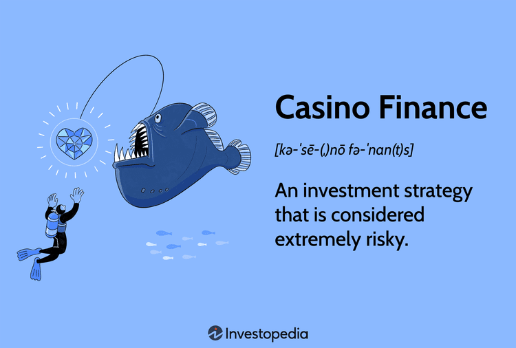

## Table of Contents

## What is casino finance and why is it important?

Casino finance is a way of managing money that is very risky. It's like betting all your money on one big gamble, hoping to win big. This kind of finance is often used by companies or countries that are in a lot of debt and need to take big risks to try and solve their problems. Instead of making safe and steady plans, they make big, dangerous bets, hoping that everything will work out.

This type of finance is important because it can affect the whole economy. If a big company or a country uses casino finance and loses, it can cause a lot of problems. For example, if a big bank makes risky bets and loses, it might not be able to pay back the people who gave it money. This can make other banks and companies worried, and they might start to be more careful with their money. This can slow down the economy and make it harder for people to get loans or find jobs. So, while casino finance might seem like a quick fix, it can lead to big problems if it doesn't work out.

## How do casinos generate revenue?

Casinos make money mostly from the games people play. They have a special advantage in every game, called the "house edge." This means that over time, the casino will always win more money than it loses. For example, in a game like roulette, the casino pays out less than the true odds of winning, so they keep a small percentage of every bet. The more people play, the more money the casino makes because that small percentage adds up over many bets.

Casinos also make money from other things besides games. They have hotels, restaurants, and shows that people pay for. These extra services bring in more money and make the casino a fun place to visit. People might come for a show or a nice meal and end up playing games too. This way, the casino earns money from different parts of their business, not just from gambling.

## What are the main operational costs for a casino?

Running a casino costs a lot of money. The biggest expense is usually the staff. Casinos need many workers like dealers, security guards, cleaners, and people to work in hotels and restaurants. All these employees need to be paid, and their salaries add up to a big part of the casino's costs. Also, casinos often have to pay for training their staff to make sure they do their jobs well and keep the place safe and fun for everyone.

Another big cost is keeping the casino running smoothly. This means paying for things like electricity, water, and heating or cooling the building. Casinos also have to spend money on fixing and updating their machines and equipment, like slot machines and gaming tables. They need to keep everything in good shape so people keep coming back. Advertising is another cost, as casinos need to let people know about their games, shows, and special events to attract more visitors.

Lastly, casinos have to pay taxes and sometimes fees to the government. These can be a big part of their costs, depending on where the casino is located. They also have to spend money on security systems and cameras to keep the place safe and prevent cheating. All these costs together make running a casino a very expensive business, but if they manage everything well, they can still make a lot of money.

## What is the role of a casino's finance department?

The finance department in a casino is like the money manager. They keep track of all the money coming in and going out. This means they watch how much money people spend on games, hotels, and food, and they also keep an eye on all the costs, like paying workers and keeping the lights on. They make sure the casino is not spending more money than it is making, and they help plan for the future by figuring out how much money the casino will need.

Another important job of the finance department is to make reports and follow the rules. They make reports that show how the casino is doing financially, and these reports help the people in charge make good decisions. They also have to follow a lot of rules about money, like paying taxes and making sure no one is cheating. This helps keep the casino honest and in good standing with the government and the people who visit.

## How does a casino manage its cash flow?

A casino manages its cash flow by keeping a close eye on the money coming in and going out. They make sure they always have enough money to pay for things like salaries, electricity, and other bills. Casinos use special machines and systems to count the money from games and track how much people are spending on other services like hotels and restaurants. This helps them know exactly how much money they have at any time.

To keep their cash flow healthy, casinos also plan ahead. They look at how much money they expect to make and spend in the future, and they make budgets to help them stay on track. If they see that they might not have enough money coming in, they might decide to cut some costs or find new ways to bring in more money. This planning helps them avoid running out of money and keeps the casino running smoothly.

## What are common financial strategies used by casinos to maximize profits?

Casinos use different financial strategies to make more money. One way is by managing their games carefully. They make sure the games have a good "house edge," which means they win more money over time. They also change the rules or payouts of games sometimes to keep more money. Another way is by offering special deals and promotions. They might give free rooms or meals to people who play a lot, hoping these people will spend more money on games. This can bring in more customers and keep them coming back.

Casinos also look at their costs and try to save money where they can. They might use cheaper supplies or find ways to use less electricity. They also plan their budget carefully, making sure they don't spend more than they make. By keeping their costs down, they can make more profit from the money they bring in. Additionally, casinos often expand their business by adding new games, restaurants, or shows. This can attract more people and give them more ways to spend money, helping the casino make more profit.

## How do casinos handle credit and debt management?

Casinos handle credit by offering it to some customers, usually those who play a lot. They might let these players borrow money to keep playing, hoping they will win and pay it back. But casinos are careful about who they give credit to. They check if the person can pay back the money and keep track of how much they owe. If someone doesn't pay back their debt, the casino might not let them play anymore or even take them to court.

Managing debt is also important for casinos. They have to make sure they can pay their own bills and debts, like loans they might have taken to build the casino. They keep a close eye on their cash flow to make sure they always have enough money coming in to cover what they owe. If a casino gets into too much debt, it can be a big problem, so they work hard to stay financially healthy. This means being careful with how they spend money and making sure they are making more than they are spending.

## What are the regulatory requirements for casino financial operations?

Casinos have to follow a lot of rules about money. Governments want to make sure casinos are honest and not cheating people. So, they have rules about how casinos can handle money, like keeping good records and reporting how much money they make. Casinos also have to pay taxes on the money they earn. These rules help stop crime and make sure casinos are playing fair. If a casino doesn't follow these rules, they can get in big trouble, like fines or even having to close down.

Another important rule is about how casinos handle credit and debt. They have to be very careful about giving people money to play with, and they need to keep good records of who owes them money. Casinos also need to make sure they can pay their own bills and debts. Governments check these things to make sure casinos are not taking too many risks with money. This helps keep the casino and the whole economy safe.

## How do casinos use financial data to make strategic decisions?

Casinos use financial data to see how they are doing and to make smart choices about what to do next. They look at how much money they make from games, hotels, and restaurants. By studying this data, they can figure out which games are the most popular and which ones they should maybe change or get rid of. They also look at how much money they are spending on things like staff, electricity, and repairs. This helps them find ways to save money and make more profit. For example, if they see they are spending too much on electricity, they might decide to use more energy-efficient lights.

Casinos also use financial data to plan for the future. They make budgets to help them decide how much money they can spend on new projects, like adding a new restaurant or a new type of game. They look at past data to guess how much money they will make in the future, which helps them decide if they can afford these new projects. If the data shows they might not make enough money, they might decide to wait or find other ways to bring in more money. This careful planning helps them stay financially healthy and keep growing.

## What are the financial risks associated with running a casino?

Running a casino can be risky because it involves a lot of money. One big risk is that people might not come to the casino as much as expected. If fewer people come to play games or stay in the hotel, the casino might not make enough money to pay its bills. Another risk is that the casino might spend too much money on things like new games or fancy decorations, hoping to attract more people. If these investments don't bring in more customers, the casino could end up losing money instead of making a profit.

Another financial risk is related to credit and debt. Casinos sometimes let people borrow money to play, but if those people don't pay back what they owe, the casino loses money. Casinos also take out loans to build or expand their business, and if they can't pay these loans back, they could go bankrupt. Additionally, casinos have to follow strict rules about money from the government. If they make a mistake or break these rules, they could get fined a lot of money or even have to close down. All these risks mean that running a casino is a tricky business that needs careful money management.

## How do advanced technologies like AI and blockchain impact casino finance?

Advanced technologies like AI and blockchain are changing how casinos handle their money. AI helps casinos by looking at a lot of data quickly. It can see which games people like the most, how much money they spend, and when they come to the casino. This helps casinos make better choices about what games to offer and how to attract more people. AI can also help with keeping the casino safe by watching for cheating or fraud. This makes the casino more honest and trustworthy, which is good for business.

Blockchain technology is also making a big difference. It helps casinos keep track of money in a very safe and clear way. With blockchain, casinos can make sure that all money coming in and going out is recorded correctly and can't be changed. This helps stop cheating and makes sure the casino follows the rules. Blockchain can also help with quick and safe payments, making it easier for people to play games and spend money at the casino. Both AI and blockchain make casino finance more efficient and secure, helping casinos make more money and stay out of trouble.

## What are the future trends in casino finance and operations?

In the future, casinos will use more technology to handle their money and run their business. They will use AI to look at data and make better choices about what games to offer and how to attract more people. AI can help casinos see patterns in how people spend money and what they like to do, so casinos can make their services better. They will also use blockchain to keep track of money in a safe and clear way. This will help stop cheating and make sure the casino follows the rules. With these technologies, casinos can make their operations more efficient and secure, which will help them make more money.

Another trend will be more online and mobile gaming. People are playing more games on their phones and computers, so casinos will offer more games online. This means they need to find new ways to make money from these games, like special deals or new types of games. They will also need to keep their online systems safe from cheating and hacking. As more people play online, casinos will need to be good at handling money in the digital world, making sure they can pay out winnings quickly and safely. This shift to online gaming will change how casinos manage their money and plan for the future.

## References & Further Reading

[1]: Miller, Dale D., & Singal, Vijay. (2017). ["Gambling and Speculation: A Theory, a History, and a Future of Some Human Decisions"](https://www.academia.edu/1033769/Griffiths_M_D_1991_Gambling_and_Speculation_A_Theory_History_and_a_Future_of_some_Human_Decisions_Journal_of_Economic_Psychology_12_197_201). Praeger Publishers.

[2]: Lopez de Prado, Marcos. (2018). ["Advances in Financial Machine Learning"](https://www.amazon.com/Advances-Financial-Machine-Learning-Marcos/dp/1119482089). Wiley.

[3]: Williams, John. (2011). ["Casino Mathematics"](https://en.wikipedia.org/wiki/Gambling_mathematics). Australian Poker Academy.

[4]: Van Eyden, Tomasz. (2016). ["The Mathematics of Games and Gambling"](https://archive.org/details/the-mathematics-of-games-and-gambling-edward-packel). Springer.

[5]: Chan, Ernest P. (2009). ["Quantitative Trading: How to Build Your Own Algorithmic Trading Business"](https://github.com/ftvision/quant_trading_echan_book). John Wiley & Sons.

[6]: Jansen, Stefan. (2020). ["Machine Learning for Algorithmic Trading: Predictive models to extract signals from market and alternative data for systematic trading strategies with Python"](https://github.com/stefan-jansen/machine-learning-for-trading). Packt Publishing.