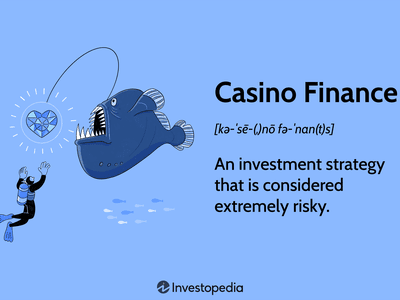

The intriguing intersection of trading psychology and casino mentality reflects a critical aspect of financial risk-taking. Both involve decision-making under uncertainty and emotions, yet acknowledging their differences is crucial for success in trading. Understanding the mindset that separates successful trading from mere gambling is essential for both novice and experienced traders. Successful trading necessitates a disciplined, strategic approach rooted in analysis, whereas gambling often relies on chance and emotion-driven decisions. This distinction underscores the importance of psychological resilience and informed strategies in achieving consistent profitability in the financial markets.

This article explores the impact of casino mentality on trading success and the role of algorithmic trading in mitigating psychological pitfalls. The casino mentality can lead traders to make impulsive decisions fueled by greed and fear, resulting in substantial financial losses. By recognizing these emotional biases, traders can adopt more structured approaches to trading. Algorithmic trading, which automates decision-making processes based on predetermined parameters, minimizes these biases by excluding human emotions from executing trades. This automation helps ensure that trades adhere to a trader’s strategy without being swayed by short-term market fluctuations or emotional impulses.



We will examine how traders can build a disciplined approach to speculation, emphasizing the development of well-defined strategies and adherence to risk management principles. Education and self-awareness form the bedrock of this disciplined approach, equipping traders to combat the urge for hasty, emotion-driven actions. Continuous learning, strategic planning, and the adoption of algorithmic solutions can transform risky trading habits into sustainable practices. 

Join us as we explore the dynamics of financial risk, trading psychology, and algorithmic trading, aiming to foster a trading mindset that prioritizes strategic decision-making over impulsive risk-taking. By understanding and overcoming the influences of casino mentality, traders can enhance their profitability and sustainability, creating a stable foundation for long-term success in the ever-evolving financial market landscape.

## Table of Contents

## Understanding Casino Mentality in Trading

New traders often equate financial markets to a casino, seeking quick wins without understanding the underlying risks. This perception is fueled by the volatility and unpredictability of markets, which can seem similar to the randomness of games of chance. The prospect of rapid financial gain often tempts traders to eschew strategic analysis and careful planning, focusing instead on the immediate gratification of potentially high returns.

The allure of rapid wealth can overshadow the necessity for strategic trading decisions. Many traders get seduced by the stories of significant short-term successes and the excitement involved in high-stakes trading. This focus on quick gains neglects the importance of a well-formulated trading strategy that considers both risk and reward, leading to a lack of preparation for adverse market conditions.

Just like in gambling, traders can be swayed by emotions such as greed and fear, which cloud judgment. Greed may push a trader to hold onto a winning position for too long, hoping for even higher returns, while fear can drive premature selling of potentially profitable investments. This psychological influence undermines rational decision-making, anchoring traders in a cycle of unpredictable and often detrimental financial behavior.

Recognizing this mentality is the first step towards adopting a more structured approach to trading. By acknowledging how impulsive reactions to market movements can be perilous, traders can begin to focus on building disciplined and informed trading habits. Developing an understanding of these psychological inclinations encourages traders to implement strategies that mitigate emotional interference, promoting consistency and resilience in their trading practices.

## Consequences of Casino Mentality

A casino mentality in trading inevitably leads to impulsive decisions, drawing parallels with gambling, where decisions are often based on chance rather than strategy. This lack of structured planning in trading increases susceptibility to significant financial losses. When traders operate under this mindset, they frequently overestimate potential rewards, seduced by the allure of quick profits, while simultaneously underestimating the inherent risks involved. Emotional trading exacerbates this issue, as decisions made under the influence of emotions such as fear and greed tend to lack rational analysis and foresight.

The absence of a strategic edge or a robust risk management framework further intensifies the risks associated with a casino mentality. Traders who rely on gut feelings or emotional impulses rather than informed decision-making processes are more likely to encounter consistent losses. This is because successful trading requires not only understanding market dynamics but also implementing systematic risk assessments such as calculating position sizes or setting stop-loss orders to protect against adverse market movements.

For instance, a trader influenced by the thrill of a potential market uptrend might neglect appropriate risk management strategies such as diversifying their portfolio or setting predefined [exit](/wiki/exit-strategy) strategies. This oversight can lead to disproportionate exposure to market [volatility](/wiki/volatility-trading-strategies), resulting in substantial losses.

Moreover, the psychological toll of trading with a casino mentality is significant. Continual financial losses erode trader morale, leading to a vicious cycle where frustration and anxiety further impair judgment, resulting in more rash decisions. Over time, this can lead to a diminished confidence in their trading abilities and an increased likelihood of abandoning trading altogether.

In summary, avoiding the trap of a casino mentality is crucial for traders seeking sustainability and success in the financial markets. Recognizing the importance of structured, informed trading strategies and effective risk management can protect against the pitfalls of impulsive, emotionally driven decision-making.

## Difference Between Gambling and Trading

Successful trading and gambling are often compared due to their inherent risk-taking and outcome uncertainty. However, they differ significantly in approach, potential returns, and underlying processes. 

Successful trading relies on skill, strategic planning, and informed decision-making. Traders apply technical and [fundamental analysis](/wiki/fundamental-analysis) to forecast market movements. Technical analysis involves evaluating statistical trends derived from trading activity, such as price movement and [volume](/wiki/volume-trading-strategy). Tools like moving averages, relative strength index (RSI), and candlestick charts are used for this purpose. Fundamental analysis, on the other hand, examines economic indicators, company financial statements, and broader economic conditions to evaluate an asset’s intrinsic value.

For example, using technical analysis, a trader might interpret a stock's moving average as follows:

```python
import numpy as np

# Simulate stock prices
prices = np.array([100, 101, 102, 105, 104, 107, 109, 111, 110])

# Calculate a simple moving average with a window size of 3
moving_avg = np.convolve(prices, np.ones(3)/3, mode='valid')
print(moving_avg)
```

Here, the moving average serves to smooth out price fluctuations, assisting traders in making more informed predictions about future movements.

In contrast, gambling typically involves games of chance with outcomes largely determined by luck, not skill. The strategies available to gamblers are often limited to betting systems that, at best, may help manage risk within a game of negative expected value. While poker might be an exception due to elements of skill involved, most gambling scenarios do not allow for strategies akin to those used in trading.

Trading, when approached correctly, offers a positive expected return. This concept is supported by the efficient market hypothesis, which suggests that prices reflect all available information. Skilled traders exploit inefficiencies within these markets to garner profit over time.

Conversely, gambling generally results in a negative expected return. Casino games are designed to benefit the house statistically (e.g., the house edge in roulette or baccarat).

The necessity of knowledge in trading is paramount. Unlike gambling, where luck predominantly dictates profit or loss, trading demands an understanding of market dynamics, risk management, and the consistent refinement of strategies. Successful traders systematically assess and mitigate risks through diversification, stop-loss orders, and other strategies to enhance their long-term viability in the financial markets.

Understanding these fundamental differences underscores why trading, when constructed upon a foundation of research and strategic execution, can be a sustainable practice with the potential for positive returns, distinguishing it sharply from gambling.

## The Role of Algorithmic Trading

Algorithmic trading provides a systematic approach to financial markets by utilizing computer algorithms to execute trades. This method not only improves efficiency but significantly reduces the influence of human emotion, a [factor](/wiki/factor-investing) often responsible for poor decision-making in traditional trading. Emotions such as fear and greed can lead to irrational trading choices, of which a predominant example is the casino mentality—an unstructured and often reckless approach to risk-taking.

Algorithms are designed to follow predetermined sets of rules that govern trading strategies. These rules can be based on various criteria, including timing, price, quantity, or complex mathematical models. By adhering to these rules, [algorithmic trading](/wiki/algorithmic-trading) helps ensure that trades are executed independently of emotional biases. For instance, an algorithm may be programmed to sell a financial asset when its price reaches a predetermined level, thereby locking in profits or cutting losses without succumbing to the temptation of holding the position in hopes of even greater gains.

The benefits of this approach lie in its ability to process vast amounts of data and execute transactions at speeds unattainable by humans. Algorithms can identify market patterns and execute trades based on probability rather than emotion. Furthermore, the automation inherent in algorithmic trading minimizes the likelihood of errors associated with manual trading, where psychological factors often lead to mistakes.

Algorithmic trading also serves as a safeguard against the casino mentality by enforcing disciplined trading practices. For example, sophisticated trading systems can include risk management features that limit exposure and prevent excessive risk-taking. Such systems can automatically adjust the size of trades based on the calculated risk, further ensuring adherence to a trader's risk management policy.

In conclusion, algorithmic trading transforms the trading process by substituting emotional decision-making with a structured and disciplined approach. By mitigating psychological pitfalls, it creates a more stable and less risky trading environment, ultimately enhancing trader effectiveness and profitability.

## Overcoming the Casino Mentality

Education and self-awareness are pivotal in overcoming the casino mentality in trading. Understanding the inherent differences between gambling and strategic trading is fundamental to developing a resilient mindset. Traders often fall into the trap of viewing market activities as akin to games of chance, driven by emotional impulses such as greed and fear. To shift away from this mentality, it is crucial to establish a structured approach to trading.

A well-defined trading strategy forms the backbone of successful market participation. This entails setting clear objectives, selecting appropriate financial instruments, and determining the time horizon for investments. Moreover, a robust strategy integrates both technical and fundamental analysis, enabling traders to make informed decisions based on empirical data rather than speculation. Traders should employ technical indicators like moving averages and oscillators, along with a keen analysis of market trends, to predict potential price movements.

Adherence to risk management principles is equally essential. A fundamental aspect of risk management involves setting stop-loss and take-profit limits, which protects the portfolio from significant losses while securing gains. Position sizing, a strategy where the size of a trade is determined based on the trader's risk tolerance and the volatility of the asset, further mitigates risk exposure. The role of mathematical models, such as the Kelly Criterion, can be instrumental in optimizing the fraction of capital allocated to each trade. The Kelly Criterion is expressed as:

$$
f^* = \frac{bp - q}{b}
$$

where:
- $f^*$ is the optimal fraction of the portfolio to wager,
- $b$ is the odds received on the wager (net odds),
- $p$ is the probability of a win,
- $q$ is the probability of a loss (where $q = 1 - p$).

Continuous learning and adopting a disciplined approach are transformative for trading habits. Engaging in educational programs, staying updated with market developments, and learning from past trading mistakes are integral to growth. Self-reflection helps traders identify emotional biases affecting their decisions, encouraging a transition towards methodical and thoughtful trading practices.

In summary, transitioning from a casino mentality requires a commitment to structured education, rigorous strategy formulation, and adherence to risk management. These efforts, complemented by continuous self-improvement, cultivate a disciplined and strategic mindset, essential for long-term trading success.

## Conclusion: Building a Sustainable Trading Practice

A sustainable trading practice ideally integrates strategic decision-making to minimize the influence of impulsive risk-taking. The ability to differentiate between a calculated trading strategy and a casino mentality is paramount to achieving consistent success in financial markets. By actively recognizing and overcoming the emotional pitfalls associated with a casino mentality, traders can significantly enhance both their profitability and sustainability over time.

One effective method to mitigate emotional decision-making is through the implementation of algorithmic trading strategies. Algorithmic trading involves the use of automated systems to execute trades based on predefined criteria, thereby reducing the bias introduced by human emotions. These algorithms leverage historical data and mathematical models to make informed decisions, facilitating a more controlled approach to trading. The benefits of algorithmic trading are further amplified when these systems are developed using rigorous analysis and comprehensive testing.

The establishment of a disciplined trading environment considers multiple forms of analysis, including technical and fundamental assessments, to gain insights into market behavior. For instance, moving averages, a common technical analysis tool, can help traders identify trends by smoothing out price data. The moving average is defined mathematically as:

$$
MA(t) = \frac{1}{n} \sum_{i=0}^{n-1} P(t-i)
$$

where $MA(t)$ is the moving average at time $t$, $n$ is the number of periods, and $P(t-i)$ represents the price at time $t-i$.

Additionally, adopting a strategic mindset involves continuous learning and staying informed about market dynamics. This continuous improvement process aids in refining trading strategies and adapting to evolving market conditions.

In conclusion, building a sustainable trading practice demands a commitment to strategic, informed decision-making and a systematic approach to trade execution. By effectively integrating algorithmic trading and thorough market analysis, traders establish a robust framework that supports long-term success and resiliency against the detrimental effects of a casino mentality.

## References & Further Reading

[1]: ["The Psychology of Trading: Tools and Techniques for Minding the Markets"](https://www.amazon.com/Psychology-Trading-Techniques-Minding-Markets/dp/0471267619) by Brett N. Steenbarger

[2]: Barberis, N., & Thaler, R. (2003). ["A Survey of Behavioral Finance."](https://www.nber.org/papers/w9222) Handbook of the Economics of Finance.

[3]: Lo, A. W. (2005). ["The Adaptive Markets Hypothesis: Market Efficiency from an Evolutionary Perspective."](https://www.researchgate.net/publication/228183756_The_Adaptive_Markets_Hypothesis_Market_Efficiency_from_an_Evolutionary_Perspective) Journal of Portfolio Management.

[4]: ["Trading Psychology 2.0: From Best Practices to Best Processes"](https://www.amazon.com/Trading-Psychology-2-0-Practices-Processes/dp/1118936817) by Brett N. Steenbarger

[5]: Odean, T. (1998). ["Are Investors Reluctant to Realize Their Losses?"](https://onlinelibrary.wiley.com/doi/full/10.1111/0022-1082.00072) The Journal of Finance.

[6]: Thaler, R. H., & Sunstein, C. R. (2008). ["Nudge: Improving Decisions About Health, Wealth, and Happiness."](https://www.researchgate.net/publication/257178709_Nudge_Improving_Decisions_About_Health_Wealth_and_Happiness_RH_Thaler_CR_Sunstein_Yale_University_Press_New_Haven_2008_293_pp)