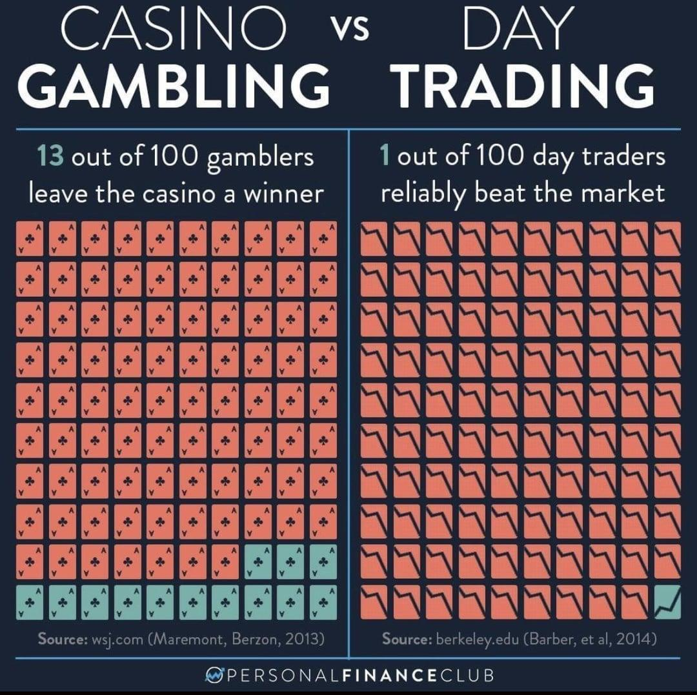

## Table of Contents

## What is casino mentality in the context of financial trading?

Casino mentality in financial trading refers to a mindset where traders treat the stock market like a casino, focusing more on the thrill of making quick profits rather than on long-term investment strategies. People with this mentality often engage in high-risk trades, hoping to strike it rich quickly, similar to how gamblers bet on games of chance. This approach can lead to significant financial losses because it is driven by emotion and short-term thinking rather than careful analysis and planning.

In contrast, successful trading usually involves a disciplined approach, where decisions are based on research, analysis, and a clear understanding of the market. Traders with a casino mentality often ignore these principles, chasing after the next big win without considering the potential downsides. Over time, this can result in a pattern of losses, as the odds in trading, like in a casino, are often stacked against those who take unnecessary risks without a solid strategy.

## How does casino mentality affect a trader's decision-making process?

Casino mentality makes traders focus on quick wins rather than smart choices. They might buy and sell stocks fast, hoping to make money right away. This way of thinking can make them ignore important information about the companies they invest in. Instead of looking at a company's financial health or future plans, they might just follow the crowd or chase after the latest hot stock.

This mindset can lead to bad decisions because it's driven by emotions like excitement and fear. Traders might hold onto losing stocks too long, hoping they'll bounce back, or sell winning stocks too soon, missing out on bigger gains. Over time, this can lead to a lot of stress and financial loss, as the thrill of the trade becomes more important than making wise investment choices.

## What are the key differences between trading with a casino mentality and a strategic approach?

Trading with a casino mentality is all about chasing quick wins and taking big risks. People with this mindset treat the stock market like a game, hoping to get rich fast without doing much research. They might buy and sell stocks quickly, following trends or tips without understanding the companies they're investing in. This approach is driven by emotions like excitement and fear, which can lead to bad decisions and big losses over time.

On the other hand, a strategic approach to trading is more careful and planned. Traders using this method take the time to study the market and the companies they invest in. They look at financial reports, future plans, and other important information before making a move. Their decisions are based on logic and analysis, not just on the hope of making quick money. This way, they aim for steady growth and long-term success, even if it means waiting longer for their investments to pay off.

## Can you explain the psychological factors that contribute to casino mentality in trading?

The casino mentality in trading often comes from a mix of emotions and psychological factors. One big [factor](/wiki/factor-investing) is the thrill of the game. Some people enjoy the rush of excitement they feel when they think they might win big, just like in a casino. This thrill can make them take big risks without thinking about the possible losses. Another factor is overconfidence. Traders might think they're smarter than the market and can outguess it, which leads them to make risky bets.

Fear of missing out (FOMO) also plays a big role. When traders see others making quick profits, they don't want to be left behind. This fear can push them to jump into trades without doing their homework, hoping to catch the same wave of success. Lastly, the desire for instant gratification can drive this mentality. People want to see results right away, so they focus on short-term gains instead of long-term growth. All these psychological factors together can make traders act more like gamblers than investors.

## What are some common signs that a trader might be exhibiting casino mentality?

A trader with a casino mentality often makes quick trades, trying to make money fast. They might buy and sell stocks in a short time, not thinking about the long-term value of their investments. They might also follow the latest trends or tips without doing much research. This kind of trader is more focused on the excitement of the trade than on making smart choices based on facts.

Another sign is that they might hold onto losing stocks for too long, hoping they will go back up. Or, they might sell winning stocks too soon, missing out on bigger gains. They might also trade more when the market is moving a lot, trying to catch big swings. This behavior shows they are driven by emotions like fear and excitement, not by a clear plan or strategy.

## How can a beginner trader avoid falling into the trap of casino mentality?

A beginner trader can avoid the casino mentality by focusing on learning and understanding the basics of the market. Instead of jumping into trades right away, they should take time to study how the stock market works, read about different companies, and learn about financial reports. By building a strong foundation of knowledge, they can make more informed decisions and avoid the trap of chasing quick wins. It's also important to set clear goals for what they want to achieve with their investments and stick to a long-term plan.

Another way to steer clear of casino mentality is to practice discipline and patience. Beginner traders should start with small amounts of money and not be tempted to make big bets right away. They should also use tools like stop-loss orders to limit their losses and avoid emotional trading. By treating trading as a serious activity and not a game, they can focus on steady growth rather than quick thrills. Over time, this approach will help them build a successful trading strategy and avoid the pitfalls of gambling with their investments.

## What role does risk management play in combating casino mentality in trading?

Risk management is very important in fighting the casino mentality in trading. It helps traders think about the possible downsides of their trades before they make them. By setting limits on how much they can lose, traders can avoid making big bets just because they feel excited or want to make quick money. This way, they can stay calm and make smarter choices, instead of acting like they're at a casino.

Using risk management tools, like stop-loss orders, can help traders stick to their plans. These tools automatically sell a stock if it drops to a certain price, which stops the trader from losing too much money. This helps them focus on long-term goals and not get caught up in the thrill of the moment. By managing risk well, traders can keep their emotions in check and build a solid strategy for success.

## Are there specific trading strategies that can help mitigate the effects of casino mentality?

One effective strategy to combat casino mentality is using a long-term investment approach. Instead of trying to make quick money, traders should focus on buying stocks of good companies and holding them for a long time. This way, they can benefit from the company's growth over years, not just days or weeks. By doing this, traders learn to ignore short-term ups and downs in the market and focus on the bigger picture. This approach helps them avoid the excitement of fast trades and makes them think about the real value of their investments.

Another strategy is to use a disciplined trading plan. This means setting clear rules for when to buy and sell stocks, based on research and analysis, not just feelings. Traders can use tools like stop-loss orders to limit their losses and take-profit orders to lock in gains. By sticking to a plan, traders can keep their emotions in check and avoid the urge to make risky bets. This disciplined approach helps them stay focused on their goals and make smarter decisions, reducing the chances of falling into the casino mentality trap.

## How do professional traders maintain discipline and avoid casino mentality?

Professional traders keep discipline and avoid casino mentality by sticking to a well-thought-out trading plan. They set clear rules for when to buy and sell stocks, based on careful research and analysis, not just their feelings. They use tools like stop-loss orders to limit their losses and take-profit orders to lock in gains. By following their plan, they can keep their emotions in check and avoid the urge to make risky bets. This disciplined approach helps them stay focused on their long-term goals and make smarter decisions.

Another way professional traders maintain discipline is by focusing on long-term investments rather than trying to make quick money. They buy stocks of good companies and hold them for a long time, benefiting from the company's growth over years, not just days or weeks. This approach helps them ignore short-term ups and downs in the market and focus on the bigger picture. By doing this, they avoid the excitement of fast trades and think about the real value of their investments, which helps them steer clear of the casino mentality trap.

## What impact does casino mentality have on long-term trading success?

Casino mentality can really hurt a trader's long-term success. When traders act like they're in a casino, they focus on making quick money instead of thinking about the future. They might buy and sell stocks fast, hoping to get rich right away. This way of thinking often leads to big losses because they're not making smart choices based on research. Over time, this can make them lose a lot of money and miss out on chances to grow their investments steadily.

To do well in trading over the long term, it's important to stay disciplined and patient. Traders need to study the market, understand the companies they invest in, and make decisions based on facts, not feelings. By focusing on long-term goals and using a clear plan, traders can avoid the casino mentality trap. This approach helps them build wealth slowly but surely, instead of risking it all on quick, risky bets.

## Can casino mentality be beneficial in any trading scenario, and if so, how?

Sometimes, casino mentality can help in trading if a trader knows what they're doing. For example, in very short-term trading, like [day trading](/wiki/day-trading-spy), the excitement and quick thinking that come with casino mentality can help traders make fast decisions. They might see a chance to make money quickly and jump on it, which can work out if they're good at spotting trends and getting in and out of trades at the right time.

But, even in these cases, it's risky. Traders need to be careful and have a plan to manage their risks. Without discipline and a clear strategy, the casino mentality can still lead to big losses. So, while it might help in some short-term situations, it's not a good idea to rely on it all the time. Long-term success in trading usually comes from being patient and making smart, well-thought-out decisions.

## How can advanced traders use psychological tools and techniques to overcome casino mentality?

Advanced traders can use psychological tools like mindfulness to keep their emotions in check and avoid casino mentality. Mindfulness means paying attention to what's happening right now without getting caught up in feelings. By practicing mindfulness, traders can stay calm and focused, making decisions based on facts instead of excitement or fear. Another helpful tool is keeping a trading journal. Writing down their trades and thoughts can help traders see patterns in their behavior and understand when they're acting like gamblers. This way, they can work on changing those habits and stick to a smarter trading plan.

Another technique advanced traders can use is cognitive behavioral therapy (CBT). CBT helps people change the way they think and act by challenging negative thoughts and replacing them with more positive ones. For traders, this can mean learning to stop thinking they can always beat the market and instead focus on realistic goals. By using CBT, traders can develop a more disciplined approach to trading, which helps them avoid the casino mentality trap. Over time, these psychological tools and techniques can help traders make better decisions and achieve long-term success in the market.

## How can one overcome the casino mentality?

Education and self-awareness are pivotal in overcoming the casino mentality in trading. Understanding the inherent differences between gambling and strategic trading is fundamental to developing a resilient mindset. Traders often fall into the trap of viewing market activities as akin to games of chance, driven by emotional impulses such as greed and fear. To shift away from this mentality, it is crucial to establish a structured approach to trading.

A well-defined trading strategy forms the backbone of successful market participation. This entails setting clear objectives, selecting appropriate financial instruments, and determining the time horizon for investments. Moreover, a robust strategy integrates both technical and [fundamental analysis](/wiki/fundamental-analysis), enabling traders to make informed decisions based on empirical data rather than speculation. Traders should employ technical indicators like moving averages and oscillators, along with a keen analysis of market trends, to predict potential price movements.

Adherence to risk management principles is equally essential. A fundamental aspect of risk management involves setting stop-loss and take-profit limits, which protects the portfolio from significant losses while securing gains. Position sizing, a strategy where the size of a trade is determined based on the trader's risk tolerance and the [volatility](/wiki/volatility-trading-strategies) of the asset, further mitigates risk exposure. The role of mathematical models, such as the Kelly Criterion, can be instrumental in optimizing the fraction of capital allocated to each trade. The Kelly Criterion is expressed as:

$$
f^* = \frac{bp - q}{b}
$$

where:
- $f^*$ is the optimal fraction of the portfolio to wager,
- $b$ is the odds received on the wager (net odds),
- $p$ is the probability of a win,
- $q$ is the probability of a loss (where $q = 1 - p$).

Continuous learning and adopting a disciplined approach are transformative for trading habits. Engaging in educational programs, staying updated with market developments, and learning from past trading mistakes are integral to growth. Self-reflection helps traders identify emotional biases affecting their decisions, encouraging a transition towards methodical and thoughtful trading practices.

In summary, transitioning from a casino mentality requires a commitment to structured education, rigorous strategy formulation, and adherence to risk management. These efforts, complemented by continuous self-improvement, cultivate a disciplined and strategic mindset, essential for long-term trading success.

## How can one build a sustainable trading practice?

A sustainable trading practice ideally integrates strategic decision-making to minimize the influence of impulsive risk-taking. The ability to differentiate between a calculated trading strategy and a casino mentality is paramount to achieving consistent success in financial markets. By actively recognizing and overcoming the emotional pitfalls associated with a casino mentality, traders can significantly enhance both their profitability and sustainability over time.

One effective method to mitigate emotional decision-making is through the implementation of [algorithmic trading](/wiki/algorithmic-trading) strategies. Algorithmic trading involves the use of automated systems to execute trades based on predefined criteria, thereby reducing the bias introduced by human emotions. These algorithms leverage historical data and mathematical models to make informed decisions, facilitating a more controlled approach to trading. The benefits of algorithmic trading are further amplified when these systems are developed using rigorous analysis and comprehensive testing.

The establishment of a disciplined trading environment considers multiple forms of analysis, including technical and fundamental assessments, to gain insights into market behavior. For instance, moving averages, a common technical analysis tool, can help traders identify trends by smoothing out price data. The moving average is defined mathematically as:

$$
MA(t) = \frac{1}{n} \sum_{i=0}^{n-1} P(t-i)
$$

where $MA(t)$ is the moving average at time $t$, $n$ is the number of periods, and $P(t-i)$ represents the price at time $t-i$.

Additionally, adopting a strategic mindset involves continuous learning and staying informed about market dynamics. This continuous improvement process aids in refining trading strategies and adapting to evolving market conditions.

In conclusion, building a sustainable trading practice demands a commitment to strategic, informed decision-making and a systematic approach to trade execution. By effectively integrating algorithmic trading and thorough market analysis, traders establish a robust framework that supports long-term success and resiliency against the detrimental effects of a casino mentality.

## References & Further Reading

[1]: ["The Psychology of Trading: Tools and Techniques for Minding the Markets"](https://www.amazon.com/Psychology-Trading-Techniques-Minding-Markets/dp/0471267619) by Brett N. Steenbarger

[2]: Barberis, N., & Thaler, R. (2003). ["A Survey of Behavioral Finance."](https://www.nber.org/papers/w9222) Handbook of the Economics of Finance.

[3]: Lo, A. W. (2005). ["The Adaptive Markets Hypothesis: Market Efficiency from an Evolutionary Perspective."](https://www.researchgate.net/publication/228183756_The_Adaptive_Markets_Hypothesis_Market_Efficiency_from_an_Evolutionary_Perspective) Journal of Portfolio Management.

[4]: ["Trading Psychology 2.0: From Best Practices to Best Processes"](https://www.amazon.com/Trading-Psychology-2-0-Practices-Processes/dp/1118936817) by Brett N. Steenbarger

[5]: Odean, T. (1998). ["Are Investors Reluctant to Realize Their Losses?"](https://onlinelibrary.wiley.com/doi/full/10.1111/0022-1082.00072) The Journal of Finance.

[6]: Thaler, R. H., & Sunstein, C. R. (2008). ["Nudge: Improving Decisions About Health, Wealth, and Happiness."](https://www.researchgate.net/publication/257178709_Nudge_Improving_Decisions_About_Health_Wealth_and_Happiness_RH_Thaler_CR_Sunstein_Yale_University_Press_New_Haven_2008_293_pp)