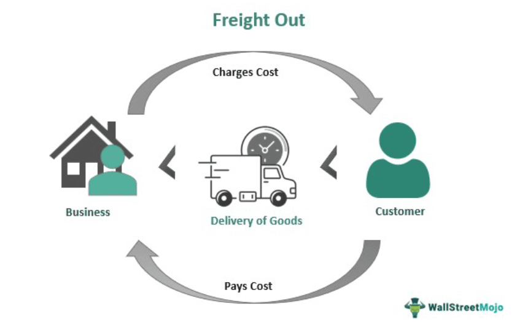

In today's fast-paced economy, the logistics and transportation sectors are pivotal in shaping market trends. These sectors ensure the efficient movement of goods, which is critical for maintaining supply chain stability and meeting consumer demand. A vital tool for understanding trends within these sectors is the Cass Freight Index. This index provides valuable data on freight movement across North America, capturing the dynamics of monthly aggregate deliveries in the region.

The significance of the Cass Freight Index lies in its ability to offer a comprehensive view of shipping activities, reflecting real-time conditions of the logistics industry. Its application extends beyond simple observation, influencing decision-making in both the transportation and financial sectors. The index's insights can be critical in predicting economic trends, thus helping analysts develop robust economic forecasts.



Moreover, the Cass Freight Index holds potential applications in algorithmic trading (algo trading). The integration of logistics metrics into trading algorithms can transform trading strategies, offering predictive insights that previously might have gone unnoticed. Algo trading relies on data-driven decision-making processes, and utilizing logistics data allows traders to optimize their strategies in response to changing economic and market conditions.

For stakeholders within the logistics, financial, and economic sectors, an informed understanding of the elements provided by the Cass Freight Index can facilitate improved strategic decision-making. By interpreting these metrics, stakeholders can enhance their ability to navigate today’s dynamic markets, improving operational efficiency and financial performance.

## Table of Contents

## Understanding the Cass Freight Index

The Cass Freight Index serves as a crucial tool for gauging the volume and expenditure aspects of freight movement across North America. It provides a comprehensive snapshot of the shipping activities by compiling data from a diverse array of over 1,200 divisions representing more than 400 companies. This extensive data collection renders the index a statistically significant barometer of U.S. freight activity. 

The index encompasses an array of transportation modes, including trucking, rail, air, and ocean freight, offering a holistic perspective on the dynamics of freight transportation. Each mode of transport contributes uniquely to the index, thereby enabling stakeholders to analyze specific segments of the logistics chain or assess overall shipping health.

Updated on a monthly basis, the Cass Freight Index functions as an essential tool for tracking freight trends. It helps correlate these trends with broader economic and supply chain indicators, providing insights into the current state of the market and potential future movements. For instance, fluctuations in the index might hint at shifts in manufacturing output, changes in consumer demand, or alterations in global trade patterns.

Moreover, the aggregated data in the Cass Freight Index is frequently referenced by economic analysts and policymakers to inform national economic strategies. Its insights aid in understanding how logistical activities correlate with economic growth patterns, making it indispensable for both economic forecasting and strategic planning within the transportation and logistics sectors.

## Cass Freight Index Components

The Cass Freight Index is built upon two foundational components: shipment volumes and expenditures. These components serve critical roles in providing a comprehensive understanding of freight movement and its economic implications.

Shipment volumes measure the quantity of goods transported across North America. This metric provides valuable insights into logistical flows, indicating the demand for shipping services and the supply chain's scale of operations. An increase in shipment volumes often signals robust economic activity, as more goods are being produced and consumed. Conversely, a decline may suggest economic slowdown or shifts in consumer behavior, impacting various sectors reliant on freight services.

Expenditures, on the other hand, reflect the total financial outlay on transportation services. This component outlines the cost aspects associated with freight movement, comprising fuel prices, labor costs, equipment expenses, and other operational factors. Changes in expenditures can highlight shifts in the efficiency and pricing dynamics of the transportation sector. For instance, a rise in transportation costs might be attributed to increased fuel prices or regulatory changes impacting logistics operations. 

By analyzing both shipment volumes and expenditures, stakeholders can grasp the dual impact of freight movements—the physical flow of goods and their financial ramifications. This understanding aids in evaluating the health of the logistics sector and predicting broader economic trends. Stakeholders such as economists, supply chain managers, and financial analysts can leverage these components to make informed decisions, align operational strategies, and anticipate market fluctuations.

## Logistics Metrics and Economic Indicators

Logistics metrics, such as those provided by the Cass Freight Index, hold significant value as indicators of broader economic trends. These metrics can function as leading indicators, providing insights into the future direction of the economy. The fundamental premise is straightforward: logistics activities are often precursors to changes in economic conditions. When companies anticipate increased demand, they may adjust their logistics activities accordingly, which can manifest in measures such as shipment volumes and transportation expenditures captured by the Cass Freight Index.

The Cass Freight Index is frequently referenced in financial and trade publications, serving as a reliable resource for gauging economic health. For instance, an uptick in freight shipments can signal an impending period of economic expansion, while a decrease might foreshadow a contraction. This predictive capability stems from the fact that the movement of goods is foundational to economic activity. As goods flow through supply chains, they stimulate a series of economic engagements, including manufacturing, retail, and services, which collectively influence the broader economy.

Moreover, the index's relevance extends to national economic data compilation, underscored by its inclusion by entities such as the Federal Reserve Bank of St. Louis. By integrating metrics like those from the Cass Freight Index into national economic data sets, analysts can obtain a more nuanced understanding of the economy’s trajectory. This inclusion suggests an acknowledgment of the index’s efficacy in reflecting real-time economic conditions. 

Understanding the Cass Freight Index as an economic indicator can empower stakeholders across various sectors to make informed decisions. Traders, economists, and policymakers can leverage this information to anticipate market shifts, adjust financial strategies, and devise policies that improve economic resilience. As such, the index is not merely a tool for measuring logistics activities but a vital component in the arsenal of analytics for economic prediction and decision-making.

## The Role of Algo Trading in Freight Index Analysis

Advancements in technology have ushered in the era of [algorithmic trading](/wiki/algorithmic-trading), now a pivotal component of modern financial markets. Algorithmic trading, often referred to as algo trading, involves executing trades based on pre-defined instructions encompassing parameters such as timing, price, and [volume](/wiki/volume-trading-strategy). The integration of logistics metrics, notably the Cass Freight Index, into trading algorithms offers valuable opportunities for optimizing trading strategies.

The Cass Freight Index, with its detailed insights into freight movements and expenditures, serves as a vital source of data for making informed trading decisions. Incorporating this index into algorithms allows traders to leverage its predictive capabilities, especially in gauging economic conditions and market demands. For instance, an increase in shipment volume, as reported by the index, may signal rising consumer demand and impending economic expansion, thus guiding investment decisions towards industries poised for growth.

Algo trading systems can be designed to automatically respond to changes in the Cass Freight Index. For example, Python code leveraging libraries like pandas and numpy can be deployed to collect and analyze freight data:

```python
import pandas as pd
import numpy as np

# Example function to calculate moving average of freight shipments
def calculate_moving_average(data, window_size):
    return data['Shipment Volume'].rolling(window=window_size).mean()

# Load Cass Freight Index data
data = pd.read_csv('cass_freight_index.csv')

# Calculate moving average
data['Moving Average'] = calculate_moving_average(data, window_size=3)
```

This kind of analysis helps traders capitalize on trends indicated by logistics data. The role of the Cass Freight Index extends beyond simple trend observation. Its data can be paired with other economic indicators to refine predictive models, enhancing the accuracy of forecasts used in algo trading. The efficacy of trading strategies is thereby improved, as these models offer deeper insights into market behavior driven by logistics performance.

Moreover, the application of the Cass Freight Index in algo trading is not constrained solely to analyzing freight movements. Expenditure data provided by the index is equally significant. Fluctuations in transportation costs, reflective of factors like fuel prices and supply chain disruptions, are critical for forecasting economic shifts. These fluctuations can be seamlessly integrated into trading algorithms to adjust financial positions and mitigate risks effectively.

In summary, incorporating the Cass Freight Index into algorithmic trading not only equips traders with crucial logistics metrics but also enhances their ability to predict economic and market behavior. This capability translates into more refined trading strategies, aligning market moves with economic signals derived from freight data. As technology continues to evolve, the intersection of logistics metrics and algorithmic trading is poised to become increasingly influential in financial decision-making.

## Cass Freight Index and Competitive Analysis

The Cass Freight Index stands as a significant benchmark within the logistics industry, providing critical insights into shipping activities and economic trends. It shares this analytical space with other notable indices, such as the Morgan Stanley Proprietary Truckload Freight Index and the U.S. Department of Transportation’s Transportation Services Index (TSI). Each of these indices employs unique methodologies to capture different aspects of freight and transportation dynamics, thus offering complementary perspectives on market conditions.

The Morgan Stanley Proprietary Truckload Freight Index, for example, focuses specifically on the trucking industry, analyzing aspects such as truckload rates, demand, and capacity. This focus on trucking provides detailed insights that are crucial for understanding fluctuations in this vital segment of the freight landscape, complementing the broader scope of the Cass Freight Index, which encompasses multiple transportation modes including rail, air, and ocean freight.

On the other hand, the U.S. Department of Transportation’s Transportation Services Index is a composite measure of transportation activity across multiple sectors, including freight and passenger services. It gauges the volume of services provided by the transportation sector, thereby serving as a broad economic indicator. This index helps in capturing the overall transportation-related economic activity, allowing stakeholders to see broader trends that might be missed if focusing solely on freight-specific indices like the Cass Freight Index.

Conducting a comparative analysis using these indices can provide a richer, multidimensional understanding of logistics trends and economic conditions. By examining the intersections and divergences among these indices, stakeholders can better predict market movements and economic shifts. For example, an upward trend in the Truckload Freight Index coupled with a stable Cass Freight Index might suggest increased trucking capacity or reduced demand in other freight modes. Similarly, if the TSI shows a downturn while the Cass Freight Index is steady or increasing, it might imply a decline in passenger transportation services rather than freight services.

Overall, utilizing a combination of these indices allows businesses, investors, and policymakers to create more nuanced strategies and decisions, leveraging the strengths of each index to capture a comprehensive picture of the economic landscape.

## Concluding Thoughts

The Cass Freight Index serves as a crucial resource for decoding the complexities of shipping trends, economic indicators, and logistics metrics. Its comprehensive dataset is instrumental in analyzing current market conditions, offering pivotal insights into the freight transportation landscape. By providing detailed breakdowns in shipment volumes and expenditures, the Index allows stakeholders to monitor both physical freight movements and the corresponding financial impacts. This dual perspective is vital for developing informed strategies and adapting to shifts in market dynamics.

Incorporating the Cass Freight Index into algorithmic trading strategies can enhance decision-making processes by leveraging data-driven insights. The Index’s ability to anticipate changes in economic activity through freight trends can help traders and analysts anticipate market behaviors and optimize trading strategies accordingly. For instance, identifying a consistent rise in freight activity might signal an impending economic expansion, prompting timely investment decisions.

Professionals in logistics, finance, and economics gain a strategic advantage through an informed application of the Cass Freight Index. As shipping volumes and expenditures are closely tied to broader economic trends, the Index provides a predictive edge in responding to economic shifts. Embracing the index as a foundational analytical tool enables stakeholders to navigate the complexities of modern markets with increased confidence and precision. This proactive approach can lead to comprehensive strategies that effectively capitalize on emerging trends, ultimately enhancing competitiveness and resilience in rapidly evolving economic environments.

## References & Further Reading

[1]: ["Cass Indexes"](https://www.cassinfo.com/freight-audit-payment/cass-transportation-indexes/cass-freight-index) - Official website for the Cass Freight Index providing up-to-date data and methodological details.

[2]: Cowen, R. (2020). ["Freight Data as an Economic Indicator: Using Logistics Insights for Better Economic Forecasting,"](https://www.emerald.com/insight/content/doi/10.1108/09600030210430660/full/html) Journal of Transport Geography.

[3]: ["Algorithmic Trading & DMA: An Introduction to Direct Access Trading Strategies"](https://www.amazon.com/Algorithmic-Trading-DMA-introduction-strategies/dp/0956399207) by Barry Johnson

[4]: ["Freight Transportation: Demand Characteristics and Public Policy Alternatives"](https://www.sciencedirect.com/science/article/pii/0191260783901620) by Norman Solomon

[5]: ["The Logistics and Supply Chain Toolkit: Over 100 Tools and Guides for Supply Chain, Transport, Warehousing and Inventory Management"](https://www.amazon.com/Logistics-Supply-Chain-Toolkit-Warehousing/dp/1398613371) by Gwynne Richards and Susan Grinsted

[6]: ["National Bureau of Economic Research: Freight and Transportation Data"](https://www.bts.gov/topics/freight-transportation) - Data resources related to freight and transportation economics.