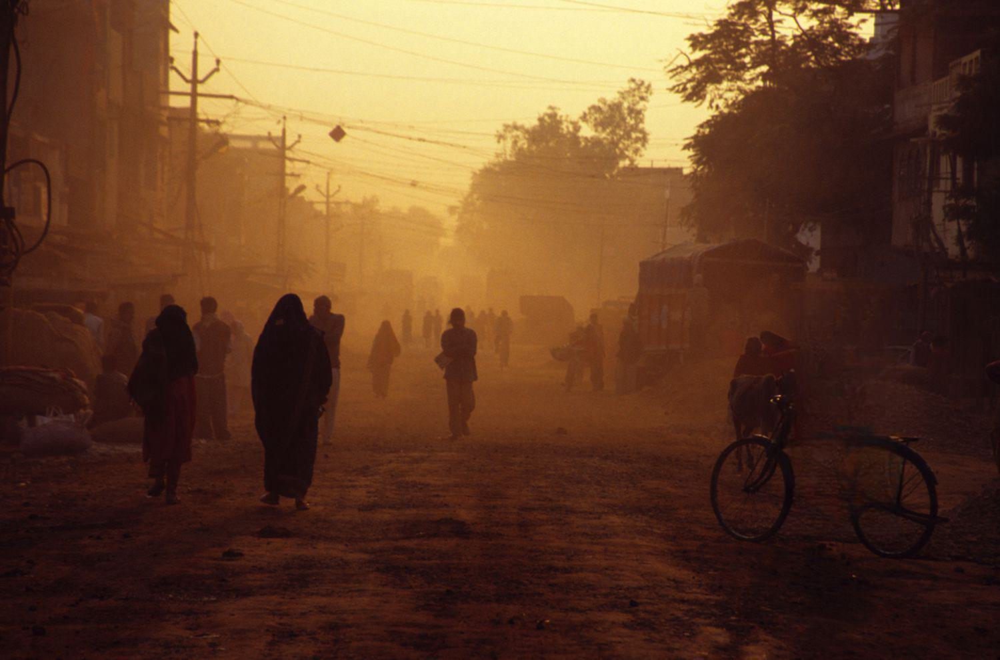

The profound implications of social stratification systems, notably the caste system, have long been a subject of scrutiny across various academic disciplines. Originating primarily in the Indian subcontinent, the caste system is a rigid social hierarchy that has historically dictated individuals' social status, occupational prospects, and personal relationships. Despite numerous efforts to dismantle its oppressive frameworks, caste-based discrimination persists, contributing significantly to enduring social inequalities. This system has profoundly informed power dynamics and access to resources, with marginalized communities often bearing the brunt of systemic bias and socio-economic deprivation.

Parallel to these historical stratifications, we stand on the brink of an era defined by rapid technological advancements. Algorithmic trading, an innovative application of algorithms to execute trades at speeds and volumes beyond human capacity, represents a frontier of modern financial markets. As this practice becomes more entrenched in global finance, it raises pertinent questions about its role in potentially reinforcing or mitigating existing social inequalities. The algorithmic systems, designed to optimize financial gains, might inadvertently amplify socio-economic disparities if unchecked biases are embedded within them.

This article seeks to explore the nuanced interaction between these entrenched social frameworks and modern technological practices. It will examine whether technology, specifically algo trading, has the capacity to democratize financial opportunities or if it perpetuates age-old inequalities. By unraveling the complexities at the intersection of traditional social systems and cutting-edge technology, we can better understand how societal practices can be reformed to foster a more equitable future.

## Table of Contents

## Understanding Caste System Discrimination

The caste system, a form of social stratification, has been a significant aspect of the Indian subcontinent's societal structure for millennia. Traditionally, it categorized people into rigid hierarchical groups based on their karma (work) and dharma (duty). These groups, or 'varnas', include the Brahmins (priests), Kshatriyas (warriors), Vaishyas (traders), and Shudras (laborers). Outside of these categories exist the Dalits, historically referred to as 'untouchables', who have been subject to severe marginalization and discrimination.

In contemporary society, caste-based discrimination persists, impacting social inequality significantly. Despite legal measures aimed at its eradication, the caste system continues to determine access to resources, education, and employment opportunities for many Indian citizens. This entrenched inequality manifests economically and socially, where marginalized communities face systemic barriers that hinder upward mobility and equitable participation in society [1].

The socio-economic repercussions for marginalized groups within the caste system are profound. Dalits and others from lower castes frequently encounter discrimination in various facets of life, including unfavorable hiring practices, wage disparities, and limited access to basic social services, which in turn perpetuates poverty cycles. Moreover, social exclusion often leads to poorer health outcomes and restricted educational opportunities, further entrenching economic disadvantages [2].

Legal frameworks in India, such as the Scheduled Castes and the Scheduled Tribes (Prevention of Atrocities) Act, aim to protect these communities from discrimination and violence. The Indian Constitution also abolishes "untouchability" and prohibits caste-based discrimination. However, enforcement remains inconsistent, and societal attitudes are slow to shift, often undermining these legal protections.

Internationally, caste discrimination has gained recognition as a human rights issue. The United Nations has addressed caste as a form of racial discrimination, urging nations to take action to combat it within their jurisdictions. Global advocacy has increased awareness, yet the implementation of effective measures remains a challenge due to deep-rooted cultural and social norms [3].

In summary, the caste system continues to influence social dynamics and economic conditions in the Indian subcontinent, despite legislative efforts aimed at its abolition. The movement towards equality requires not just legal reforms but also societal changes that address and dismantle the underlying cultural attitudes perpetuating caste discrimination.

---

[1] Deshpande, A. (2011). The Grammar of Caste: Economic Discrimination in Contemporary India. Oxford University Press.

[2] Thorat, S., & Newman, K. S. (2010). Blocked by Caste: Economic Discrimination in Modern India. Oxford University Press.

[3] United Nations Human Rights Office. (2016). Statement by the UN High Commissioner for Human Rights Zeid Ra'ad Al Hussein on caste-based discrimination. Retrieved from https://www.ohchr.org/en/statements/2016/08/statement-un-high-commissioner-human-rights-zeid-raad-al-hussein-caste-based

## Social Inequality in the Modern World

Social inequality manifests in contemporary society through various dimensions, notably economic, racial, and gender disparities. Each dimension contributes uniquely to the broader context of unequal opportunities and access to essential resources. 

Economic inequality, often measured by metrics like the Gini coefficient, reflects the uneven distribution of wealth and income across populations. Individuals and communities with limited access to capital and financial resources face significant barriers in accessing quality education, healthcare, and employment opportunities, perpetuating cycles of poverty.

Racial inequality is evident in systemic differences in treatment and opportunity based on race. It is perpetuated by historical legacies of colonization, slavery, and segregation, leading to disparities in educational attainment, housing, and law enforcement. Racial bias often results in marginalized groups facing discrimination at institutional and individual levels, contributing to their continued socio-economic disadvantages.

Gender inequality remains a persistent issue, with women and gender minorities often experiencing obstacles in accessing the same opportunities as their male counterparts. This disparity is reflected in wage gaps, underrepresentation in leadership roles, and unequal access to education and healthcare services. These inequalities are compounded by societal norms and legal frameworks that fail to protect or empower gender-diverse groups fully.

Entrenched social systems, including class structures, cultural norms, and institutional practices, obstruct equal access to resources and opportunities. These systems inherently favor certain groups over others, creating an environment where social mobility is limited. For example, individuals born into lower socio-economic classes frequently encounter challenges in breaking the cycle of poverty due to limited educational and employment prospects.

Efforts to reduce social inequalities have been implemented on a global scale, encompassing policies and initiatives aimed at fostering inclusion and equity. International commitments such as the United Nations Sustainable Development Goals (SDGs) highlight the importance of addressing inequality. Goal 10, in particular, focuses on reducing inequality within and among countries. However, the effectiveness of these global efforts varies significantly. While some regions have made substantial progress, others continue to grapple with systemic issues that hinder comprehensive reform.

Implementing identity-based policies to promote equality presents several challenges. Such policies aim to address specific inequalities faced by different demographic groups. However, they often encounter resistance from those who perceive them as preferential treatment or reverse discrimination. Moreover, accurately identifying and addressing the nuanced needs of diverse groups without reinforcing stereotypes or inadvertently excluding others is complex. Policies must strike a balance between recognizing the unique challenges faced by specific groups and fostering an inclusive approach that benefits the broader population.

Overall, addressing social inequality requires a multifaceted approach that acknowledges the interplay between economic, racial, and gender disparities. It necessitates a commitment to reforming entrenched social systems and implementing policies that promote equitable access to resources and opportunities. Achieving meaningful progress will depend on sustained global efforts, effective policy implementation, and a continued emphasis on inclusivity and equity.

## Algorithmic Trading: A Double-Edged Sword

Algorithmic trading, often referred to as algo trading, is a method of executing securities trades using pre-programmed instructions and mathematical models. These algorithms can process vast datasets quickly, detecting price movements and executing buy or sell orders within fractions of a second. As such, algo trading plays a crucial role in modern financial markets by providing [liquidity](/wiki/liquidity-risk-premium), narrowing bid-ask spreads, and facilitating high-frequency trading ([HFT](/wiki/high-frequency-trading-strategies)).

The advantages of [algorithmic trading](/wiki/algorithmic-trading) are multi-faceted. It allows for enhanced precision and speed in trade execution, minimizes human error, and can operate continuously across global markets. Financial institutions leverage algorithms to gain competitive advantages, such as arbitraging price discrepancies and executing large volumes without significantly impacting market prices. This has transformed the financial landscape, leading to increased market efficiency and reduced costs for participants.

However, these advantages are coupled with potential disparities. The accessibility to advanced trading algorithms is often restricted to institutions with substantial resources, creating an uneven playing field. Retail investors and smaller firms may struggle to compete against the sheer speed and sophistication of institutional algo trading. This technological edge can prioritize the interests of well-funded entities, reinforcing existing economic disparities.

Algorithmic trading systems can perpetuate social inequalities if they are not cautiously designed and managed. In scenarios where algorithms exploit market inefficiencies, smaller investors might bear the cost. For example, flash crashes—sudden market declines caused by algorithmic errors or manipulations—can disproportionately affect retail investors. The 2010 Flash Crash is a notable example, where the Dow Jones Industrial Average plunged and quickly rebounded within minutes, attributed partly to automated trading programs.

There are significant ethical considerations and regulatory concerns associated with algorithmic trading. The potential for market manipulation, lack of transparency, and systemic risks necessitates robust regulatory oversight. Regulators worldwide, including the U.S. Securities and Exchange Commission (SEC) and the European Securities and Markets Authority (ESMA), have laid down rules governing algorithmic practices to ensure market integrity and protect investors. These regulations encompass requirements for algorithm testing, risk management, and monitoring mechanisms to prevent abusive trading behaviors.

Moreover, there is an ongoing debate about whether algorithms should possess decision-making capabilities in financial markets. The opacity of some algorithmic strategies raises questions about accountability during market anomalies. Ethical frameworks are crucial in guiding the deployment of algorithms to ensure they operate equitably and do not exacerbate unintended disparities.

Ultimately, while algorithmic trading offers unparalleled efficiencies and innovations within financial markets, it also represents a double-edged sword. Its benefits must be balanced with vigilant regulatory measures and ethical considerations to avoid amplifying existing social inequalities and to safeguard the interests of all market participants.

## The Intersection of Traditional Social Systems and Modern Technology

Traditional social systems, such as caste hierarchies, have historically influenced access to resources, opportunities, and social mobility. With the advent of modern technologies like algorithmic trading, there is a growing concern about how these historic structures intersect with technological advancements. Algorithmic trading, which involves the use of computer algorithms to execute trades at high speed and [volume](/wiki/volume-trading-strategy), has transformed financial markets but also raises questions about the reinforcement or democratization of existing social inequalities.

Algorithmic trading has the potential to democratize financial systems by making markets more efficient and accessible. The use of technology can theoretically reduce transaction costs and provide broader access to financial instruments for diverse participants. For example, retail investors can now utilize trading platforms that were once the exclusive domain of institutional investors, potentially leveling the playing field.

However, the accessibility provided by technology is not uniformly distributed. Existing social inequalities, such as those propagated by caste hierarchies, can influence who benefits from these technological advancements. Individuals from marginalized communities, often lacking access to quality education and resources, may find themselves at a disadvantage when it comes to leveraging algorithmic trading tools effectively. Moreover, biases present in algorithmic systems could inadvertently perpetuate existing disparities. Algorithms are designed by humans who may, consciously or unconsciously, embed societal biases into their models, thereby reinforcing structural inequalities.

A pertinent example of technology intersecting with social inequality is the digital divide. Access to advanced technologies like high-speed internet, sophisticated trading algorithms, and real-time data feeds is often limited to urban, economically prosperous regions. In contrast, individuals residing in rural or underdeveloped areas, frequently corresponding to lower caste demographics, face significant barriers in accessing these tools.

The role of policy and regulation is crucial in managing these intersections. Regulatory frameworks need to address both the technical and social dimensions of technology use. For algorithmic trading, this includes ensuring transparency in algorithmic decisions, mitigating market manipulation risks, and implementing safeguards against systemic biases. Policies must also aim to enhance digital literacy and economic inclusivity, ensuring marginalized groups have the means to engage with modern technologies.

Initiatives, such as promoting STEM education in underserved areas and providing platforms for diverse voices in technological development, can aid in bridging the gap between traditional social systems and modern technology. Additionally, regulations that mandate diversity in tech development teams could result in algorithms more representative of broader societal needs.

In conclusion, while algorithmic trading and other modern technologies have the potential to democratize financial systems, they also [carry](/wiki/carry-trading) the risk of exacerbating existing social inequalities. Addressing these challenges requires a multifaceted approach involving robust policy interventions, regulatory oversight, and community engagement to ensure technologies serve as tools for inclusivity rather than division.

## Future Directions and Considerations

The examination of caste system discrimination and the implications of algorithmic trading underscores the complexity of social inequalities in modern contexts. Reviewing historical and technological influences reveals that entrenched disparities continue to affect marginalized groups, while advanced technologies like algorithmic trading offer both opportunities and threats to equality.

To address these inequalities, policy innovations are critical. Policymakers should consider implementing measures that ensure fair access to technological tools and resources. For instance, regulating algorithmic trading to prevent monopolistic practices and ensuring transparency in financial algorithms can mitigate economic disparities. Adopting inclusive digital policies that support underrepresented communities in technology and finance is essential. This involves developing programs that provide education and training in digital literacy, thereby democratizing access to emerging technological fields.

Public awareness and education are pivotal in challenging discriminatory practices. Initiatives to educate people about caste discrimination and its modern-day effects can foster societal change. Educational curricula should incorporate modules on social justice, promoting empathy and understanding across diverse social groups. Similarly, awareness campaigns can highlight the ethical use of technology, emphasizing its role in perpetuating or reducing inequality.

Ongoing research into the social impacts of technologies like algorithmic trading is necessary. Interdisciplinary studies that combine insights from social sciences, economics, and technology can yield a holistic understanding of these impacts. Research should focus on how algorithmic systems can be designed to promote fairness and inclusivity. Additionally, examining the unintended consequences of these technologies will inform better policy and regulatory frameworks.

In conclusion, addressing social inequalities requires coordinated efforts across policy, education, and research. With careful consideration and proactive strategies, there is potential to harness technology as a tool for social equity rather than a source of division.

## Conclusion

Addressing caste system discrimination remains a critical challenge with profound modern implications. The caste system, historically entrenched in social stratification, continues to affect millions worldwide, primarily in South Asia, by perpetuating social inequality and limiting opportunities for marginalized communities. Modern societies must remain vigilant to the persistence of these discriminatory practices, recognizing their impacts across economic, educational, and political domains.

Technology serves a dual role in influencing social equality. On one hand, technological advancements hold the promise of democratizing access to resources, fostering innovation, and bridging societal gaps. For instance, digital platforms can provide educational resources or financial services to underserved groups, potentially enhancing social mobility. On the other hand, technology can also entrench existing disparities, as seen in algorithmic trading, where the advantages often accrue to those with existing capital and technological know-how, potentially widening economic divides and replicating systemic biases.

A societal shift towards inclusivity is essential. This involves active efforts to dismantle discriminatory social systems and cautious implementation of technological solutions that avoid reinforcing existing disparities. Policies that prioritize equitable access to technology, combined with rigorous bias-checking in algorithmic systems, are necessary. Furthermore, public awareness and educational initiatives can highlight the ongoing impacts of discrimination and provide tools for communities to advocate for change.

Collaboration is key. Policymakers, technologists, and communities must work together to create frameworks that protect against discrimination while promoting equitable opportunities. Policymakers should ensure that regulations keep pace with technological advances, preventing new forms of inequality. Technologists must engage with ethical considerations, designing systems that are transparent and fair. Communities, meanwhile, should participate in these discussions, ensuring that diverse voices shape the technologies and policies that impact them.

In conclusion, addressing caste system discrimination and its interplay with modern technology requires comprehensive strategies that highlight inclusivity and equity. By recognizing the dual nature of technology and fostering collaboration across sectors, society can move towards a more equitable future. The responsibility lies with each of us—policymakers, technologists, and community members—to champion this transformation, leveraging technology as a tool for social justice and equality.

## References & Further Reading

[1]: Deshpande, A. (2011). *The Grammar of Caste: Economic Discrimination in Contemporary India*. Oxford University Press.

[2]: Thorat, S., & Newman, K. S. (2010). *Blocked by Caste: Economic Discrimination in Modern India*. Oxford University Press.

[3]: United Nations Human Rights Office. (2016). [Statement by the UN High Commissioner for Human Rights Zeid Ra'ad Al Hussein on caste-based discrimination](https://www.ohchr.org/en/statements/2016/02/statement-un-high-commissioner-human-rights-zeid-raad-al-hussein-end-his-mission).

[4]: Lopez de Prado, M. (2018). *Advances in Financial Machine Learning*. Wiley.

[5]: Chan, E. P. (2008). *Quantitative Trading: How to Build Your Own Algorithmic Trading Business*. Wiley.

[6]: UN DESA (2020). [World Social Report 2020: Inequality in a rapidly changing world](https://www.un.org/development/desa/dspd/wp-content/uploads/sites/22/2020/02/World-Social-Report2020-FullReport.pdf).

[7]: Jansen, S. (2020). *Machine Learning for Algorithmic Trading*. Packt Publishing.