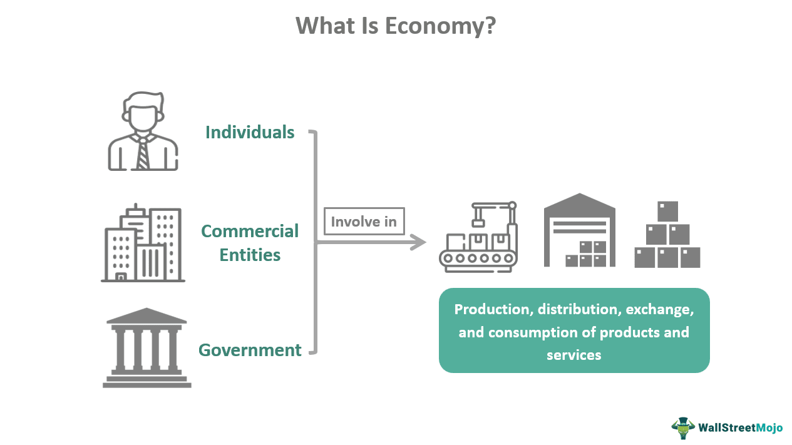

In today's interconnected world, social hierarchy and stratification have transcended traditional boundaries to mold diverse fields, including finance and technology. As these paradigms evolve, the relationship between historical caste systems and contemporary social structures becomes increasingly relevant, especially in the context of algorithmic trading within the financial sector. This dynamic interplay raises questions about how age-old systems of social stratification influence, and are reflected in, modern economic practices.

Caste systems, notably the historical example in India, have long dictated social order based on hereditary occupation and social standing. These systems imposed rigid boundaries that determined individuals' access to resources and opportunities, producing long-lasting socioeconomic effects. In a parallel sense, modern financial markets operate within a framework where access to technology and capital can create stratifications reminiscent of these historical hierarchies.



The financial sector, particularly through algorithmic trading, epitomizes this convergence. Algorithmic trading involves using sophisticated algorithms to execute trades at unprecedented speeds, predominantly benefiting elite financial institutions with access to cutting-edge technology and vast data resources. This creates an environment where economic status and access dictate participation and success, echoing the constraints imposed by traditional caste systems.

As we explore the convergence of these historical and modern social hierarchies, the implications on financial markets become evident. A deeper understanding of this intersection provides insights into how these structures influence economic inequality and the distribution of financial gains. This exploration sheds light on the need for reforms that democratize access to financial technologies, ensuring that they serve as tools for broad-based economic opportunity rather than reinforcing existing disparities.

In summary, by dissecting the convergence of traditional caste systems with modern financial hierarchies, we aim to reveal the intricate ways in which these systems perpetuate economic stratification. Understanding these connections is essential for crafting policies that address systemic inequalities and promote equitable access within the financial sector.

## Table of Contents

## Historical Background of Social Hierarchies

Social hierarchies have existed for centuries and play a crucial role in shaping societies. Among these, the caste system in India stands out as one of the oldest and most rigid structures. Originating over 2,000 years ago, it categorizes individuals based on hereditary occupation and social standing. The principal categories in the caste system are known as varnas, which traditionally include Brahmins (priests and teachers), Kshatriyas (warriors and rulers), Vaishyas (traders), and Shudras (laborers). Additionally, numerous jatis, or sub-castes, emerged within these varnas, further stratifying the societal structure.

The societal impact of this system has been profound and long-lasting. It dictated various aspects of life, such as marriage, occupation, and dietary habits, thereby influencing both personal and community life. The hierarchical nature of the caste system inherently allotted privileges and economic opportunities to the higher classes, while simultaneously restricting access and rights for lower ones. This led to significant socioeconomic effects, such as disparate access to resources and education, which have persisted despite efforts to combat these biases.

Understanding these roots is essential to comprehending how hierarchies have evolved into current economic systems. Today’s economic structures can echo these historical divisions, as modern social stratifications sometimes reflect the inequalities seen in ancient hierarchies. To illustrate, privileged access to education and technology in contemporary society often correlates with higher economic classes, reminiscent of the advantages traditionally ascribed to upper caste groups.

In exploring these parallels, it is evident how deeply entrenched social stratifications have historically influenced economic systems worldwide. This understanding underscores the necessity to critically analyze and address modern economic inequalities to prevent the perpetuation of such historical disparities.

## Modern-day Social Hierarchies and Finance

Social hierarchies in modern society prominently manifest through economic status and access to financial resources, creating a landscape where finance significantly reflects and enforces these stratifications. The advent and evolution of [algorithmic trading](/wiki/algorithmic-trading) stand as a testament to how technological advancements in finance are deeply intertwined with existing social hierarchies. 

Algorithmic trading involves the use of sophisticated mathematical models and high-speed computers to execute trades at scales and speeds unimaginable to the average investor. This system leverages financial algorithms that are designed to identify and exploit marginal trading opportunities across global markets. The primary advantage of algorithmic trading is its ability to process vast amounts of data rapidly, making split-second decisions that can drastically affect financial outcomes. However, the accessibility to these innovative financial tools is heavily skewed in favor of elite financial institutions, hedge funds, and the upper echelons of the financial industry. 

The resources required to develop and maintain algorithmic trading systems—such as high-performance computing infrastructure, advanced quantitative financial models, and teams of skilled data scientists and engineers—are substantial. As a result, only those with significant capital and technological access can fully participate in and benefit from algorithmic trading. This reality perpetuates a financial hierarchy where wealth is both a prerequisite for and a product of participation in high-frequency trading markets.

Moreover, this financial stratification is perpetuated by the competitive nature of the industry. Firms with the ability to invest in cutting-edge technology and top-tier human capital strengthen their competitive edge, further widening the gap between economic classes. Resource-rich entities gain a disproportionate influence over market dynamics and pricing structures, exacerbating economic disparities.

Algorithmic trading showcases the interplay between modern technology and social stratification, embodying a contemporary hierarchy rooted in economic prowess and technological access. These systems emphasize the ongoing influence of social hierarchies in shaping financial markets, reinforcing the economic divide reminiscent of historical social frameworks.

## The Intersection of the Caste System and Algorithmic Trading

The evolution of financial technology has introduced sophisticated tools like algorithmic trading, designed to enhance market efficiency and transaction speed. Yet, despite these technological advancements, the financial sector mirrors traditional social stratifications akin to historical caste systems. This intersection is primarily characterized by the accessibility of technology and resources, which dictate participation and success in algorithmic trading.

Algorithmic trading involves the use of complex algorithms that process vast quantities of data to make informed trading decisions at speeds unattainable by human traders. These algorithms leverage advanced computational power, requiring significant financial and technical resources. Consequently, access to these technologies is often limited to a select group of affluent financial institutions and individuals, establishing a modern hierarchy within the financial markets. This hierarchy echoes the rigid structures of caste systems, where one's status and opportunities are largely predetermined by their access to resources.

The caste-like structure within algorithmic trading creates distinct classes of market participants: those with access to cutting-edge technology and those without. Elite financial firms and high-net-worth individuals can invest in the necessary infrastructure, such as high-frequency trading systems and direct data feeds, to gain competitive advantages. This access allows them to execute trades with superior speed and precision, optimizing their strategies and profits. Conversely, smaller firms and individual traders without such resources face significant barriers, limiting their market impact and potential for success.

This technological disparity directly influences the dynamics of financial markets. Market [liquidity](/wiki/liquidity-risk-premium) and pricing efficiency are often enhanced by the participation of algorithmic traders. However, the concentration of trading power within a limited number of market participants can lead to imbalances. For instance, the prevalence of high-frequency trading firms can result in market environments where prices move in response to algorithmic activity rather than fundamental market factors. Such conditions may disadvantage those without sophisticated trading tools, further entrenching existing financial divides.

Beyond market dynamics, this hierarchical structure raises questions about who truly benefits from advancements in algorithmic trading. While increased efficiency and liquidity theoretically benefit all market participants, the reality is that the primary advantages are often accrued by those who can afford the best technologies. This reinforces the economic stratification reminiscent of caste systems, where the wealthy and well-resourced enjoy disproportionate gains.

In conclusion, while algorithmic trading presents significant advancements in financial markets, it perpetuates an invisible hierarchy reminiscent of historical caste systems. Technology and resource accessibility dictate market participation and success, creating a modern social stratification within the financial sector. Understanding this intersection is crucial for addressing systemic inequalities and fostering a more equitable financial landscape.

## Implications of Algorithmic Trading on Economic Equality

Algorithmic trading is a double-edged sword with the potential to bring about significant efficiency and liquidity benefits in financial markets while simultaneously exacerbating economic inequality. This form of trading utilizes intricate algorithms and cutting-edge technology to execute trades at astonishing speeds, often allowing those with access to these advanced systems to outperform the average investor. Such disparity in access can widen existing economic divides, drawing parallels to historical caste systems that rigidly segmented society based on birth and access to resources.

To understand the impact of algorithmic trading on economic equality, it is important to examine the barriers to entry that exist in this domain. Elite financial institutions and seasoned traders frequently have the upper hand due to their substantial capital reserves, access to high-performance computing technologies, and data analytics capabilities. This creates a hierarchy within financial markets, discriminating between those who possess the necessary resources to effectively engage in algorithmic trading and those who do not.

An often-cited concern within algorithmic trading is the "latency [arbitrage](/wiki/arbitrage)," where traders exploit small time differences in market prices. High-frequency traders are able to capitalize on this by executing trades within microseconds, a feat impossible for those lacking the required technological infrastructure. As a result, markets may become skewed in favor of these traders, thus perpetuating a cycle of inequality.

Moreover, algorithmic trading tends to favor participants who have privileged access to proprietary data, leading to information asymmetry. In markets where decision-making is heavily data-driven, this inequality in data access can translate directly into unequal financial outcomes. For instance, those with exclusive access to certain market indicators or sentiment analysis tools may have a significant advantage over less-equipped traders.

```python
# Example of a simple moving average algorithm for illustrative purposes
def simple_moving_average(data, window_size):
    """Calculates simple moving average over a specified window size."""
    return [sum(data[i:i+window_size])/window_size for i in range(len(data)-window_size+1)]

data = [20, 22, 24, 25, 23, 22, 21, 24, 26, 28]  # sample stock prices
window_size = 3
sma = simple_moving_average(data, window_size)
print(sma)
```

The above example merely illustrates a basic algorithm that average market participants might use. However, in professional settings, algorithms are exponentially more complex and require substantial computational power and expertise.

The incumbents in algorithmic trading are companies and investment firms equipped with top-tier technology, further solidifying their positions not just because of the efficiency of their trades but also due to gains from economies of scale. In contrast, smaller firms and individual traders, unable to compete on the same level, face increasingly narrowing profit margins.

Recognizing these dynamics is crucial for understanding how algorithmic trading both reflects and amplifies disparities in financial markets. It underscores a need for reforms to ensure that the benefits of such advancements are accessible to a broader spectrum of market participants. This includes regulatory measures to promote transparency, equal access to essential trading resources, and the democratization of market data.

## Future Perspectives and Reforms

As financial technologies continue to evolve, democratizing access to tools like algorithmic trading becomes increasingly urgent. The current landscape presents significant barriers to entry, often favoring large financial institutions with sizeable resources—thus reinforcing economic hierarchies. To counter this, regulatory bodies must adopt strategies that promote inclusivity and equitable access to these transformative technologies.

A fundamental step in this direction is enhancing transparency in financial markets. Regulatory agencies can mandate clearer disclosure of algorithmic strategies and trading data. By implementing policies that require firms to outline the algorithms they use, along with any potential market impact, smaller players can gain insights into the mechanisms driving market movements. Technologies such as blockchain could be leveraged to build decentralized systems offering more transparent access to trading information, ensuring a level of trust and fairness in market operations.

Education and skill development initiatives also play a critical role. Governments and financial institutions should collaborate on programs designed to equip individuals with the skills needed to understand and engage with algorithmic trading. Such initiatives could include boot camps, online courses, and industry partnerships that focus on algorithmic literacy, encouraging wider participation from individuals who might otherwise be excluded due to lack of knowledge.

Furthermore, financial reforms could focus on subsidizing technology access for smaller firms and individual traders. For instance, public-private partnerships could be formed to offer cloud-based services, providing affordable computational power necessary for running sophisticated trading algorithms. This subsidy would help smaller entities to compete on more equal footing with large financial institutions.

To ensure these measures are effective, constant oversight and the flexibility to adapt policies as technology evolves are crucial. Regulators could establish dedicated task forces that continuously monitor technological advancements in finance, identify emerging inequities, and propose timely adaptations to existing regulations. 

Lastly, fostering a collaborative environment between government agencies, fintech companies, and traditional financial institutions can lead to innovative solutions that address the disparities in access to algorithmic trading. By involving multiple stakeholders, a more holistic approach can be taken, ensuring that policies are comprehensive and cater to a wide range of needs. 

Through these reforms, the financial sector can work towards dismantling the modern-day hierarchies entrenched within algorithmic trading, moving closer to an equitable playing field where all participants can benefit from the advantages of financial technology.

## Conclusion

The convergence of traditional caste systems and modern financial hierarchies underscores the complexities of achieving true economic equality. Algorithmic trading, a cornerstone of contemporary finance, exemplifies how advancements in technology can inadvertently mimic age-old social stratifications. These systems, despite their apparent differences, share a common thread: the unequal distribution of resources and opportunities. 

While algorithmic trading enhances market efficiency and provides liquidity, it predominantly benefits those with substantial capital and technological prowess. Elite financial institutions that can afford sophisticated algorithms and access to expansive datasets find themselves in positions of unparalleled advantage. This prevailing disparity reflects a modern iteration of historical social hierarchies, where access to privilege is not universal but contingent upon one's position within the financial pecking order.

Understanding the historical contexts of caste systems allows us to recognize the enduring patterns of inequality that persist in financial markets today. Existing economic divides are often widened by the very technologies designed to level the playing field. The parallels between the two systems reveal that contemporary economic inequality is as much a structural issue as it is technological.

Contemplating the implications of these insights, it becomes evident that achieving economic equality requires targeted reforms that democratize access to financial technologies. Regulatory frameworks must adapt to these evolving hierarchies, ensuring that financial innovation does not come at the cost of broad societal welfare. By mitigating systemic inequalities through informed policies, we can navigate the challenges posed by algorithmic trading and build a more equitable financial sector for all participants.

## References & Further Reading

[1]: ["Advances in Financial Machine Learning"](https://www.amazon.com/Advances-Financial-Machine-Learning-Marcos/dp/1119482089) by Marcos Lopez de Prado

[2]: Bergstra, J., Bardenet, R., Bengio, Y., & Kégl, B. (2011). ["Algorithms for Hyper-Parameter Optimization."](https://dl.acm.org/doi/10.5555/2986459.2986743) Advances in Neural Information Processing Systems 24.

[3]: ["Machine Learning for Algorithmic Trading"](https://github.com/stefan-jansen/machine-learning-for-trading) by Stefan Jansen

[4]: ["Evidence-Based Technical Analysis: Applying the Scientific Method and Statistical Inference to Trading Signals"](https://www.amazon.com/Evidence-Based-Technical-Analysis-Scientific-Statistical/dp/0470008741) by David Aronson

[5]: ["Quantitative Trading: How to Build Your Own Algorithmic Trading Business"](https://www.amazon.com/Quantitative-Trading-Build-Algorithmic-Business/dp/1119800064) by Ernest P. Chan