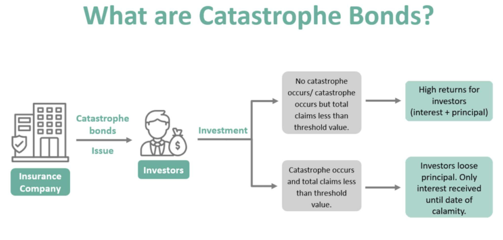

Understanding the way financial markets work involves recognizing various instruments designed to mitigate risk and enhance returns. Among these, catastrophe bonds, insurance-linked securities, and algorithmic trading are crucial components, each serving distinct purposes in managing financial risks.

Catastrophe bonds, often termed CAT bonds, represent a class of risk-linked securities that transfer certain risks from issuers, such as insurance companies, to investors. These bonds offer high yields, acting as a hedge against specific natural disasters, such as hurricanes or earthquakes. In the event of a predefined catastrophe, issuers can suspend interest or principal payments, essentially offloading the risk onto investors. This innovative approach allows insurance companies to manage their risk exposure effectively and provides investors with an opportunity to earn substantial returns, albeit with associated risks.

Insurance-linked securities (ILS), which include CAT bonds, expand the frontier of risk management beyond traditional mechanisms. ILS offer insurers a pathway to distribute risk among a broader pool, tapping into capital markets to supplement conventional reinsurance methods. This creates a diversified risk profile for investors, while simultaneously enhancing the capacity of insurers to cover potential claims.

Algorithmic trading, with its reliance on complex algorithms, has radically transformed financial markets by enabling trading decisions that vastly outpace human capabilities. This form of trading facilitates enhanced market liquidity and rapid price discovery, thereby optimizing transaction efficiency. However, with great speed and efficiency come risks, including those related to market stability and ethical considerations surrounding potential market manipulation. Despite these challenges, algorithmic trading plays a vital role in modern finance, leveraging technology to augment robust risk management strategies.

Together, these instruments provide a framework for comprehensive risk management. By understanding their mechanics and implications, investors and stakeholders in financial markets gain a strategic advantage. This article aims to explore the characteristics, benefits, and risks associated with catastrophe bonds, insurance-linked securities, and algorithmic trading, illustrating their integration into broader financial strategies to manage uncertainty and enhance returns.

## Table of Contents

## Catastrophe Bonds: A High Yield Investment

Catastrophe bonds (CAT bonds) are financial instruments that offer investors an opportunity to earn high yields while providing a mechanism for insurers and other issuers to transfer the financial risks of natural disasters. Introduced in the mid-1990s, these bonds emerged as a response to the increasing incidence and financial burden of catastrophic events such as hurricanes, earthquakes, and floods. By investing in CAT bonds, investors essentially insure the issuer against a specified catastrophe, receiving regular interest payments unless the stipulated event occurs.

**Structure of CAT Bonds**

The structure of a CAT bond typically involves three parties: the bond issuer (often an insurance company), the investor, and a special purpose vehicle (SPV). The SPV is created to hold the investors' funds and issues the bond. The process can be described as follows:

1. **Issuance**: A sponsor, such as an insurance firm, initiates the CAT bond by creating an SPV. The SPV issues bonds to investors, collecting the principal amount.

2. **Investment and Interest**: The SPV invests the principal in low-risk securities, and the return on these investments, along with a premium from the sponsor, serves as the interest paid to investors.

3. **Trigger Event**: A payout is triggered if a predefined event, such as a Category 4 hurricane, occurs. If triggered, the investors forfeit parts or all of their principal, which the SPV transfers to the sponsor to cover claims.

**Payout Triggers and Investor Profile**

CAT bond triggers can be classified into several categories:

- **Indemnity triggers**: Linked to the issuer's actual losses.
- **Industry index triggers**: Based on industry-wide loss indices.
- **Parametric triggers**: Determined by the physical parameters of the event, such as wind speed or earthquake magnitude.
- **Modelled loss triggers**: Based on modeled estimates of the losses from an event.

These triggers are instrumental in defining the risk profile of the bond and are thus crucial for investor decision-making. Typical investors in CAT bonds include pension funds, hedge funds, and institutional investors looking to diversify their portfolios with instruments uncorrelated to traditional market risks.

**Benefits and Risks**

**Benefits:**
- **High Returns**: CAT bonds provide attractive yields compared to other fixed-income securities.
- **Risk Diversification**: They offer diversification as their returns are not correlated with the broader financial markets.
- **Capital Relief**: For issuers, CAT bonds offer a way to reduce liabilities and free up capital for other investments.

**Risks:**
- **Event Risk**: A significant catastrophe can lead to partial or total loss of the principal for investors.
- **Complexity**: Understanding the terms and conditions, especially the trigger mechanisms, requires sophisticated analysis.
- **Marketability**: CAT bonds can be less liquid, making it challenging to sell before maturity.

Overall, CAT bonds play a crucial role in disaster risk management, offering issuers a means to offset the financial impact of potential disasters, while providing investors with high-yield opportunities tied to specific, non-market-related risks. Their structured design and risk-sharing mechanism contribute to their appeal and functionality within the financial markets.

## Insurance-Linked Securities (ILS): Linking Risk to Investors

Insurance-linked securities (ILS) are innovative financial products that represent a bridge between the insurance industry and capital markets, offering a mechanism to transfer insurance risk to a wide spectrum of investors. This makes them an invaluable tool for insurers seeking to manage their risk portfolios more effectively. At their core, ILS are structured to have their value derive from insurance-linked events, such as natural disasters or significant life insurance claims, thereby offering a distinct category of investment that is relatively uncorrelated with traditional financial markets.

One of the most well-known types of ILS is the catastrophe (CAT) bond. These securities allow insurers and reinsurers to mitigate their exposure to large, catastrophic events by transferring some of the financial risks to investors. CAT bonds are typically structured so that if a predefined disaster occurs, bondholders may lose part or all of their principal, which is then used by the insurer to cover claims. In exchange for taking on this risk, investors generally receive attractive risk-adjusted returns. In addition to CAT bonds, the ILS market encompasses other instruments, such as life insurance securitizations, which involve pooling life insurance policies and selling interests in expected future cash flows to investors.

ILS offer insurers access to capital markets, enabling them to draw on capital more flexibly and broadly than traditional reinsurance. This access permits insurers to distribute risk across a broader investor base, effectively diversifying their risk portfolios. The infusion of capital market funds can also help insurers meet regulatory capital requirements more efficiently and manage potential large-scale payout scenarios better.

The dynamics of the ILS market are influenced by factors such as risk assessment, investor appetite, and regulatory changes. Investors are attracted to ILS due to their ability to provide diversification benefits. Since the return characteristics of ILS are generally not correlated with those of traditional asset classes like stocks and bonds, they can offer portfolio diversification, reducing overall investment risk. This is particularly advantageous for investors seeking to manage their insurance or disaster exposure through a non-traditional investment vehicle.

ILS complement traditional reinsurance by providing additional capacity and flexibility. While traditional reinsurance involves contracts between insurers and reinsurers to share risk, ILS allow insurers to package risks and offer them to capital market investors. This additional layer of risk transfer can stabilize insurance markets, providing a buffer against the financial impact of significant loss events.

The integration of ILS into investment portfolios enables investors to benefit from the high yield potential of these securities while participating in risk mitigation efforts. As the ILS market continues to evolve, investors and insurers alike find new opportunities for collaboration, further enhancing the capacity to manage large-scale risks. By understanding the benefits and mechanics of ILS, stakeholders can strategically position themselves to capitalize on the growing intersection between insurance risk and financial markets.

## Algorithmic Trading in Financial Markets: Efficiency and Speed

Algorithmic trading is a method of executing trades using pre-programmed algorithms, enabling rapid decision-making at speeds that far exceed human capabilities. This approach to trading typically involves large volumes of trades that are executed automatically based on complex mathematical models and algorithms. The primary advantage of [algorithmic trading](/wiki/algorithmic-trading) is its ability to swiftly execute trades and manage large blocks of assets across various markets without the need for human intervention. 

The mechanics of algorithmic trading involve the use of algorithms that can process multiple market variables, such as price, [volume](/wiki/volume-trading-strategy), and timing, to determine the most opportune moments for buying or selling assets. Among the most notable strategies employed in algorithmic trading is high-frequency trading ([HFT](/wiki/high-frequency-trading-strategies)). HFT involves executing a large number of orders at extremely high speeds, often within microseconds, to capitalize on minute price discrepancies. These strategies rely on lightning-fast data processing and robust network infrastructures to reduce latency.

Algorithmic trading significantly enhances market [liquidity](/wiki/liquidity-risk-premium) and facilitates efficient price discovery. By quickly reacting to market changes, algorithms help maintain balance between supply and demand, which narrows the bid-ask spread. Efficient price discovery, aided by the speed and volume of trades executed by algorithms, helps in achieving fair market prices that reflect all available information.

Despite the benefits, algorithmic trading poses certain risks and ethical considerations. One major concern is market manipulation, where traders might use algorithms to create false market liquidity, misleading other market participants. There is also the risk of algorithmic errors or "flash crashes," where erroneous trades cause rapid and severe market disruptions. 

Moreover, algorithmic trading impacts risk management strategies and regulatory frameworks. Institutions employing algorithmic trading must establish stringent risk management protocols to monitor and control the activities of their trading algorithms. This includes setting limits on trading activities, continuous performance monitoring, and employing real-time risk management tools.

From a regulatory perspective, authorities have established guidelines to manage the risks posed by algorithmic trading. These regulations often require firms to implement adequate systems and controls to ensure the integrity of the financial markets. Compliance involves regular audits and the need for transparency in algorithm development and deployment.

In summary, while algorithmic trading enhances efficiency and liquidity in financial markets, its use must be carefully managed to mitigate potential risks and uphold ethical standards. Its integration into risk management strategies and adherence to regulatory requirements are crucial for sustaining its benefits and safeguarding market stability.

## Integrating Risk Management Strategies

Combining catastrophe bonds, insurance-linked securities, and algorithmic trading creates a multifaceted approach to risk management, each bringing distinct advantages to the table. Catastrophe bonds (CAT bonds) and insurance-linked securities (ILS) primarily serve to distribute and mitigate risk by shifting specific financial burdens onto a broader group of investors. This redistribution is crucial for financial institutions seeking protection against large-scale setbacks, such as natural disasters, by directly transferring risks typically held by insurers.

Algorithmic trading, on the other hand, contributes efficiency through automation, allowing transactions to be executed at speeds and volumes unattainable by human traders. This mode of trading not only enhances market liquidity but also aids in precise price discovery, essential for maintaining market equilibrium during volatile conditions.

The integration of these tools can significantly bolster a financial institution's risk management strategy. By combining the risk distribution capacity of CAT bonds and ILS with the transactional efficiency of algorithmic trading, institutions can achieve an optimized balance between risk and return. For instance, during periods of market instability, the liquidity provided by algorithmic trading can ensure that securities like CAT bonds and ILS maintain fair pricing, even under stressed conditions. This interplay allows for the efficient reallocation of capital, thereby minimizing potential losses and stabilizing portfolio performance.

Moreover, understanding the synergies among these instruments allows financial institutions to customize their risk management strategies, tailoring them to specific risks and investment goals. For example, an institution could strategically time the execution of trades based on algorithmic predictions, aligning them with the maturity dates of CAT bonds or ILS to optimize return on investment while concurrently managing exposure to catastrophic events.

To illustrate these principles in action, consider a case study of an insurance company utilizing integrated strategies. By embracing CAT bonds, the company offloads a portion of its risk to capital market investors. Concurrently, it employs algorithmic trading algorithms to hedge against market [volatility](/wiki/volatility-trading-strategies), ensuring that its portfolio retains value even during unfavorable market conditions. This dual-layered approach allows the company to maintain a resilient stance in the face of potential threats, demonstrating the efficacy of combining these diverse financial instruments.

In summary, integrating CAT bonds, ILS, and algorithmic trading constructs a holistic risk management framework. This synthesis not only disperses financial exposure but also harnesses modern trading technologies to exploit market conditions proactively, providing a significant strategic advantage in managing the complexities of the financial landscape.

## Conclusion

In a rapidly evolving financial landscape, staying informed about instruments like catastrophe bonds (CAT bonds), insurance-linked securities (ILS), and algorithmic trading proves essential for investors and financial stakeholders. Each of these financial tools plays a critical role in managing risks within investment portfolios. CAT bonds offer a way to mitigate the financial impact of natural disasters, providing high yields but also carrying the risk of loss if a specified catastrophic event occurs. Similarly, ILS extends the capacity for distributing insurance risk through capital markets, thereby enhancing risk management by diversifying exposure beyond traditional reinsurance.

Algorithmic trading, on the other hand, presents opportunities for increased efficiency and liquidity in financial markets. By leveraging sophisticated algorithms to execute trades at speeds unattainable by humans, it enhances price discovery processes. However, the rapid pace and complexity of algorithmic trading also bring challenges, including risks related to market manipulation and the need for stringent regulatory oversight.

The potential benefits of CAT bonds, ILS, and algorithmic trading are significant, yet each comes with specific risks requiring careful evaluation. Investors who understand and effectively leverage these tools are better equipped to navigate the complexities of modern financial markets. Comprehensive knowledge of these instruments allows for more informed decision-making, ultimately leading to more effective risk management strategies.

This article underscores the importance of integrating diverse financial strategies to enhance risk management. By combining various instruments, financial entities can construct robust portfolios that not only seek optimized returns but also provide resilience against market uncertainties and potential disasters. Through strategic use of CAT bonds, ILS, and algorithmic trading, investors can mitigate risks and adapt dynamically to the ever-changing market environment.

## References & Further Reading

[1]: Cummins, J. D., Lalonde, D., & Phillips, R. D. (2004). ["The Basis Risk of Catastrophic-Loss Index Securities."](https://www.sciencedirect.com/science/article/abs/pii/S0304405X03001727) Journal of Financial Economics, 71(1), 77–93.

[2]: Barrieu, P., & Albertini, L. (2009). ["The Handbook of Insurance-Linked Securities."](https://onlinelibrary.wiley.com/doi/book/10.1002/9781119206545) Wiley.

[3]: Cox, S. H., & Pedersen, H. W. (2000). ["Catastrophe Risk Bonds."](https://www.semanticscholar.org/paper/Catastrophe-Risk-Bonds-Cox-Pedersen/8a83af8b0f5105605e116a68be3f6c7b87d0d5f6) North American Actuarial Journal, 4(4), 56-82.

[4]: Chincarini, L. B. (2018). ["The Crisis of Crowding: Quant Copycats, Ugly Models, and the New Crash Normal."](https://www.semanticscholar.org/paper/The-Crisis-of-Crowding%3A-Quant-Copycats%2C-Ugly-and-Chincarini/188aab02ba415fc0046c2e7d3ccb044379c9b9b1) Wiley.

[5]: Lopez de Prado, M. (2018). ["Advances in Financial Machine Learning."](https://www.amazon.com/Advances-Financial-Machine-Learning-Marcos/dp/1119482089) Wiley.