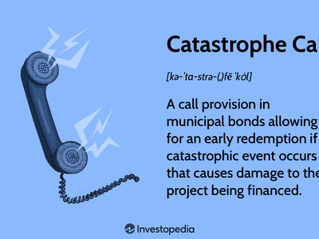

In the world of finance, managing risk is a fundamental aspect that can dictate the success or failure of investments and business operations. The financial landscape is fraught with uncertainties and potential losses, making it imperative for investors, institutions, and businesses to strategically manage and mitigate risk. This article explores the intricate relationship between financial risk, catastrophe bonds, reinsurance, and algorithmic trading, illustrating how these components collaboratively enhance risk management.

Financial markets are increasingly influenced by the frequency and severity of catastrophic events such as natural disasters, which pose significant threats to economic stability. As a response, financial instruments like catastrophe bonds have gained prominence. These high-yield bonds are designed to transfer the risk of catastrophic events from insurers to investors, offering a novel way to manage these risks.



Reinsurance plays a critical role in strengthening the financial sector's stability. By transferring portions of risk portfolios to third parties, insurers can reduce the burden of potential liabilities arising from claims. This ensures they have the necessary liquidity to honor financial obligations even in the aftermath of significant events.

Algorithmic trading has revolutionized financial markets by implementing advanced computer algorithms that execute trades automatically based on predefined criteria, such as timing, price, and volume. This technology provides traders with increased precision, speed, and efficiency, helping minimize the impact of human errors and enable better management of financial risks.

This article examines these themes to elucidate their interconnectedness within the modern financial landscape, emphasizing the importance of using sophisticated strategies and tools to navigate the complexities of risk management effectively. By understanding the relationship between these elements, finance professionals can better prepare and protect their investments against unforeseen challenges, ensuring sustainable financial growth and resilience.

## Table of Contents

## Understanding Financial Risk

Financial risk represents the potential for financial loss in investment or business operations. There are several categories of financial risk, each with distinct features and implications for individuals and organizations:

1. **Market Risk**: This risk arises from fluctuations in market prices, including changes in equity prices, interest rates, foreign exchange rates, and commodity prices. Market risk can affect the entire market or an individual asset. Investors often manage market risk through diversification or hedging techniques.

2. **Credit Risk**: This pertains to the possibility that a borrower may fail to meet their obligations as per the loan agreement, leading to a financial loss for the lender. Credit risk can be mitigated by conducting thorough credit assessments and employing credit derivatives such as credit default swaps.

3. **Liquidity Risk**: Liquidity risk occurs when an entity is unable to meet its short-term financial obligations due to the inability to convert assets into cash without significant loss. This can happen during periods of unusual market stress or when assets are particularly illiquid. Strategies to manage liquidity risk include maintaining a buffer of liquid assets and developing liquidity contingency plans.

4. **Operational Risk**: This type of risk results from failures in internal processes, people, and systems, or from external events. Operational failures can lead to financial losses and damages to an organization's reputation. Risk management strategies for operational risk include robust internal controls, regular audits, and comprehensive training programs for staff.

Effectively managing these risks involves identifying, assessing, and prioritizing them to develop appropriate risk management strategies. Essential tools in this process include:

- **Risk Assessment**: This involves systematic identification of potential risks and evaluating their potential impact and likelihood. Accurate risk assessment is crucial for developing effective management strategies.

- **Risk Prioritization**: Based on assessment, risks are prioritized to determine which require immediate intervention and which can be monitored or tolerated, guiding resource allocation and management focus.

To hedge against various types of risks, financial instruments known as derivatives are frequently utilized. Derivatives derive their value from underlying assets and can take the form of:

- **Options**: Contracts granting the right, but not the obligation, to buy or sell an asset at a predetermined price within a specified period. Options can be used to hedge against price volatility.

- **Futures**: Standardized contracts obligating the buyer to purchase, or the seller to sell, an underlying asset at a set price on a future date. Futures are extensively used for hedging and speculation.

- **Swaps**: Financial agreements to exchange cash flows or other financial metrics. Interest rate swaps, for example, involve exchanging fixed-rate interest payments for floating-rate payments, effectively managing interest rate exposure.

These derivatives enable investors and businesses to manage exposure and protect against adverse movements in market variables, thus playing a crucial role in risk management strategies.

## What are Catastrophe Bonds?

Catastrophe bonds, commonly referred to as 'cat bonds,' are specialized financial instruments designed to provide insurance companies with an alternative method of risk transfer in the event of catastrophic natural disasters such as hurricanes, earthquakes, or floods. These bonds were developed in the 1990s as part of the insurance-linked securities (ILS) market to address the increasing demand for risk capital in the insurance industry.

Cat bonds function by transferring the risk of a specified catastrophe from the insurer to the investors who purchase these bonds. In the event that a predefined catastrophe occurs, the issuer of the cat bond is allowed to suspend or reduce the interest and/or principal payments, thereby utilizing the raised capital to cover the claims resulting from the disaster. This effectively shifts the financial burden from the insurer to the investors, who assume the risk that they might not receive the anticipated cash flows.

One of the most appealing aspects of cat bonds to investors is their potential to deliver high yields. These yields are designed to compensate for the risk of loss should the specified catastrophic event occur. Additionally, the returns provided by cat bonds are generally uncorrelated with the broader financial markets. This uncorrelated nature provides a valuable diversification tool for investors’ portfolios, as cat bond performance is largely independent of typical market influences like economic cycles or [interest rate](/wiki/interest-rate-trading-strategies) changes.

The structure of a typical cat bond involves the formation of a Special Purpose Vehicle (SPV), which issues the bond. The proceeds from the bond sale are invested, and the returns on these investments provide the interest payments to bondholders. If no triggering event occurs, the investors receive their principal back at maturity. The triggering events are often based on predefined parameters, which can include measurements like earthquake magnitude, hurricane wind speeds, or overall financial losses.

For example, an SPV might issue a $100 million cat bond to cover hurricanes of a certain intensity in a specific region. If a hurricane meeting the defined parameters hits, the insurer would access these funds, utilizing them for claim payouts while the investors may forgo some or all of their due payments.

Overall, cat bonds serve as an innovative financial instrument that aids in distributing the financial risks associated with catastrophic events, thereby enhancing the ability of insurers to manage substantial risk exposures while providing investors with unique opportunities for higher returns and diversification in their investment strategies.

## Role of Reinsurance in Risk Management

Reinsurance is a critical component in the landscape of financial risk management. It involves insurers transferring portions of their risk portfolios to other entities, known as reinsurers. This transfer helps mitigate the financial strain that could result from having to pay out a substantial insurance claim, thereby reducing the potential for significant financial losses.

The primary benefit of reinsurance for insurers is the increased capacity it provides. By transferring risks, insurers can underwrite larger volumes of business than they could otherwise handle. This enables them to cater to a wider range of clients and more significant policies, thus expanding their market share without compromising their financial stability. Moreover, reinsurance arrangements strengthen the financial resilience of insurers, ensuring they have the necessary resources to address claims effectively.

Reinsurance becomes particularly vital in the aftermath of catastrophes, such as natural disasters. In such events, insurers are confronted with multiple claims that, if not managed properly, could lead to insolvency. Reinsurance arrangements ensure that insurers can meet their financial commitments, even when catastrophic events occur. By sharing the burden of payouts with reinsurers, insurers are better equipped to handle sudden and extensive claims without exhausting their reserves.

In practice, reinsurance can take various forms, including proportional (quota share) and non-proportional (excess of loss) reinsurance. Proportional reinsurance involves the reinsurer receiving a fixed percentage of premiums in exchange for covering the same percentage of losses. In contrast, non-proportional reinsurance involves the reinsurer covering losses that exceed a predetermined threshold, offering protection against unusually large claims.

Overall, reinsurance is not simply a protective measure but a strategic tool that enables insurers to maintain solvency, manage risk efficiently, and achieve sustainable growth in a volatile financial environment.

## Algorithmic Trading: A Revolution in Financial Markets

Algorithmic trading automates the trading process by using computer algorithms to execute orders with precision based on pre-established criteria such as timing, price, and [volume](/wiki/volume-trading-strategy). This method significantly enhances the efficiency of financial markets by enabling rapid trade execution, which minimizes potential human errors and reduces transaction costs.

One of the key advantages of [algorithmic trading](/wiki/algorithmic-trading) is its speed. Algorithms can process market data and execute trades much faster than a human trader, thus enabling strategies that exploit short-lived market opportunities, such as statistical [arbitrage](/wiki/arbitrage) or [trend following](/wiki/trend-following). This swiftness not only ensures better trade execution prices but also allows for the management of large orders by breaking them into smaller trades, thereby reducing market impact.

Algorithmic trading has become a crucial tool among institutional investors, such as mutual funds, pension funds, and hedge funds, due to their need to efficiently manage substantial amounts of capital. The use of algorithms facilitates the execution of large volume trades without significantly affecting the market prices. 

Investment banks also use these strategies to provide [liquidity](/wiki/liquidity-risk-premium) in the market, while proprietary trading firms utilize advanced algorithmic tactics to gain a competitive edge.

Python, being a versatile programming language, is often preferred for developing algorithmic trading strategies. Libraries such as pandas and NumPy are used for data manipulation, and tools like scikit-learn enable the incorporation of [machine learning](/wiki/machine-learning) models into trading algorithms. Here's a basic Python example of a moving average crossover strategy:

```python
import pandas as pd

# Assuming 'data' is a DataFrame with a 'Close' column for closing prices
data['Short_MA'] = data['Close'].rolling(window=40, min_periods=1).mean()
data['Long_MA'] = data['Close'].rolling(window=100, min_periods=1).mean()

# Generate buy/sell signals
data['Signal'] = 0
data['Signal'][40:] = np.where(data['Short_MA'][40:] > data['Long_MA'][40:], 1, -1)

# Calculate positions
data['Position'] = data['Signal'].shift()

print(data.tail())
```

This script calculates the short and long moving averages of the stock's closing price and generates buy or sell signals when the short moving average crosses above or below the long moving average. 

The application of algorithmic trading has grown significantly, transforming the financial landscape by offering higher efficiency, accuracy, and rapid adaptability to market conditions. As markets continue to evolve with technology, the role of algorithmic trading in financial risk management and portfolio optimization is expected to expand, fostering a more dynamic and technologically integrated financial ecosystem.

## Integration of Catastrophe Bonds and Reinsurance with Algorithmic Trading

The integration of catastrophe bonds and reinsurance with algorithmic trading represents a sophisticated blend of financial instruments and technological advancements aimed at enhancing risk management strategies. This synergy not only allows for more efficient handling of catastrophic risks but also optimizes financial outcomes within the insurance sector and broader financial markets.

Algorithmic trading plays a pivotal role in assessing and managing portfolios that include catastrophe bonds. By utilizing sophisticated algorithms, investors can efficiently monitor risk exposures and make data-driven decisions to adjust their investment strategies. These algorithms draw on vast datasets, including historical catastrophe data, market trends, and economic indicators, to predict potential risks and return dynamics. For instance, investors might use stochastic models to simulate various scenarios of natural disasters and their potential impact on bond values. This information is crucial for optimizing portfolios to maximize returns while minimizing exposure to unsystematic risks.

In the reinsurance industry, data analytics and algorithmic trading techniques enable insurers to refine their risk coverage and pricing strategies. Algorithms can analyze claims data, assess risk factors, and predict future claims with high precision. This data-driven approach allows reinsurance companies to set premiums that accurately reflect the underlying risk, ultimately benefiting both the insurers and their clients. Additionally, it facilitates the design of dynamic reinsurance contracts that can adapt to changing risk landscapes, thereby enhancing financial resilience.

The incorporation of algorithmic trading into these sectors is not limited to mere assessment and optimization but extends to the automation and execution of trades and contracts. Python, for example, is widely used to develop trading algorithms for these purposes. Below is a simple Python code snippet that illustrates the use of a basic stochastic model to evaluate catastrophe bond risk:

```python
import numpy as np

def catastrophe_risk_simulation(num_scenarios, risk_probabilities, loss_severity):
    risk_outcomes = []
    for _ in range(num_scenarios):
        scenario_loss = 0
        for prob, loss in zip(risk_probabilities, loss_severity):
            if np.random.random() < prob:
                scenario_loss += loss
        risk_outcomes.append(scenario_loss)
    return risk_outcomes

risk_probabilities = [0.01, 0.02, 0.03]  # probabilities of different catastrophic events
loss_severity = [1000000, 500000, 200000]  # potential losses in USD

simulations = catastrophe_risk_simulation(10000, risk_probabilities, loss_severity)
average_loss = np.mean(simulations)
print(f"Average estimated loss: ${average_loss:.2f}")
```

This piece of code simulates the potential losses associated with different catastrophic events by calculating an average loss over multiple scenarios, thus aiding portfolio managers in understanding potential risk exposures.

Overall, the integration of catastrophe bonds and reinsurance with algorithmic trading not only enhances the efficacy of risk management strategies but also paves the way for innovative financial solutions that are resilient to catastrophic events. Such integration is increasingly crucial in today's volatile financial environment, where the ability to adapt quickly to emerging risks determines the competitive edge in the insurance and investment industries.

## Conclusion

Understanding financial risk and employing tools like catastrophe bonds, reinsurance, and algorithmic trading is crucial for maintaining a competitive edge in the financial industry. These instruments collectively enhance the capacity of businesses to withstand adverse events and capitalize on unforeseen investment opportunities.

Catastrophe bonds provide a unique avenue for transferring financial risks from insurers to the broader investment community. By issuing these bonds, insurers can mitigate the impact of large-scale disasters on their financial stability. This not only safeguards their balance sheets but also assures policyholders of claim settlements, thereby maintaining trust and confidence in the insurance sector.

Reinsurance complements this by allowing insurers to distribute risk further, reducing their potential exposure to catastrophic events. By sharing risks with reinsurance market participants, insurers enhance their ability to cover large claims, which is especially critical in the aftermath of natural disasters. This ensures that insurers remain solvent and operational, preventing systemic risks that could arise from massive payout obligations.

Algorithmic trading, meanwhile, introduces efficiency and precision in executing financial transactions. By leveraging advanced algorithms, market participants can identify and respond to opportunities swiftly, minimizing human errors and optimizing portfolio returns. Additionally, algorithmic trading enables the real-time analysis of large datasets, assisting in the informed decision-making process regarding risk management and asset allocation.

The integration of these elements forms a robust framework for managing both predictable and unpredictable financial risks. As technology continues to advance, the interplay between these risk management tools is likely to become increasingly synergistic. Financial institutions will be able to harness data-driven insights to refine their strategies, enhance their predictive capabilities, and optimize their risk-return profiles.

In conclusion, the convergence of catastrophe bonds, reinsurance, and algorithmic trading is not merely a defensive strategy but a proactive approach that shapes the future of finance. As the financial landscape continues to evolve, the adoption and adaptation of these tools will be vital in navigating challenges and seizing new opportunities.

## References & Further Reading

[1]: Cummins, J.D., & Weiss, M.A. (2009). ["Convergence of Insurance and Financial Markets: Hybrid and Securitized Risk-Transfer Solutions."](https://onlinelibrary.wiley.com/doi/abs/10.1111/j.1539-6975.2009.01311.x) Journal of Risk and Insurance.

[2]: Lane, M., & Mahul, O. (2008). ["Catastrophe Risk Pricing: An Empirical Analysis."](http://www.lanefinancialllc.com/content/view/231/50/) The World Bank Publications.

[3]: John Wiley & Sons (2011). ["Handbook of Quantitative Finance and Risk Management."](https://www.amazon.com/Handbook-Quantitative-Finance-Risk-Management/dp/0387771166) 

[4]: Chan, E.P. (2008). ["Quantitative Trading: How to Build Your Own Algorithmic Trading Business."](https://github.com/ftvision/quant_trading_echan_book) Wiley Trading.

[5]: Jorion, P. (2000). ["Value at Risk: The New Benchmark for Managing Financial Risk."](https://books.google.com/books/about/Value_at_Risk_3rd_Ed.html?id=nnblKhI7KP8C) McGraw-Hill.