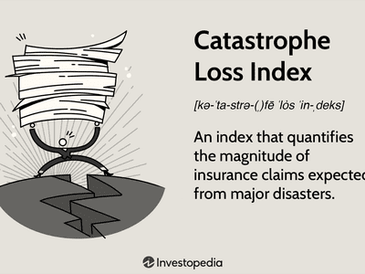

Risk management is a critical component of financial planning and trading strategies, ensuring that potential negative impacts on financial performance are minimized. It involves the identification, assessment, and prioritization of risks followed by a coordinated effort to minimize, control, or mitigate the impact of unforeseen events on business objectives. In this context, financial instruments such as derivatives and swaps become essential tools for transferring and managing risk.

This article examines the complex interactions between various financial instruments, risk management practices, catastrophe swaps, and algorithmic trading. These components collectively contribute to maintaining financial stability and safeguarding against potential market disruptions. By understanding how these elements work together, businesses can enhance their preparedness for financial uncertainties, thereby securing their future in an ever-changing market landscape.



Throughout, we aim to elucidate how companies can effectively utilize these financial tools and strategies to manage risk. Effective risk management not only stabilizes an organization's financials but can also provide significant competitive advantages. The incorporation of advanced technology in the form of algorithmic trading further augments these strategies, allowing for rapid data analysis and real-time decision-making processes.

In the following sections, we will cover the specifics of these elements and present real-world examples. By comprehending these principles, businesses and investors can better position themselves against financial adversities, leveraging both traditional and innovative approaches to risk management.

## Table of Contents

## Understanding Financial Instruments and Risk Management

Financial instruments are critical tools in managing risk, allowing companies to transfer and mitigate potential financial losses. Derivatives and swaps are two key types of financial instruments that play significant roles in this process. 

Derivatives are financial contracts whose value is derived from the performance of an underlying asset, index, or rate. Common forms of derivatives include options, futures, and forwards. Options give the holder the right, but not the obligation, to buy or sell an asset at a predetermined price before a specified date. This flexibility makes options particularly useful for hedging against adverse price movements. For example, a company exposed to fluctuating commodity prices might use options to lock in prices, thus stabilizing its cash flows and minimizing the risk of financial loss due to price volatility.

Swaps are another form of derivative that involve the exchange of cash flows between two parties. They are often used to manage [interest rate](/wiki/interest-rate-trading-strategies) risk or currency risk. In an interest rate swap, parties exchange fixed interest rate payments for floating rate payments, allowing each party to take advantage of preferred interest conditions and hedge against unfavorable rate movements. For currency swaps, companies can manage foreign exchange risk by swapping cash flows in different currencies, thus protecting against adverse shifts in exchange rates.

By utilizing derivatives and swaps, companies can effectively hedge against various market risks. These instruments help stabilize cash flows and manage investment portfolios, ensuring that companies can maintain financial stability even in adverse market conditions. For instance, a company with significant foreign operations might use currency swaps to manage the risk of exchange rate fluctuations, ensuring that revenue from international operations is not adversely affected by changes in currency rates.

Effective risk management, facilitated by these financial instruments, can provide a competitive advantage in the market by not only safeguarding against losses but also by potentially reducing the cost of capital. Companies that manage their risks efficiently are seen as more stable and trustworthy, which can lead to better credit ratings and lower borrowing costs.

In conclusion, financial instruments like derivatives and swaps are indispensable tools in the arsenal of risk management strategies. They allow companies to tailor their risk exposures and achieve financial objectives by transforming potential uncertainties into manageable risks. Through the strategic use of these instruments, businesses can enhance their resilience against financial uncertainties, thereby securing a stronger position in an increasingly volatile market environment.

## Catastrophe Swaps: An Overview

Catastrophe swaps are specialized financial instruments designed to alleviate the risk associated with natural disasters by transferring this risk from insurers to investors. These swaps are integral to managing potential large-scale financial losses that can arise from events such as hurricanes, earthquakes, or other catastrophic events. By engaging in this form of risk transfer, insurers can maintain stability in their operations despite the occurrence of such unpredictable events.

The structure of catastrophe swaps allows insurers to effectively diversify their risk portfolios. This diversification is achieved by initiating trades with other insurers or investors who possess different risk exposures. For instance, an insurer located in a region susceptible to hurricanes may enter into a swap agreement with another insurer operating in an earthquake-prone area. This mutual exchange of risks enables both parties to mitigate their exposure to location-specific disasters, thereby stabilizing their financial outlook.

In contrast to traditional reinsurance, catastrophe swaps offer a more customizable approach to risk management. Traditional reinsurance often involves standardized coverage terms and premiums that may not align perfectly with an insurer's specific needs. Catastrophe swaps, however, provide the flexibility to tailor agreements based on the unique risk exposures and preferences of the involved parties. Such customization can include specific conditions under which payouts are triggered, the magnitude of potential losses covered, and the duration of the risk exposure.

The appeal of catastrophe swaps also lies in their potential for creating novel risk management strategies. Investors, including hedge funds and pension funds, may be attracted to these swaps as they provide a means to access uncorrelated investment opportunities. By entering into catastrophe swaps, these investors assume some of the insurers' risk in exchange for a return, effectively adding another layer of diversification to their investment portfolios.

Catastrophe swaps serve a dual purpose in financial markets: they protect insurers from the immediate financial shock of catastrophic events and offer investors a unique opportunity to engage with a distinct asset class. By efficiently distributing risk across various stakeholders, catastrophe swaps contribute to the broader goal of enhancing financial market resilience in the face of natural disasters.

## The Role of Algorithmic Trading in Risk Management

Algorithmic trading has become a crucial component of modern financial markets, offering distinct advantages in managing risks and optimizing trading strategies. At its core, [algorithmic trading](/wiki/algorithmic-trading) uses automated systems to execute trades based on pre-defined criteria, such as price, timing, or [volume](/wiki/volume-trading-strategy), without human intervention. This technology brings remarkable speed and efficiency to trading operations, enabling financial entities to manage market risks by executing trades almost instantaneously.

One of the primary advantages of algorithmic trading is its ability to implement sophisticated risk management strategies through real-time data analysis. Algorithms are designed to rapidly process massive volumes of market data, enabling traders to identify patterns and make informed decisions at speeds unattainable by human traders. This real-time analysis allows algotrading systems to adjust strategies quickly in response to volatile market conditions, thereby helping to mitigate potential losses and enhance portfolio performance.

Moreover, algorithms can be employed to optimize portfolio performance by continuously monitoring market conditions and executing trades that align with predefined risk thresholds. For instance, an algorithm might be programmed to sell a security if its price drops by a certain percentage, thereby limiting potential losses. Similarly, an algorithm can manage exposure to market [volatility](/wiki/volatility-trading-strategies) by adjusting asset allocations dynamically, based on ongoing assessments of risk and return.

Integrating catastrophe swaps with algorithmic trading further enhances risk mitigation strategies for financial entities. Catastrophe swaps, which transfer risk from insurers to investors, can be seamlessly incorporated into algotrading systems to provide additional layers of risk protection. By automating swap transactions, financial institutions can swiftly adjust their risk exposures in response to forecasts of potential disasters, ensuring that their risk management strategies remain robust and responsive to changing conditions.

Overall, algorithmic trading presents a powerful toolset for managing financial risks. When combined with innovative financial instruments like catastrophe swaps, it offers a comprehensive approach to safeguarding assets and ensuring stability in the face of market uncertainties. As the technology continues to advance, the potential for algorithmic trading to further enhance financial risk management will likely grow, providing even more effective solutions for navigating complex market environments.

## Combining Catastrophe Swaps and Algo Trading

The integration of catastrophe swaps and algorithmic trading provides an advanced and comprehensive framework for risk management in financial markets. Catastrophe swaps are instrumental in enabling insurers to transfer the risks associated with natural disasters to investors. Algorithmic trading enhances this framework by allowing for real-time adjustments to investment portfolios based on dynamic assessments of risk, leveraging data inputs, and predictive models. This synergy between swaps and algorithmic trading is achieved through automation, enabling swift and efficient response to disaster forecasts or market changes.

Algorithmic trading systems, often referred to as "algos," use pre-defined criteria to execute trades at high speed, enhancing the efficiency and timing of investment decisions. With real-time data analytics, these systems can assess market conditions and execute trades that reflect the prevailing risk landscape. By incorporating catastrophe swaps into this automated trading environment, financial institutions can dynamically adjust their exposure to catastrophic risks. For example, an algorithm might be programmed to increase or decrease holdings in catastrophe-linked securities based on incoming weather models or seismic activity data.

Automating swap transactions not only reduces the time needed to execute trades but also minimizes human error, ensuring that financial institutions can respond promptly to evolving disaster forecasts. This rapid response capability is crucial in safeguarding assets and maintaining portfolio stability during extreme market disruptions caused by unforeseen catastrophic events. By seamlessly integrating algorithmic trading platforms with the catastrophe swap process, firms can react to volatile market conditions faster than traditional manual methods allow.

Leveraging cutting-edge technology, firms can achieve a more predictive and responsive risk management strategy. Predictive analytics and [machine learning](/wiki/machine-learning) models play a significant role, allowing algorithms to forecast potential market changes and optimize portfolios accordingly. Consider a Python implementation for an algorithm that adjusts a portfolio based on disaster risk forecasts:

```python
import numpy as np
from sklearn.ensemble import RandomForestRegressor

# Hypothetical dataset of disaster forecasts and market parameters
X = np.array([[0.1, 200], [0.3, 250], [0.5, 320]])  # Features: [forecasted risk, market index]
y = np.array([50, 70, 90])  # Portfolio adjustment scores

# Train a predictive model
model = RandomForestRegressor(n_estimators=100)
model.fit(X, y)

# New incoming data for prediction
new_data = np.array([[0.4, 280]])
predicted_adjustment = model.predict(new_data)

print("Predicted portfolio adjustment:", predicted_adjustment)
```

In this example, the algorithm uses machine learning to suggest portfolio adjustments based on disaster forecasts and market indices, effectively mirroring the integration of catastrophe swaps with algorithmic trading. This predictive capability provides financial entities a strategic advantage in proactively managing risks associated with catastrophic events and market volatility.

In conclusion, by fusing catastrophe swaps with algorithmic trading, firms benefit from a fortified defense against financial uncertainties, achieving not only reactive measures to safeguard assets but also a comprehensive strategy that anticipates and adjusts to emerging threats.

## Case Studies and Examples

The World Bank's issuance of catastrophe bonds in 2014 serves as a seminal example of using financial instruments for disaster risk mitigation. Catastrophe bonds, or cat bonds, are an innovative risk transfer mechanism that allows entities such as the World Bank to transfer the financial risk of catastrophic events, like natural disasters, to investors. These bonds are structured so that if a predefined event occurs, such as a hurricane exceeding a specific intensity, investors may lose part or all of their interest and/or principal, thus providing immediate capital relief to the issuer. The issuance of these bonds in 2014 aided countries in accessing quick financial relief post-disaster, thereby promoting financial stability and enhancing risk management strategies.

AIG, one of the world's leading insurance organizations, has also utilized catastrophe bonds in its risk management portfolio. By issuing cat bonds, AIG transfers the risks associated with catastrophic events to capital market investors. This strategy diversifies AIG's risk exposure and provides an additional layer of protection against substantial financial losses. Such strategic risk transfer showcases how organizations leverage financial instruments to preemptively address the potential economic fallout from disasters.

JP Morgan, a global financial services firm, exemplifies the integration of algorithmic trading with risk management through the use of swaps and derivatives. Algorithmic trading systems at JP Morgan employ advanced algorithms to execute trades based on complex financial models and real-time market data. By integrating derivatives strategies, these algorithms can manage portfolio risks and adjust exposures more effectively to market volatility. This capability enhances JP Morgan's ability to safeguard assets and optimize financial performance, thereby demonstrating the practical application of combining financial instruments with algorithmic methodologies.

These case studies illustrate the efficacy of leveraging financial instruments like catastrophe bonds and derivatives alongside advanced trading technologies. Such strategies not only protect against financial losses caused by catastrophic events but also reinforce the critical role of innovation in risk management. The strategic use of these tools by institutions like the World Bank, AIG, and JP Morgan underscores their importance in maintaining financial resilience amidst uncertainties.

## Challenges and Future Outlook

Risk transfer mechanisms, such as swaps and derivatives, are integral to risk management in finance, yet they present challenges like counterparty risk, which refers to the probability that the opposing party in a transaction may default on their contractual obligation. This risk underscores the importance of rigorous counterparty evaluation and the implementation of robust credit risk mitigation strategies.

Algorithmic trading systems also face significant challenges in risk management. These systems require continuous updates to adapt to dynamic market conditions, ensuring that trading algorithms remain effective. Rapid changes in market volatility, interest rates, and global economic conditions necessitate agile models capable of adapting almost instantaneously. The implementation of machine learning and AI can aid in developing systems that self-optimize and adjust in real-time, yet ensuring these tools are both sophisticated and reliable remains a substantial undertaking.

The inherent complexity of financial instruments, such as swaps, further complicates risk management strategies. Swaps are contracts to exchange cash flows or liabilities between parties and are used to hedge against multiple risks, including interest rate and currency fluctuations. However, their structuring demands a deep understanding of financial markets, accounting principles, and regulatory requirements. Expertise in these areas is pivotal to harnessing the full potential of swaps while managing associated risks effectively.

Compliance and regulatory scrutiny constitute another layer of challenge. Financial institutions must navigate a landscape that includes Basel III, Dodd-Frank Act, and other regulatory frameworks. These regulations are designed to promote transparency and stability in financial markets but can also restrict the flexibility required to implement innovative risk management solutions. Firms must balance compliance with the need for flexibility in crafting their risk management strategies.

Despite these challenges, the future of risk management looks promising due to advancements in fintech. Innovations such as blockchain technology, which can potentially reduce counterparty risk by ensuring transparency and immutability of transactions, are being explored. Additionally, advancements in big data analytics and AI are enabling more precise risk assessment and management, providing financial institutions with enhanced tools to predict and mitigate various risks.

In summary, while the challenges in risk transfer and management are considerable, the continuous evolution of technology and data analytics is paving the way for more effective and resilient risk management strategies. Financial institutions that successfully integrate these technological advancements will be better equipped to manage future uncertainties, safeguarding their operations against potential financial disruptions.

## Conclusion

The strategic deployment of financial instruments and technology stands as a cornerstone for effective risk management. Catastrophe swaps and algorithmic trading represent pivotal elements within this framework, offering robust mechanisms for managing and mitigating risks. Through the integration of catastrophe swaps—a method of transferring risk from insurers to investors—with algorithmic trading platforms that provide real-time data processing and automated trade execution, both insurers and investors are equipped to manage exposures more efficiently. 

The constant evolution of technology signals a shifting landscape for risk management, making adaptability and innovation in this sector crucial. Firms that embrace these advancements and successfully incorporate them into their risk management strategies will be better prepared to safeguard their financial interests. This adaptability not only positions firms to respond to present-day challenges but also enhances their resilience against future uncertainties.

In essence, the combined power of catastrophe swaps and algorithmic trading offers a superior defense against financial unpredictability. As firms refine these techniques and technologies become more sophisticated, the potential to enhance financial stability and mitigate risk will continue to expand. This synergy ensures that organizations maintaining such adaptive capacity are well-equipped to navigate the complexities and volatilities inherent in financial markets.

## References & Further Reading

[1]: Cox, J. C., Ingersoll, J. E., & Ross, S. A. (1985). ["A Theory of the Term Structure of Interest Rates."](https://www.semanticscholar.org/paper/A-theory-of-the-term-structure-of-interest-rates''%2C-Cox-Ingersoll/853c1f9b36a574432f112d72b473a68f377f410e) Econometrica.

[2]: Hull, J. C. (2018). ["Options, Futures, and Other Derivatives."](https://www.semanticscholar.org/paper/Options%2C-Futures%2C-and-Other-Derivatives-Hull/89bdee500c8623864fc9eb7a471546aa713acc44) Pearson Education.

[3]: Lopez de Prado, M. (2018). ["Advances in Financial Machine Learning."](https://www.amazon.com/Advances-Financial-Machine-Learning-Marcos/dp/1119482089) Wiley.

[4]: Cummins, J. D., & Phillips, R. D. (2009). ["Capital Adequacy and Insurance Risk-Based Capital Systems."](https://www.researchgate.net/publication/313198082_Capital_adequacy_and_insurance_risk-based_capital_systems) Journal of Banking & Finance.

[5]: Arias, D., & Teplá, L. (2009). ["The Anatomy of Catastrophe Bonds."](https://www.researchgate.net/publication/335906546_Employing_Finance_in_Pursuit_of_the_Sustainable_Development_Goals_The_Promise_and_Perils_of_Catastrophe_Bonds) Journal of Economic Policy Reform.