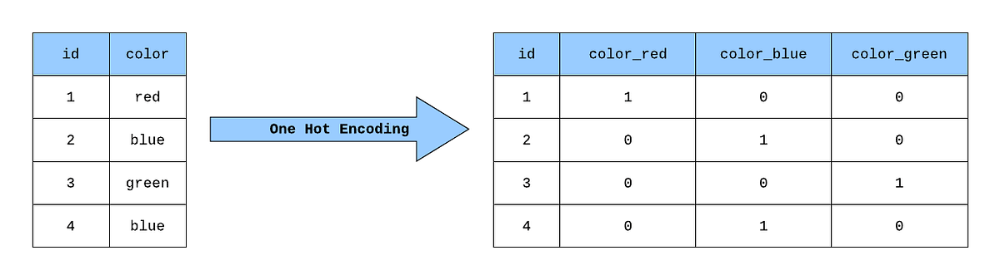

## Table of Contents

## What is categorical data in the context of machine learning?

Categorical data in machine learning refers to information that can be divided into groups or categories. These categories represent different types or levels of a variable, and they are usually non-numeric. For example, colors like 'red', 'blue', and 'green' or types of fruits like 'apple', 'banana', and 'orange' are categorical data. In machine learning, this type of data is important because it helps in classifying and organizing information into meaningful groups.

There are two main types of categorical data: nominal and ordinal. Nominal data has categories without any inherent order, like the colors mentioned before. Ordinal data, on the other hand, has categories that can be ranked or ordered, such as 'small', 'medium', and 'large' sizes. When working with categorical data in machine learning models, it's often necessary to convert these categories into numerical values, a process known as encoding. Common encoding techniques include one-hot encoding and label encoding, which help machine learning algorithms process and analyze categorical data effectively.

## How is categorical data different from numerical data?

Categorical data and numerical data are two different types of information used in machine learning. Categorical data is made up of groups or categories that don't have a numerical value. For example, if you have data about different kinds of fruits like apples, bananas, and oranges, these are categories. They don't have a natural order or a way to do math with them. You can't add or subtract apples and bananas. Instead, you use them to sort and group things.

On the other hand, numerical data is made up of numbers that you can do math with. This type of data can be measured or counted, like the weight of an apple or the number of apples you have. With numerical data, you can add, subtract, multiply, or divide the numbers. For example, if you have 5 apples and you buy 3 more, you can easily calculate that you now have 8 apples. This makes numerical data very useful for many kinds of calculations and analyses in machine learning.

In machine learning, it's important to know whether you're working with categorical or numerical data because they need to be handled differently. Categorical data often needs to be turned into numbers using methods like one-hot encoding or label encoding before it can be used in many machine learning models. For example, if you're using a model to predict fruit types, you might need to convert 'apple', 'banana', and 'orange' into numbers. On the other hand, numerical data can usually be used directly in models without any special conversion. Understanding these differences helps in choosing the right techniques and models for your data.

## What are the types of categorical data?

Categorical data comes in two main types: nominal and ordinal. Nominal data are categories without any order or ranking. For example, colors like 'red', 'blue', and 'green' are nominal because you can't say one is better or bigger than another. They are just different. Another example is types of fruits like 'apple', 'banana', and 'orange'. These categories are used to group things, but you can't put them in a specific order.

Ordinal data, on the other hand, are categories that can be ranked or ordered. For example, shirt sizes like 'small', 'medium', and 'large' are ordinal because you know that 'small' is smaller than 'medium', and 'medium' is smaller than 'large'. Another example is education levels like 'high school', 'bachelor's degree', and 'master's degree'. You can say that a 'master's degree' is a higher level of education than a 'bachelor's degree'. In machine learning, knowing if data is nominal or ordinal can help you choose the right way to use it in your models.

## Why is it important to handle categorical data properly in machine learning models?

Handling categorical data properly in machine learning models is important because it helps the models understand and use the data correctly. Categorical data, like colors or types of fruits, can't be used directly by most machine learning algorithms because these algorithms work with numbers. So, we need to turn these categories into numbers in a way that makes sense. For example, if we have data about fruits like apples, bananas, and oranges, we can use a method called one-hot encoding to turn these into numbers. This helps the machine learning model see the difference between these fruits without thinking that one is better or bigger than another.

If we don't handle categorical data the right way, our machine learning model might not work well. For example, if we just turn 'apple', 'banana', and 'orange' into the numbers 1, 2, and 3, the model might think that 'orange' is bigger or better than 'apple' because 3 is bigger than 1. But that's not true for fruits! By using the right methods to handle categorical data, like one-hot encoding or label encoding, we can make sure our models understand the data correctly and make better predictions. This is important for getting good results in machine learning projects.

## What are common techniques for encoding categorical data?

One common technique for encoding categorical data is one-hot encoding. This method turns each category into a new column with a 1 or a 0. For example, if you have data about fruits like apples, bananas, and oranges, one-hot encoding would create three new columns: one for apples, one for bananas, and one for oranges. If a row in your data has an apple, the apple column would have a 1 and the other columns would have 0s. This way, the machine learning model can see each fruit as a separate thing without thinking one is better than another. One-hot encoding is very useful but can make your data bigger if you have a lot of categories.

Another technique is label encoding. This method turns each category into a number, like turning 'apple' into 1, 'banana' into 2, and 'orange' into 3. Label encoding is simpler than one-hot encoding and doesn't make your data bigger, but it can cause problems. If you use label encoding, your machine learning model might think that 'orange' is better or bigger than 'apple' because 3 is bigger than 1. But that's not true for fruits! So, you need to be careful when using label encoding and make sure it makes sense for your data.

There's also a method called ordinal encoding, which is similar to label encoding but is used for ordinal data. Ordinal data has categories that can be ranked, like shirt sizes 'small', 'medium', and 'large'. Ordinal encoding turns these into numbers that show the order, like turning 'small' into 1, 'medium' into 2, and 'large' into 3. This makes sense because 'large' is bigger than 'small'. Ordinal encoding is good for data where the order matters, but you still need to be careful to make sure the numbers you use show the right order.

## How does one-hot encoding work, and what are its advantages and disadvantages?

One-hot encoding turns each category into a new column with a 1 or a 0. For example, if you have data about fruits like apples, bananas, and oranges, one-hot encoding would create three new columns: one for apples, one for bananas, and one for oranges. If a row in your data has an apple, the apple column would have a 1 and the other columns would have 0s. This way, the machine learning model can see each fruit as a separate thing without thinking one is better than another. In code, you might use a library like pandas in Python to do this. Here's a simple example:

```python
import pandas as pd

# Sample data
data = pd.DataFrame({'Fruit': ['Apple', 'Banana', 'Orange', 'Apple']})

# One-hot encoding
encoded_data = pd.get_dummies(data, columns=['Fruit'])
print(encoded_data)
```

One-hot encoding has some big advantages. It's great for nominal data, where the categories don't have any order. It helps the machine learning model understand that each category is different without thinking one is better than another. This can make your model work better because it sees the data the right way. But one-hot encoding also has some disadvantages. It can make your data much bigger if you have a lot of categories. For example, if you have 100 different fruits, you'll need 100 new columns. This can make your data harder to work with and can slow down your machine learning model. So, you need to think about whether one-hot encoding is the best choice for your data.

## What is label encoding, and when is it appropriate to use it?

Label encoding turns each category into a number. For example, if you have data about fruits like apples, bananas, and oranges, label encoding might turn 'apple' into 1, 'banana' into 2, and 'orange' into 3. This method is simpler than one-hot encoding and doesn't make your data bigger. You can use a library like scikit-learn in Python to do this. Here's how you might do it:

```python
from sklearn.preprocessing import LabelEncoder

# Sample data
data = ['Apple', 'Banana', 'Orange', 'Apple']

# Label encoding
encoder = LabelEncoder()
encoded_data = encoder.fit_transform(data)
print(encoded_data)
```

Label encoding is good to use when the order of the categories matters, like with ordinal data. For example, if you have shirt sizes like 'small', 'medium', and 'large', label encoding can turn these into numbers that show the order, like 1 for 'small', 2 for 'medium', and 3 for 'large'. This makes sense because 'large' is bigger than 'small'. But you need to be careful with label encoding when the categories don't have an order, like with fruits. If you use label encoding for fruits, your machine learning model might think that 'orange' is better or bigger than 'apple' because 3 is bigger than 1. So, make sure the numbers you use show the right order or use it only when the order makes sense.

## How can you handle high cardinality in categorical features?

High cardinality in categorical features means you have a lot of different categories. This can make one-hot encoding hard because it creates a new column for each category, and too many columns can slow down your machine learning model. For example, if you have data about cities and there are hundreds of different cities, one-hot encoding would make your data very big and hard to work with. Instead of one-hot encoding, you can use other methods to handle high cardinality. One good way is to use a method called target encoding, which turns each category into a number based on what you're trying to predict. For example, if you're trying to predict how much people like different cities, target encoding can turn each city into a number that shows how much people usually like that city.

Another way to handle high cardinality is to group categories together. For example, if you have data about cities, you can group them by state or country instead of using each city as a separate category. This makes your data smaller and easier to work with. You can also use a method called frequency encoding, which turns each category into a number based on how often it appears in your data. For example, if 'New York' appears a lot in your data, frequency encoding would turn 'New York' into a bigger number than a city that doesn't appear as often. These methods can help you handle high cardinality and make your machine learning model work better without making your data too big.

## What are some advanced methods for dealing with categorical variables in machine learning?

One advanced method for dealing with categorical variables in machine learning is target encoding, also known as mean encoding. This method turns each category into a number based on the average of the target variable for that category. For example, if you're trying to predict how much people like different cities, target encoding would turn each city into a number that shows the average liking score for that city. This can be very helpful when you have a lot of categories because it keeps your data small. But you need to be careful with target encoding because it can cause overfitting if you're not careful. Overfitting means your model works well on the data you have but not on new data. To avoid this, you can use techniques like regularization or cross-validation.

Another advanced method is using embeddings for categorical variables. Embeddings turn categories into numbers in a way that captures the relationships between them. For example, if you have data about different kinds of fruits, embeddings can turn 'apple', 'banana', and 'orange' into numbers that show how similar or different they are. This is very useful for deep learning models because it helps the model understand the data better. To use embeddings, you can use libraries like TensorFlow or PyTorch in Python. Here's a simple example of how you might use embeddings in PyTorch:

```python
import torch
import torch.nn as nn

# Define the embedding layer
embedding = nn.Embedding(num_embeddings=10, embedding_dim=3)

# Example input (indices of categories)
input_data = torch.LongTensor([1, 3, 5, 7])

# Get the embeddings
embedded_data = embedding(input_data)
print(embedded_data)
```

Embeddings can make your model work better, but they can also make it more complex. So, you need to think about whether embeddings are the right choice for your data and your model.

## How does the choice of encoding method impact the performance of machine learning models?

The choice of encoding method can have a big impact on how well a machine learning model works. If you use one-hot encoding for a lot of categories, your data can get very big. This can make your model slow and hard to work with. On the other hand, if you use label encoding for categories that don't have an order, like fruits, your model might think that 'orange' is better than 'apple' because 3 is bigger than 1. This can make your model give wrong answers. So, it's important to pick the right encoding method for your data. If you have a lot of categories, target encoding or embeddings might be better choices because they keep your data small and help your model understand the data better.

Using the right encoding method can also help your model learn better. For example, if you use target encoding, your model can see how each category is related to what you're trying to predict. This can make your model work better because it understands the data in a more useful way. But you need to be careful because some methods, like target encoding, can cause overfitting if you're not careful. Overfitting means your model works well on the data you have but not on new data. So, you might need to use techniques like regularization or cross-validation to make sure your model works well on new data too. Choosing the right encoding method can help your machine learning model give better and more accurate answers.

## What are the considerations for using categorical data in deep learning models?

When using categorical data in deep learning models, it's important to think about how to turn categories into numbers in a way that helps the model learn well. One common way is one-hot encoding, where each category gets its own column with a 1 or a 0. This works well for deep learning because it lets the model see each category as different without thinking one is better than another. But if you have a lot of categories, one-hot encoding can make your data very big and slow down your model. Another way is to use embeddings, which turn categories into numbers that show how similar or different they are. Embeddings can help your model understand the data better and work faster, but they can also make your model more complex.

Choosing the right way to handle categorical data can make a big difference in how well your deep learning model works. For example, if you use embeddings, your model can learn the relationships between categories, like how 'apple' and 'orange' are both fruits but different from 'car'. This can help your model give better answers. But you need to be careful because some methods, like target encoding, can cause your model to overfit. Overfitting means your model works well on the data you have but not on new data. To avoid this, you might need to use techniques like regularization or cross-validation to make sure your model works well on new data too. So, it's important to think about what kind of data you have and what you're trying to predict when choosing how to handle categorical data in deep learning models.

## How can you evaluate the effectiveness of different categorical data encoding techniques in a machine learning pipeline?

To evaluate the effectiveness of different categorical data encoding techniques in a machine learning pipeline, you can use a method called cross-validation. Cross-validation splits your data into different parts and uses some parts to train your model and other parts to test it. This helps you see how well your model works on new data. You can try different encoding methods like one-hot encoding, label encoding, or embeddings, and then compare how well your model works with each method. If your model gives better answers with one method, that method is more effective for your data. You can measure how well your model works using metrics like accuracy, which shows how often your model is right, or F1-score, which is good when your data isn't balanced.

Another way to evaluate encoding techniques is by looking at how your model's performance changes when you use different methods. For example, you might find that one-hot encoding makes your data very big and slows down your model, while embeddings make your model faster and give better answers. You can also use a method called A/B testing, where you train two models with different encoding methods and see which one works better. By trying different encoding methods and seeing how they affect your model's performance, you can choose the best method for your data. This helps you make your machine learning pipeline work better and give more accurate answers.