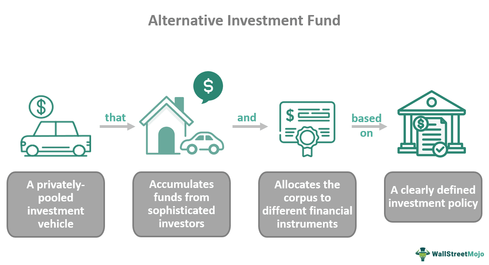

In today's fast-changing retail landscape, category killers have emerged as dominant forces reshaping the industry. These retail giants focus on specific product categories, presenting expansive selections and highly competitive pricing that directly challenge traditional retail models. Unlike diversified retailers, category killers utilize their specialization to achieve economies of scale, enabling them to reduce costs and offer lower prices than smaller competitors. This strategy often results in diminished market presence for independent retailers and smaller chains, as consumers are drawn to the convenience and savings presented by these large-scale entities.

The rise of category killers is not occurring in isolation; it is intertwined with technological advancements such as algorithmic trading strategies. Originally utilized in financial markets for executing complex trading decisions at high speeds, algorithmic trading is increasingly being adapted to the retail sector. These technologies facilitate real-time data analysis, enabling retailers to optimize pricing, inventory management, and supply chain logistics. Integrating such innovations allows category killers to maintain their competitive edge by predicting consumer demand more accurately and adjusting operations dynamically.



Analyzing the business strategies, impacts, and future prospects of category killers reveals their pivotal role in transforming retail dynamics. With their market influence and technological integration, these entities set new standards for efficiency and consumer expectations. Understanding how category killers leverage advanced technologies like algorithmic trading can provide insights into their sustained market dominance and outline potential trajectories for other retailers aiming to compete in a technology-driven economy.

## Table of Contents

## Understanding Category Killers

Category killers are powerful retailers that establish supremacy within specific product categories by offering a vast selection of products at highly competitive prices. This business model primarily relies on the economies of scale, enabling these retailers to reduce costs and consequently, offer lower prices than smaller competitors who struggle to match these efficiencies.

Such retailers typically follow a strategy that emphasizes large-scale operations, extensive inventory, and strategic pricing structures. The goal is to dominate the market segment entirely, causing substantial challenges for smaller and more traditional retail competitors. By providing an exhaustive range of options within a product category, category killers attract a wide array of consumers, further consolidating their market position.

Examples of category killers include Home Depot, which specializes in home improvement products, Best Buy in consumer electronics, and PetSmart in pet supplies. These retailers have built their success on a foundation of robust supply chain mechanisms, expansive product knowledge, and an enhanced customer shopping experience. This combination not only draws in consumers but also fosters brand loyalty by establishing trust and reliability.

The customer experience plays a crucial role in the success of category killers. Retailers invest significantly in employee training to ensure staff possess in-depth knowledge of the product offerings, which allows them to provide expert advice, thereby enhancing the customer's shopping experience. Moreover, these stores are designed to be consumer-friendly, often featuring interactive displays or sections that showcase products in action, which can significantly influence purchase decisions.

Ultimately, the dominant position of category killers is maintained through their ability to continuously optimize operations and adapt to consumer needs. This involves upgrading supply chains, embracing technological advancements, and fine-tuning pricing models that not only compete aggressively but also often set pricing benchmarks within their respective industries.

## Historical Perspective and Evolution

Category killers emerged as prominent players in the retail industry during the 1980s and 1990s by offering an extensive range of products within specific categories, often at unbeatable prices. This approach allowed them to build a loyal customer base and exert significant influence over their respective markets. Companies such as Toys R Us revolutionized the toy industry by providing a vast selection, effectively outcompeting smaller retailers and establishing themselves as leaders in their niche.

The rise of e-commerce in the late 1990s and early 2000s presented new challenges for category killers, forcing them to rethink traditional business models. The convenience and accessibility of online shopping platforms meant that physical retailers had to innovate to maintain their relevance. As a response, many category killers began integrating digital strategies, launching online storefronts to complement their brick-and-mortar operations. This shift required substantial investments in technology and logistics to ensure a seamless customer experience across multiple channels, a concept known as omnichannel retailing.

Despite pioneering the category-killer model, some early leaders like Toys R Us struggled to adapt to the rapidly changing market conditions and eventually succumbed to bankruptcy. Their decline highlighted the importance of agility and innovation in sustaining market leadership.

In the contemporary retail environment, successful category killers skillfully merge physical and digital strategies. By capitalizing on their established brand recognition and deep product expertise, they continue to attract customers both online and in-store. They leverage data analytics and customer insights to tailor their offerings and provide personalized shopping experiences, securing a competitive edge in a dynamic retail landscape. This hybrid approach ensures their sustained dominance in a sector increasingly driven by technological advancements and evolving consumer preferences.

## Retail Strategy in the Digital Age

In response to evolving consumer preferences, category killers are significantly investing in e-commerce infrastructure. This strategic move aims to cater to the growing trend of online shopping, which prioritizes convenience and accessibility. By strengthening their online platforms, these retail giants seek to create a robust virtual presence that mirrors their physical store advantages, providing extensive product ranges and competitive pricing.

One of the primary strategies employed by category killers is the development of omnichannel experiences. This approach ensures that consumers receive a cohesive and integrated shopping journey across various platforms, whether online or in-store. By unifying different sales channels, retailers can provide seamless transitions for consumers who might start their purchase journey online but wish to complete it in person or vice versa. This omnichannel strategy not only enhances customer satisfaction but also maximizes sales opportunities by capturing diverse consumer purchasing behaviors.

To further personalize customer interactions, category killers increasingly rely on data-driven insights. By analyzing consumer data, these retailers can tailor marketing efforts, product recommendations, and service offerings to meet individual customer needs. This level of personalization fosters greater consumer loyalty and encourages repeat purchases, adding significant value to the retail experience.

The integration of advanced technologies, notably [algorithmic trading](/wiki/algorithmic-trading) and data analytics, has become essential for category killers striving to maintain a competitive edge. Algorithmic trading, commonly associated with financial markets, is now being employed in retail to optimize various operational aspects. By using algorithms to analyze market trends, consumer demand, and competitive pricing, retailers can dynamically adjust their pricing models. This allows for real-time price changes that reflect current market conditions, optimizing profitability and attracting price-sensitive consumers.

Furthermore, these technological innovations assist with real-time stock management. By utilizing data analytics, category killers can forecast demand and adjust inventory levels accordingly, ensuring that popular items remain in stock while minimizing overstock situations. Efficient inventory management not only reduces operational costs but also enhances customer satisfaction by increasing the availability of desired products.

In conclusion, the digital age necessitates that category killers integrate technology deeply into their operations. By enhancing online presence, ensuring seamless omnichannel experiences, and personalizing customer interactions, they can maintain their dominance in a rapidly changing retail landscape. The use of algorithmic trading and data analytics further strengthens this position by optimizing pricing strategies and stock management, ensuring that category killers remain resilient and competitive.

## The Role of Algorithmic Trading

Algorithmic trading, originally developed for financial markets, is increasingly being adopted by category killers in the retail sector to enhance operational efficiency. By employing sophisticated algorithms, these large retailers can automate various facets of their operations, resulting in significant improvements in inventory management, demand forecasting, and supply chain optimization.

Inventory management is a critical component where algorithmic trading comes into play. By analyzing historical sales data, purchase trends, and external factors such as economic indicators, algorithms can predict inventory needs with high accuracy. This foresight allows retailers to maintain optimal stock levels, reducing both overstock and stockouts. For example, a Python code snippet using linear regression might look like this:

```python
import numpy as np
from sklearn.linear_model import LinearRegression

# Example historical data: past sales figures
sales_data = np.array([[1, 100], [2, 150], [3, 200], [4, 220], [5, 250]])
X = sales_data[:, 0].reshape(-1, 1)  # Time or other independent variables
y = sales_data[:, 1]  # Sales numbers

# Create and train the model
model = LinearRegression().fit(X, y)

# Predict future sales
future_time = np.array([[6]])
predicted_sales = model.predict(future_time)
```

Dynamic pricing models further illustrate the application of algorithmic strategies. These algorithms adjust prices in real-time based on market variables such as competitor pricing, demand fluctuations, and inventory levels. The result is price optimization that maximizes revenue while ensuring competitive pricing for consumers. A simple illustration of dynamic pricing can be represented as a function that considers multiple input parameters to output the optimal price point.

```python
def dynamic_pricing(competitor_price, demand_level, inventory_status):
    base_price = 100  # Base price of the product
    price_variation = base_price * 0.1  # Variation factor

    # Calculate optimal price
    optimal_price = base_price + price_variation * (demand_level - competitor_price/inventory_status)
    return max(optimal_price, base_price)
```

The fusion of algorithmic tools in retail not only streamlines operations but also enhances the strategic decision-making process. Algorithms facilitate more informed and timely decisions by providing actionable insights derived from complex data analyses. This empowers category killers to remain competitive in a landscape marked by rapid technological advancements and evolving consumer expectations. Consequently, algorithmic trading represents a formidable advantage, enabling retailers to maintain leadership by continuously refining their business models and operational approaches.

## Impact on Small Businesses and Local Economies

Category killers have emerged as influential players in the retail industry, bringing both prosperity and challenges to the market landscape. Large-scale operations dominate specific product categories, offering consumers lower prices and extensive selections. However, their success often comes at the expense of smaller, local retailers, which struggle to compete against these formidable opponents. The decline of small businesses due to the dominance of category killers manifests in several ways.

Firstly, as category killers capture significant market share, small retailers frequently encounter financial challenges, leading to closures. This concentration of market power results in a reduction of local business diversity, leaving communities with fewer options and a homogenized commercial environment. While consumers may initially benefit from lower prices and an extensive range of products, the long-term consequences can be detrimental to local economies.

The closure of small businesses often leads to job losses within communities, further weakening the local economic ecosystem. Reduced employment opportunities can result in decreased consumer spending power, creating a downward economic spiral. Additionally, community engagement that thrives on diverse local business interactions tends to diminish, as fewer unique and specialized markets exist.

Efforts to mitigate these negative impacts focus on promoting and sustaining local businesses. Encouraging consumers to support local retailers can help foster a more balanced retail ecosystem. Initiatives such as "shop local" campaigns and policies aimed at providing financial incentives or tax relief for small businesses can bolster their resilience against category killers' dominance.

To survive and thrive, small retailers must differentiate themselves by offering unique products, personalized customer service, and a distinctly local experience. Cultivating strong relationships with the local community is essential for smaller retailers to maintain competitive advantage and relevance in a market often overshadowed by larger corporate entities.

Ultimately, the survival of small businesses and the vibrancy of local economies depend not only on consumer choices and local policies but also on the ability of these businesses to adapt and offer something distinctively valuable that category killers cannot replicate.

## Future of Retail

The rapid evolution of the retail sector demands that category killers adopt a more agile approach, emphasizing both adaptability and innovation. In response to changing consumer preferences and environmental concerns, sustainable practices are increasingly prominent. Retailers are adopting eco-friendly supply chain methods and reducing carbon footprints, thus aligning with global sustainability goals and gaining favor with environmentally conscious consumers.

Experiential retail is another emerging trend, redefining how category killers engage with customers. This concept involves creating immersive shopping experiences that encourage consumer interaction with products, enhancing customer satisfaction and brand loyalty. Category killers now explore strategies such as incorporating virtual reality (VR) and augmented reality (AR) into their stores, providing unique and engaging buying experiences that blur the lines between online and offline shopping.

The proliferation of private labels represents a strategic shift for many category killers, allowing them to offer exclusive products that enhance brand identity and consumer loyalty while increasing profit margins. Private labels can differentiate retailers in a competitive market by offering unique value propositions that generic brands cannot match.

Navigating economic fluctuations poses a significant challenge in the ever-changing retail landscape. Retailers must remain vigilant about potential impacts of shifting global trade policies, inflation, or currency exchange rates, which can affect consumer purchasing power. Adapting to these changes is crucial, involving the development of robust financial strategies to manage and mitigate risk.

Furthermore, retailers must adapt to evolving regulatory changes in trading practices, such as those affecting data privacy and protection. Compliance with these regulations is essential, as non-compliance can lead to significant fines and reputational damage.

Artificial intelligence (AI) is poised to play a crucial role in the future of retail, providing category killers with tools to maintain relevance and leadership. AI-driven strategies offer significant improvements in data analytics, customer insights, and personalized marketing. Machine learning algorithms can process vast amounts of consumer data to predict buying behaviors and preferences, delivering targeted marketing and optimizing inventory management.

For example, a Python script utilizing [machine learning](/wiki/machine-learning) could analyze consumer purchasing patterns to forecast demand:

```python
from sklearn.model_selection import train_test_split
from sklearn.ensemble import RandomForestRegressor
import pandas as pd

# Load consumer purchasing data
data = pd.read_csv('consumer_data.csv')

# Features and target variable
X = data.drop('purchase_amount', axis=1)
y = data['purchase_amount']

# Split data into training and test sets
X_train, X_test, y_train, y_test = train_test_split(X, y, test_size=0.2, random_state=42)

# Initialize and train the model
model = RandomForestRegressor(n_estimators=100, random_state=42)
model.fit(X_train, y_train)

# Predict future purchase amounts
predictions = model.predict(X_test)
```

This script demonstrates how AI can enable retailers to make data-driven decisions, optimizing stock levels and reducing costs associated with overproduction or stockouts.

In conclusion, the future of retail for category killers is intertwined with their ability to adapt to new trends and challenges. By embracing sustainable practices, experiential retail, private labels, and advanced technologies, these retail giants can maintain their position at the forefront of the industry while meeting the evolving demands of today's consumers.

## Conclusion

Category killers have fundamentally transformed retail by leveraging their strengths in product selection and competitive pricing, often outpacing traditional retailers. Despite these advantages, they are compelled to continuously innovate, primarily due to the rapidly evolving demands of tech-savvy consumers. The integration of algorithmic trading and data-driven insights represents a critical pathway for these retail giants to sustain their leadership. By implementing real-time data analytics and dynamic pricing models, category killers can respond swiftly to market changes and consumer preferences.

In a digital economy characterized by instantaneous information flow and consumer empowerment, the strategic use of technology becomes imperative. Algorithmic trading allows category killers not only to optimize inventory management and demand forecasting but also to enhance pricing strategies through automated and adaptive systems. This technological interplay supports an agile retail model capable of predicting and meeting consumer needs with precision.

The future retail landscape will increasingly be shaped by the symbiotic relationship between technological advancements and retail strategy. As [artificial intelligence](/wiki/ai-artificial-intelligence) and machine learning technologies advance, their role in shaping competitive dynamics will expand, dictating which category killers will lead and which will falter. In conclusion, the ability of category killers to adapt and leverage technology effectively will determine their continued success in an ever-changing global market.

## References & Further Reading

[1]: ["Competing with Giants: Survival Strategies for Local Companies in Emerging Markets"](https://hbr.org/1999/03/competing-with-giants-survival-strategies-for-local-companies-in-emerging-markets) - Harvard Business Review

[2]: McAfee, A & Brynjolfsson, E. (2008). ["Investing in the IT That Makes a Competitive Difference."](https://hbr.org/2008/07/investing-in-the-it-that-makes-a-competitive-difference) Harvard Business Review.

[3]: ["The Retail Revival: Reimagining Business for the New Age of Consumerism"](https://www.amazon.com/Retail-Revival-Reimagining-Business-Consumerism/dp/1118489675) by Doug Stephens

[4]: ["E-commerce and the Market Structure of Retail Industries"](https://www.nber.org/system/files/working_papers/w14166/w14166.pdf) - Journal of Economic Literature

[5]: Chopra, S., & Sodhi, M. S. (2004). ["Managing Risk to Avoid Supply-Chain Breakdown."](https://www.researchgate.net/publication/237646139_Managing_Risk_to_Avoid_Supply-Chain_Breakdown) Harvard Business Review.