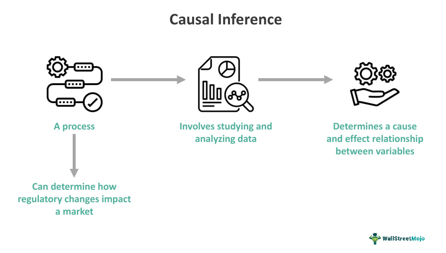

Causal inference is an essential analytical tool in algorithmic trading, focused on identifying cause-and-effect relationships among financial variables. This capability is crucial because financial markets are replete with complex, interrelated factors that can easily be mistaken for direct causes when they are merely correlated. Distinguishing between correlation and causation can lead to the creation of trading strategies that are more resilient to market fluctuations and less susceptible to financial downturns.

Traditional methods in trading often rely heavily on statistical correlations. While these methods can uncover relationships between variables, they do not inherently determine whether one variable directly impacts another. For instance, a trader may observe a correlation between stock prices and economic indicators, but this does not confirm that changes in economic indicators cause stock price fluctuations. By adopting causal inference techniques, traders can identify genuine causal relationships, leading to a deeper understanding of market mechanisms.



Understanding causal relationships enables the development of adaptable trading strategies. These strategies are designed to respond to dynamic market conditions, thereby reducing potential financial losses. Harnessing causal inference, traders can refine risk management practices by gaining insights into the underlying drivers of market movements, thereby supporting more robust decision-making processes.

The importance of causal inference in trading extends beyond improved decision-making. It enhances the interpretability of trading models, fostering regulatory compliance by providing clear, evidence-based explanations for trading actions. In a highly regulated financial environment, having transparent models is increasingly vital.

This article investigates the application of causal inference in financial markets, contrasting its benefits with those of conventional correlation-based strategies. It also provides a comprehensive overview of various causal inference methodologies, such as Instrumental Variables and Structural Equation Modeling, which are tailor-made for financial contexts.

By employing causal inference methods, traders can effectively dissect the intricacies of financial markets, leading to enhanced predictive capabilities. This discipline's continued evolution promises advancements in the sophistication of algorithmic trading strategies, potentially transforming the landscape with more insightful and effective approaches.

## Table of Contents

## Importance in Algorithmic Trading

Distinguishing between correlation and causation is crucial for developing effective trading strategies in [algorithmic trading](/wiki/algorithmic-trading). Strategies derived from causation typically demonstrate increased robustness and adaptability in response to fluctuating market conditions. This is because causal inference helps traders identify true cause-and-effect relationships, thereby reducing the likelihood of developing strategies based on superficial or spurious correlations.

By focusing on causation rather than correlation, traders can better predict how changes in one financial variable will affect others, thus enhancing risk management. For instance, understanding the causal relationship between [interest rate](/wiki/interest-rate-trading-strategies) changes and stock prices enables traders to devise strategies that account for potential risks associated with monetary policy adjustments.

Causal inference also plays a vital role in regulatory compliance. Trading strategies based on causal models provide more interpretable outcomes, increasing transparency and aiding compliance with financial regulations. Regulators increasingly favor strategies that can be explained in terms of fundamental economic principles rather than opaque, correlation-driven models.

Moreover, causal inference has the potential to improve predictive accuracy by concentrating on the underlying mechanisms that drive financial markets. This focus on mechanisms rather than mere associations allows traders to make more informed predictions about future market behavior. By employing techniques such as structural equation modeling or causal discovery algorithms, traders can extract insights on the causal pathways within complex financial systems, leading to more effective and reliable predictions.

In summary, the emphasis on causation over mere correlation in algorithmic trading can significantly enhance strategy development. Such an approach not only bolsters the adaptability and resilience of trading algorithms but also supports better risk management, regulatory compliance, and predictive power.

## Methods of Causal Inference

Causal inference methods play a crucial role in discerning the causal relationships among financial variables, significantly impacting the development of algorithmic trading strategies. Each method offers unique advantages and faces specific challenges, particularly when applied to the complex and dynamic environment of financial markets.

1. **Randomized Controlled Trials (RCTs):** RCTs are considered the gold standard for establishing causality. In these trials, subjects are randomly assigned to either a treatment or a control group, allowing for a clear comparison between the two groups to determine the causal impact of a variable. Despite their precision, implementing RCTs in financial markets can be daunting due to ethical constraints, high costs, and the difficulty of controlling market participants' behavior.

2. **Instrumental Variables (IV):** IV methods are employed when RCTs are infeasible. An instrumental variable is a variable that is correlated with the endogenous explanatory variable but not with the error term, providing a mechanism to estimate causal effects. This method is particularly useful in financial markets for isolating the impact of a variable when random assignment is not possible. The challenge lies in identifying suitable instruments that fulfill these conditions.

3. **Difference-in-Differences (DiD):** This technique involves comparing the difference in outcomes over time between a treatment group and a control group. DiD assumes that, in the absence of treatment, the average change in the outcome variable would be the same for both groups. This method has been applied in financial markets to evaluate policy impacts or specific events on market variables. The critical assumption of parallel trends is often scrutinized and validated using historical data.

4. **Regression Discontinuity Design (RDD):** RDD exploits a threshold-based assignment for treatment, assuming that observations close to the threshold are comparable. This design is used to assess causal effects by comparing observations on either side of the threshold. In financial markets, RDD can be applied when regulatory changes or credit ratings create clear cut-off points for analysis.

5. **Structural Equation Modeling (SEM):** SEM is a comprehensive statistical approach that examines complex interdependencies among variables. It encompasses multiple equations modeling simultaneously and can incorporate latent variables. SEM is particularly effective in financial markets to analyze the simultaneous impact of numerous factors, accounting for indirect effects and measurement error.

6. **Causal Discovery Algorithms:** Algorithms such as the Peter-Clark (PC) and Fast Causal Inference (FCI) help in constructing causal graphs from high-dimensional data. These algorithms exploit conditional independence tests to identify causal structures and are essential in financial environments characterized by intricate networks of variables. Python code implementing these algorithms can facilitate the analysis:

```python
from causallearn.search.CIC import PC
from causallearn.utils.GraphUtils import GraphUtils
import numpy as np

# Simulated data
data = np.random.rand(100, 5)

# Running the PC algorithm
pc = PC(independence_test_method="fisher_z", alpha=0.05)
pc.learn(data)

# Visualizing the causal graph
graph = pc.get_labeled_graph()
GraphUtils.plot(graph)
```

Each of these methods contributes to the advancement of causal inference in financial markets, albeit with implementation challenges and assumptions that must be carefully considered.

## Practical Applications in Algorithmic Trading

High-frequency traders utilize causal inference to gain insights into market microstructures, enabling them to minimize slippage – the difference between the expected price of a trade and the actual price at execution. By understanding the causal relationships between order flows, price movements, and [liquidity](/wiki/liquidity-risk-premium), these traders can optimize execution algorithms to achieve better fill rates and reduce transaction costs. This is crucial in high-frequency environments where even minimal delays or inefficiencies can significantly impact profitability.

In event-driven trading, causal models are instrumental for capitalizing on temporary inefficiencies that arise from events such as corporate earnings reports or macroeconomic announcements. By establishing a causal link between events and market reactions, traders can predict how asset prices will respond and position themselves advantageously beforehand. For instance, a trader might use natural language processing to causally relate sentiment from a company's earnings call transcript to subsequent price [volatility](/wiki/volatility-trading-strategies), allowing for more informed trade decisions.

Risk [arbitrage](/wiki/arbitrage) strategies, which involve taking positions in companies involved in mergers or acquisitions, benefit from causal analysis to enhance the assessment of a deal's completion likelihood. Accurately modeling the causal factors influencing deal success, such as regulatory approval or shareholder votes, allows arbitrageurs to refine their risk assessments and adjust their positions accordingly. This reduces the risk of adverse price movements if the deal terms change or fall through unexpectedly.

Market makers rely on causal inference to understand the effects of their quoting strategies on market liquidity and spreads. By analyzing causal connections between their own actions and market variables, market makers can adjust their bid-ask spreads to maintain profitability while providing liquidity. Understanding these causal dynamics helps market makers to balance their inventory risk with the benefit of capturing the bid-ask spread, thereby enhancing overall trading performance. 

Overall, causal inference is a versatile tool that aids various algorithmic trading strategies by providing clarity on the underlying mechanisms driving market changes, enabling traders to make data-driven decisions while reducing exposure to risk.

## Challenges and Limitations

Financial data often presents significant challenges for causal inference due to the inherent lack of experimental control. Unlike laboratory settings where conditions can be meticulously managed, financial markets are subject to numerous external influences and random shocks. This complexity makes it difficult to isolate specific causal relationships, as the multitude of variables involved and their interconnections can obscure clear findings.

High-dimensional data is a common characteristic in financial markets, presenting unique challenges in developing causal models. With an extensive number of variables, multicollinearity—where independent variables are highly correlated—can skew results, leading to unreliable model coefficients. Additionally, overfitting becomes a prevalent concern. In a high-dimensional space, models can become too tailored to the specific dataset, capturing noise rather than genuine trends. This reduces the model's predictive accuracy and its ability to generalize beyond the data it was trained on.

Models based on historical data face another limitation: they may not always generalize to future market conditions. This issue, known as a lack of external validity, arises because financial markets are dynamic, with patterns that can change over time due to economic shifts, regulatory changes, or technological advancements. Therefore, a strategy that performed well historically might fail when applied in a new market context, risking financial losses.

Ethical and legal considerations add another layer of complexity to the application of causal inference in financial markets. The use of complex algorithms and AI-driven models must comply with regulatory frameworks such as the Markets in Financial Instruments Directive II (MiFID II) in Europe or the Dodd-Frank Act in the United States. These regulations demand transparency in trading strategies, ensuring that they do not exploit unfair advantages or manipulate market conditions, all while respecting data privacy and ethical guidelines.

Identifying and controlling confounding variables is essential but challenging due to the intricate nature of financial markets. Confounders are variables that can falsely appear to cause an observed effect due to their relationship with both the treatment and the outcome of interest. For example, economic indicators, geopolitical events, or market sentiment can all act as confounders. Failing to account for these can lead to incorrect causal conclusions. Advanced statistical techniques, such as propensity score matching or the use of control functions, are often employed to mitigate the effects of confounders, but these methods require careful implementation to avoid introducing new biases. 

Overall, while causal inference holds substantial promise for enhancing algorithmic trading, navigating these challenges requires sophisticated techniques and continuous methodological advancements.

## Companies Specializing in Causal Inference for Trading

Several industry-leading firms are at the forefront of integrating causal inference techniques into their trading strategies, enhancing their ability to make informed decisions in financial markets. Notably, AQR Capital Management employs causal inference methodologies to develop systematic trading strategies. Their approach involves using statistical techniques to identify cause-and-effect relationships within market data, which enhances the robustness and adaptability of their strategies.

Renaissance Technologies, renowned for its sophisticated quantitative models, also leverages complex statistical and causal inference techniques to refine its trading strategies. This integration aids the firm in distinguishing between mere correlations and genuine causal relationships, thereby enabling more precise predictions and effective trading decisions.

Two Sigma, another key player in the field, combines [machine learning](/wiki/machine-learning) with causal inference to build robust trading algorithms. This integration allows Two Sigma to enhance the predictive power of their models by concentrating on the underlying causal mechanisms of financial markets rather than simple correlation-based analyses.

BlackRock's Aladdin platform utilizes causal inference techniques as part of its comprehensive approach to portfolio management and trading. The platform incorporates these methods to deliver more interpretable models, improve risk assessments, and optimize portfolio allocations through a better understanding of market dynamics.

Goldman Sachs employs causal inference to refine its risk management protocols and optimize algorithmic trading execution. By analyzing the causal relationships inherent in financial data, Goldman Sachs enhances its ability to manage risk effectively, providing more reliable and stable trading outcomes.

These firms collectively highlight the growing importance of causal inference in modern algorithmic trading, demonstrating its potential to improve trading strategy development and execution through a deeper understanding of financial markets.

## Conclusion

Causal inference provides a robust framework for understanding the mechanisms driving financial markets, offering a significant advantage over traditional correlation-based approaches. By focusing on true cause-and-effect relationships, causal inference enhances the robustness, transparency, and effectiveness of trading strategies. This approach allows traders to design strategies that not only perform well under a variety of market conditions but also provide clearer insights into the underlying market dynamics. By moving beyond correlation, traders can avoid the pitfalls of spurious relationships and focus on the factors that genuinely impact financial outcomes.

However, the application of causal inference in financial markets presents a range of complex challenges. Financial data often lacks the experimental control found in other fields, requiring sophisticated statistical methods to discern causal links accurately. Developing and validating these causal models requires a careful approach, particularly given the high-dimensional nature of financial data and the presence of confounding variables. Additionally, models based on historical data may not always generalize well to future market conditions, affecting their reliability and external validity.

As the field of causal inference evolves, we can expect the development of more advanced methodologies and tools that address these challenges more effectively. Innovations in machine learning and [artificial intelligence](/wiki/ai-artificial-intelligence) hold promise for improving the accuracy and applicability of causal inference in algorithmic trading. Such advancements are likely to further enhance the capabilities of trading strategies, providing traders with even more powerful tools to navigate the complexities of financial markets. Continued research and technical advancements will drive the field forward, offering new opportunities for those involved in algorithmic trading.

## References & Further Reading

[1]: Judea Pearl, & Mackenzie, D. (2018). ["The Book of Why: The New Science of Cause and Effect"](https://books.google.com/books/about/The_Book_of_Why.html?id=EmY8DwAAQBAJ). Basic Books.

[2]: Imbens, G. W., & Rubin, D. B. (2015). ["Causal Inference for Statistics, Social, and Biomedical Sciences: An Introduction."](https://www.cambridge.org/core/books/causal-inference-for-statistics-social-and-biomedical-sciences/71126BE90C58F1A431FE9B2DD07938AB) Cambridge University Press.

[3]: Hernán, M. A., & Robins, J. M. (2020). ["Causal Inference: What If"](https://miguelhernan.org/whatifbook). Chapman & Hall/CRC.

[4]: Peters, J., Janzing, D., & Schölkopf, B. (2017). ["Elements of Causal Inference: Foundations and Learning Algorithms"](https://dl.acm.org/doi/book/10.5555/3202377). The MIT Press.

[5]: Angrist, J.D., & Pischke, J.S. (2008). ["Mostly Harmless Econometrics: An Empiricist's Companion"](https://www.jstor.org/stable/j.ctvcm4j72). Princeton University Press.

[6]: Lopez de Prado, M. (2018). ["Advances in Financial Machine Learning"](https://www.amazon.com/Advances-Financial-Machine-Learning-Marcos/dp/1119482089). Wiley.

[7]: Wooldridge, J. M. (2010). ["Econometric Analysis of Cross Section and Panel Data"](https://jrvargas.files.wordpress.com/2011/01/wooldridge_j-_2002_econometric_analysis_of_cross_section_and_panel_data.pdf). The MIT Press.