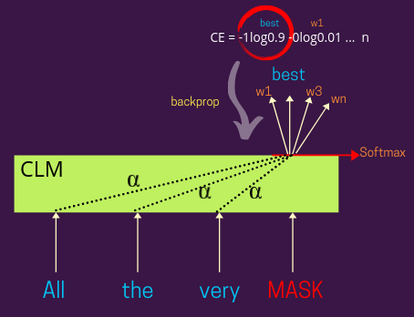

## Table of Contents

## What is a Causal Language Model in machine learning?

A Causal Language Model in machine learning is a type of model that predicts the next word in a sequence based on the words that came before it. This is different from other models that might look at words that come after the word being predicted. Think of it like reading a book from left to right and trying to guess the next word as you go along. This method is really useful for tasks like writing stories or answering questions because it helps the model understand and generate text in a way that makes sense.

These models are often used in applications like chatbots and text generation tools. They work by learning patterns in language from large amounts of text data. When you type a sentence, the model uses what it has learned to predict what you might say next. For example, if you type "I like to eat," the model might suggest "apples" or "pizza" because those words often follow "eat" in the texts it has seen. This makes the model very good at creating text that sounds natural and fits well with what has already been written.

## How does a Causal Language Model differ from other language models?

A Causal Language Model is different from other language models because it only looks at the words that come before the word it's trying to predict. Imagine you're reading a sentence from left to right. A causal model tries to guess the next word based only on the words it has already seen. Other models, like bidirectional models, might look at words that come after the word being predicted too. This makes causal models good for tasks where you need to generate text one word at a time, like writing stories or answering questions.

For example, if you type "I like to eat," a causal model will suggest the next word based on what usually follows "eat" in the texts it has learned from. It might suggest "apples" or "pizza." On the other hand, a bidirectional model might also look at words that come after "eat" in the sentence, which could change its prediction. This difference makes causal models simpler and faster for some tasks, but they might not be as good at understanding the full context of a sentence compared to bidirectional models.

## What are the key components of a Causal Language Model?

The key components of a Causal Language Model include a tokenizer, a model architecture, and a training dataset. The tokenizer breaks down text into smaller units called tokens, which the model can understand and process. For example, if you type "I like to eat," the tokenizer might turn it into tokens like "I," "like," "to," and "eat." The model architecture is the structure of the model itself, usually made up of layers of neural networks that learn patterns in the text. A common architecture for causal language models is the transformer, which uses attention mechanisms to focus on different parts of the text when making predictions.

The training dataset is a large collection of text that the model uses to learn how language works. By reading through this data, the model learns what words usually come after other words, helping it predict the next word in a sentence. During training, the model adjusts its internal parameters to get better at predicting the next word based on the words it has seen. This process involves a loss function, which measures how well the model is doing, and an optimizer, which tweaks the model's parameters to minimize the loss. Together, these components allow the causal language model to generate text that sounds natural and fits well with the context provided.

## Can you explain the concept of causality in the context of language models?

Causality in the context of language models refers to the idea that the model predicts the next word based only on the words that come before it. Imagine you are reading a story. A causal language model tries to guess what the next word will be by looking at the words it has already read. This is like trying to predict the next word in a sentence as you go along, without peeking ahead. This approach helps the model generate text that makes sense because it follows the natural flow of language from left to right.

In contrast, other types of language models, like bidirectional models, might look at words that come both before and after the word being predicted. This can give them a better understanding of the full context of a sentence, but it also means they are not strictly following the causal principle. Causal language models are simpler and faster for tasks like generating text one word at a time, which is why they are often used in applications like chatbots and text generation tools. By sticking to the words that have already been seen, these models can create coherent and contextually relevant text based on the input they receive.

## What are some common applications of Causal Language Models?

Causal Language Models are often used in chatbots and virtual assistants. These models help the chatbot understand what you are saying and respond in a way that sounds natural. For example, if you ask a chatbot a question, the model will use the words you've already typed to guess the next word and build a complete answer. This makes the chatbot sound more like a real person because it can [carry](/wiki/carry-trading) on a conversation one word at a time.

Another common use for Causal Language Models is in text generation tools. These tools can help you write stories, articles, or even social media posts. The model looks at the words you've written so far and suggests what you might want to say next. This can be really helpful if you're stuck and need some ideas to keep writing. By following the natural flow of language, these models can create text that fits well with what you've already written.

## How is training data prepared for a Causal Language Model?

Training data for a Causal Language Model is prepared by collecting a large amount of text from various sources like [books](/wiki/algo-trading-books), websites, and social media. This text is then cleaned to remove any errors or unwanted characters. The next step is to break the text into smaller parts called tokens. Tokens can be words, punctuation, or even parts of words. For example, the sentence "I like to eat" might be turned into tokens like "I," "like," "to," and "eat." This process is done using a tokenizer, which is a tool that understands how to split text into these smaller units.

Once the text is tokenized, the model is trained to predict the next token based on the tokens that came before it. This is done by showing the model many examples of text and adjusting its internal parameters to get better at guessing the next word. The model learns from its mistakes and improves over time. The training process involves using a loss function to measure how well the model is doing and an optimizer to make small changes to the model's parameters to minimize this loss. This way, the model can learn the patterns in language and use them to generate new text that sounds natural.

## What are the challenges in implementing Causal Language Models?

One of the main challenges in implementing Causal Language Models is the need for a lot of training data. These models learn by reading through huge amounts of text, which can be hard to collect and clean. The text needs to be from many different sources to make sure the model learns a wide range of language patterns. Cleaning the data to remove errors and unwanted characters is also a big job. If the data isn't good, the model won't learn well and might make mistakes when it tries to generate new text.

Another challenge is the computational power needed to train and run these models. Causal Language Models often use complex structures like transformers, which need a lot of processing power. Training the model involves adjusting many parameters to get better at predicting the next word, and this can take a long time on powerful computers. Once the model is trained, using it to generate text can also be slow if the hardware isn't good enough. This can be a problem for applications that need to respond quickly, like chatbots.

Lastly, making sure the model generates text that is both coherent and relevant can be tricky. Since Causal Language Models predict the next word based only on the words that came before, they can sometimes go off track or repeat themselves. Keeping the generated text on topic and making sure it sounds natural requires careful tuning of the model's parameters and sometimes additional techniques like fine-tuning on specific types of text.

## How do Causal Language Models handle long-range dependencies in text?

Causal Language Models handle long-range dependencies in text by using a special part called the attention mechanism. Imagine you are reading a long story. The attention mechanism helps the model remember important words from earlier in the story when it's trying to guess the next word. This way, even if the important word was many words ago, the model can still use it to make a good guess. The attention mechanism looks at all the words it has seen so far and decides which ones are most important for predicting the next word.

For example, if you are reading a story about a detective and the model sees the word "detective" at the beginning, it can still use that information to guess words related to solving a mystery even if many other words come between. This helps the model create text that makes sense over long distances. The attention mechanism is like a helper that keeps track of the important parts of the story, making sure the model doesn't forget them as it reads on.

## What evaluation metrics are used to assess the performance of Causal Language Models?

One common way to check how well a Causal Language Model is doing is by using a metric called perplexity. Perplexity measures how surprised the model is by the text it sees. If the model is good at guessing the next word, it will have a low perplexity. Think of it like a game where the model tries to predict the next word in a sentence. The better it guesses, the lower the perplexity score. A low perplexity means the model understands the language well. The formula for perplexity is $$ \text{Perplexity} = 2^{-\frac{1}{N} \sum_{i=1}^{N} \log_2 p(w_i | w_1, ..., w_{i-1})} $$, where $$ N $$ is the number of words, and $$ p(w_i | w_1, ..., w_{i-1}) $$ is the probability the model gives to the next word.

Another important metric is the BLEU score, which stands for Bilingual Evaluation Understudy. This score is often used to see how well the model's generated text matches human-written text. It looks at how many words and phrases in the model's text are the same as in the human text. A higher BLEU score means the model's text is more like what a person would write. This is useful for tasks like translating languages or summarizing text. Both perplexity and BLEU scores help researchers and developers understand if their model is working well and where it might need improvements.

## How can biases be identified and mitigated in Causal Language Models?

Biases in Causal Language Models can be identified by looking at the text the model generates and seeing if it unfairly favors or discriminates against certain groups of people. For example, if the model often uses words that stereotype a particular group, that's a sign of bias. Researchers can also use special tests, like checking if the model links certain jobs more often to one gender than another. These tests help find hidden biases that might not be obvious at first. To identify biases, people might use tools like word association tests or analyze the training data to see if it contains biased language.

To mitigate biases, one approach is to clean the training data by removing or balancing out biased content. This means going through the text the model learns from and making sure it doesn't contain language that could lead to unfair predictions. Another way is to use techniques like fine-tuning, where the model is trained again on a smaller, more balanced dataset to correct its biases. Additionally, developers can add special rules or constraints to the model to make sure it doesn't generate biased text. By carefully checking and adjusting the model, biases can be reduced, making the model fairer and more useful for everyone.

## What are the latest advancements in Causal Language Model research?

One of the latest advancements in Causal Language Model research is the development of more efficient training methods. Researchers have found ways to train these models faster and with less data. For example, techniques like few-shot learning allow models to learn new tasks with just a few examples. This is important because it makes it easier to update models with new information without needing to start the training process from scratch. Another advancement is the use of more advanced attention mechanisms, which help the model better understand and remember long-range dependencies in text. These improvements make the models more accurate and useful for tasks like writing stories or answering questions.

Another exciting area of research is the focus on making Causal Language Models more interpretable. This means researchers are working on ways to understand how the models make their predictions. By figuring out which parts of the input text the model pays attention to, we can better understand why it generates certain words. This is helpful for spotting and fixing biases in the model. Additionally, researchers are exploring ways to make these models generate text that is not only coherent but also more creative and diverse. By tweaking the model's parameters and using new training techniques, they can produce text that sounds more like what a human would write, making the models even more useful in real-world applications.

## How do Causal Language Models integrate with other AI technologies?

Causal Language Models often work together with other AI technologies to make them even better. For example, they can be used with speech recognition systems to turn spoken words into written text and then generate responses. This makes chatbots and virtual assistants more helpful because they can understand and reply to what people say. Another way they integrate is with machine translation tools. A Causal Language Model can help translate text from one language to another by predicting the next word in the target language based on the words it has already seen in the source language. This makes translations sound more natural and easier to understand.

In addition, Causal Language Models can be combined with image recognition technology. For instance, when a model sees a picture, it can use the image data to generate a description of what's in the picture. This is useful for applications like generating captions for photos or helping visually impaired people understand images. By working together with other AI technologies, Causal Language Models can do more than just understand and generate text. They can become part of larger systems that help people in many different ways, making AI more powerful and useful in everyday life.