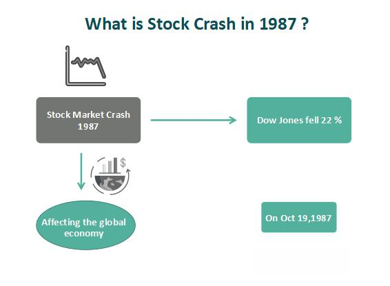

On October 19, 1987, global stock markets experienced what is now known as Black Monday, a day marked by an unprecedented and staggering decline in market values across the world. During this single trading session, major indices such as the U.S. S&P 500 and the Dow Jones Industrial Average plummeted by over 20%, demonstrating the largest one-day percentage drop in stock market history. This dramatic event not only sent shockwaves through financial markets but also ushered in a period of introspection and analysis aimed at understanding the underlying causes.

The market catastrophe was not merely a result of economic factors but was significantly compounded by technological advancements, most notably in algorithmic trading. This automated form of trading—where computer systems are programmed to execute trades based on pre-set instructions—played a crucial role in both the magnitude and speed of the market decline experienced on that day. The reliance on program trading, which included strategies like portfolio insurance that were intended to protect investments, ironically contributed to the rapid devaluation as these strategies prompted a cascading effect of sell orders.



Algorithmic trading, while designed to enhance efficiencies in trading by leveraging speed and computational power, introduced a level of systemic risk that was underestimated at the time. The events of Black Monday have since been pivotal in shaping the discourse around the balance between technological innovation in trading systems and the need for regulatory oversight to prevent market instability. This article will explore the economic and technological precursors to the crash, dissecting the intricate role that algorithmic trading played in one of the most significant financial disruptions of the 20th century.

## Table of Contents

## Economic Context Preceding Black Monday

In the mid-1980s, the U.S. stock market experienced robust growth, characterized by substantial gains and elevated valuations. This period of bullish market conditions was influenced by both economic dynamics and specific monetary policies. The Plaza Accord of 1985 was a collaborative agreement among major economies, including the United States, Japan, West Germany, France, and the United Kingdom, aiming to depreciate the U.S. dollar in relation to the Japanese yen and the German deutsche mark. The intent was to rectify trade imbalances that had placed considerable strain on the U.S. economy by boosting American exports through a more competitive dollar exchange rate.

Following the Plaza Accord, the Louvre Accord was established in 1987 to stabilize the dollar after its significant depreciation. This agreement marked a shift in policy, as participating nations sought to maintain exchange rates at levels that would prevent further decline of the dollar. However, this stabilization effort led to a tightening of monetary conditions as central banks, notably the Federal Reserve, adjusted interest rates to sustain the targeted exchange rates.

The U.S. Federal Reserve's response involved increasing interest rates to curb inflation and stabilize the dollar, as mandated by the evolving international monetary frameworks. These rising interest rates had a direct impact on the financial markets, contributing to a reassessment of asset valuations. Elevated stock valuations, previously buoyed by low interest rates and strong economic performance, began to appear unsustainable as borrowing costs increased. Investors, reacting to these changes, reevaluated the risk-return profile of their portfolios, leading to heightened market sensitivity and anxiety.

This economic context, underscored by shifts in monetary policy and associated fluctuations in interest rates, set the stage for increased market [volatility](/wiki/volatility-trading-strategies). As the cost of capital rose, it exerted downward pressure on stock prices, contributing to the precarious market conditions that ultimately culminated in the dramatic events of Black Monday. This interplay between macroeconomic policies and financial markets highlighted the complex interdependencies that can exacerbate market vulnerabilities.

## Role of Program Trading and Portfolio Insurance

The advent of program trading revolutionized the financial markets in the 1980s by enabling computers to execute large-scale automatic trades with remarkable speed and precision. This technological development allowed institutional investors to manage vast portfolios with increased efficiency. However, alongside these benefits came unforeseen consequences that contributed to market volatility.

One of the key strategies linked to program trading during this era was portfolio insurance. This strategy was designed to mitigate market risk by dynamically adjusting the composition of a portfolio in response to market fluctuations. Specifically, it involved short-selling stock futures as market prices fell, theoretically providing a hedge against losses by offsetting declines in the underlying equity portfolio. The concept was based on financial models predicting that selling additional futures as markets dropped would limit downside exposure.

Despite its theoretical appeal, portfolio insurance had significant shortcomings, especially when implemented on a large scale. On Black Monday, October 19, 1987, its limitations were starkly illustrated. As market prices began to fall, the algorithmic nature of portfolio insurance triggered a cascade of sell orders in both the futures and underlying stock markets. This surge in sell orders overwhelmed the buy-side market participants, significantly depleting market [liquidity](/wiki/liquidity-risk-premium).

The feedback loop created by these strategies exacerbated the downward spiral, as the lack of available buyers led to further price declines, prompting additional selling triggers in the automated programs. This cycle resulted in an accelerating downturn, highlighting a critical flaw: the reliance on automated strategies without adequate consideration for real-time market liquidity dynamics.

Overall, while program trading and portfolio insurance demonstrated the power of algorithmic interventions in financial markets, they also exposed vulnerabilities related to systemic risks and market stability. These events underscore the importance of careful risk management and the need for strategies that account for liquidity and market participant behavior during periods of extreme volatility.

## Mechanics of the Crash: A Closer Look

The week preceding Black Monday was marked by an accelerated downturn, causing heightened apprehension among investors and priming the market for severe volatility. By October 16, 1987, anxiety about the U.S. trade deficit and concerns over potential [interest rate](/wiki/interest-rate-trading-strategies) hikes coalesced, leading to significant market contractions. This precarious environment set the stage for the unprecedented events of October 19, 1987.

On the day of the crash itself, the deployment of computer algorithms in trading systems precipitated a cascade of sell orders. Algorithmic trading, initially designed to optimize trading efficiency and capitalize on fleeting price discrepancies, inadvertently magnified market instability. The program trading strategies, especially portfolio insurance, were configured to automatically sell stock index futures as market prices fell. This intended protective measure resulted in the opposite effect during Black Monday, where the simultaneous execution of massive sell orders generated overwhelming downward pressure on stock prices.

The sudden surge in sell orders caused an immediate evaporation of buy-side liquidity. Market makers, usually the stabilizers providing counterbalance through buying, were unable to absorb the excess supply of stocks quickly enough. The depth and speed at which orders were processed effectively overwhelmed the market, leading to a situation where sell orders far outstripped buy orders, exacerbating the downturn.

The lack of liquidity further compounded the market's decline. In a typical trading environment, liquidity allows for the smooth execution of trades with minimal price impact. However, on Black Monday, the excessive selling pressure consumed available liquidity in the marketplace, causing a feedback loop. As prices plummeted and buy-side interest dwindled, increased selling pressure led to further reductions in prices, driving the market deeper into a nosedive.

This systemic failure underscored the interdependence of technology and human intervention in financial markets. The automated nature of [algorithmic trading](/wiki/algorithmic-trading), absent sufficient oversight, highlighted vulnerabilities in market infrastructure and the need for regulatory mechanisms to safeguard against similar occurrences.

## Lessons Learned and Regulatory Changes

Black Monday underscored the critical need for regulatory intervention in financial markets to mitigate the potentially destabilizing effects of algorithmic trading and technological advancements. One of the immediate responses to the 1987 crash was the introduction of trading curbs and circuit breakers. These mechanisms are designed to temporarily halt trading on an exchange when significant indices drop by a certain percentage within a short time frame, aiming to prevent or reduce panic selling that could lead to a market freefall.

The implementation of circuit breakers added a layer of security that allowed human traders and market makers time to gather information and make reasoned decisions, countering the automated systems that can react without considering broader market context. The events of Black Monday emphasized the limitations of relying solely on algorithmic trading strategies, such as portfolio insurance, which contributed to the crash by indiscriminately issuing sell orders as market conditions worsened.

To address these systemic vulnerabilities, regulatory frameworks have evolved significantly since 1987. Key reforms have been aimed at enhancing market transparency and ensuring better oversight over automated trading systems. For example, post-Black Monday, regulations such as the Order Audit Trail System (OATS) were developed to collect detailed trade data, providing regulators with the ability to reconstruct and analyze market activities for better oversight.

Furthermore, regulatory bodies, including the U.S. Securities and Exchange Commission (SEC) and the Commodity Futures Trading Commission (CFTC), have implemented rules to safeguard against unchecked algorithmic trading. These regulations require firms to test their algorithms rigorously and incorporate risk management features to ensure that algorithms behave predictably under various market conditions.

Notably, the introduction of Volcker Rule as part of the Dodd-Frank Wall Street Reform and Consumer Protection Act, restricts speculative trading activities by banks, which is a move towards minimizing systemic risk posed by large financial institutions in volatile trading environments.

Despite improvements in regulatory measures, the evolution of financial markets and technologies necessitates ongoing adaptation within regulatory frameworks to address new challenges. High-frequency trading ([HFT](/wiki/high-frequency-trading-strategies)) and other aggressive trading strategies continue to exert influence on market dynamics, highlighting the need for continuous advancements in regulatory technology and policy to safeguard market stability effectively.

In conclusion, Black Monday served as a pivotal moment for global financial markets, highlighting the need for robust regulatory mechanisms. Continuous refinement of these mechanisms is essential to balance the efficiencies of algorithmic trading with the stability of financial systems.

## Comparisons to Recent Market Crashes

The 2008 financial crisis and the 2010 flash crash exemplify the enduring vulnerabilities within global financial markets, emphasizing the necessity for robust oversight and adaptable regulations.

The 2008 financial crisis was precipitated by the collapse of the housing market in the United States and the proliferation of subprime mortgages. This crisis underscored systemic weaknesses, such as the lack of transparency in financial products and inadequate risk management practices. Despite the absence of high-frequency trading (HFT) being a central [factor](/wiki/factor-investing) in the crisis, the event highlighted how interconnected markets can exacerbate risk, leading to widespread economic instability.

In contrast, the 2010 flash crash was primarily an HFT-related event. On May 6, 2010, U.S. markets plummeted almost 1,000 points within minutes, only to recover a large portion of those losses by the end of the trading day. The incident was largely attributed to the impact of computer algorithms executing high-speed trades in a volatile environment. Automated trading systems, including both algorithmic and high-frequency trading, contributed to a rapid sequence of buying and selling, reducing market liquidity and heightening volatility.

High-frequency trading remains a contentious topic due to its profound impact on market dynamics. The primary advantages of HFT include increased market liquidity and tighter bid-ask spreads, which generally benefit traders. However, HFT can also result in significant disruptions, as these systems are capable of executing thousands of trades per second. The [volume](/wiki/volume-trading-strategy) and speed of trades can overwhelm traditional market mechanisms, potentially leading to volatility spikes and systemic failures.

To illustrate, consider a scenario where two trading algorithms, A and B, are programmed to execute trades based on volume conditions. If both algorithms are targeting the same conditions, they could inadvertently trigger cascading sell-offs by responding similarly to market fluctuations. Here’s a simplified representation using Python:

```python
def trading_algorithm(volume, threshold):
    if volume > threshold:
        return "Sell"
    else:
        return "Hold"

volume_data = [5000, 10000, 15000, 8000]
threshold = 9000
trades = [trading_algorithm(volume, threshold) for volume in volume_data]
print(trades)
```

In this hypothetical example, algorithms A and B might both decide to "Sell" when the volume exceeds the threshold, contributing to increased selling pressure.

Market resilience has indeed improved since these events, largely due to regulatory measures aimed at containing systemic risk. For instance, the introduction of circuit breakers, which temporarily halt trading during precipitous price declines, has become standard practice to curb panic selling. Additionally, regulatory bodies continue to refine frameworks, requiring greater transparency and oversight of algorithmic trading practices.

The evolution of financial markets necessitates continuous adaptation, particularly as algorithmic strategies and technologies evolve. While strides have been made in enhancing market stability, the dynamic nature of financial technologies necessitates an ongoing commitment to evolving regulatory frameworks to safeguard market integrity.

## Conclusion

Algorithmic trading has undeniably transformed financial markets by enabling rapid and efficient trade executions. These systems are capable of processing an enormous volume of transactions at a speed far exceeding human capabilities, thereby increasing market liquidity and reducing transaction costs. However, the efficiency gains brought about by algorithmic trading also come with significant systemic risks. These risks are epitomized by events such as Black Monday, where automated trading strategies, in the absence of adequate oversight, contributed to a large-scale market collapse.

The financial industry, therefore, faces the challenge of balancing the benefits of automation with the necessity for strategic oversight. One approach to achieving this balance is the implementation of robust risk management systems that continuously monitor trading algorithms for abnormal behavior or unintended consequences. Furthermore, coupling these systems with human oversight can reduce the likelihood of automated decisions spiraling into market-moving errors.

Black Monday serves as a cautionary tale, emphasizing the critical need for a well-considered regulatory framework. Regulation must evolve alongside technological advancements to prevent market disruptions. This involves setting limits on the speed and volume of transactions and requiring algorithms to undergo stringent testing before live deployment. Additionally, failsafe mechanisms, such as circuit breakers and trading curbs, should be in place to prevent spirals in irrational trading.

The regulatory framework must also encourage transparency and accountability within algorithmic trading platforms. This can be achieved by mandating disclosures on trading strategies and holding operators responsible for any negative market impacts. While technological innovation in financial markets is inevitable, its integration must be managed in a manner that safeguards market stability.

In conclusion, while algorithmic trading offers numerous efficiencies, history underscores the imperative need for a carefully structured regulatory environment. The experiences and lessons from Black Monday should inform current regulatory practices to ensure that financial markets can harness the benefits of automation without compromising their integrity or stability.

## References & Further Reading

[1]: Brady, N. F. (1988). Report of the Presidential Task Force on Market Mechanisms. U.S. Government Printing Office. [Available online](http://3197d6d14b5f19f2f440-5e13d29c4c016cf96cbbfd197c579b45.r81.cf1.rackcdn.com/collection/papers/1980/1988_0101_BradyReport.pdf)  

[2]: Shiller, R. J. (1987). ["Investor Behavior in the October 1987 Stock Market Crash: Survey Evidence."](https://www.nber.org/papers/w2446) National Bureau of Economic Research Working Paper Series.

[3]: Roll, R. (1988). ["The International Crash of October 1987."](https://rpc.cfainstitute.org/en/research/financial-analysts-journal/1988/the-international-crash-of-october-1987) Financial Analysts Journal, 44(5), 19-35. 

[4]: Harris, L. (1988). ["The October 1987 S&P 500 Stock-Futures Basis."](https://www.jstor.org/stable/2328276) The Journal of Finance, 43(2), 529-555.

[5]: Malkiel, B. G. (2007). ["A Random Walk Down Wall Street: The Time-Tested Strategy for Successful Investing"](https://www.amazon.com/Random-Walk-Down-Wall-Street/dp/0393330338). W. W. Norton & Company. 

[6]: Kyle, A. S., & Xiong, W. (2001). ["Contagion as a Wealth Effect."](https://onlinelibrary.wiley.com/doi/abs/10.1111/0022-1082.00373) The Journal of Finance, 56(4), 1401-1440.

[7]: MacKenzie, D. (2006). ["An Engine, Not a Camera: How Financial Models Shape Markets"](https://direct.mit.edu/books/monograph/2002/An-Engine-Not-a-CameraHow-Financial-Models-Shape). MIT Press. 

[8]: Markose, S. M. (2013). ["Systemic Risk from Global Financial Derivatives: A Network Analysis of Contagion and Its Mitigation with Super-Spreader Tax"](https://papers.ssrn.com/sol3/papers.cfm?abstract_id=2199301). University of Essex, Economics Department Discussion Paper Series. 

[9]: Bookstaber, R. (1997). ["Global Risk Management: Are We Missing the Point?"](https://www.semanticscholar.org/paper/Global-Risk-Management-Bookstaber/fe19821cbf729e587b174235fc854441cd3db865) Journal of Financial Services Research, 12(2-3), 297-308.